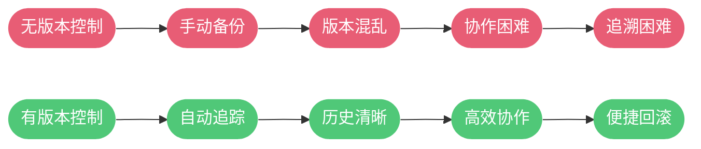
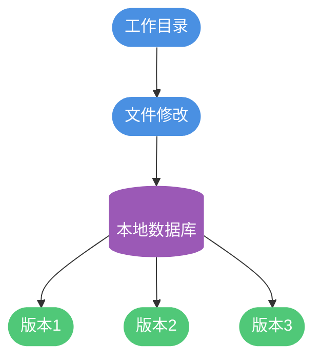
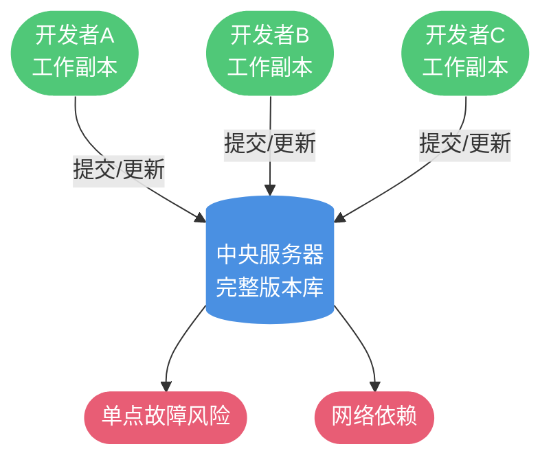
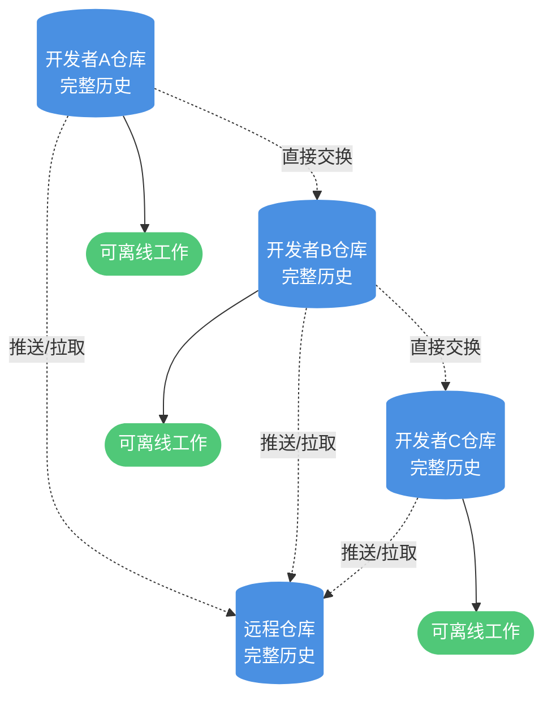
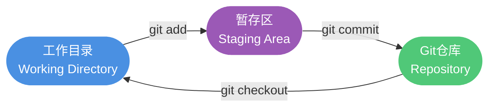
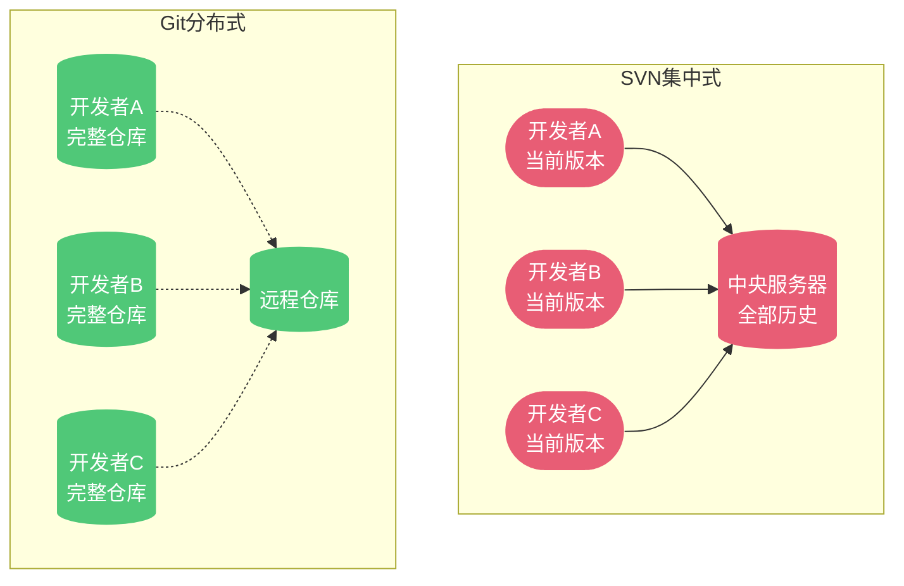
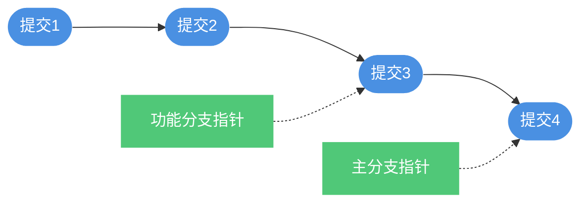

# Git版本控制系统全面解析

## 版本控制的本质与价值

在软件开发的世界里,代码就是开发者的核心资产。然而,随着项目的不断演进,代码会经历无数次的修改、重构和优化。如果缺少有效的管理机制,开发者将面临诸多困境:

- 如何追溯某个功能在哪个时间点被谁修改过?
- 当新版本出现严重问题时,如何快速回退到稳定版本?
- 多人同时开发时,如何避免代码相互覆盖?
- 如何在不影响主线代码的情况下尝试新功能?

版本控制系统应运而生,它为代码管理提供了一套完整的解决方案。通过版本控制,我们可以记录项目从初始创建到当前状态的每一次变更,包括修改内容、修改时间、修改人员等完整信息,就像为项目建立了一条完整的时间线。



## 版本控制系统的演进历程

### 本地版本控制阶段

在早期,开发者通常采用最原始的方式管理代码版本——复制整个项目目录,并用日期或版本号命名,例如`project-v1.0`、`project-20231120`等。这种方式虽然简单直观,但存在明显缺陷:

- 容易混淆当前工作目录,误操作会导致代码丢失
- 占用大量磁盘空间,每个副本都是完整拷贝
- 无法追踪具体修改内容,只能通过对比文件差异
- 多人协作几乎不可能实现

为了改进这种状况,诞生了本地版本控制系统。这类工具在本地数据库中记录文件的历次更新差异,最具代表性的是RCS(Revision Control System)。虽然解决了部分问题,但本地版本控制依然无法满足团队协作的需求。



### 集中式版本控制阶段

随着软件工程的发展,团队协作成为常态。为了让不同地点的开发者能够协同工作,集中式版本控制系统(CVCS)应运而生,典型代表包括SVN、CVS、Perforce等。

集中式系统的核心架构是设立一个中央服务器,存储所有文件的完整历史版本。开发者通过客户端连接中央服务器,检出(checkout)需要的文件,修改后再提交(commit)到服务器。这种模式实现了基本的团队协作功能,但也带来了新的问题:

**核心缺陷:**

- **单点故障风险**:中央服务器一旦宕机,整个团队无法协作;如果服务器磁盘损坏且未备份,所有历史记录将永久丢失
- **网络依赖性强**:绝大多数操作都需要连接服务器,网络状况直接影响工作效率
- **性能瓶颈**:所有操作都通过中央服务器处理,在大型项目和团队中容易形成性能瓶颈



### 分布式版本控制阶段

分布式版本控制系统(DVCS)代表了版本控制技术的最新发展方向,Git、Mercurial等都属于这一类。它从根本上改变了版本控制的架构模式。

在分布式系统中,每个开发者的本地仓库都包含完整的项目历史。克隆(clone)操作不仅仅是获取最新代码,而是将整个代码库完整镜像到本地。这种设计带来了革命性的改变:

**核心优势:**

- **完全的本地自主性**:绝大多数操作(提交、查看历史、创建分支等)都在本地完成,无需网络连接
- **天然的备份机制**:每个开发者都拥有完整的版本库副本,任何一处都可以作为灾备恢复点
- **灵活的协作模式**:可以采用中央仓库模式,也可以直接在开发者之间交换修改
- **强大的分支能力**:分支创建和合并的成本极低,支持各种复杂的开发工作流



## Git 的诞生背景

Git的创建有着特殊的历史渊源。Linux内核项目作为全球最大的开源项目之一,曾长期使用商业的分布式版本控制系统BitKeeper来管理代码。2005年,BitKeeper的开发公司收回了Linux社区的免费使用权,这迫使Linux创始人Linus Torvalds决定开发一个全新的版本控制系统。

Linus在BitKeeper的使用经验基础上,结合Linux内核开发的实际需求,仅用两周时间就完成了Git的初始版本。Git从设计之初就确立了明确的目标:

- 支持数千开发者的并行开发
- 拥有极高的性能,能够处理Linux内核级别的大型项目
- 完全的分布式架构,不依赖中央服务器
- 强大的分支和合并能力
- 确保数据完整性,防止意外或恶意的数据损坏

经过近二十年的发展,Git已经成为软件行业的事实标准,被无数开源项目和商业公司采用。

## Git 的核心设计理念

### 快照存储模式

Git与其他版本控制系统的最大区别在于数据存储方式。大多数传统系统(如SVN)采用**增量存储**模式,它们保存文件的初始版本,然后记录每次修改的差异(delta)。要获取某个版本的完整文件,需要将初始版本与所有差异进行累加计算。


这种方式在差异积累过多时会产生性能问题,而且如果中间某个差异损坏,后续版本都将无法正确恢复。

Git采用了完全不同的**快照流**模式。每次提交时,Git都会对当前项目的全部文件创建一个快照。为了提高效率,对于未修改的文件,Git不会重复存储,而是创建一个指向上一版本文件的链接。

```mermaid
graph TB
    V1([版本1快照]) --> F1A([文件A])
    V1 --> F1B([文件B])
    V1 --> F1C([文件C])
    
    V2([版本2快照]) --> F2A([文件A'])
    V2 --> Link1[/链接/] -.-> F1B
    V2 --> F2C([文件C'])
    
    V3([版本3快照]) --> Link2[/链接/] -.-> F2A
    V3 --> F3B([文件B''])
    V3 --> Link3[/链接/] -.-> F2C
    
    classDef versionStyle fill:#4A90E2,stroke:none,color:#fff
    classDef fileStyle fill:#50C878,stroke:none,color:#fff
    classDef linkStyle fill:#9B59B6,stroke:none,color:#fff
    
    class V1,V2,V3 versionStyle
    class F1A,F1B,F1C,F2A,F2C,F3B fileStyle
    class Link1,Link2,Link3 linkStyle
```

这种设计使得Git能够:
- 快速切换到任意历史版本,无需计算差异
- 高效地进行分支操作,分支本质上只是快照的指针
- 保证数据完整性,每个快照都是独立完整的

### 三种文件状态

Git中的文件始终处于三种状态之一,理解这三种状态是掌握Git工作流程的关键:

**已修改(Modified)**
- 文件在工作目录中被修改,但尚未标记为待提交
- 这些修改仅存在于本地文件系统中,Git尚未追踪

**已暂存(Staged)**  
- 已修改的文件被标记为将包含在下次提交的快照中
- 通过`git add`命令将文件添加到暂存区

**已提交(Committed)**
- 数据已经安全地保存在本地Git仓库中
- 通过`git commit`命令完成提交

与这三种状态对应的是Git项目的三个核心区域:



**标准Git工作流程:**

1. 在工作目录中修改文件
2. 使用`git add`将需要提交的修改添加到暂存区
3. 使用`git commit`将暂存区的内容永久存储到Git仓库
4. 使用`git push`将本地仓库的提交推送到远程仓库(如GitHub)

## Git 快速上手指南

### 仓库初始化

获取Git仓库的两种方式:

**方式一:在现有目录初始化**

```bash
# 进入项目目录
cd /workspace/my-project

# 初始化Git仓库
git init

# 此时会创建.git子目录,包含所有必要的仓库文件
```

**方式二:克隆远程仓库**

```bash
# 克隆远程仓库到本地
git clone https://github.com/username/repository.git

# 克隆并指定本地目录名
git clone https://github.com/username/repository.git my-project
```

### 基本操作流程

**检查文件状态**

```bash
# 查看当前工作目录和暂存区的状态
git status

# 简洁模式显示
git status -s
```

**添加文件到暂存区**

```bash
# 添加指定文件
git add main.java

# 添加所有.java文件
git add *.java

# 添加当前目录所有修改
git add .
```

**提交更新**

```bash
# 提交暂存区的内容
git commit -m "实现用户登录功能"

# 跳过暂存区直接提交所有已跟踪文件的修改
git commit -a -m "修复配置文件路径问题"
```

**规范的提交信息格式**

```
功能模块: 简明扼要的修改描述

如有必要,在此提供更详细的修改说明:
- 修改的原因和背景
- 解决了什么问题
- 是否引入了新的依赖或API变更

相关Issue: #123
```

**推送到远程仓库**

```bash
# 添加远程仓库
git remote add origin https://github.com/username/repo.git

# 推送到远程仓库的main分支
git push origin main

# 推送并设置上游分支
git push -u origin main
```

### 分支管理

分支是Git最强大的特性之一,它允许开发者在不影响主线代码的情况下开发新功能或修复问题。

```bash
# 创建新分支
git branch feature-login

# 切换到指定分支
git checkout feature-login

# 创建并切换分支(上面两个命令的合并)
git checkout -b feature-login

# 查看所有分支
git branch -a

# 合并分支到当前分支
git merge feature-login

# 删除已合并的分支
git branch -d feature-login

# 强制删除未合并的分支
git branch -D feature-login

# 推送分支到远程
git push origin feature-login
```

分支工作流示意:


### 查看提交历史

```bash
# 显示提交历史
git log

# 显示最近3条提交
git log -3

# 显示每次提交的差异
git log -p

# 查看指定作者的提交
git log --author="张三"

# 图形化显示分支历史
git log --graph --oneline --all
```

### 撤销操作

**修改最后一次提交**

```bash
# 重新提交,替换上一次提交
git commit --amend -m "修正后的提交信息"

# 追加遗漏的文件到上次提交
git add forgotten-file.java
git commit --amend --no-edit
```

**取消暂存**

```bash
# 将文件从暂存区移除,保留工作目录的修改
git reset HEAD config.properties
```

**放弃工作目录的修改**

```bash
# 危险操作!丢弃工作目录中的修改,恢复到上次提交的状态
git checkout -- database.sql
```

**从远程强制更新**

```bash
# 获取远程最新提交
git fetch origin

# 强制重置到远程main分支
git reset --hard origin/main
```

## Git 与 SVN 的核心差异

虽然Git和SVN都是版本控制工具,但它们在架构设计、使用方式和核心理念上存在本质区别。

### 架构模式差异

**分布式 vs 集中式**

这是两者最根本的区别。SVN采用集中式架构,所有版本数据都存储在中央服务器上,开发者本地只保留当前工作副本。而Git采用分布式架构,每个开发者本地都有完整的版本库。



**影响:**
- Git可以完全离线工作,SVN大多数操作需要网络连接
- Git天然具备完整备份,SVN依赖中央服务器备份
- Git支持灵活的协作模式,SVN只能通过中央服务器协作

### 版本标识方式

**SVN使用递增数字**作为版本号,如版本1、版本2、版本100。这种方式简单直观,但在分布式环境下无法保证唯一性。

**Git使用SHA-1哈希值**作为每个提交的唯一标识,如`3f2a1b4c5d6e7f8g9h0i1j2k3l4m5n6o7p8q9r0`。虽然看起来复杂,但能够保证全球唯一性,即使在完全离线的情况下创建的提交也不会产生冲突。

### 分支管理能力

**SVN的分支本质**是目录的复制,创建分支会复制整个项目目录树。这导致:
- 分支创建和切换的开销较大
- 合并操作复杂,容易出现冲突
- 分支管理不够灵活

**Git的分支本质**是指向提交对象的可移动指针,分支操作几乎是瞬间完成:
- 创建和删除分支的成本极低
- 支持快速切换分支
- 合并操作简单高效,支持多种合并策略
- 鼓励频繁创建分支的开发模式



### 存储机制差异

**SVN采用增量存储**:保存文件的初始版本和后续的所有差异。优点是节省空间,缺点是获取历史版本时需要计算差异链。

**Git采用快照存储**:每次提交都保存完整的文件快照(未修改的文件通过引用共享)。优点是访问任意版本都非常快速,缺点是可能占用更多空间(但Git有优秀的压缩算法)。

### 性能与规模

**Git的优势:**
- 绝大多数操作都在本地完成,速度极快
- 能够高效处理超大规模项目(如Linux内核有数十万次提交)
- 分支和合并操作的性能优异

**SVN的局限:**
- 大多数操作需要与服务器通信,受网络影响
- 在超大型仓库中,性能可能成为瓶颈
- 分支操作相对较慢

### 适用场景

**选择Git的场景:**
- 开源项目或分布式团队协作
- 需要频繁创建分支和进行实验性开发
- 项目规模大,要求高性能
- 需要离线工作能力

**选择SVN的场景:**
- 团队已熟悉SVN,切换成本高
- 需要细粒度的权限控制(SVN可以控制目录级别的访问权限)
- 包含大量二进制文件且不常修改的项目
- 企业内部严格的集中管理需求

## 学习资源推荐

**在线交互式学习**

Learn Git Branching (https://learngitbranching.js.org/?locale=zh_CN) 是一个可视化的Git学习工具,通过交互式关卡逐步掌握Git的各种操作,特别适合初学者理解分支和合并的概念。

**权威文档**

Pro Git (https://git-scm.com/book/zh/v2) 是Git官方推荐的权威书籍,已被翻译成多种语言。从基础概念到高级技巧,内容全面且深入,适合作为长期参考资料。

**实用教程**

- Git简明指南 (https://rogerdudler.github.io/git-guide/index.zh.html) 快速上手Git的常用操作
- 图解Git (https://marklodato.github.io/visual-git-guide/index-zh-cn.html) 通过图形化方式理解Git的工作原理
- Atlassian Git教程 (https://www.atlassian.com/git/tutorials) 由Bitbucket团队编写的系统性教程

**进阶资源**

- Git工作流比较 (https://www.atlassian.com/git/tutorials/comparing-workflows) 了解不同团队规模和项目类型的分支管理策略
- Git内部原理 深入理解Git的底层实现机制,掌握高级技巧
