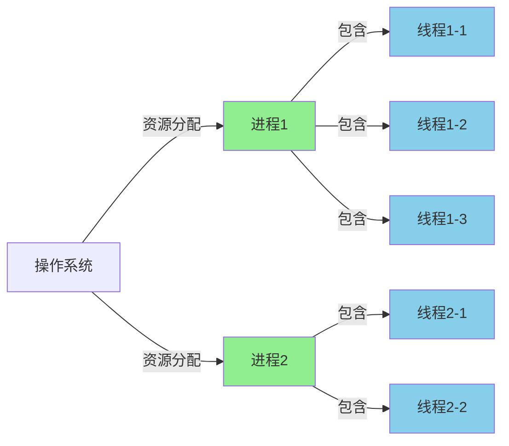
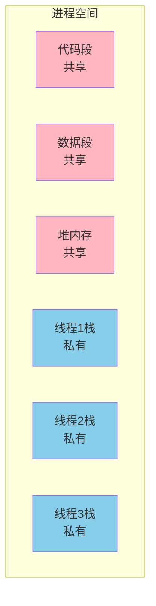
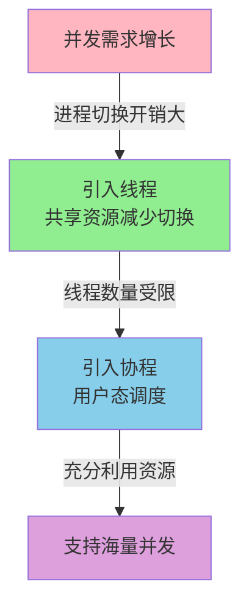

# 进程线程与协程

## 基本概念对比

在操作系统中,**进程**是系统进行**资源分配和保护**的基本单位,而**线程**则是**处理器调度和分派**的基本单位。这两者虽然都与程序执行相关,但在资源管理和调度方式上有本质区别。

以Java应用为例,当我们启动一个Java程序时,操作系统会为其创建一个独立的JVM进程。该进程拥有独立的内存空间、文件描述符等系统资源。在这个JVM进程内部,我们可以创建多个工作线程,这些线程共享进程的资源(如堆内存、方法区等),并且可以并发执行不同的任务。



## 进程的特点

进程具有独立的执行环境和完整的资源集合,主要特征包括:

### 独立的地址空间
每个进程都拥有自己私有的虚拟地址空间,这意味着不同进程之间的内存是相互隔离的。一个电商系统中的订单服务进程无法直接访问库存服务进程的内存数据,这种隔离机制保障了系统的稳定性和安全性。

### 资源独占性
进程拥有独立的文件描述符表、打开的网络连接、信号处理器等系统资源。当一个数据处理进程崩溃时,它所占用的文件句柄、数据库连接等资源会被操作系统回收,不会影响到其他进程的正常运行。

### 较重的创建开销
创建新进程需要分配独立的内存空间、复制父进程的资源描述符等,这个过程涉及大量的系统调用和内核态操作。因此,进程的创建和销毁相比线程要消耗更多的时间和系统资源。

## 线程的特点

线程作为进程内的执行单元,具有以下关键特性:

### 共享进程资源
同一进程内的所有线程共享进程的内存空间、文件句柄、全局变量等资源。在一个Web服务器进程中,多个请求处理线程可以共享数据库连接池、缓存数据等资源,避免了重复创建和维护的开销。

### 轻量级调度单元
线程的创建和销毁只需要分配较小的栈空间和线程控制块(TCB),相比进程要轻量得多。一个典型的用户态线程栈大小约为1MB左右,而进程则需要完整的虚拟地址空间(32位系统约3GB用户空间)。

### 高效的上下文切换
线程间切换不需要切换地址空间,只需要保存和恢复寄存器状态、程序计数器和栈指针,因此上下文切换速度远快于进程。

### 通信便捷
由于共享内存空间,线程间可以直接通过全局变量、堆内存等进行数据交换,无需像进程那样通过管道、消息队列等IPC机制。但这也带来了并发访问的同步问题,需要通过锁、信号量等机制保证数据一致性。



## 协程的引入

协程(Coroutine)是一种用户态的轻量级执行单元,与进程和线程的本质区别在于其调度方式。

### 用户态调度
操作系统内核无法感知协程的存在,协程的创建、调度和销毁完全由应用程序在用户态管理。这避免了内核态和用户态之间的频繁切换,大幅降低了调度开销。

在Go语言中,当我们启动成千上万个goroutine时,底层的调度器(GMP模型)会将这些协程映射到少量的操作系统线程上执行,充分利用CPU资源而不会造成线程爆炸。

### 解决阻塞问题
对于大量涉及IO等待的场景,传统的多线程模型会导致大量线程阻塞在IO操作上,浪费系统资源。而协程可以在遇到IO操作时主动让出CPU,切换到其他协程执行,等IO完成后再恢复执行。

例如,一个需要处理10000个HTTP请求的服务器:
- 使用线程:需要创建10000个线程或使用线程池,线程间切换和同步开销巨大
- 使用协程:可以为每个请求创建一个协程,协程在等待网络IO时自动让出CPU,总体只需要少量线程即可高效运行

### 代码可读性优势
相比基于回调的异步编程模型,协程允许我们用同步的方式编写代码逻辑,避免了"回调地狱"问题。

在Node.js的演进中,我们可以看到这种转变:
```javascript
// 回调方式 - 可读性差
fetchUserInfo(userId, function(user) {
    fetchOrderList(user.id, function(orders) {
        processOrders(orders, function(result) {
            // 深层嵌套...
        });
    });
});

// 协程方式(async/await) - 逻辑清晰
async function handleRequest() {
    const user = await fetchUserInfo(userId);
    const orders = await fetchOrderList(user.id);
    const result = await processOrders(orders);
    return result;
}
```

### 协程的局限性
协程并非银弹,它也有自己的适用场景:
- **适合IO密集型任务**:大量网络请求、文件读写等场景
- **不适合CPU密集型任务**:计算密集的任务无法通过协程提升性能,因为协程本质上还是在用户态串行执行

Java在JDK 19中引入的虚拟线程(Project Loom)就是对协程的一种实现,旨在以更低的开销支持大规模并发。

## 为什么需要这些抽象

### 从进程到线程
早期操作系统只有进程的概念,但进程间切换开销过大。当用户使用文字处理软件时,如果拼写检查、字数统计、自动保存都作为独立进程运行,频繁的进程切换会严重影响性能。

引入线程后,这些"子任务"可以在同一进程内以线程方式运行,共享文档数据,切换开销大幅降低,用户体验得到显著提升。

### 从线程到协程
随着互联网的发展,系统需要同时处理海量的并发连接。即使线程相比进程已经轻量很多,但为每个连接分配一个线程仍然会导致资源耗尽。

协程通过用户态调度,允许系统以极低的开销支持百万级并发连接,这在即时通讯、实时数据推送等场景中至关重要。



## 对比总结

| 维度 | 进程 | 线程 | 协程 |
|------|------|------|------|
| 调度单位 | 操作系统调度 | 操作系统调度 | 用户程序调度 |
| 资源占用 | 重量级(独立地址空间) | 轻量级(共享进程资源) | 极轻量(用户态栈) |
| 创建开销 | 大(需要分配完整资源) | 中(需要分配栈空间) | 小(仅需协程栈) |
| 切换开销 | 大(需要切换地址空间) | 中(需要内核态切换) | 小(用户态切换) |
| 通信方式 | IPC(管道、消息队列等) | 共享内存(需同步) | 共享内存(主动让出) |
| 并发规模 | 数十到数百 | 数百到数千 | 数万到数百万 |
| 适用场景 | 资源隔离、独立服务 | 共享资源的并发任务 | IO密集型高并发 |

在实际开发中,我们需要根据具体场景选择合适的并发模型:
- **进程**:用于构建微服务架构,实现服务间的故障隔离
- **线程**:用于实现单个服务内的并发处理,如Web服务器的请求处理
- **协程**:用于处理大规模IO密集型任务,如爬虫系统、实时通讯服务等
