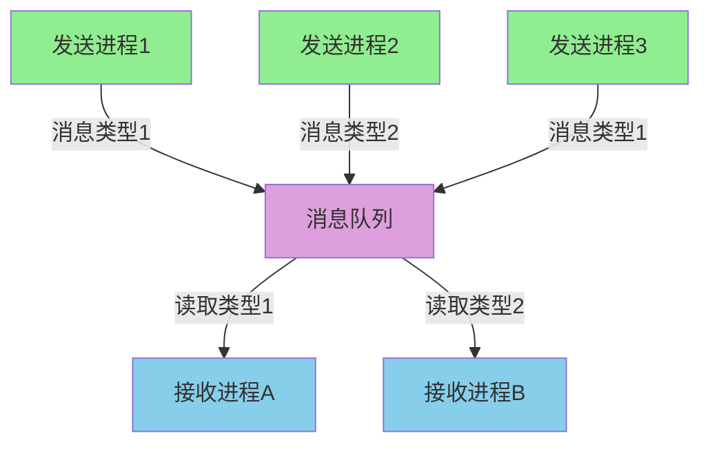
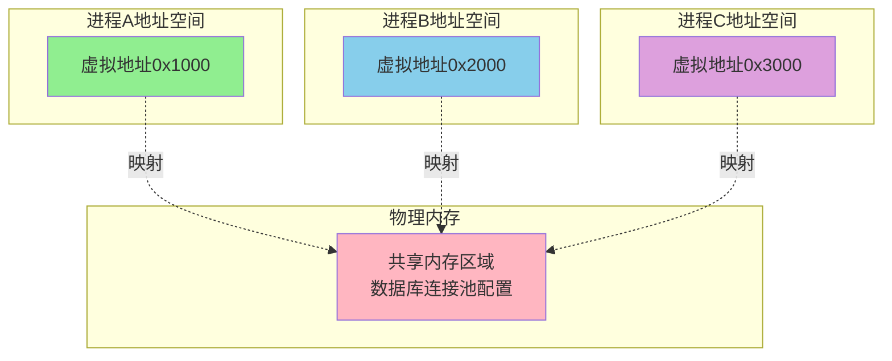
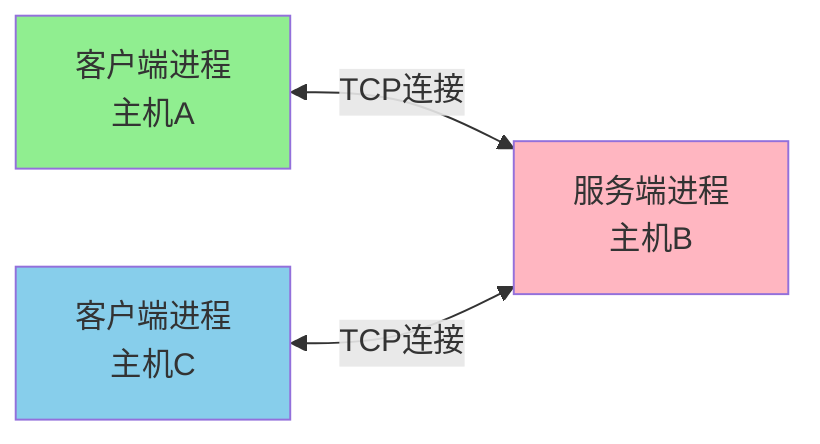
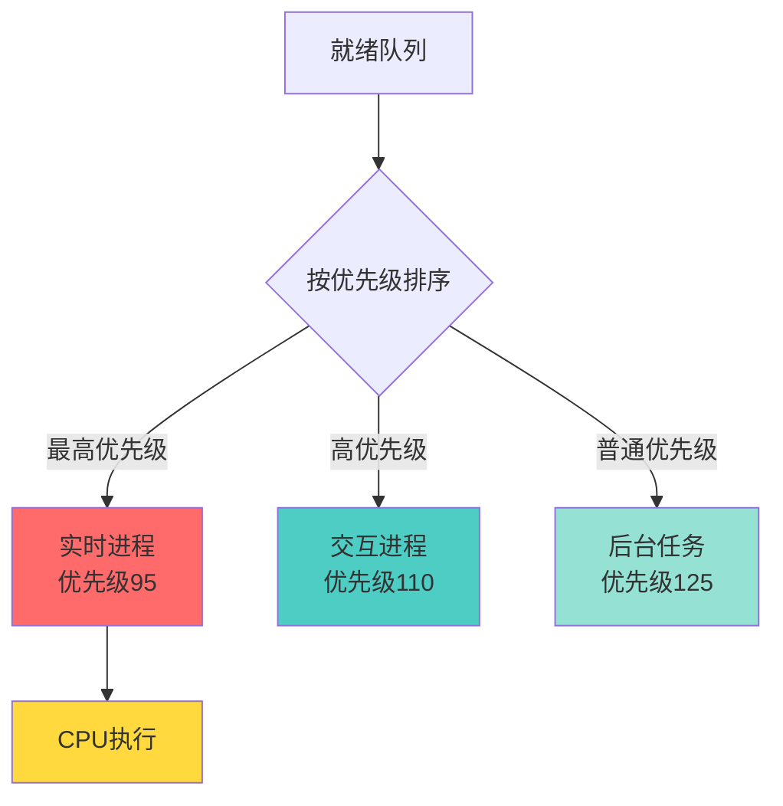
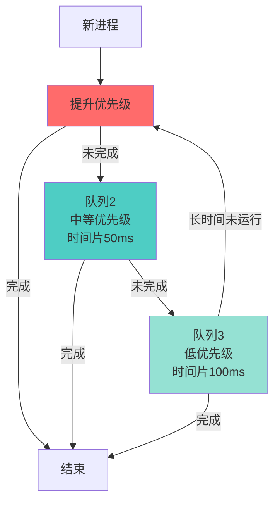
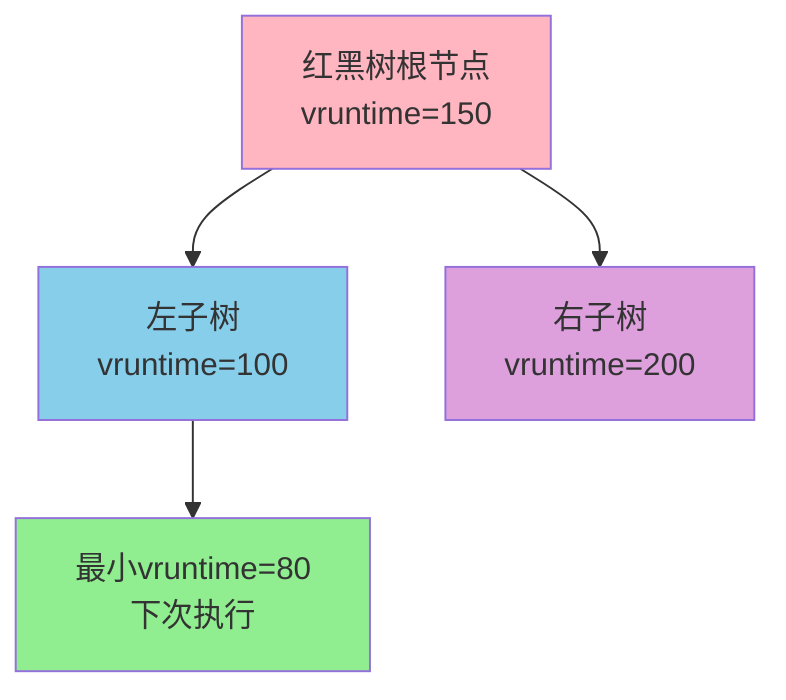

# 进程通信与调度

## 进程间通信机制

进程间通信(Inter-Process Communication, IPC)是指不同进程之间进行数据交换和信息传递的机制。由于进程拥有独立的地址空间,无法直接访问其他进程的内存,因此需要通过操作系统提供的特殊机制来实现通信。

### 管道通信

管道是一种半双工的通信方式,数据只能单向流动。在实现上,管道本质是内核维护的一块缓冲区,一个进程写入数据,另一个进程读取数据。

#### 匿名管道
匿名管道主要用于父子进程间的通信。当我们在Shell中执行命令组合时,就用到了管道:

```bash
# 统计日志文件中包含ERROR的行数
cat application.log | grep "ERROR" | wc -l
```

在这个例子中,`cat`命令的输出通过管道传递给`grep`,`grep`的输出再传递给`wc`。三个进程通过两个管道连接起来,数据在管道中单向流动。


**局限性**:
- 只能用于有亲缘关系的进程(父子进程或兄弟进程)
- 半双工通信,数据单向流动
- 管道缓冲区大小有限(通常为64KB)

#### 命名管道
命名管道突破了匿名管道只能在亲缘进程间使用的限制。它在文件系统中以特殊文件的形式存在,任何有权限的进程都可以通过文件名访问。

在Linux系统中创建命名管道:
```bash
# 创建命名管道
mkfifo /tmp/data_pipe

# 进程A写入数据
echo "订单数据" > /tmp/data_pipe

# 进程B读取数据
cat < /tmp/data_pipe
```

**应用场景**:不相关进程间的单向数据传输,如日志收集系统中,多个服务进程将日志写入同一个命名管道,日志收集进程从管道读取并统一处理。

### 消息队列

消息队列允许进程通过消息缓冲区进行异步通信。进程可以将结构化的消息发送到队列中,其他进程按需从队列中读取。

#### 工作原理
操作系统维护一个消息队列,每个消息包含消息类型和消息内容。接收进程可以按照消息类型选择性地读取,而不必按照发送顺序。



#### 使用场景
在分布式系统中,消息队列被广泛应用。例如,电商系统的订单处理流程:
- 用户服务将订单创建消息发送到队列
- 库存服务从队列获取消息,扣减库存
- 支付服务从队列获取消息,发起支付
- 物流服务从队列获取消息,创建物流单

这种解耦方式使得各个服务可以独立扩展和维护。

**优势**:
- 异步通信,发送方无需等待接收方处理
- 消息可以持久化,系统崩溃后可恢复
- 支持多对多通信模式

### 共享内存

共享内存是最快的IPC方式。多个进程将同一块物理内存映射到各自的虚拟地址空间,从而实现数据共享。

#### 高效的原因
数据不需要在内核空间和用户空间之间复制,一个进程对共享内存的写操作,其他进程可以立即看到。这避免了管道、消息队列等方式中的数据拷贝开销。



#### 同步问题
由于多个进程可以同时访问共享内存,必须配合信号量等同步机制,防止数据竞争。

实际应用示例 - 数据库连接池:
```python
# 进程A写入配置
shared_mem.write({
    'db_host': 'localhost',
    'max_connections': 100,
    'timeout': 30
})

# 进程B读取配置
config = shared_mem.read()
db_pool = create_pool(config)
```

**注意事项**:
- 需要手动管理同步,容易出现死锁和数据不一致
- 共享内存不会随进程结束自动释放,需要显式删除

### 信号量

信号量是一种计数器,用于进程同步和互斥控制。它不用于传输数据,而是用于协调多个进程对共享资源的访问。

#### 工作机制
信号量维护一个整数值,进程可以对其进行两种原子操作:
- **P操作(wait)**:信号量值减1,如果值小于0则进程阻塞
- **V操作(signal)**:信号量值加1,如果有进程阻塞则唤醒一个

#### 典型应用 - 生产者消费者模型
```python
empty_slots = Semaphore(10)  # 缓冲区空位数量
filled_slots = Semaphore(0)  # 缓冲区数据数量
mutex = Semaphore(1)         # 互斥锁

# 生产者进程
def producer():
    while True:
        item = produce_item()
        empty_slots.wait()    # 等待空位
        mutex.wait()          # 获取锁
        buffer.add(item)      # 添加数据
        mutex.signal()        # 释放锁
        filled_slots.signal() # 通知有新数据

# 消费者进程
def consumer():
    while True:
        filled_slots.wait()   # 等待数据
        mutex.wait()          # 获取锁
        item = buffer.get()   # 取出数据
        mutex.signal()        # 释放锁
        empty_slots.signal()  # 通知有空位
        consume_item(item)
```

### 套接字

套接字(Socket)既可用于网络通信,也可用于本地进程间通信。

#### 本地套接字(Unix Domain Socket)
在同一台机器上,Unix Domain Socket比网络套接字更高效,因为数据不需要经过网络协议栈。

典型应用 - Docker与容器通信:
```bash
# Docker daemon监听Unix socket
/var/run/docker.sock

# 客户端通过socket发送命令
docker ps  # 通过socket查询容器列表
```

#### 网络套接字
支持跨主机的进程通信,是分布式系统的基础。



**应用场景**:
- 微服务之间的RPC调用
- 数据库客户端与服务端通信
- 分布式缓存访问

### 内存映射文件

进程可以将文件映射到自己的地址空间,通过操作内存的方式读写文件。多个进程映射同一个文件即可实现共享。

#### 优势
- 读写大文件时效率高,避免频繁的系统调用
- 多个进程共享只读数据时节省内存

```python
# 进程A映射文件并写入
with open('shared_config.dat', 'r+b') as f:
    mmapped = mmap.mmap(f.fileno(), 0)
    mmapped[:10] = b'newconfig!'
    mmapped.close()

# 进程B映射同一文件并读取
with open('shared_config.dat', 'r+b') as f:
    mmapped = mmap.mmap(f.fileno(), 0)
    config = mmapped[:10]  # 读取到'newconfig!'
    mmapped.close()
```

## IPC方式对比

| 方式 | 数据传输 | 同步需求 | 性能 | 使用复杂度 | 适用场景 |
|------|---------|---------|------|-----------|---------|
| 管道 | 字节流 | 自动阻塞 | 中 | 低 | 父子进程单向通信 |
| 消息队列 | 结构化消息 | 异步 | 中 | 中 | 异步解耦的进程通信 |
| 共享内存 | 直接访问 | 需手动同步 | 高 | 高 | 高性能数据共享 |
| 信号量 | 不传输数据 | 同步原语 | 高 | 中 | 资源访问控制 |
| 套接字 | 字节流 | 可选 | 低(网络)/中(本地) | 中 | 跨主机通信 |
| 内存映射 | 文件内容 | 需手动同步 | 高 | 中 | 大文件共享 |

## 进程调度算法

操作系统通过进程调度决定CPU的分配顺序和时长,直接影响系统的响应速度和吞吐量。

### 先来先服务(FCFS)

按照进程到达就绪队列的顺序分配CPU,先到先执行,类似银行排队办理业务。

#### 工作流程


时间线:
- 0-5时刻:进程A执行
- 5-7时刻:进程B执行(等待了4个时间单位)
- 7-10时刻:进程C执行(等待了5个时间单位)

**优点**:实现简单,公平对待所有进程
**缺点**:"护航效应" - 一个长进程会导致后续所有短进程等待

### 短作业优先(SJF)

优先执行预计运行时间最短的进程,分为非抢占式和抢占式两种。

#### 抢占式SJF(最短剩余时间优先)
当新进程到达时,如果其执行时间短于当前进程的剩余时间,则抢占CPU。

假设场景:
- 进程A:到达时间0,执行时间8
- 进程B:到达时间1,执行时间4
- 进程C:到达时间2,执行时间2

执行顺序:
1. 0-1时刻:进程A执行(剩余7)
2. 1-2时刻:进程B抢占(执行时间4 < A剩余7)
3. 2-4时刻:进程C抢占(执行时间2 < B剩余3)
4. 4-7时刻:进程B继续
5. 7-14时刻:进程A继续

**优点**:平均等待时间最短(理论最优)
**缺点**:
- 无法准确预测进程执行时间
- 长进程可能"饿死"

### 优先级调度

为每个进程分配优先级,高优先级进程优先获得CPU。

#### 优先级设置策略
实时系统中的优先级示例:
- **实时进程**:优先级0-99(最高)
  - 紧急中断处理:优先级90-99
  - 实时数据采集:优先级80-89
- **普通进程**:优先级100-139
  - 交互式应用:优先级100-119
  - 后台批处理:优先级120-139



#### 防止饥饿 - 优先级老化
长时间未执行的进程优先级逐渐提升,防止低优先级进程永远得不到执行。

### 时间片轮转(RR)

每个进程分配固定时间片(如100毫秒),时间片用完则切换到队列尾部,循环执行。

#### 时间片大小的影响
- **时间片太小**(如10ms):频繁切换导致开销增大
- **时间片太大**(如1s):退化为FCFS,响应时间变长
- **合适大小**(如100ms):平衡响应时间和切换开销

实际应用 - 分时操作系统:


用户感知:
- 编辑文档(进程A)
- 播放音乐(进程B)
- 下载文件(进程C)

三个任务快速轮转,给用户"同时执行"的错觉。

**优点**:公平,响应时间可控
**缺点**:上下文切换开销

### 多级反馈队列(MLFQ)

将进程按优先级分配到多个队列,队列间优先级不同,队列内时间片不同。

#### 工作机制


#### 特点
- **短任务快速响应**:新进程进入高优先级队列,时间片短,快速执行完毕
- **长任务逐渐降级**:未完成的进程降到低优先级,时间片变长,减少切换
- **防止饥饿**:长时间未执行的低优先级进程会被提升

**应用**:现代Linux系统的调度器(CFS)就借鉴了这种思想。

### 完全公平调度(CFS)

Linux内核默认调度器,通过虚拟运行时间(vruntime)实现公平调度。

#### 核心思想
每个进程维护一个vruntime,表示进程已占用的CPU时间。调度器总是选择vruntime最小的进程执行,确保所有进程按权重公平地获得CPU时间。

```python
# 简化的vruntime计算
vruntime += 实际运行时间 * (nice_0_weight / 进程权重)

# nice值越小,权重越大,vruntime增长越慢,获得更多CPU时间
```

#### 红黑树管理
CFS使用红黑树存储就绪进程,按vruntime排序,查找最小vruntime的时间复杂度为O(log n)。



**优点**:
- 高公平性,避免进程饥饿
- 低延迟,适合交互式应用
- 自适应负载变化

## 调度算法对比

| 算法 | 抢占性 | 平均等待时间 | 响应时间 | 公平性 | 复杂度 | 适用场景 |
|------|--------|------------|---------|--------|--------|---------|
| FCFS | 否 | 长 | 长 | 高 | 低 | 批处理系统 |
| SJF | 可选 | 短(理论最优) | 中 | 低 | 中 | 已知执行时间的任务 |
| 优先级 | 可选 | 中 | 短(高优先级) | 低 | 中 | 实时系统 |
| RR | 是 | 中 | 短 | 高 | 低 | 分时系统 |
| MLFQ | 是 | 短 | 短 | 中 | 高 | 通用操作系统 |
| CFS | 是 | 短 | 短 | 高 | 中 | 现代Linux |

在实际系统中,往往会组合多种调度策略。例如Linux系统同时支持:
- **SCHED_FIFO**:实时先来先服务
- **SCHED_RR**:实时轮转
- **SCHED_NORMAL**:普通进程(使用CFS)
- **SCHED_BATCH**:批处理任务
- **SCHED_IDLE**:空闲时执行

系统根据进程特性选择合适的调度策略,以达到最佳的整体性能。
