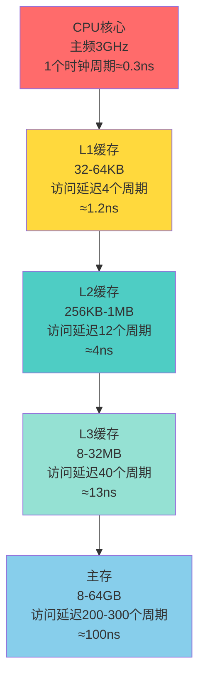
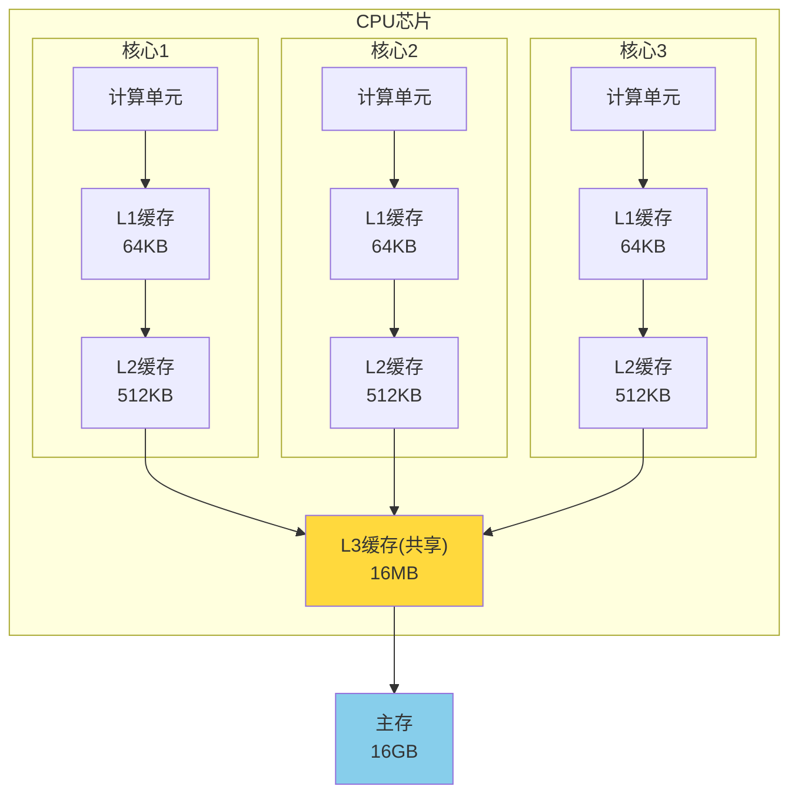
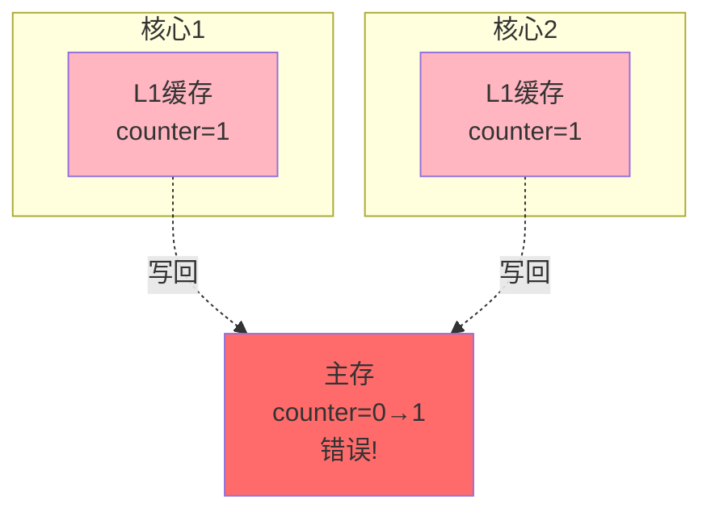
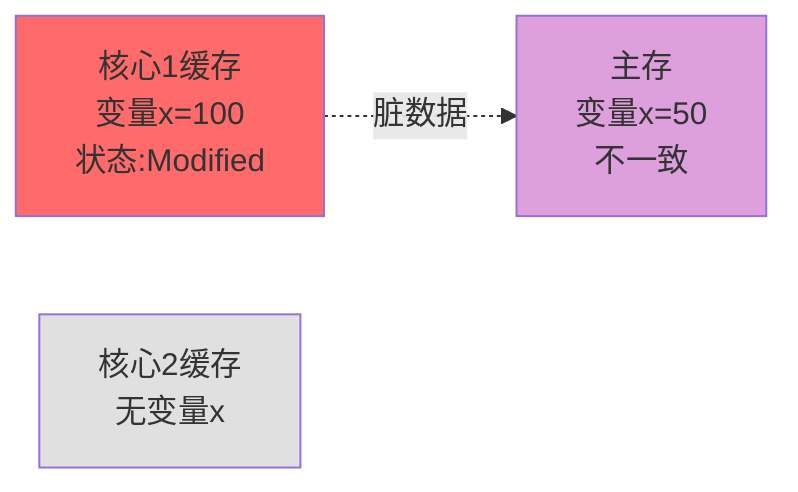
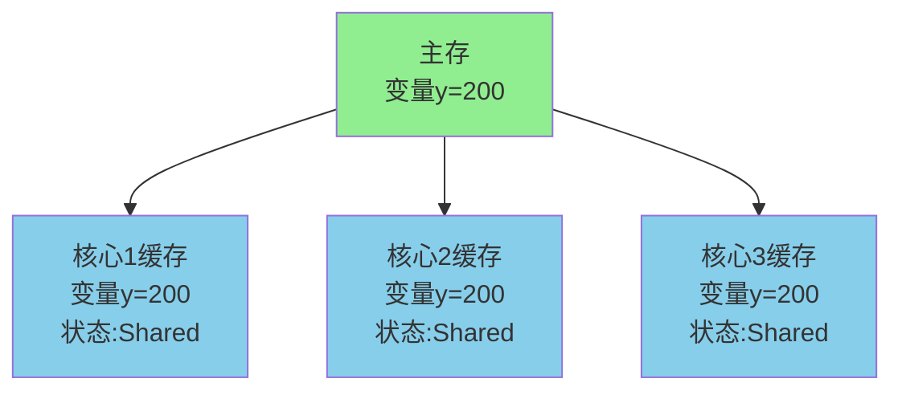
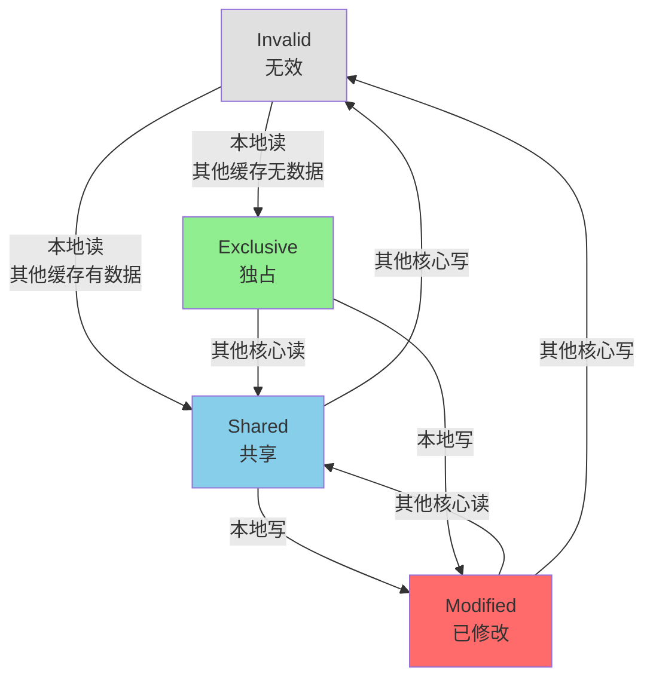
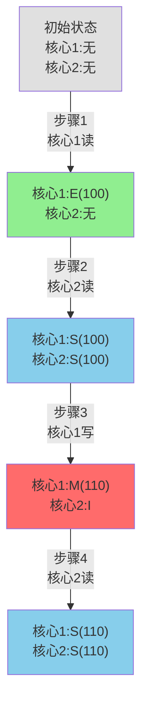
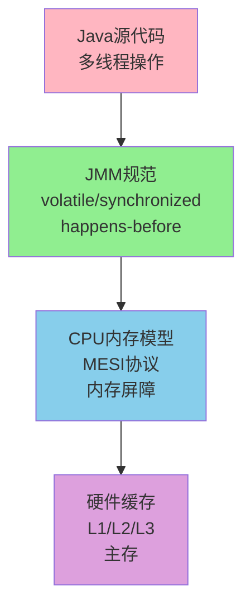

# CPU缓存与一致性协议

## CPU多级缓存体系

随着CPU性能的飞速发展,CPU与主存之间的速度差距越来越大。现代CPU的主频可达数GHz,而内存访问延迟仍在百纳秒级别,两者速度相差数百倍。如果CPU每次操作都直接访问内存,大量时间会浪费在等待数据传输上。

为解决这个瓶颈,计算机体系结构引入了多级缓存,在CPU和主存之间建立速度梯度,缓解速度不匹配问题。

### 缓存层次结构

现代CPU通常具有三级缓存(L1、L2、L3),越接近CPU的缓存速度越快、容量越小、成本越高。



### 缓存特性对比

| 缓存级别 | 容量 | 访问延迟 | 位置 | 共享方式 |
|---------|------|---------|------|---------|
| L1 | 32-64KB | 4周期(约1ns) | CPU核心内 | 每核心独享 |
| L2 | 256KB-1MB | 12周期(约4ns) | CPU核心内 | 每核心独享 |
| L3 | 8-32MB | 40周期(约13ns) | CPU芯片内 | 所有核心共享 |
| 主存 | 8-64GB | 200周期(约100ns) | 主板上 | 所有CPU共享 |

**性能提升示例**:
假设程序执行1亿次内存访问,缓存命中率90%:
- 无缓存:1亿 × 100ns = 10秒
- 有L1缓存(90%命中):9000万 × 1ns + 1000万 × 100ns = 1.09秒
- **性能提升约9倍**

### 多核CPU的缓存架构

在多核处理器中,每个核心拥有独立的L1和L2缓存,而L3缓存被所有核心共享。



### 数据读取流程

当CPU需要读取数据时,按照以下顺序查找:

1. **L1缓存查询**:在L1 cache中查找数据
   - 命中:直接返回(耗时约1ns)
   - 未命中:进入下一级

2. **L2缓存查询**:在L2 cache中查找
   - 命中:返回并填充L1(耗时约4ns)
   - 未命中:进入下一级

3. **L3缓存查询**:在L3 cache中查找
   - 命中:返回并填充L2、L1(耗时约13ns)
   - 未命中:访问主存

4. **主存访问**:从内存读取数据
   - 耗时约100ns
   - 将数据依次填充到L3、L2、L1

**代码示例 - 数组遍历**:
```java
// 方式1:按行遍历(利用空间局部性,缓存友好)
for (int i = 0; i < 1000; i++) {
    for (int j = 0; j < 1000; j++) {
        sum += array[i][j];  // 连续访问内存
    }
}

// 方式2:按列遍历(跳跃访问,缓存不友好)
for (int j = 0; j < 1000; j++) {
    for (int i = 0; i < 1000; i++) {
        sum += array[i][j];  // 跨行访问,缓存命中率低
    }
}
```

实测结果(1000×1000整数数组):
- 方式1:约2毫秒(高缓存命中率)
- 方式2:约15毫秒(频繁cache miss)
- **性能差距7.5倍**

## 缓存一致性问题

在多核系统中,每个核心都有独立的L1/L2缓存。当多个核心同时访问同一内存地址时,可能出现数据不一致的情况。

### 问题场景

假设有两个CPU核心,共享变量`counter`初始值为0,内存地址0x1000:

**时间序列**:
1. **T1时刻**:核心1读取counter(值为0),缓存到L1
2. **T2时刻**:核心2读取counter(值为0),缓存到L1
3. **T3时刻**:核心1将counter加1,写入L1缓存(核心1 L1中counter=1)
4. **T4时刻**:核心2将counter加1,写入L1缓存(核心2 L1中counter=1)
5. **T5时刻**:两个核心将数据写回主存

**预期结果**:counter = 2
**实际结果**:counter = 1(数据不一致!)



### 解决方案演进

#### 早期方案:总线锁

在执行关键代码时,锁定总线(LOCK#信号),阻止其他CPU访问内存。

**问题**:
- 锁定总线期间,其他CPU完全无法访问内存
- 系统整体性能严重下降
- 即使访问的是不同内存地址也会被阻塞

#### 现代方案:缓存一致性协议

通过协议保证多个缓存中的数据一致性,只在必要时进行同步,性能更高。

## MESI缓存一致性协议

MESI是Intel等处理器广泛采用的缓存一致性协议,名称来源于缓存行的四种状态:

### 四种状态

#### Modified(已修改)
- **含义**:缓存行数据已被修改,与内存不一致
- **独占性**:数据只存在于当前缓存,其他核心的缓存中无此数据
- **脏数据**:需要在被替换前写回内存
- **场景**:核心1对变量执行了写操作



#### Exclusive(独占)
- **含义**:缓存行数据与内存一致
- **独占性**:数据只存在于当前缓存
- **干净数据**:可直接丢弃,无需写回
- **场景**:核心1首次读取未被其他核心缓存的数据

#### Shared(共享)
- **含义**:缓存行数据与内存一致
- **共享性**:多个核心缓存中都有此数据
- **干净数据**:可直接丢弃
- **场景**:多个核心读取同一变量



#### Invalid(无效)
- **含义**:缓存行数据无效,不可用
- **场景**:其他核心修改了此数据,当前缓存被标记为失效

### 状态转换流程



### 实际运作示例

假设两个核心并发访问变量`count`,初始值100:

**步骤1**:核心1读取count
- 核心1:发起读请求
- 内存:返回count=100
- 核心1缓存:count=100,状态=Exclusive(独占)

**步骤2**:核心2读取count
- 核心2:发起读请求
- 核心1:监听到请求,将数据共享给核心2
- 核心1缓存:count=100,状态改为Shared
- 核心2缓存:count=100,状态=Shared

**步骤3**:核心1写入count=110
- 核心1:发起写请求
- 核心1:通过总线发送Invalidate消息
- 核心2:收到消息,将缓存行状态改为Invalid
- 核心1:执行写操作,count=110,状态=Modified

**步骤4**:核心2读取count
- 核心2:发现缓存行Invalid,发起读请求
- 核心1:监听到请求,发现自己是Modified状态
- 核心1:先将count=110写回主存
- 核心1:将数据共享给核心2,状态改为Shared
- 核心2:获取count=110,状态=Shared



### 总线监听机制

MESI协议通过总线监听(Bus Snooping)实现:
- 每个核心的缓存控制器监听总线上的所有内存操作
- 当发现其他核心访问自己缓存的数据时,采取相应行动
- 保证同一时刻最多一个核心拥有Modified状态的缓存行

### 性能优化机制

#### 写缓冲区(Store Buffer)
当核心执行写操作需要通知其他核心时,不会同步等待,而是将写请求放入Store Buffer,CPU继续执行后续指令。

#### 无效队列(Invalidate Queue)
接收到Invalidate消息的核心,将消息放入队列异步处理,避免阻塞。

**副作用**:可能导致指令重排序,需要内存屏障(Memory Barrier)保证顺序性。

## MESI与Java内存模型

虽然MESI保证了硬件层面的缓存一致性,但Java程序还需要处理更复杂的可见性和有序性问题。

### 可见性问题

即使MESI保证了缓存最终一致,但由于Store Buffer和Invalidate Queue的存在,一个线程的写操作可能不会立即对其他线程可见。

```java
// 线程1
public void writer() {
    data = 42;      // 写入Store Buffer,暂未生效
    ready = true;   // 写入Store Buffer
}

// 线程2
public void reader() {
    if (ready) {    // 可能读到ready=true
        int value = data;  // 但data可能还是0!
    }
}
```

### Java的解决方案

#### volatile关键字
- 写操作后插入Store Barrier,强制刷新Store Buffer
- 读操作前插入Load Barrier,强制清空Invalidate Queue
- 保证可见性和有序性

```java
private volatile boolean ready = false;

// 线程1
public void writer() {
    data = 42;
    ready = true;  // volatile写,保证data的修改对其他线程可见
}

// 线程2
public void reader() {
    if (ready) {   // volatile读,保证能读到最新的data
        int value = data;  // 一定能读到42
    }
}
```

#### synchronized和Lock
- 获取锁时,清空本地缓存,从主存读取
- 释放锁时,将修改写回主存
- 保证临界区内的操作对其他线程可见

### 为什么有了MESI还需要JMM?

**MESI的局限**:
- 只保证单个缓存行的一致性
- 不保证跨缓存行的操作顺序
- 不阻止编译器和CPU的指令重排序

**JMM的补充**:
- 定义happens-before规则,保证跨线程的操作顺序
- 提供volatile、synchronized等工具,显式控制内存可见性
- 屏蔽不同硬件平台的差异,提供统一的并发语义



## 实战应用

### 伪共享(False Sharing)问题

当两个线程频繁修改同一缓存行(通常64字节)中的不同变量时,会导致缓存行在Modified和Invalid状态间频繁切换,严重影响性能。

```java
// 存在伪共享的代码
public class CounterNoPadding {
    public volatile long counter1 = 0;  // 8字节
    public volatile long counter2 = 0;  // 8字节,与counter1在同一缓存行
}

// 解决伪共享:填充使变量位于不同缓存行
public class CounterWithPadding {
    public volatile long counter1 = 0;
    private long p1, p2, p3, p4, p5, p6, p7;  // 填充56字节
    public volatile long counter2 = 0;  // 位于下一个缓存行
}
```

性能测试:
- 2个线程各自修改1亿次counter
- 无填充:耗时约5秒(频繁缓存行失效)
- 有填充:耗时约0.5秒(各自独立的缓存行)
- **性能提升10倍**

### JDK中的应用

Java 8引入`@Contended`注解,自动进行缓存行填充:

```java
@jdk.internal.vm.annotation.Contended
public class OptimizedCounter {
    public volatile long counter = 0;
}
```

在高并发场景下,理解和利用CPU缓存机制,可以显著提升程序性能。
