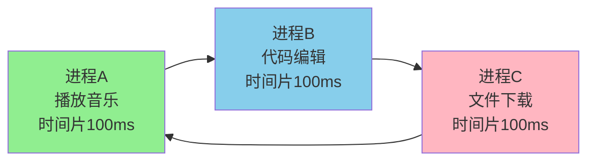
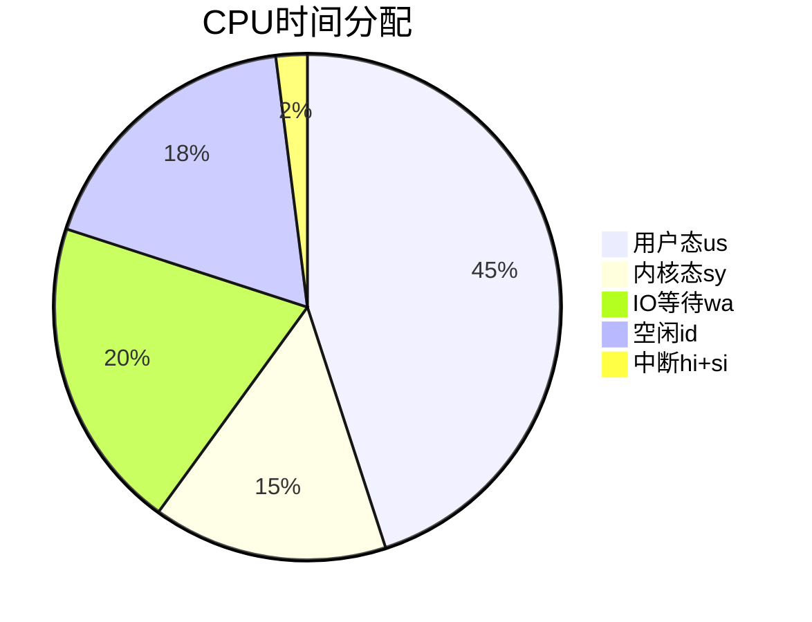
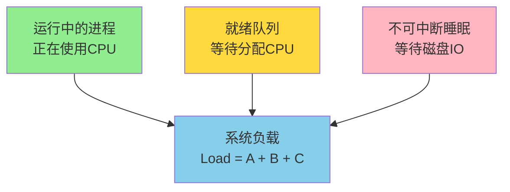

# 系统性能监控

## 时间片与分时调度

现代操作系统(如Windows、Linux、macOS)都是多用户多任务分时系统。用户可以"同时"运行多个程序:边听音乐边写代码边下载文件,这早已成为日常习惯。

但实际上,对于单核CPU来说,同一时刻只能执行一个任务。为了营造"并行执行"的假象,操作系统采用了时间片轮转的调度策略。

### 时间片机制

**时间片(Time Slice)** 是操作系统分配给每个进程的CPU使用时间,通常为几十到几百毫秒。



**工作流程**:
1. 进程A获得CPU,执行100ms
2. 时间片耗尽,操作系统暂停进程A,保存其状态(寄存器、PC等)
3. 切换到进程B,恢复其状态,执行100ms
4. 依次轮转到进程C
5. 一轮结束后,回到进程A继续执行

由于切换速度极快(毫秒级),用户感知不到停顿,认为程序在"同时"运行。

### 时间片大小的权衡

**时间片过小**(如10ms):
- **优点**:响应速度快,用户操作实时性好
- **缺点**:频繁切换导致CPU浪费在上下文保存/恢复上,吞吐量下降

**时间片过大**(如1秒):
- **优点**:减少切换开销,吞吐量高
- **缺点**:响应速度慢,用户操作可能需要等待较长时间

**实际配置**:
- Linux CFS调度器:动态调整,默认目标延迟6ms,根据进程数量分配时间片
- Windows:优先级高的进程获得更多时间片,通常20-120ms

### 上下文切换的代价

每次进程切换需要:
1. 保存当前进程的CPU寄存器(程序计数器PC、栈指针SP、通用寄存器等)
2. 更新进程状态(运行→就绪)
3. 选择下一个进程(查询调度队列)
4. 加载新进程的寄存器状态
5. 切换内存映射(页表切换,TLB失效)

**开销估算**:
- 寄存器保存/恢复:约几微秒
- TLB刷新导致的缓存失效:数十微秒到毫秒
- 总开销:通常1-10微秒

如果时间片10ms,切换开销10μs,则上下文切换占比仅0.1%,可以接受。

## CPU利用率详解

CPU利用率是衡量系统负载的核心指标之一,表示CPU在一段时间内被有效使用的比例。

### 利用率的组成

CPU时间可分为多个维度:

**按执行模式分**:
- **用户态时间(us)**:执行用户程序代码
- **内核态时间(sy)**:执行系统调用、中断处理等内核代码
- **空闲时间(id)**:CPU无任务可执行

**按任务类型分**:
- **Nice进程时间(ni)**:低优先级(nice值>0)进程占用的时间
- **IO等待时间(wa)**:等待IO完成,CPU闲置
- **硬中断时间(hi)**:处理硬件中断
- **软中断时间(si)**:处理软件中断
- **虚拟化开销(st)**:虚拟机等待宿主机分配CPU的时间



### 利用率计算公式

在时刻t1和t2之间,CPU利用率计算为:

```
总时间 = (user2 + nice2 + system2 + idle2 + iowait2 + irq2 + softirq2) 
       - (user1 + nice1 + system1 + idle1 + iowait1 + irq1 + softirq1)

空闲时间 = idle2 - idle1

CPU利用率 = (1 - 空闲时间/总时间) × 100%
```

### 查看CPU利用率

#### vmstat命令

```bash
$ vmstat 2 3
procs -----------memory---------- ---swap-- -----io---- --system-- -----cpu-----
 r  b   swpd   free   buff  cache   si   so    bi    bo   in   cs us sy id wa st
 1  0      0 2446260      0 3202312    0    0   201 16304    1    6 40 10 45  5  0
 0  1      0 2479404      0 3165176    0    0     0  2804 81664 2715 38  8 48  6  0
 0  0      0 2450123      0 3180234    0    0   150  3200 82341 2890 42  9 43  6  0
```

**CPU部分解读**:
- **us=40**:用户态占用40%,应用程序计算密集
- **sy=10**:内核态占用10%,系统调用频繁
- **id=45**:空闲45%,还有余力
- **wa=5**:IO等待5%,磁盘可能有轻微瓶颈
- **st=0**:非虚拟化环境或虚拟机资源充足

**异常情况分析**:
- **us持续>70%**:应用程序CPU密集,考虑优化算法或增加CPU核心
- **sy持续>30%**:系统调用过多,可能存在大量小IO操作或线程创建
- **wa持续>20%**:IO成为瓶颈,检查磁盘读写、网络传输
- **st持续>10%**:虚拟机CPU资源不足,宿主机超配严重

#### top命令

```bash
$ top
top - 10:58:07 up 18:13,  1 user,  load average: 0.32, 0.24, 0.19
Tasks:  64 total,   1 running,  63 sleeping,   0 stopped,   0 zombie
Cpu(s): 42.1%us, 8.2%sy, 0.0%ni, 43.8%id, 5.1%wa, 0.0%hi, 0.8%si, 0.0%st
Mem:   8388608k total,  5928076k used,  2460532k free,        0k buffers
Swap: 16777216k total,        0k used, 16777216k free,  3181996k cached

   PID USER      PR  NI  VIRT  RES  SHR S %CPU %MEM    TIME+  COMMAND
  2393 app       20   0 5056m 2.2g  56m S 78.3 27.6  79:06.21 java
  1054 root      20   0  338m 9760 5112 S  0.3  0.1   2:37.30 logagent
```

**线程级CPU分析**:
```bash
$ top -Hp 2393
PID USER      PR  NI  VIRT  RES  SHR S %CPU %MEM    TIME+  COMMAND
19163 app      20   0 5056m 2.2g  56m R 45.7 27.6  17:39.97 java
10649 app      20   0 5056m 2.2g  56m S 18.7 27.6   4:07.64 java
5884 app       20   0 5056m 2.2g  56m S  8.3 27.6   2:18.19 java
```

发现线程19163占用CPU最高,使用jstack分析:
```bash
$ printf %x 19163  # 转换为16进制
4adb
$ jstack 2393 | grep -A 20 4adb
"BusinessThread-5" #500 daemon prio=10 tid=0x00007f632314a800 nid=0x4adb runnable
   at com.example.service.Calculator.compute(Calculator.java:42)
   - locked <0x00000000e1234567> (a java.lang.Object)
   at com.example.service.OrderService.process(OrderService.java:88)
```

定位到具体的高CPU占用代码,可以针对性优化。

## 系统负载(Load Average)

Load Average表示系统在一段时间内的平均负载,反映系统的繁忙程度。

### 负载的含义

负载值=**正在运行的进程数 + 等待运行的进程数 + 不可中断睡眠的进程数**



**不可中断睡眠**:进程正在等待IO(如磁盘读写),此时不能被打断,计入负载。

### 三个时间窗口

```bash
$ uptime
13:29  up 23:41, 3 users, load averages: 2.45 1.87 1.56
```

- **1.45**:最近1分钟平均负载
- **1.87**:最近5分钟平均负载
- **1.56**:最近15分钟平均负载

**趋势分析**:
- **1分钟 < 5分钟 < 15分钟**:负载在下降,系统趋于稳定
- **1分钟 > 5分钟 > 15分钟**:负载在上升,可能出现问题
- **三者接近**:负载平稳

### 负载阈值判断

负载是否过高取决于CPU核心数。一般规则:

```
安全负载 = CPU核心数 × 0.7
```

**示例**:
- **单核CPU**:负载>0.7需关注,>1.0需介入,>5.0严重问题
- **4核CPU**:负载>2.8需关注,>4.0需介入,>20.0严重问题

**特殊情况**:
- IO密集型服务器(如文件服务器):负载可能长期>1.0,但CPU使用率不高,属于正常
- CPU密集型服务器(如科学计算):负载应与CPU核心数接近

### 负载飙高排查

#### 步骤1:查看负载和CPU利用率

```bash
$ uptime
load average: 12.50, 8.30, 4.20

$ vmstat 1 3
procs -----------memory---------- ---swap-- -----io---- --system-- -----cpu-----
 r  b   swpd   free   buff  cache   si   so    bi    bo   in   cs us sy id wa st
18  3      0 245632      0 3202312    0    0  8500 16000   100 5000 85 10  2  3  0
```

**分析**:
- r(运行队列)=18:18个进程等待CPU,远超4核CPU处理能力
- b(阻塞队列)=3:3个进程等待IO
- us=85%:用户态占用极高,应用程序计算密集
- wa=3%:IO等待不高,排除磁盘瓶颈

**结论**:CPU计算瓶颈,非IO问题。

#### 步骤2:定位高CPU进程

```bash
$ top -o %CPU
PID   USER      %CPU  %MEM   COMMAND
1893  app       450.0  32.6  java
2341  app        98.2  12.3  python
```

进程1893占用450%(4.5个核心),异常!

#### 步骤3:分析线程CPU占用

```bash
$ top -Hp 1893
PID   USER      %CPU  COMMAND
4519  app       180.0  java  # 占用1.8个核心!
4520  app        95.0  java
4521  app        90.0  java
```

#### 步骤4:定位代码

```bash
$ printf %x 4519
11a7
$ jstack 1893 | grep -A 50 11a7
"calculator-thread" nid=0x11a7 runnable
   at com.example.Calculator.fibonacci(Calculator.java:15)  # 递归计算斐波那契数列
   at com.example.Calculator.fibonacci(Calculator.java:15)
   ...
```

**问题根源**:低效的递归算法导致CPU飙升。

#### 步骤5:临时缓解

```bash
# 降低进程优先级
$ renice +10 -p 1893

# 限制CPU使用率(使用cpulimit工具)
$ cpulimit -p 1893 -l 100  # 限制在1个核心(100%)
```

#### 步骤6:根本解决

优化算法,将递归改为动态规划:
```java
// 优化前:指数级时间复杂度O(2^n)
public long fibonacci(int n) {
    if (n <= 1) return n;
    return fibonacci(n-1) + fibonacci(n-2);
}

// 优化后:线性时间复杂度O(n)
public long fibonacci(int n) {
    if (n <= 1) return n;
    long[] dp = new long[n+1];
    dp[0] = 0; dp[1] = 1;
    for (int i = 2; i <= n; i++) {
        dp[i] = dp[i-1] + dp[i-2];
    }
    return dp[n];
}
```

性能对比(计算fibonacci(40)):
- 优化前:耗时约30秒,CPU 100%
- 优化后:耗时小于1毫秒,CPU瞬间峰值

## CPU密集 vs IO密集

任务类型决定了优化方向和资源配置策略。

### CPU密集型任务

**特征**:
- 大量计算操作,很少IO等待
- CPU利用率高(大于70%)
- 增加线程数无明显收益,甚至因上下文切换降低性能

**典型场景**:
- 视频编码/解码
- 图像处理(滤镜、压缩)
- 机器学习模型训练
- 密码学计算(加密/解密、哈希)
- 科学计算(矩阵运算、模拟仿真)

**优化策略**:
1. **增加CPU核心数**:线性提升处理能力
2. **使用多进程**:充分利用多核,避免GIL限制(Python)
3. **算法优化**:降低时间复杂度,如O(n²)→O(n log n)
4. **并行计算**:使用SIMD指令、GPU加速

**示例 - 图像处理**:
```python
# CPU密集型:调整图像大小
from PIL import Image
import multiprocessing

def resize_image(path):
    img = Image.open(path)
    img = img.resize((800, 600))  # CPU密集的像素计算
    img.save(f"resized_{path}")

# 使用进程池充分利用多核
if __name__ == '__main__':
    paths = [f"image_{i}.jpg" for i in range(100)]
    with multiprocessing.Pool(processes=4) as pool:  # 4核CPU
        pool.map(resize_image, paths)
```

### IO密集型任务

**特征**:
- 大量IO操作(网络、磁盘、数据库)
- CPU利用率低(小于30%),大量时间在等待
- 增加并发(线程/协程)可显著提升吞吐量

**典型场景**:
- Web服务(处理HTTP请求)
- 数据库查询
- 文件读写
- 网络爬虫
- 消息队列消费

**优化策略**:
1. **增加并发线程/协程**:CPU可以在等待IO时处理其他任务
2. **使用异步IO**:避免阻塞,提升并发能力
3. **连接池复用**:减少建立连接的开销
4. **缓存热点数据**:减少IO操作次数

**线程数量配置**:
```
最优线程数 = CPU核心数 × (1 + IO等待时间/CPU计算时间)
```

例如,4核CPU,任务80%时间在IO等待:
```
最优线程数 = 4 × (1 + 80/20) = 4 × 5 = 20
```

**示例 - 网络爬虫**:
```python
import asyncio
import aiohttp

# IO密集型:并发爬取URL
async def fetch(session, url):
    async with session.get(url) as response:  # 网络IO
        return await response.text()

async def main():
    urls = [f"http://example.com/page{i}" for i in range(100)]
    async with aiohttp.ClientSession() as session:
        tasks = [fetch(session, url) for url in urls]
        results = await asyncio.gather(*tasks)  # 并发100个请求
    
# 单线程+异步IO处理100个请求
asyncio.run(main())
```

### 混合型任务

实际应用往往是混合型,需要分段优化:

**示例 - 数据处理流程**:


**优化方案**:
- 数据库读取:使用连接池+批量查询,减少IO次数
- 数据清洗和特征提取:使用多进程并行计算
- 存入Redis:使用pipeline批量写入,减少网络往返

### 对比总结

| 维度 | CPU密集型 | IO密集型 |
|------|----------|---------|
| CPU使用率 | 高(大于70%) | 低(小于30%) |
| 主要瓶颈 | 计算能力 | IO等待 |
| 线程策略 | 线程数≈CPU核心数 | 线程数可以远大于核心数 |
| 扩展方式 | 多进程/增加CPU | 多线程/协程/异步IO |
| 典型任务 | 视频编码、机器学习 | Web服务、爬虫、数据库 |

**架构建议**:
- **CPU密集服务**(如视频转码):纵向扩展,增加单机CPU核心数
- **IO密集服务**(如API网关):横向扩展,增加服务器数量,每台保持较低的CPU使用率

通过正确识别任务类型并采用相应的优化策略,可以最大化系统性能和资源利用率。
