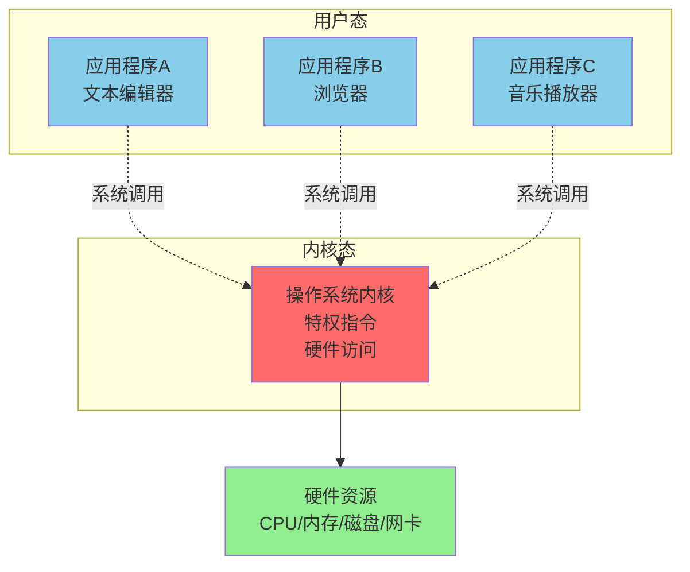
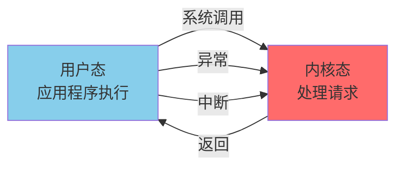
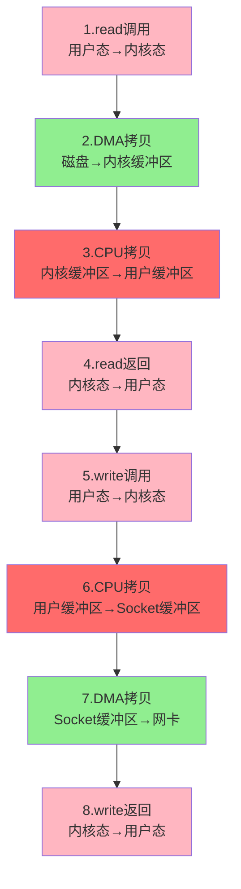
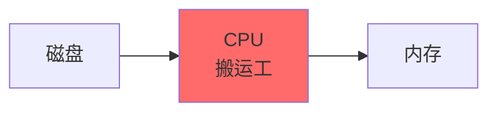
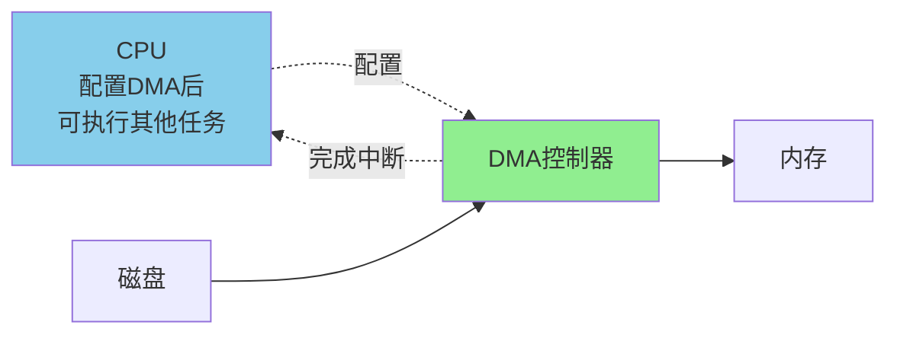
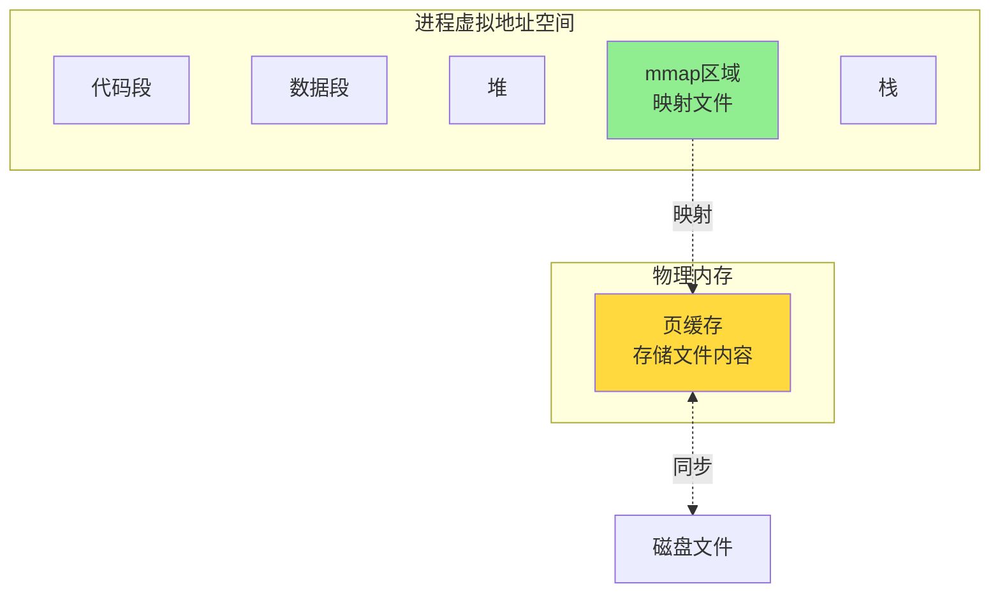
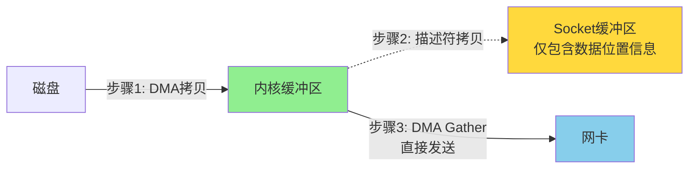
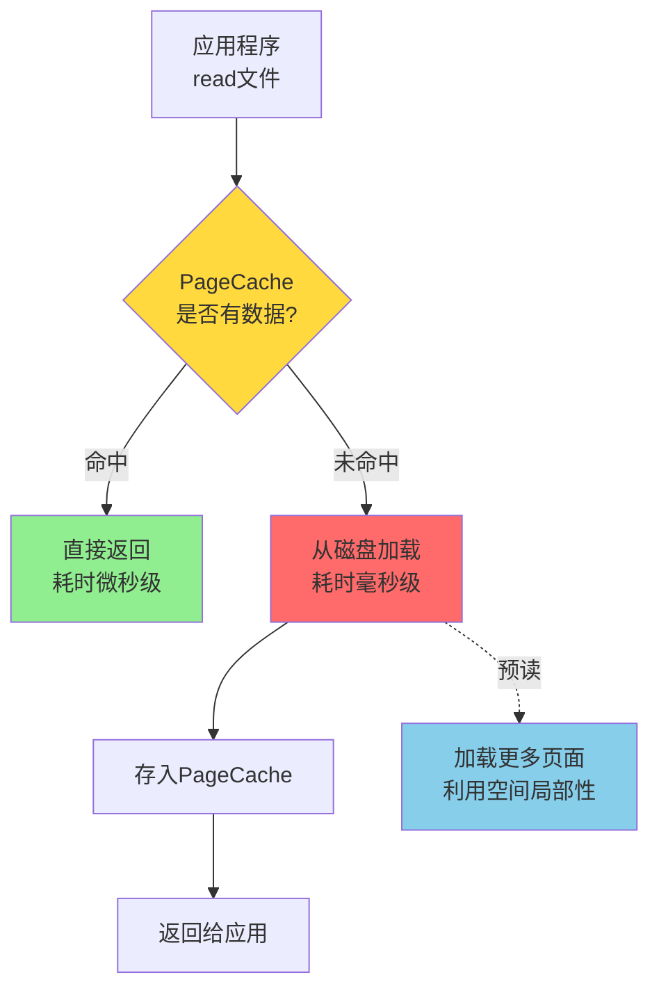
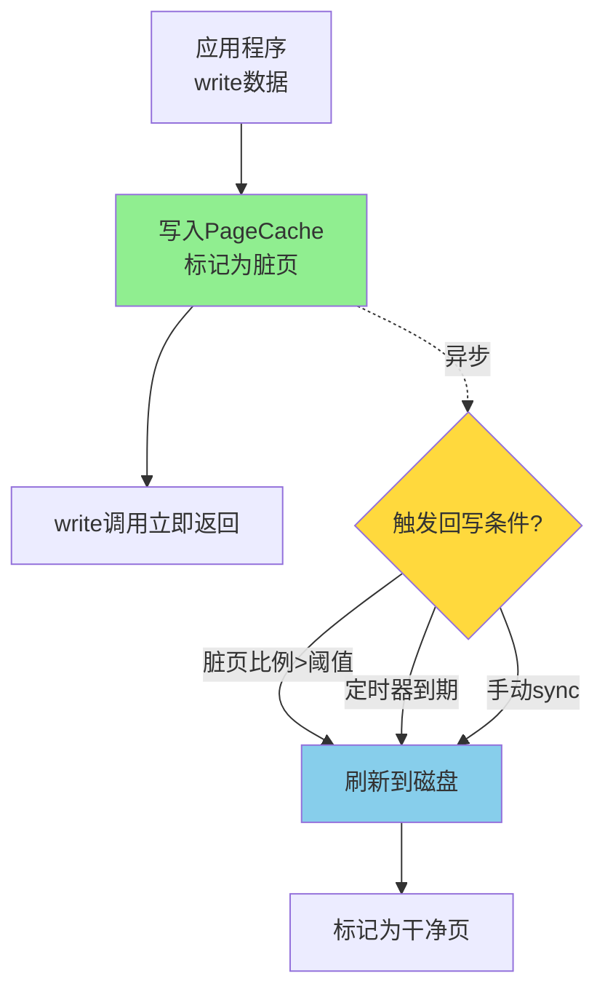

# IO优化与零拷贝

## 用户态与内核态

操作系统为了保证系统的稳定性和安全性,将运行模式划分为两种特权级别:用户态和内核态。

### 特权级别的必要性

如果所有应用程序都能直接访问硬件资源,会导致严重问题:
- **系统崩溃**:恶意程序或bug可能破坏关键系统数据结构
- **资源冲突**:多个进程同时操作同一硬件设备导致混乱
- **安全漏洞**:绕过权限检查,访问其他用户的私密数据

因此,操作系统内核运行在高特权的内核态,而应用程序运行在低特权的用户态。



### 用户态特征

**定义**:应用程序运行在非特权模式下,访问受限的资源。

**限制**:
- 只能执行非特权指令(算术运算、逻辑判断等)
- 不能直接访问硬件设备(磁盘、网卡等)
- 不能修改系统关键数据结构(进程表、内存页表等)
- 只能访问自己的虚拟地址空间

**示例**:
```java
// 用户态代码
public class FileReader {
    public String readFile(String path) {
        // 这段代码运行在用户态
        StringBuilder content = new StringBuilder();
        
        // 当调用read时,会触发系统调用,切换到内核态
        try (BufferedReader br = new BufferedReader(new FileReader(path))) {
            String line;
            while ((line = br.readLine()) != null) {
                content.append(line);
            }
        }
        
        return content.toString();
    }
}
```

### 内核态特征

**定义**:操作系统内核运行在特权模式下,拥有最高权限。

**能力**:
- 执行所有指令,包括特权指令(修改寄存器、操作IO端口等)
- 直接访问硬件设备
- 修改系统数据结构(进程控制块、页表等)
- 访问所有内存空间(包括其他进程的)

**职责**:
- 进程调度:决定哪个进程获得CPU
- 内存管理:分配和回收内存
- 文件系统:管理磁盘上的文件
- 设备驱动:控制硬件设备
- 网络协议栈:处理网络通信

### 状态切换时机

**用户态→内核态**的触发条件:

#### 系统调用(主动切换)
应用程序主动请求内核服务,如读写文件、创建进程等。

```java
// Java中的系统调用示例
FileInputStream fis = new FileInputStream("/etc/passwd");
// 底层触发open()系统调用,从用户态进入内核态
fis.read(buffer);
// 底层触发read()系统调用
```

#### 异常(被动切换)
程序执行出错,如访问非法内存地址、除零错误等。

```c
int *p = NULL;
*p = 10;  // 触发段错误,CPU自动切换到内核态处理异常
```

#### 中断(被动切换)
外部设备发出中断信号,如网卡收到数据包、定时器到期等。



### 切换过程与开销

**切换步骤**:
1. **保存用户态上下文**:
   - 保存通用寄存器(rax, rbx等)
   - 保存程序计数器PC
   - 保存栈指针SP

2. **切换到内核栈**:
   - 每个进程有独立的用户栈和内核栈
   - 切换栈指针到内核栈

3. **执行内核代码**:
   - 根据系统调用号执行相应函数
   - 访问硬件设备、修改内核数据结构

4. **恢复用户态上下文**:
   - 将结果写入用户态寄存器
   - 恢复用户态栈
   - 返回用户态继续执行

**开销分析**:
- 单次切换时间:约几百纳秒到几微秒
- 频繁切换影响:高频系统调用(如小块读写文件)性能下降明显

**优化示例**:
```java
// 低效:每次读1字节,频繁系统调用
FileInputStream fis = new FileInputStream("large.dat");
for (int i = 0; i < 1000000; i++) {
    fis.read();  // 100万次系统调用!
}

// 高效:批量读取,减少系统调用
BufferedInputStream bis = new BufferedInputStream(fis);
byte[] buffer = new byte[8192];
while (bis.read(buffer) != -1) {
    // 仅需约122次系统调用(1MB/8KB)
}
```

## IO优化技术

传统的文件读写涉及多次数据拷贝和状态切换,在高性能场景下成为瓶颈。多种IO优化技术应运而生。

### 传统IO的问题

读取文件并通过网络发送的完整流程:



**统计**:
- **4次数据拷贝**:磁盘→内核→用户→内核→网卡
- **4次状态切换**:用户态↔内核态往返2次
- **2次CPU参与的拷贝**:占用CPU资源

### DMA技术

**DMA(Direct Memory Access,直接内存访问)** 允许设备直接与内存交换数据,无需CPU参与。

#### 传统方式
CPU负责搬运数据:
1. CPU从磁盘控制器读取数据到寄存器
2. CPU将寄存器数据写入内存
3. 重复直到传输完成



#### DMA方式
DMA控制器代替CPU搬运数据:
1. CPU配置DMA控制器(源地址、目标地址、数据量)
2. DMA控制器接管工作,直接在磁盘和内存间传输
3. 传输完成后,DMA向CPU发送中断通知



**优势**:
- CPU不参与数据搬运,可以执行其他计算任务
- 减少CPU占用,提升整体吞吐量

### mmap内存映射

**mmap**将文件直接映射到进程的虚拟地址空间,读写文件如同操作内存。

#### 工作原理

```c
// 将文件映射到内存
void *addr = mmap(NULL, filesize, PROT_READ|PROT_WRITE, 
                  MAP_SHARED, fd, 0);

// 像操作内存一样读写文件
char *content = (char *)addr;
content[0] = 'H';  // 直接修改,最终会同步到文件
```



#### 优势与局限

**优势**:
- 减少数据拷贝:用户态和内核态共享同一块内存
- 懒加载:只有访问时才从磁盘加载数据(缺页中断)
- 多进程共享:多个进程映射同一文件实现共享内存

**局限**:
- 需要预先知道文件大小
- 变长文件不适用(映射大小固定)
- 随机写入场景性能不一定优于buffered IO
- 32位系统虚拟地址空间受限,难以映射超大文件

**适用场景**:
- 大文件顺序读取(如日志分析)
- 进程间共享数据(如配置文件)
- 数据库系统的数据页管理

### sendfile零拷贝

**sendfile**直接在内核空间完成数据传输,数据不经过用户空间。

#### 基础sendfile

```c
// 将文件发送到socket,无需用户态参与
ssize_t sendfile(int out_fd, int in_fd, off_t *offset, size_t count);
```


**改进**:
- **3次数据拷贝**(减少1次)
- **2次状态切换**(减少2次)

#### sendfile + DMA Scatter/Gather

现代网卡支持DMA Scatter/Gather,可以从不连续的内存区域收集数据。



**步骤**:
1. DMA将文件数据拷贝到内核缓冲区
2. CPU将数据的**位置信息**(地址+长度)拷贝到Socket缓冲区
3. DMA根据位置信息,直接从内核缓冲区收集数据发送到网卡

**最优化结果**:
- **2次数据拷贝**(磁盘→内核, 内核→网卡)
- **0次CPU拷贝**
- **2次状态切换**

**应用实例 - Nginx**:
```nginx
location /download/ {
    sendfile on;  # 启用sendfile
    tcp_nopush on;  # 配合sendfile优化
}
```

Nginx使用sendfile传输静态文件,相比传统read+write,CPU占用降低约30%,吞吐量提升约15%。

### 直接IO(Direct IO)

**Direct IO**绕过操作系统的页缓存,直接在用户态缓冲区和磁盘间传输数据。

```c
int fd = open("/path/to/file", O_DIRECT);  // 启用Direct IO
read(fd, user_buffer, size);  // 数据直接到用户缓冲区
```


**适用场景**:
- 数据库系统(如MySQL InnoDB):自己实现缓存管理,不需要OS缓存
- 视频流媒体服务:大文件顺序读取,OS缓存效果不佳

**注意事项**:
- 需要应用程序自己管理缓存
- IO必须对齐(通常512字节或4KB)
- 小IO性能反而下降

## PageCache与文件IO

PageCache是操作系统在内存中缓存磁盘文件内容的机制,大幅提升文件访问性能。

### PageCache工作原理

#### 读操作



**预读机制**:
- 应用请求4KB数据,OS可能读取16KB或更多
- 利用空间局部性,提前加载后续数据
- 顺序读取场景效果显著

#### 写操作



**回写触发条件**:
- **脏页比例阈值**:如超过总内存的10%
- **定时刷新**:如每30秒一次
- **显式同步**:调用`sync()`、`fsync()`
- **内存压力**:系统需要回收内存时

### 优缺点分析

**优点**:
1. **大幅提升读性能**:内存访问比磁盘快数千倍
2. **减少磁盘IO次数**:多次读取只需一次磁盘访问
3. **写入异步化**:应用无需等待磁盘,快速返回
4. **批量刷盘**:合并多次写入,减少磁盘寻道

**缺点**:
1. **占用内存**:缓存越多,可用内存越少
2. **数据丢失风险**:断电前未刷盘的数据会丢失
3. **缓存污染**:大量一次性读取的数据占据缓存

### Linux下的PageCache管理

#### 查看PageCache占用

```bash
$ free -h
              total        used        free      shared  buff/cache   available
Mem:           15Gi       3.2Gi       8.1Gi       256Mi       4.0Gi        11Gi
```
- **buff/cache=4GB**:PageCache和Buffer占用的内存
- **available=11GB**:实际可用内存(包括可回收的cache)

#### 手动清理PageCache

```bash
# 仅清理PageCache
echo 1 > /proc/sys/vm/drop_caches

# 清理dentries和inodes
echo 2 > /proc/sys/vm/drop_caches

# 全部清理
echo 3 > /proc/sys/vm/drop_caches
```

**使用场景**:
- 性能测试前清理缓存,避免缓存干扰
- 内存压力大时手动释放(通常不推荐,OS会自动管理)

#### 调整脏页回写策略

```bash
# 脏页比例超过10%开始后台回写
echo 10 > /proc/sys/vm/dirty_background_ratio

# 脏页比例超过20%阻塞写入进程,强制刷盘
echo 20 > /proc/sys/vm/dirty_ratio

# 脏页存在超过30秒强制回写
echo 3000 > /proc/sys/vm/dirty_expire_centisecs
```

**调优建议**:
- **数据库服务器**:降低dirty_ratio,加快刷盘,减少断电丢失
- **日志服务器**:提高dirty_ratio,减少磁盘写入,延长SSD寿命

### 应用层的优化

#### 使用合适的缓冲区大小

```java
// 低效:默认8KB缓冲区
FileInputStream fis = new FileInputStream("large.dat");
BufferedInputStream bis = new BufferedInputStream(fis);

// 高效:64KB缓冲区,减少系统调用
BufferedInputStream bis = new BufferedInputStream(fis, 65536);
```

#### 显式刷盘保证持久化

```java
// 写入关键数据后立即刷盘
FileOutputStream fos = new FileOutputStream("critical.dat");
fos.write(data);
fos.getFD().sync();  // 强制刷新到磁盘,fsync系统调用
```

#### 预读优化

```c
// Linux下建议内核预读数据
posix_fadvise(fd, offset, len, POSIX_FADV_WILLNEED);
```

## 通信模式

### 全双工 vs 半双工 vs 单工

**单工**:
- 数据只能单向传输
- 一方只能发送,另一方只能接收
- 示例:广播电台(电台→听众,听众无法回传)

**半双工**:
- 数据可双向传输,但不能同时
- 通信双方轮流发送和接收
- 示例:对讲机(按住按键说话,松开才能听)


**全双工**:
- 数据可同时双向传输
- 双方可同时发送和接收
- 示例:电话、TCP连接


**应用选择**:
- **HTTP/1.x**:请求-响应模式,类似半双工(实际是全双工TCP,但应用层协议限制)
- **WebSocket**:全双工,服务器可主动推送
- **USB设备**:部分是半双工(如某些打印机)

### 性能对比

| 模式 | 利用率 | 延迟 | 典型应用 |
|------|--------|------|----------|
| 单工 | 50%(单向) | 低 | 广播 |
| 半双工 | 50-90% | 中等(需等待) | 对讲机、RS485 |
| 全双工 | 接近100% | 低(无等待) | 电话、网络通信 |

现代网络系统几乎都采用全双工通信,充分利用带宽并降低延迟。
