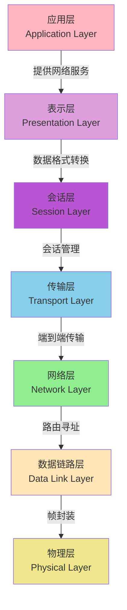
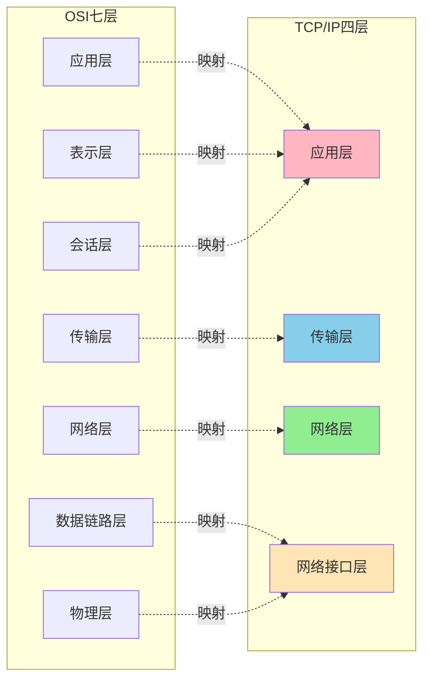
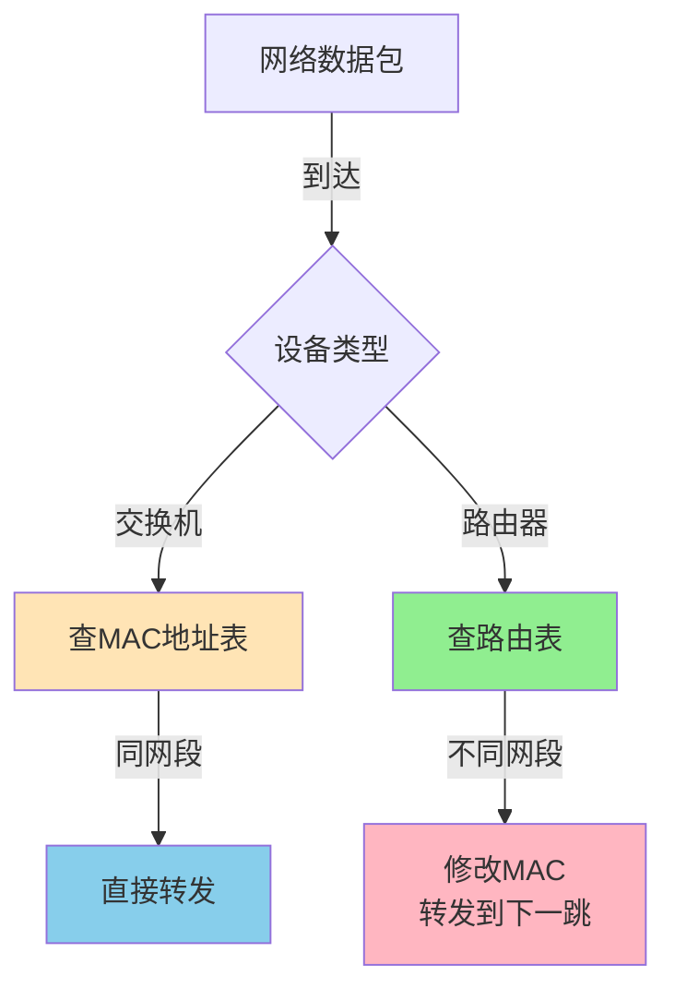
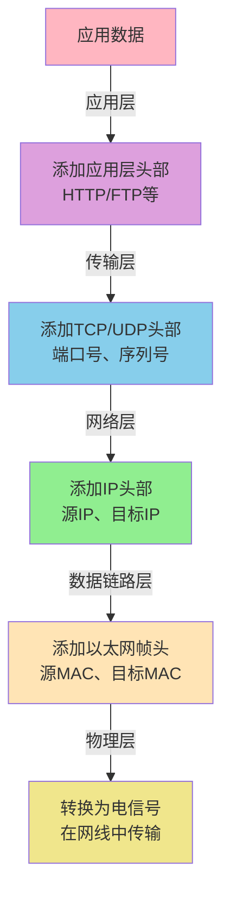

# 网络基础与协议模型

## 网络协议分层模型

在现代计算机网络通信中,为了降低设计复杂度和提高系统的可维护性,业界采用分层的方式组织网络协议。最经典的两种模型是OSI七层模型和TCP/IP模型。

### OSI七层参考模型

OSI(Open System Interconnection,开放式系统互联)模型是由国际标准化组织制定的网络通信标准框架,将网络通信划分为七个层次,每层负责特定的功能:

#### 各层功能详解

**物理层(Physical Layer)**

物理层定义了网络传输的物理特性,包括电气信号、光信号的传输标准。例如,网线采用的RJ45接口标准、光纤的单模和多模规范等都属于物理层定义的内容。该层主要协议包括RS-232、V.35、以太网物理层标准(100BASE-T、1000BASE-T等)。

在实际应用中,当我们更换机房网线从百兆升级到千兆时,就涉及到物理层的升级改造。

**数据链路层(Data Link Layer)**

数据链路层在物理层基础上建立可靠的数据传输通道,负责将网络层传来的数据包封装成帧(Frame),并进行差错检测和流量控制。典型协议包括以太网协议(Ethernet)、PPP协议、HDLC协议等。

在交换机网络中,数据链路层通过MAC地址来识别设备。当服务器A向服务器B发送数据时,交换机通过查询MAC地址表,将数据帧精准地转发到目标端口。

**网络层(Network Layer)**

网络层解决数据在不同网络间的传输问题,核心功能是路由选择和逻辑寻址。IP协议是该层最重要的协议,它为每台主机分配唯一的IP地址,并负责数据包的转发。

以电商系统为例,当用户在移动端下单时,请求数据包可能经过移动网络基站、城域网、骨干网、数据中心网络等多个网段,网络层的路由协议(如OSPF、BGP)确保数据包能够正确到达订单处理服务器。

**传输层(Transport Layer)**

传输层提供端到端的可靠数据传输服务,主要协议是TCP和UDP。该层负责数据分段、流量控制、拥塞控制等功能。

在微服务架构中,服务间通信大多采用HTTP(基于TCP)或gRPC(也基于TCP)协议。传输层确保订单服务发送给库存服务的数据能够完整、有序地到达,即使网络出现丢包,TCP的重传机制也能保证数据的可靠性。

**会话层(Session Layer)**

会话层负责建立、管理和终止会话连接。它提供了不同主机上进程间的通信管理,包括会话恢复和同步功能。典型协议如NetBIOS。

在实际应用中,当我们使用SSH远程登录服务器时,会话层负责维护这个登录会话,直到我们主动断开或超时。

**表示层(Presentation Layer)**

表示层处理数据的格式转换、加密解密、压缩解压等操作,确保应用层数据能够被正确解释。例如JPEG图片格式、MPEG视频格式的编解码都属于表示层功能。

在跨平台数据传输中,表示层能够处理不同系统间的字节序差异(大端/小端)、字符编码转换(UTF-8/GBK)等问题。

**应用层(Application Layer)**

应用层直接为用户应用程序提供网络服务,包括文件传输、电子邮件、Web浏览等功能。常见协议有HTTP、FTP、SMTP、DNS、TELNET等。

当我们在浏览器中访问网站时,浏览器作为HTTP客户端与Web服务器交互,这个过程就发生在应用层。

### TCP/IP四层模型

TCP/IP模型是互联网实际使用的协议模型,它将OSI的七层简化为四层:

TCP/IP模型将会话层、表示层和应用层合并为应用层,将数据链路层和物理层合并为网络接口层,使得模型更加简洁实用。在实际开发中,我们通常按照TCP/IP模型来理解网络通信。

## TCP与UDP协议对比

传输层的两大核心协议TCP和UDP各有特点,适用于不同的应用场景:

### TCP协议特性

TCP(Transmission Control Protocol)是面向连接的可靠传输协议,具有以下关键特征:

**面向连接**

通信前必须通过三次握手建立连接,结束时通过四次挥手断开连接。这个过程确保了双方的收发能力都正常,为后续可靠传输奠定基础。

在金融交易系统中,支付请求必须建立可靠的TCP连接,确保每一笔交易数据都能准确无误地传输到服务端。

**可靠传输保证**

TCP通过序列号、确认应答、超时重传等机制确保数据完整性。发送方的每个数据包都有唯一序列号,接收方通过ACK确认接收。若发送方在规定时间内未收到ACK,会自动重传数据包。

在文件下载场景中,TCP保证下载的文件与服务器原文件完全一致,即使网络出现丢包也能通过重传恢复。

**流量控制与拥塞控制**

TCP使用滑动窗口机制实现流量控制,防止发送方发送速度过快导致接收方缓冲区溢出。同时通过慢启动、拥塞避免、快重传、快恢复算法应对网络拥塞,保证网络整体效率。

**头部开销较大**

TCP头部固定20字节,可选字段最多可达60字节,包含序列号、确认号、窗口大小等丰富的控制信息。

### UDP协议特性

UDP(User Datagram Protocol)是无连接的不可靠传输协议,特点包括:

**无连接传输**

UDP发送数据前不需要建立连接,直接将数据封装成数据报发送出去,减少了通信延迟。

**不保证可靠性**

UDP不提供确认、重传机制,数据包可能丢失、重复或乱序到达,应用层需要自行处理这些情况。

**头部开销极小**

UDP头部仅8字节,包含源端口、目标端口、长度和校验和,传输效率高。

**支持广播和多播**

UDP支持一对多的通信模式,适合音视频直播等场景。

### 应用场景选择

| 协议 | 特点 | 典型应用场景 |
|------|------|------------|
| TCP | 可靠、有序、连接导向 | Web服务(HTTP/HTTPS)、文件传输(FTP)、邮件(SMTP)、远程登录(SSH) |
| UDP | 快速、无连接、低开销 | 视频直播、在线游戏、DNS查询、语音通话(VoIP)、IoT设备通信 |

在直播系统中,视频流采用UDP传输能够降低延迟,即使偶尔丢失几帧画面,用户体验影响也不大。而用户的聊天消息、礼物打赏等则使用TCP传输,确保数据准确送达。

## 网络设备与工作层次

### 交换机

交换机工作在数据链路层,根据MAC地址转发数据帧。在企业局域网中,交换机连接同一网段内的多台计算机,通过MAC地址表实现快速转发。

现代数据中心交换机采用交换结构设计,支持线速转发,即每个端口都能以最大带宽同时收发数据,不存在共享总线的冲突问题。

**工作原理**

当交换机收到一个数据帧时,会提取源MAC地址并记录到MAC地址表中,同时根据目标MAC地址查表转发。如果目标MAC未知,则广播到所有端口(除源端口外)。

### 路由器

路由器工作在网络层,根据IP地址和路由表转发数据包,实现不同网络间的互联。家用路由器通常集成了交换机、无线AP、NAT等功能。

**路由选择**

路由器维护路由表,记录到达各个目标网络的路径信息。当数据包到达时,路由器根据目标IP地址查找路由表,选择最优路径转发。

在企业网络中,边界路由器连接内网和外网,内部路由器负责不同部门子网间的通信。通过OSPF、BGP等动态路由协议,路由器能够自动学习网络拓扑变化,调整路由策略。

### 设备对比

| 特性 | 交换机 | 路由器 |
|------|--------|--------|
| 工作层次 | 数据链路层(第2层) | 网络层(第3层) |
| 转发依据 | MAC地址 | IP地址 |
| 主要功能 | 组建局域网 | 连接不同网络 |
| 隔离广播域 | 否 | 是 |
| 处理速度 | 快(硬件转发) | 较慢(需路由计算) |

在网络规划中,交换机用于构建高速局域网,连接同一楼层或机房内的服务器。路由器则用于连接不同的子网,实现跨地域的通信,同时提供防火墙、NAT等安全功能。

## 数据封装与传输过程

当应用程序发送数据时,数据会经过各层的封装处理:

以订单服务调用库存服务为例:

1. 应用层:订单服务构造HTTP请求,包含查询库存的API调用和参数
2. 传输层:TCP协议添加源端口(如订单服务监听的45678)和目标端口(库存服务的8080)
3. 网络层:IP协议添加源IP(订单服务所在服务器IP)和目标IP(库存服务所在服务器IP)
4. 数据链路层:以太网协议添加源MAC(订单服务器网卡MAC)和目标MAC(下一跳路由器MAC)
5. 物理层:将二进制数据转换为电信号,通过网卡发送到网线

接收方按照相反顺序解封装,最终将HTTP请求数据交给库存服务应用程序处理。这个分层封装的设计使得各层可以独立演进,例如从IPv4升级到IPv6只需修改网络层,不影响应用层协议。
