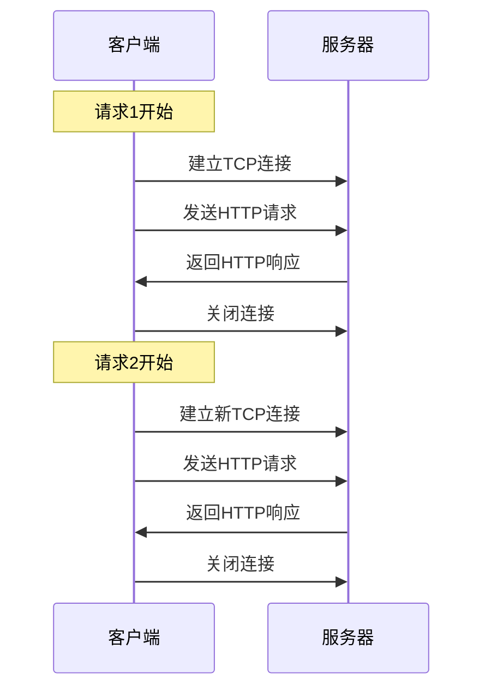
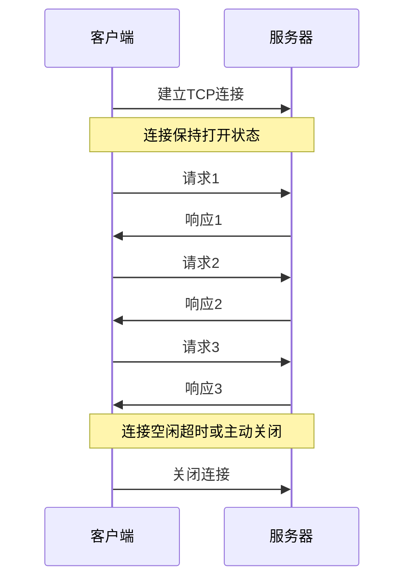
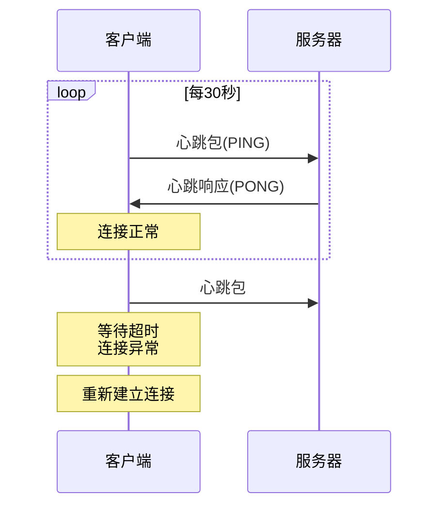
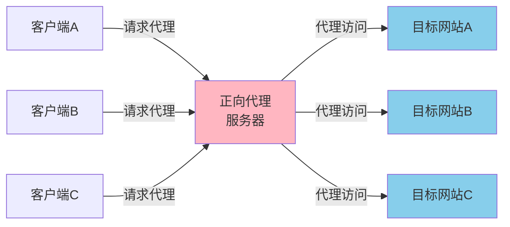
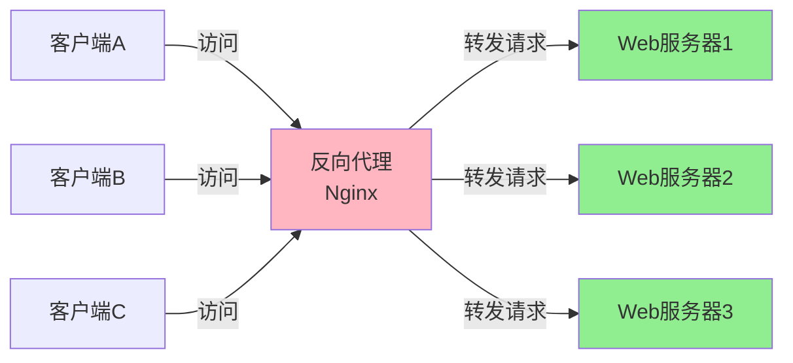
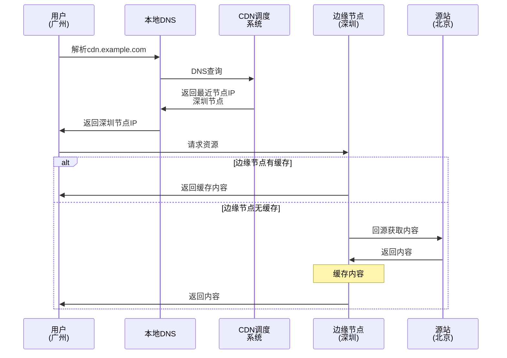
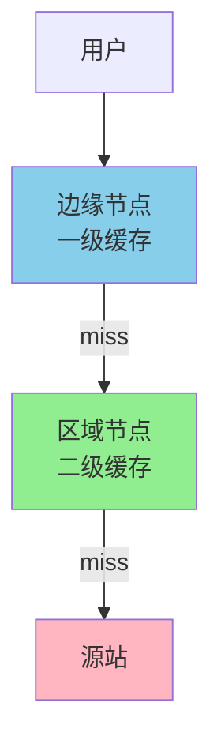
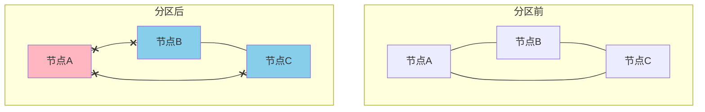
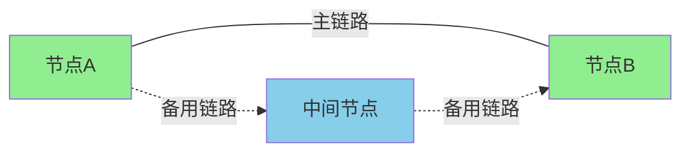
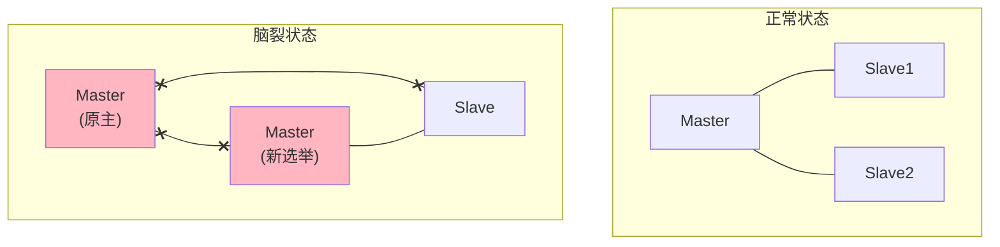

# 网络架构与优化

## TCP连接管理策略

在网络应用中,TCP连接的管理方式对系统性能和资源利用率有显著影响。根据不同的业务场景,可以选择短连接或长连接模式。

### 短连接模式

短连接是指客户端与服务器完成一次数据交互后立即关闭连接:



**短连接特点**

- **资源释放及时**:连接关闭后,服务器立即释放文件描述符、内存缓冲区等资源
- **开销较大**:每次请求都要经历TCP三次握手和四次挥手,增加延迟
- **适用场景**:低频访问、对延迟不敏感的场景

在邮件发送系统中,SMTP协议通常使用短连接。邮件客户端连接到邮件服务器,发送完一封邮件后断开连接,服务器不需要维护长期连接。

### 长连接模式

长连接允许在同一个TCP连接上完成多次数据交互:



**长连接特点**

- **减少握手开销**:复用连接,避免频繁的连接建立和销毁
- **降低延迟**:无需等待三次握手,请求响应更快
- **资源占用**:服务器需要维护大量活跃连接,消耗文件描述符和内存
- **适用场景**:高频交互、实时性要求高的场景

在Web浏览器中,HTTP/1.1默认启用Keep-Alive长连接。用户访问一个网页时,HTML、CSS、JavaScript、图片等资源通过同一个TCP连接加载,显著提升页面加载速度。

### 长连接维护机制

**心跳检测**

为了防止长连接因网络故障或中间设备超时而静默失效,应用层需要实现心跳机制:



在即时通讯系统中,客户端每隔30秒向服务器发送心跳包。如果连续3次心跳失败,判定连接断开,触发重连逻辑,确保消息通道可用。

**连接池管理**

数据库连接池是长连接应用的典型场景:

```java
// Hikari连接池配置示例
HikariConfig config = new HikariConfig();
config.setJdbcUrl("jdbc:mysql://localhost:3306/shop");
config.setUsername("root");
config.setPassword("password");

// 最大连接数
config.setMaximumPoolSize(20);
// 最小空闲连接数
config.setMinimumIdle(5);
// 连接最大空闲时间
config.setIdleTimeout(600000);
// 连接最大生命周期
config.setMaxLifetime(1800000);

HikariDataSource dataSource = new HikariDataSource(config);
```

连接池预先创建一定数量的数据库连接,应用程序从池中获取连接使用,用完后归还到池中而不是关闭。这避免了频繁创建和销毁数据库连接的开销,大幅提升系统吞吐量。

### 选择策略对比

| 特性 | 短连接 | 长连接 |
|------|--------|--------|
| 连接复用 | 否,每次请求建立新连接 | 是,连接可复用 |
| 延迟 | 高(需要握手) | 低(无握手开销) |
| 服务器资源 | 低,连接快速释放 | 高,需维护连接 |
| 并发能力 | 受限于连接建立速度 | 高,无连接建立瓶颈 |
| 适用场景 | API接口、邮件发送 | WebSocket、IM、数据库连接池 |

在微服务架构中,服务间的RPC调用通常使用连接池维护长连接,减少网络开销,提升调用效率。而对外提供的RESTful API则根据实际请求频率,灵活选择长短连接模式。

## 代理服务器架构

代理服务器是网络架构中的重要组件,根据代理对象的不同,分为正向代理和反向代理。

### 正向代理

正向代理代理的是客户端,客户端通过代理服务器访问目标服务器:



**典型应用场景**

**突破访问限制**

企业员工通过公司正向代理服务器访问互联网,实现访问控制和流量监控。代理服务器可以过滤恶意网站,记录员工访问日志,保障网络安全。

**匿名访问**

用户通过代理服务器访问网站,目标网站只能看到代理服务器的IP,无法追溯到真实用户IP,保护用户隐私。

**缓存加速**

正向代理缓存常访问的内容。多个用户访问同一资源时,代理直接返回缓存数据,减少外网带宽消耗,提升访问速度。

在科研机构,研究人员通过正向代理访问国外学术资源,代理服务器缓存论文PDF文件,避免重复下载,节省国际带宽。

### 反向代理

反向代理代理的是服务器,客户端感知不到后端真实服务器的存在:



**典型应用场景**

**负载均衡**

反向代理将请求分发到多台后端服务器,实现负载均衡:

```nginx
# Nginx负载均衡配置
upstream backend {
    server 192.168.1.10:8080 weight=3;
    server 192.168.1.11:8080 weight=2;
    server 192.168.1.12:8080 weight=1;
    
    # 健康检查
    check interval=3000 rise=2 fall=3 timeout=1000;
}

server {
    listen 80;
    server_name www.shop.com;
    
    location / {
        proxy_pass http://backend;
        proxy_set_header Host $host;
        proxy_set_header X-Real-IP $remote_addr;
    }
}
```

在电商大促场景中,秒杀服务部署10台实例,Nginx反向代理根据服务器权重分配请求,高配置服务器处理更多请求,充分利用集群资源。

**SSL卸载**

反向代理统一处理HTTPS加解密,后端服务器使用HTTP通信,降低计算负担:

```nginx
server {
    listen 443 ssl;
    server_name api.example.com;
    
    ssl_certificate /path/to/cert.pem;
    ssl_certificate_key /path/to/key.pem;
    
    location / {
        # 后端使用HTTP
        proxy_pass http://backend;
    }
}
```

在微服务架构中,API网关作为反向代理,统一处理TLS握手,内网服务间使用明文HTTP通信,减少加解密开销,提升性能。

**缓存与压缩**

反向代理缓存静态资源,启用Gzip压缩,减轻后端服务器压力:

```nginx
location ~* \.(jpg|jpeg|png|gif|css|js)$ {
    proxy_pass http://backend;
    proxy_cache my_cache;
    proxy_cache_valid 200 1h;
    
    gzip on;
    gzip_types text/css application/javascript image/*;
}
```

在内容网站中,Nginx缓存图片、CSS、JavaScript文件,用户访问时直接从Nginx返回缓存内容,后端应用服务器只需处理动态请求,系统吞吐量大幅提升。

### 代理对比总结

| 维度 | 正向代理 | 反向代理 |
|------|----------|----------|
| 代理对象 | 代理客户端 | 代理服务器 |
| 部署位置 | 客户端侧 | 服务器侧 |
| 客户端感知 | 知道代理存在 | 不知道代理存在 |
| 主要作用 | 访问控制、匿名访问 | 负载均衡、SSL卸载 |
| 典型应用 | 企业上网代理、VPN | Nginx、HAProxy |

在实际架构中,正向代理和反向代理可以组合使用。企业内网通过正向代理访问互联网,互联网用户通过反向代理访问企业服务,构建安全高效的网络架构。

## CDN内容分发网络

CDN(Content Delivery Network)通过在全球部署边缘节点,将内容缓存到离用户最近的位置,大幅提升访问速度。

### CDN工作原理



**智能调度**

CDN调度系统根据用户地理位置、网络运营商、节点健康状况,将用户请求解析到最优边缘节点:

- **地理位置**:广州用户访问,优先分配深圳、广州节点
- **运营商**:电信用户优先分配电信线路节点,避免跨网访问
- **负载均衡**:节点过载时,将请求分配到临近节点

在视频直播场景中,用户观看演唱会直播,CDN将视频流推送到全国数千个边缘节点,用户从最近节点拉流,延迟降低到百毫秒级,观看体验流畅。

### CDN缓存策略

**缓存层级**

CDN通常采用多级缓存架构:



- **一级缓存(边缘节点)**:离用户最近,容量较小,缓存热点内容
- **二级缓存(区域节点)**:覆盖一个省或地区,容量较大
- **源站**:存储全量数据

在电商大促时,爆款商品图片缓存在全国所有边缘节点,访问命中率接近100%,源站几乎无压力,确保促销页面流畅加载。

**缓存过期策略**

通过HTTP头控制CDN缓存时间:

```
Cache-Control: max-age=86400
Expires: Wed, 21 Oct 2025 07:28:00 GMT
ETag: "33a64df551425fcc55e4d42a148795d9f25f89d4"
```

- **max-age**:缓存有效期,单位秒
- **Expires**:缓存过期的绝对时间
- **ETag**:资源版本标识,用于验证缓存是否最新

对于静态资源(图片、CSS、JS),设置较长的缓存时间(如1天),减少回源请求。对于动态内容(API接口),设置较短的缓存时间或不缓存,保证数据实时性。

### CDN应用场景

**图片小文件加速**

将网站图片、CSS、JavaScript部署到CDN,用户访问时从CDN加载,大幅减轻源站压力:

```html
<!-- 源站直接引用 -->


<!-- CDN加速 -->

```

在新闻门户网站,文章配图存储在CDN,全国用户访问新闻页面,图片从本地CDN节点加载,页面打开速度提升3-5倍。

**大文件下载加速**

软件安装包、APP更新包等大文件通过CDN分发,提升下载速度:

某手机厂商发布新系统更新包(2GB),通过CDN推送到全国节点,用户下载更新包时,从附近节点下载,速度从源站的几百KB/s提升到几十MB/s,用户体验显著改善。

**视频点播与直播**

视频平台的核心基础设施就是CDN:
- **点播**:视频文件缓存在CDN,用户点播时从最近节点拉取
- **直播**:主播推流到CDN源站,CDN将流分发到所有边缘节点,观众从边缘节点拉流

在在线教育场景中,录播课程视频存储在CDN,学生观看课程时,从本地CDN节点播放,即使源站服务器故障,也不影响学生学习,提高了系统可用性。

## 网络分区与分布式系统

网络分区是指分布式系统中,由于网络故障导致节点间无法通信,系统被分割成多个孤立的部分。

### 网络分区现象



节点A与节点B、C之间的网络链路中断,系统被分为两个分区:
- **分区1**:节点A独立运行
- **分区2**:节点B和C可以互相通信

### CAP理论与网络分区

在分布式系统设计中,CAP理论指出不可能同时满足:
- **Consistency(一致性)**:所有节点看到相同的数据
- **Availability(可用性)**:系统持续提供服务
- **Partition tolerance(分区容错性)**:网络分区时系统仍能运行

网络分区在分布式系统中不可避免,因此必须在一致性和可用性之间权衡:

**CP系统(牺牲可用性)**

网络分区时,少数派节点拒绝服务,保证数据一致性:

ZooKeeper在分区发生时,失去与Leader联系的节点会停止服务,只有多数派(Quorum)能继续工作,确保分布式锁、配置中心的数据一致性。

**AP系统(牺牲一致性)**

网络分区时,各分区继续提供服务,允许数据暂时不一致:

Amazon DynamoDB在分区时,各节点继续接受读写请求,网络恢复后通过版本向量(Vector Clock)解决冲突,保证最终一致性。

在电商购物车场景中,用户添加商品到购物车,即使网络分区导致不同节点数据不一致,也应该让用户操作成功,而不是显示"系统不可用",提升用户体验。

### 减少网络分区影响

**冗余连接**

数据中心部署多条物理链路,避免单点故障:



在金融交易系统中,核心服务器间部署双网卡、双交换机,确保单条链路故障时,流量自动切换到备用链路,避免网络分区。

**监控与告警**

实时监控节点间的心跳通信,及时发现网络异常:

```java
// 心跳检测示例
public class HeartbeatMonitor {
    private static final int TIMEOUT = 5000; // 5秒超时
    
    public void checkHeartbeat(Node node) {
        long lastHeartbeat = node.getLastHeartbeatTime();
        long now = System.currentTimeMillis();
        
        if (now - lastHeartbeat > TIMEOUT) {
            // 触发告警
            alertService.sendAlert("节点" + node.getId() + "心跳超时");
            // 标记节点为疑似故障
            node.setStatus(NodeStatus.SUSPECT);
        }
    }
}
```

在微服务架构中,服务注册中心(如Eureka、Consul)通过心跳检测感知服务健康状况,及时将故障节点从服务列表移除,避免将请求路由到不可用节点。

### 脑裂问题

脑裂是网络分区的特殊表现,在主从架构中,分区导致多个节点都认为自己是主节点:



原Master与Slave网络分区,Slave选举出新Master,此时系统存在两个Master,可能导致数据不一致。

**解决方案:过半机制**

要求超过半数节点达成一致才能进行关键操作:

在Redis Sentinel主从切换场景中,必须多数Sentinel节点都认为Master故障,才会触发故障转移,避免网络抖动导致的误切换。

在数据库主从复制中,使用Paxos、Raft等共识算法,确保只有获得多数节点认可的节点才能成为主节点,从根本上避免脑裂。

通过合理的架构设计和容错机制,可以最大程度降低网络分区对系统的影响,保证分布式系统的高可用性和数据一致性。
