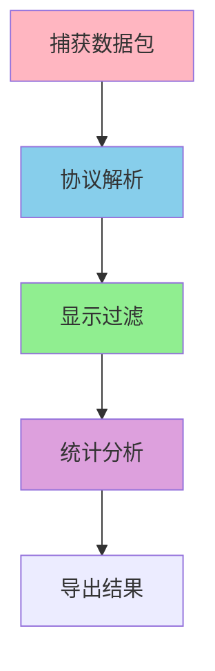
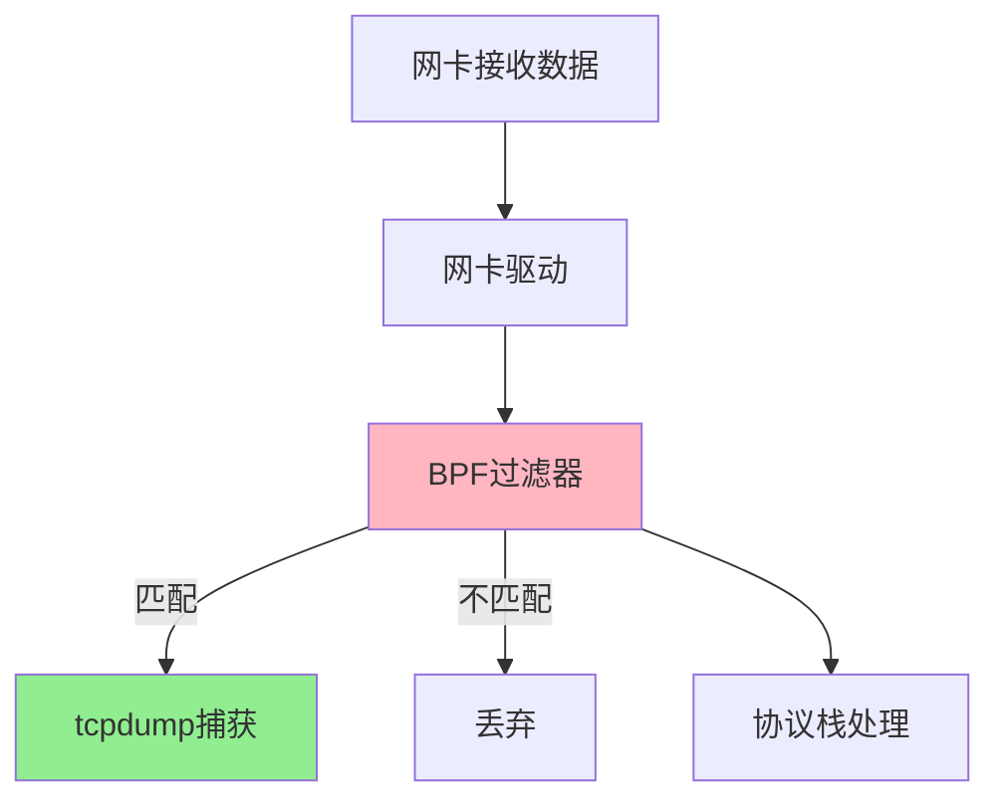
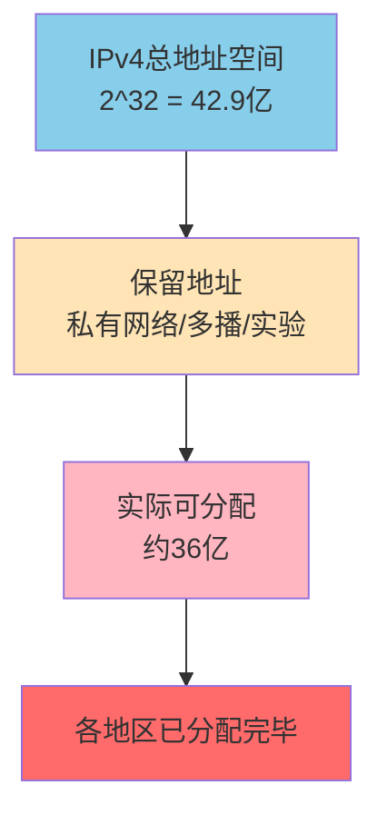
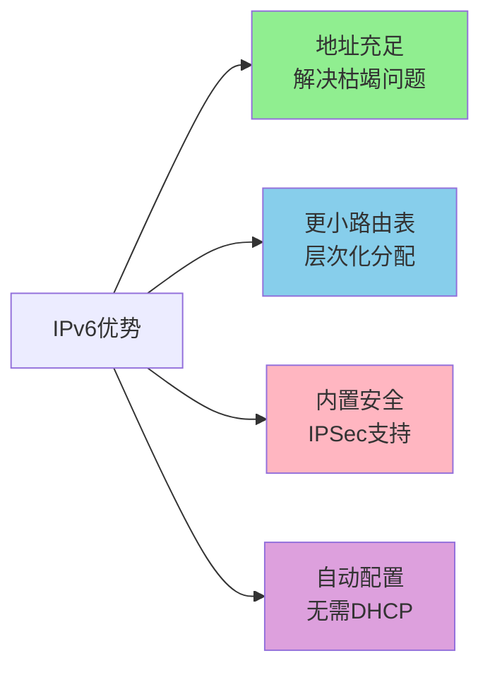
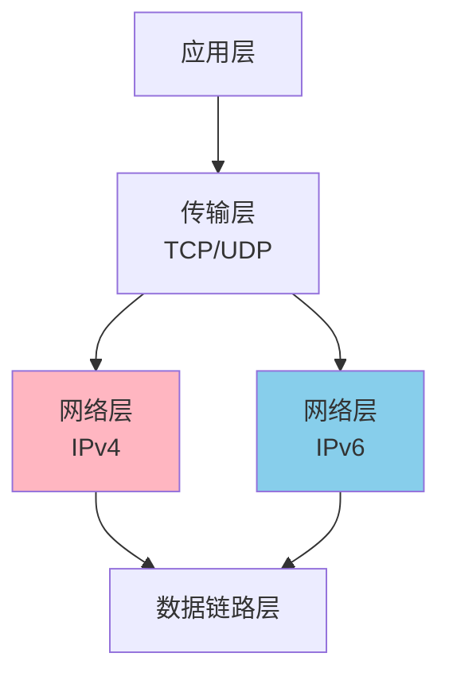
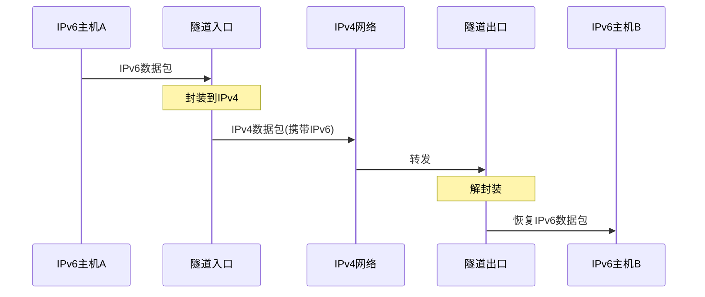
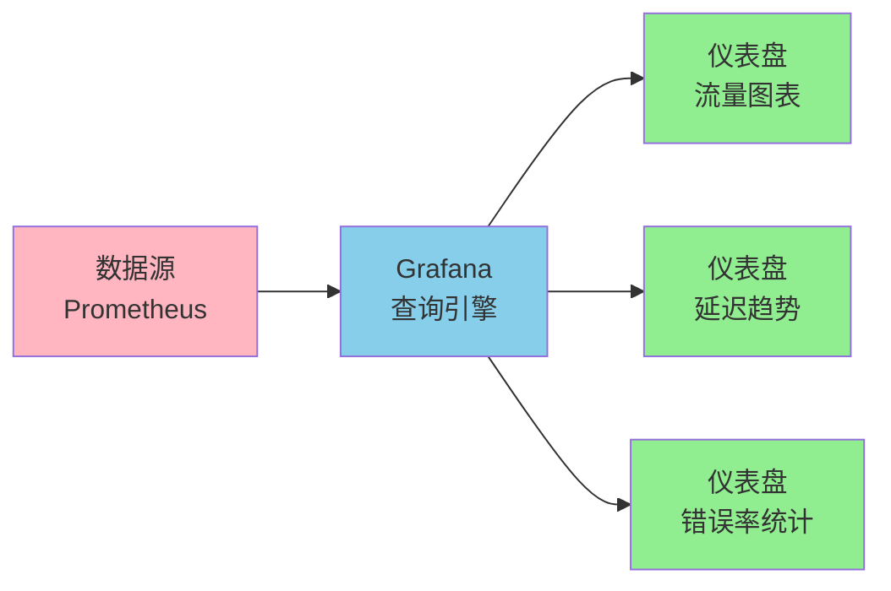
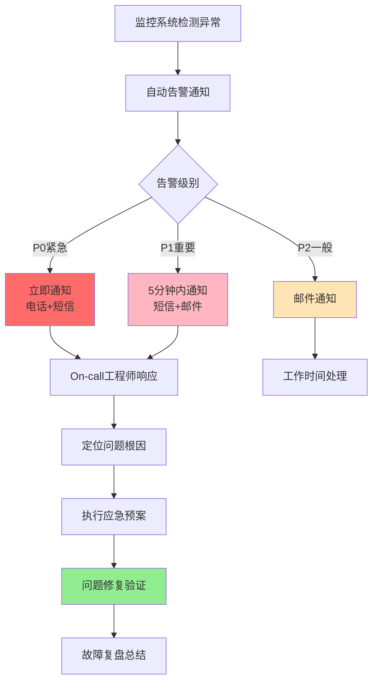

# 网络诊断与监控

## 网络抓包技术

网络抓包是排查网络问题的核心技能,通过捕获网络数据包,分析协议交互过程,快速定位通信故障。

### 抓包工具选择

**tcpdump命令行工具**

tcpdump是Linux系统自带的命令行抓包工具,在服务器环境中使用广泛:

```bash
# 抓取指定网卡的所有数据包
tcpdump -i eth0

# 抓取特定主机的数据包
tcpdump host 192.168.1.100

# 抓取特定端口的TCP数据包
tcpdump tcp port 80

# 保存到文件供后续分析
tcpdump -i eth0 -w capture.pcap

# 组合过滤条件
tcpdump -i eth0 'tcp port 3306 and host 192.168.1.50'
```

在线上故障排查中,数据库连接异常时,可以在应用服务器上抓取MySQL端口(3306)的数据包,分析TCP连接建立、SQL查询等过程,判断问题是网络层还是应用层。

**Wireshark图形化分析**

Wireshark提供强大的图形界面,支持协议解析和流量统计:



典型分析流程:
1. **捕获数据包**:选择网卡,设置捕获过滤器
2. **协议解析**:Wireshark自动解析HTTP、TCP、IP等协议字段
3. **显示过滤**:使用过滤表达式筛选感兴趣的数据包
4. **流跟踪**:追踪TCP连接的完整会话
5. **统计分析**:生成协议分层统计、对话列表等报表

### tcpdump工作原理

tcpdump基于Linux内核的BPF(Berkeley Packet Filter)机制,在网卡驱动和协议栈之间拦截数据包:



**重要特性**

- **位于iptables之前**:tcpdump能捕获被防火墙拦截的数据包
- **双向捕获**:同时捕获进入和离开网卡的数据包
- **高性能**:BPF在内核态过滤,减少用户态和内核态切换

在微服务故障排查中,服务A调用服务B超时,在服务A上抓包可以确认请求是否发出,在服务B上抓包可以确认是否收到请求,从而定位是网络丢包还是服务处理慢。

### 抓包实战案例

**HTTP请求抓包分析**

某电商系统用户反馈支付页面加载慢,抓包分析HTTP请求:

```bash
# 抓取支付服务的HTTP流量
tcpdump -i eth0 'tcp port 8080' -A -s 0 -w payment.pcap
```

通过Wireshark分析payment.pcap:
1. 查看TCP三次握手时间:发现握手正常,耗时2ms
2. 查看HTTP请求时间:客户端发送完整请求耗时5ms
3. 查看HTTP响应时间:服务器2秒后才返回响应

定位到问题是服务器处理慢,而非网络延迟。进一步排查发现数据库查询慢,优化SQL后问题解决。

**丢包问题诊断**

视频会议系统出现卡顿,抓包发现UDP数据包大量丢失:

```bash
# 抓取RTP视频流(通常使用UDP)
tcpdump -i eth0 'udp and port 10000-20000' -w video.pcap
```

分析发现:
- 序列号不连续,存在丢包
- 丢包率约5%,超过视频通话容忍度
- 丢包主要发生在网络拥塞时段

解决方案:
- 启用QoS策略,提高RTP流量优先级
- 调整发送码率,适应网络带宽
- 部署就近的媒体服务器,减少传输距离

## TCP性能监控

### 重传率指标

TCP重传率反映网络质量,计算公式:

```
重传率 = (重传报文段数 / 总发送报文段数) × 100%
```

**查看重传统计**

```bash
# 查看TCP统计信息
netstat -s | grep -i retrans

# 输出示例
    45230 segments retransmitted
    8956 fast retransmits
    2134 retransmits in slow start
    
# 查看特定连接的重传次数
ss -ti | grep -A 10 'ESTAB'

# 输出示例
State    Recv-Q    Send-Q    Local:Port    Peer:Port
ESTAB    0         0         10.0.1.5:443  10.0.1.10:54321
         cubic wscale:7,7 rto:204 rtt:3.5/2.1 
         send 95.2Mbps lastsnd:2 rcv_rtt:10 rcv_space:29200
         retrans:5/10 dsack_dups:2
```

关键指标解读:
- **retrans:5/10**:当前重传5次,累计重传10次
- **rto:204**:重传超时时间204ms
- **rtt:3.5/2.1**:平均往返时间3.5ms,抖动2.1ms

**重传率阈值**

| 重传率范围 | 网络状况 | 处理建议 |
|-----------|---------|---------|
| < 0.5% | 优秀 | 无需处理 |
| 0.5% - 1% | 良好 | 持续监控 |
| 1% - 3% | 一般 | 排查网络设备 |
| > 3% | 较差 | 立即处理 |
| > 5% | 异常 | 严重网络问题 |

在云服务环境中,跨地域的服务调用重传率通常高于同地域。可以通过部署区域服务副本,减少跨域调用,降低重传率,提升服务稳定性。

### 连接状态监控

**各状态含义**

```bash
# 统计各状态连接数
netstat -an | awk '/^tcp/ {print $6}' | sort | uniq -c

# 输出示例
    256 ESTABLISHED
     18 TIME_WAIT
      5 SYN_SENT
      3 CLOSE_WAIT
      2 LISTEN
```

**状态异常诊断**

**TIME_WAIT过多**

TIME_WAIT状态持续2MSL(通常120秒),大量TIME_WAIT会耗尽端口资源:

```bash
# 查看TIME_WAIT数量
ss -ant | grep TIME_WAIT | wc -l
```

解决方案:
```bash
# 允许TIME_WAIT复用
sysctl -w net.ipv4.tcp_tw_reuse=1

# 快速回收TIME_WAIT(谨慎使用)
sysctl -w net.ipv4.tcp_tw_recycle=1

# 调整TIME_WAIT超时时间
sysctl -w net.ipv4.tcp_fin_timeout=30
```

在高并发Web服务器上,短连接模式会产生大量TIME_WAIT。通过启用tcp_tw_reuse,允许新连接复用TIME_WAIT状态的端口,缓解端口耗尽问题。

**CLOSE_WAIT堆积**

CLOSE_WAIT表示对端已关闭连接,但本地应用未调用close():

这通常是应用层bug,连接泄漏导致。需要排查代码,确保finally块中关闭连接:

```java
// 错误示例:连接未关闭
Socket socket = new Socket("10.0.1.5", 8080);
InputStream in = socket.getInputStream();
// 处理数据...
// 未调用socket.close()

// 正确示例:保证连接关闭
try (Socket socket = new Socket("10.0.1.5", 8080);
     InputStream in = socket.getInputStream()) {
    // 处理数据...
} // try-with-resources自动关闭
```

在数据库连接池场景中,如果应用获取连接后未归还,会导致CLOSE_WAIT堆积,最终连接池耗尽,新请求无法获取连接而失败。

### TCP参数调优

**连接队列调优**

```bash
# SYN队列大小(半连接队列)
sysctl -w net.ipv4.tcp_max_syn_backlog=8192

# Accept队列大小(全连接队列)
sysctl -w net.core.somaxconn=2048
```

在秒杀场景中,瞬间大量连接涌入,默认的SYN队列(512)很快被占满,后续连接被丢弃。调大队列能够缓冲突发流量,减少连接失败。

**缓冲区调优**

```bash
# TCP接收缓冲区
sysctl -w net.ipv4.tcp_rmem='4096 87380 6291456'

# TCP发送缓冲区
sysctl -w net.ipv4.tcp_wmem='4096 16384 4194304'
```

格式为"最小值 默认值 最大值",单位字节。在大文件传输场景中,增大缓冲区可以提高吞吐量,充分利用网络带宽。

**拥塞控制算法**

```bash
# 查看可用算法
sysctl net.ipv4.tcp_available_congestion_control

# 设置拥塞控制算法
sysctl -w net.ipv4.tcp_congestion_control=bbr
```

常用算法:
- **Reno**:传统算法,适合有线网络
- **Cubic**:Linux默认,优化高带宽长延迟网络
- **BBR**:Google开发,在弱网环境性能优异

在跨国专线传输中,BBR算法能够更准确地估算带宽和延迟,在高丢包率情况下仍能保持较高吞吐量,显著优于传统算法。

## IPv4与IPv6

### IPv4地址枯竭

IPv4使用32位地址,理论上可提供约43亿个地址,但实际可用地址更少:



**IPv4地址表示**

点分十进制:每个字节用十进制表示,如`192.168.1.100`

```
192    .    168    .     1     .    100
11000000  10101000  00000001  01100100 (二进制)
```

**私有地址段**

- **A类**:10.0.0.0 - 10.255.255.255
- **B类**:172.16.0.0 - 172.31.255.255
- **C类**:192.168.0.0 - 192.168.255.255

企业内网使用私有地址,通过NAT(网络地址转换)共享公网IP访问互联网。

### IPv6解决方案

IPv6使用128位地址,地址空间达到2^128,约3.4×10^38个,足够每粒沙子分配一个IP地址:

**IPv6地址表示**

冒号十六进制:每16位一组,共8组,如:

```
2001:0db8:85a3:0000:0000:8a2e:0370:7334
```

**简化规则**

1. 省略前导零:0db8可写成db8
2. 连续的零组用`::`表示(只能使用一次)

```
# 完整形式
2001:0db8:0000:0000:0000:0000:0000:0001

# 简化形式
2001:db8::1
```

**IPv6特点**



在物联网场景中,每个智能设备都需要独立IP地址。IPv4时代只能通过NAT共享地址,设备互联复杂。IPv6为每个设备分配全球唯一地址,设备间直接通信,简化网络架构。

### IPv4到IPv6过渡

**双栈技术**

设备同时运行IPv4和IPv6协议栈:



主流操作系统都支持双栈,网站可以同时提供IPv4和IPv6服务:

```
# DNS A记录(IPv4)
www.example.com.  IN  A     93.184.216.34

# DNS AAAA记录(IPv6)
www.example.com.  IN  AAAA  2606:2800:220:1:248:1893:25c8:1946
```

客户端优先尝试IPv6连接,失败后回退到IPv4,确保兼容性。

**隧道技术**

在IPv4网络上传输IPv6数据包:



6to4、Teredo等隧道技术允许IPv6孤岛通过IPv4网络互联,为IPv6部署提供过渡方案。

### IPv6部署现状

中国是IPv6用户数最多的国家,截至2024年:
- IPv6地址拥有量全球第一
- IPv6活跃用户数超过7亿
- 三大运营商4G/5G网络全面支持IPv6
- 主要互联网公司(阿里、腾讯、百度等)完成IPv6改造

在教育网CERNET2,已全面部署纯IPv6网络,为高校师生提供更快速的国际学术资源访问。

## 网络监控与告警

### 监控指标体系

**网络层指标**

- **丢包率**:发送包数与接收包数的差异
- **延迟**:数据包往返时间(RTT)
- **带宽利用率**:实际使用带宽占总带宽比例
- **错误包率**:CRC校验失败、格式错误的包

**传输层指标**

- **TCP连接数**:各状态连接数量
- **TCP重传率**:重传报文段占比
- **连接建立失败率**:三次握手失败的比例
- **连接超时率**:连接建立超时的比例

**应用层指标**

- **HTTP响应时间**:从请求发送到收到响应的时间
- **HTTP错误率**:4xx、5xx状态码占比
- **DNS解析时间**:域名解析耗时
- **SSL握手时间**:HTTPS连接建立耗时

### 监控工具选型

**Zabbix综合监控**

Zabbix提供网络设备监控、流量统计、性能告警:

```bash
# 监控交换机端口流量
zabbix_get -s 192.168.1.1 -k net.if.in[eth0]
zabbix_get -s 192.168.1.1 -k net.if.out[eth0]

# 监控TCP连接状态
zabbix_get -s 192.168.1.10 -k system.tcp.state[ESTABLISHED]
```

在企业网络中,Zabbix监控核心交换机流量,当某端口流量超过阈值80%时触发告警,运维人员及时扩容带宽,避免网络拥塞。

**Prometheus时序监控**

Prometheus专注于时序数据采集和查询:

```yaml
# 采集网络指标
scrape_configs:
  - job_name: 'node'
    static_configs:
      - targets: ['192.168.1.10:9100']

# 告警规则
groups:
  - name: network
    rules:
      - alert: HighPacketLoss
        expr: rate(node_network_receive_errs_total[5m]) > 0.01
        for: 5m
        annotations:
          summary: "网卡错误包率过高"
```

**Grafana可视化**

Grafana将监控数据可视化为仪表盘:



在微服务架构中,Grafana展示服务间调用延迟、错误率、吞吐量等指标,帮助团队快速识别性能瓶颈和故障节点。

### 告警策略设计

**阈值告警**

基于指标值超过预设阈值触发:

```
IF 网络重传率 > 3% AND 持续时间 > 5分钟
THEN 发送告警邮件 + 短信通知运维
```

**趋势告警**

基于指标变化趋势预测问题:

```
IF 网络流量增长率 > 20%/小时 AND 当前流量 > 总带宽的60%
THEN 发送容量预警,建议提前扩容
```

**复合告警**

结合多个指标综合判断:

```
IF (TCP重传率 > 2% AND 丢包率 > 1%) OR 延迟 > 200ms
THEN 判定为网络质量异常,触发故障应急流程
```

在电商大促场景中,监控系统检测到网络流量激增,同时重传率上升,自动触发扩容流程,启用备用链路和边缘节点,确保用户访问流畅。

### 故障处理流程



**典型故障案例**

某视频网站在直播过程中,CDN边缘节点出现大量TCP重传,导致观众卡顿:

1. **告警触发**:监控系统检测到某地区边缘节点重传率从0.3%飙升到8%
2. **快速响应**:On-call工程师5分钟内介入,通过抓包分析发现运营商链路故障
3. **应急处理**:通过DNS调度,将该地区用户流量切换到临近节点
4. **问题修复**:联系运营商修复链路故障,恢复原节点服务
5. **复盘改进**:增加链路冗余度,优化自动切换策略

通过完善的监控体系和快速响应机制,将故障影响降到最低,保障业务连续性。网络监控不仅是发现问题的工具,更是提升系统稳定性和用户体验的重要手段。
