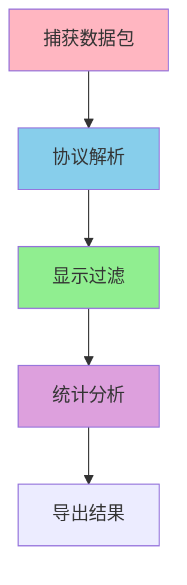
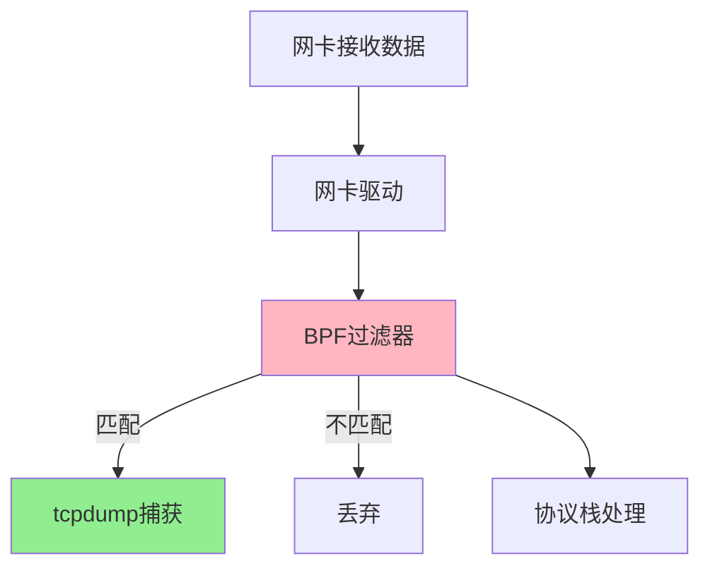

import PaidCTA from '@site/src/components/PaidCTA';

# 网络诊断与监控

## 网络抓包技术

网络抓包是排查网络问题的核心技能,通过捕获网络数据包,分析协议交互过程,快速定位通信故障。

### 抓包工具选择

**tcpdump命令行工具**

tcpdump是Linux系统自带的命令行抓包工具,在服务器环境中使用广泛:

```bash
# 抓取指定网卡的所有数据包
tcpdump -i eth0

# 抓取特定主机的数据包
tcpdump host 192.168.1.100

# 抓取特定端口的TCP数据包
tcpdump tcp port 80

# 保存到文件供后续分析
tcpdump -i eth0 -w capture.pcap

# 组合过滤条件
tcpdump -i eth0 'tcp port 3306 and host 192.168.1.50'
```

在线上故障排查中,数据库连接异常时,可以在应用服务器上抓取MySQL端口(3306)的数据包,分析TCP连接建立、SQL查询等过程,判断问题是网络层还是应用层。

**Wireshark图形化分析**

Wireshark提供强大的图形界面,支持协议解析和流量统计:



典型分析流程:
1. **捕获数据包**:选择网卡,设置捕获过滤器
2. **协议解析**:Wireshark自动解析HTTP、TCP、IP等协议字段
3. **显示过滤**:使用过滤表达式筛选感兴趣的数据包
4. **流跟踪**:追踪TCP连接的完整会话
5. **统计分析**:生成协议分层统计、对话列表等报表

### tcpdump工作原理

tcpdump基于Linux内核的BPF(Berkeley Packet Filter)机制,在网卡驱动和协议栈之间拦截数据包:



**重要特性**

- **位于iptables之前**:tcpdump能捕获被防火墙拦截的数据包
- **双向捕获**:同时捕获进入和离开网卡的数据包
- **高性能**:BPF在内核态过滤,减少用户态和内核态切换

在微服务故障排查中,服务A调用服务B超时,在服务A上抓包可以确认请求是否发出,在服务B上抓包可以确认是否收到请求,从而定位是网络丢包还是服务处理慢。

### 抓包实战案例

**HTTP请求抓包分析**

某电商系统用户反馈支付页面加载慢,抓包分析HTTP请求:

```bash
# 抓取支付服务的HTTP流量
tcpdump -i eth0 'tcp port 8080' -A -s 0 -w payment.pcap
```

通过Wireshark分析payment.pcap:
1. 查看TCP三次握手时间:发现握手正常,耗时2ms
2. 查看HTTP请求时间:客户端发送完整请求耗时5ms
3. 查看HTTP响应时间:服务器2秒后才返回响应

定位到问题是服务器处理慢,而非网络延迟。进一步排查发现数据库查询慢,优化SQL后问题解决。

**丢包问题诊断**

视频会议系统出现卡顿,抓包发现UDP数据包大量丢失:

```bash
# 抓取RTP视频流(通常使用UDP)
tcpdump -i eth0 'udp and port 10000-20000' -w video.pcap
```

分析发现:
- 序列号不连续,存在丢包
- 丢包率约5%,超过视频通话容忍度
- 丢包主要发生在网络拥塞时段

解决方案:
- 启用QoS策略,提高RTP流量优先级
- 调整发送码率,适应网络带宽
- 部署就近的媒体服务器,减少传输距离

<PaidCTA />