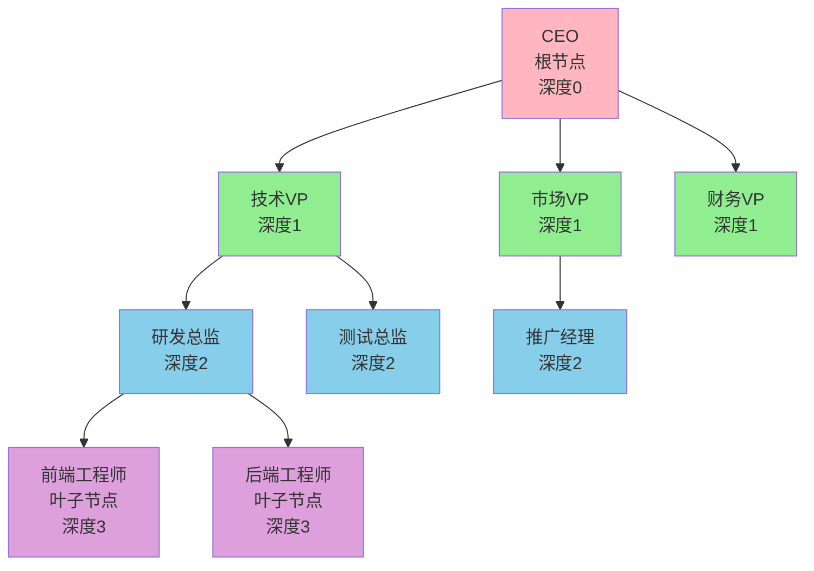
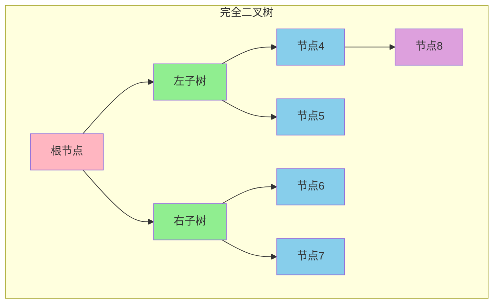
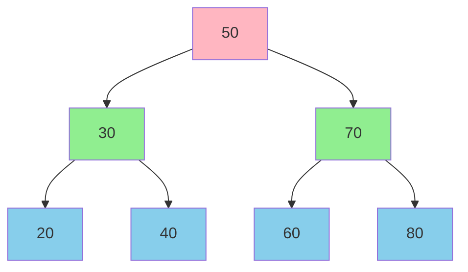
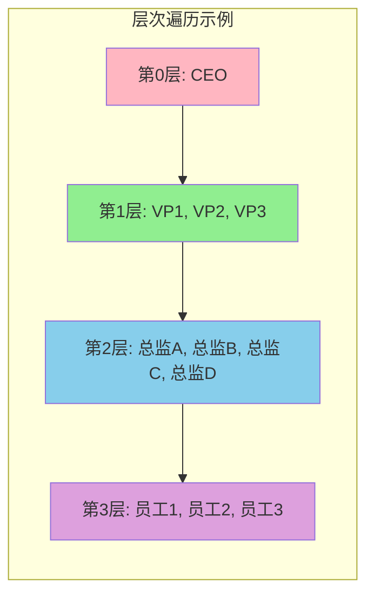
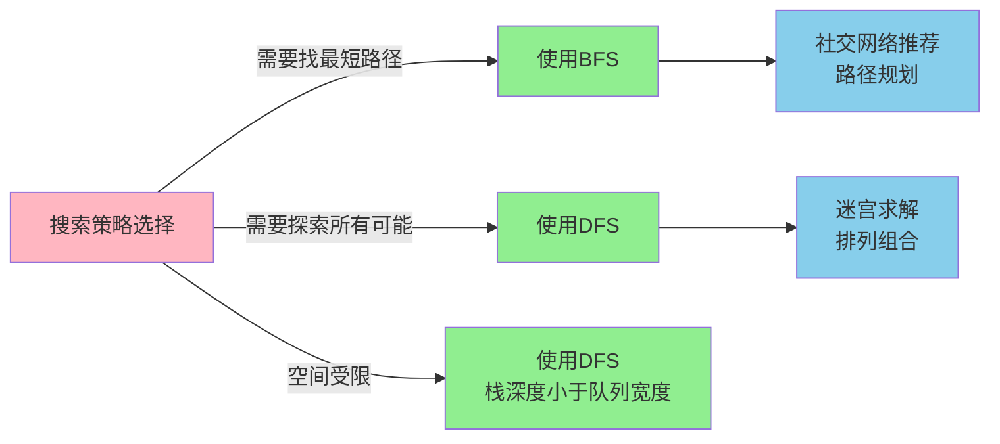

# 树形结构基础

## 树结构的核心概念

树是一种由节点和边构成的**非线性层次化**数据结构,其最重要的特征是**不存在环路**。与数组、链表等线性结构不同,树结构能够高效地表达具有层级关系的数据。

从实现角度看,树通常采用链式存储结构,每个节点包含数据域和若干指针域,指针指向其子节点。

### 树的基本术语

在一个企业组织架构中:
- **根节点**: 公司CEO,没有上级领导
- **父节点**: 部门经理相对于其下属员工
- **子节点**: 员工相对于其直属领导
- **叶子节点**: 普通员工,没有下属
- **节点深度**: 从根节点到该节点经过的边数
- **树的高度**: 根节点到最深叶子节点的最长路径长度



## 二叉树的分类

**二叉树**是每个节点最多有两个子节点的树结构,是最常用的树形态。根据结构特点,二叉树分为多种类型:

### 普通二叉树与满二叉树

**满二叉树**要求除了叶子节点外,所有节点都必须有两个子节点,且所有叶子节点都在同一层。这种结构非常紧凑,节点数量与高度有严格的数学关系:节点总数 = 2^(h+1) - 1。

### 完全二叉树

**完全二叉树**是一种特殊的二叉树,除了最后一层外,其他层的节点都是满的,且最后一层的节点从左到右连续排列,不能有间隙。



完全二叉树的重要性在于它可以高效地用**数组存储**,节点之间的父子关系可以通过索引计算得出:
- 节点 i 的父节点索引: (i-1)/2
- 节点 i 的左子节点索引: 2*i + 1
- 节点 i 的右子节点索引: 2*i + 2

这个特性使得堆、优先队列等数据结构可以用数组高效实现。

### 二叉搜索树

**二叉搜索树(BST)**具有特殊的有序性:对于任意节点,其左子树的所有节点值都小于该节点值,右子树的所有节点值都大于该节点值。



这种有序性使得二叉搜索树支持高效的查找、插入和删除操作,平均时间复杂度为O(log n)。但在极端情况下(如按顺序插入),二叉搜索树可能退化为链表,时间复杂度降至O(n)。

## 二叉树的遍历策略

遍历是访问树中所有节点的过程,不同的遍历顺序适用于不同的应用场景。

### 前序遍历

**前序遍历**按照"根节点 → 左子树 → 右子树"的顺序访问。在文件系统中列出目录结构时,通常使用前序遍历:先显示目录名,再递归显示子目录内容。

```java
class FileSystemTraversal {
    List<String> paths = new ArrayList<>();
    
    private void preOrderTraverse(TreeNode directory) {
        if (directory == null) return;
        
        paths.add(directory.name);           // 访问当前目录
        preOrderTraverse(directory.left);    // 遍历左侧子目录
        preOrderTraverse(directory.right);   // 遍历右侧子目录
    }
}
```

**使用栈实现前序遍历**可以避免递归:

```java
public List<String> preorderWithStack(TreeNode root) {
    List<String> result = new ArrayList<>();
    Stack<TreeNode> nodeStack = new Stack<>();
    
    if (root == null) return result;
    nodeStack.push(root);
    
    while (!nodeStack.isEmpty()) {
        TreeNode current = nodeStack.pop();
        result.add(current.name);
        
        // 先压右子节点,再压左子节点,保证左子节点先出栈
        if (current.right != null) nodeStack.push(current.right);
        if (current.left != null) nodeStack.push(current.left);
    }
    
    return result;
}
```

### 中序遍历

**中序遍历**按照"左子树 → 根节点 → 右子树"的顺序访问。对于二叉搜索树,中序遍历会得到一个**升序序列**,这个特性常用于数据排序验证。

```java
class DataValidator {
    List<Integer> sortedValues = new ArrayList<>();
    
    private void inOrderTraverse(TreeNode node) {
        if (node == null) return;
        
        inOrderTraverse(node.left);       // 先处理左子树
        sortedValues.add(node.value);     // 访问当前节点
        inOrderTraverse(node.right);      // 再处理右子树
    }
}
```

**栈实现中序遍历**需要先找到最左侧节点:

```java
public List<Integer> inorderWithStack(TreeNode root) {
    List<Integer> result = new ArrayList<>();
    Stack<TreeNode> nodeStack = new Stack<>();
    TreeNode current = root;
    
    while (current != null || !nodeStack.isEmpty()) {
        // 持续向左深入,将路径节点压栈
        while (current != null) {
            nodeStack.push(current);
            current = current.left;
        }
        
        // 访问最左节点
        TreeNode node = nodeStack.pop();
        result.add(node.value);
        
        // 转向右子树
        current = node.right;
    }
    
    return result;
}
```

### 后序遍历

**后序遍历**按照"左子树 → 右子树 → 根节点"的顺序访问。计算目录占用的磁盘空间时需要用后序遍历:先统计子目录大小,最后累加到当前目录。

```java
class DiskSpaceCalculator {
    Map<String, Long> sizeMap = new HashMap<>();
    
    private long postOrderCalculate(TreeNode directory) {
        if (directory == null) return 0;
        
        long leftSize = postOrderCalculate(directory.left);
        long rightSize = postOrderCalculate(directory.right);
        long totalSize = directory.fileSize + leftSize + rightSize;
        
        sizeMap.put(directory.name, totalSize);
        return totalSize;
    }
}
```

**双栈实现后序遍历**:

```java
public List<Integer> postorderWithStack(TreeNode root) {
    List<Integer> result = new ArrayList<>();
    Stack<TreeNode> stack1 = new Stack<>();
    Stack<TreeNode> stack2 = new Stack<>();
    
    if (root == null) return result;
    stack1.push(root);
    
    while (!stack1.isEmpty()) {
        TreeNode node = stack1.pop();
        stack2.push(node);  // 将节点暂存到第二个栈
        
        // 先压左子节点,再压右子节点
        if (node.left != null) stack1.push(node.left);
        if (node.right != null) stack1.push(node.right);
    }
    
    // 从第二个栈中取出,顺序即为后序遍历
    while (!stack2.isEmpty()) {
        result.add(stack2.pop().value);
    }
    
    return result;
}
```

### 层次遍历

**层次遍历**按照从上到下、从左到右的顺序逐层访问节点。在社交网络中查找"二度人脉"时,就需要用层次遍历:第一层是直接好友,第二层是好友的好友。

```java
public List<List<String>> levelOrderTraversal(TreeNode root) {
    List<List<String>> levels = new ArrayList<>();
    Queue<TreeNode> queue = new LinkedList<>();
    
    if (root != null) queue.offer(root);
    
    while (!queue.isEmpty()) {
        int levelSize = queue.size();  // 当前层的节点数量
        List<String> currentLevel = new ArrayList<>();
        
        for (int i = 0; i < levelSize; i++) {
            TreeNode node = queue.poll();
            currentLevel.add(node.name);
            
            // 将下一层节点加入队列
            if (node.left != null) queue.offer(node.left);
            if (node.right != null) queue.offer(node.right);
        }
        
        levels.add(currentLevel);
    }
    
    return levels;
}
```



## 深度优先与广度优先

**深度优先搜索(DFS)**沿着一条路径尽可能深入,直到无法继续时回溯。前序、中序、后序遍历都属于DFS,通常使用**栈或递归**实现。

**广度优先搜索(BFS)**先访问距离起点近的节点,再逐步扩展到远处。层次遍历属于BFS,通常使用**队列**实现。



## 树结构的应用价值

### 二叉搜索树的应用
- **数据库索引**: 通过BST变种(如B树)快速定位记录
- **符号表**: 编译器中维护变量和函数的查找表
- **优先级队列**: 通过堆(特殊的完全二叉树)实现

### 遍历算法的应用
- **表达式求值**: 后序遍历计算表达式树的值
- **语法分析**: 编译器通过遍历抽象语法树生成代码
- **文件系统操作**: 递归复制、删除目录结构

### 搜索算法的应用
- **网络爬虫**: BFS保证先爬取首页链接,DFS深入挖掘特定主题
- **游戏AI**: 通过DFS搜索博弈树寻找最优策略
- **推荐系统**: BFS在知识图谱中查找相关实体

## 常见树结构预览

除了基础的二叉树,还有多种针对特定场景优化的树结构:

| 树类型 | 核心特征 | 典型应用 |
|-------|---------|---------|
| 平衡二叉树(AVL) | 任意节点的左右子树高度差≤1 | 需要严格平衡的查找场景 |
| 红黑树 | 放松平衡条件,插入删除更快 | Java的TreeMap/TreeSet |
| B树/B+树 | 多路搜索树,减少磁盘IO | 数据库索引、文件系统 |
| 前缀树(Trie) | 共享字符串公共前缀 | 搜索引擎提示、词频统计 |
| 堆 | 完全二叉树,父节点值大于/小于子节点 | 优先队列、TopK问题 |

这些高级树结构将在后续章节中详细展开。
