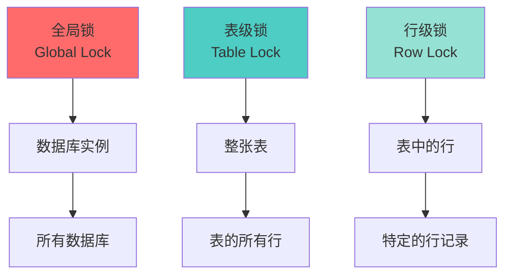
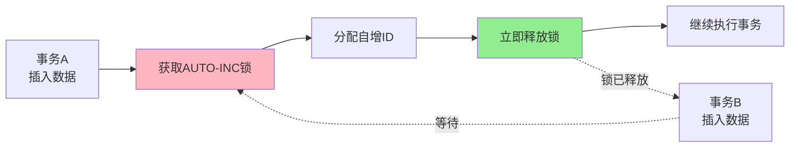
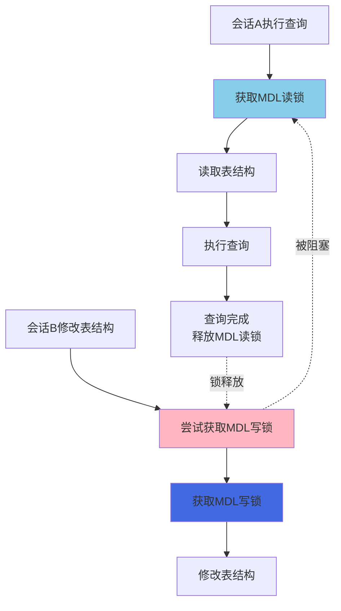
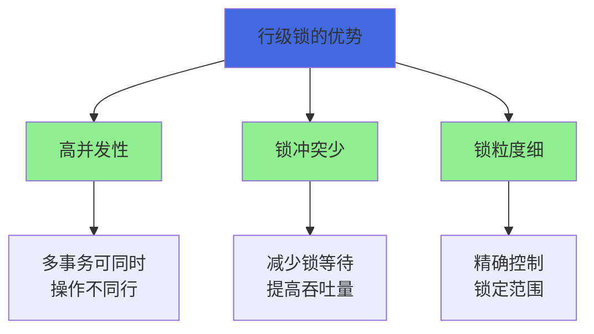
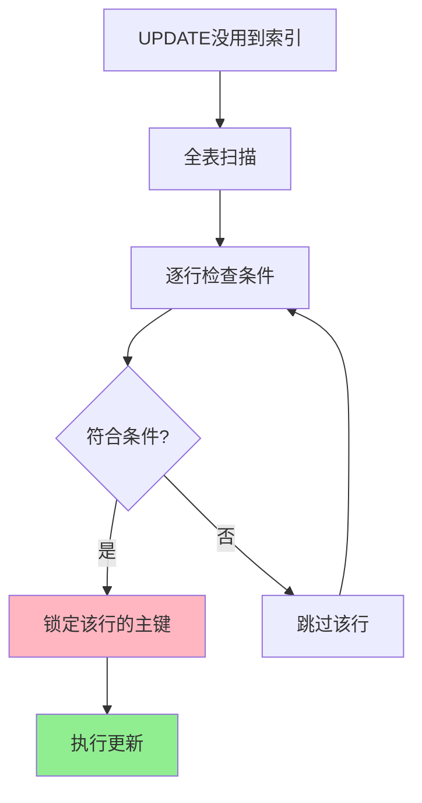
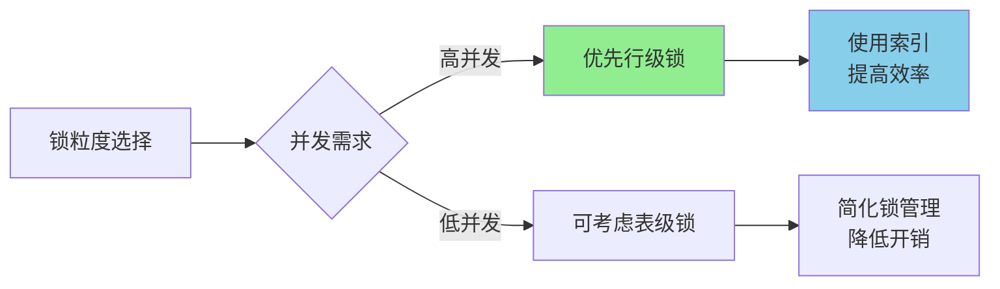

# MySQL锁的粒度与层级

## 锁粒度概述

在数据库系统中,锁的粒度指的是锁定资源的大小范围。锁的粒度越小,并发度越高,但管理成本也越高;锁的粒度越大,管理成本越低,但并发度也会降低。

InnoDB存储引擎支持多种粒度的锁,从大到小依次是:
- 全局锁: 锁定整个MySQL实例
- 表级锁: 锁定整张表  
- 行级锁: 锁定表中的某些行

需要注意的是,**InnoDB不支持页级锁**,这是它与某些其他存储引擎的区别。



## 全局锁

### 全局锁的作用

全局锁是一种影响整个MySQL实例的锁,它会锁定数据库实例中的所有表,使整个数据库处于只读状态。

在MySQL中,可以使用以下命令添加全局读锁:

```sql
FLUSH TABLES WITH READ LOCK;
```

执行该命令后:
- 所有数据库中的所有表都被锁定为只读
- 所有的写操作(INSERT、UPDATE、DELETE)都会被阻塞
- 其他会话可以继续执行查询操作
- DDL操作(如CREATE、ALTER、DROP)也会被阻塞

解锁命令:

```sql
UNLOCK TABLES;
```

### 全局锁的使用场景

全局锁主要用于以下场景:

**1. 全库逻辑备份**

当需要对整个数据库进行一致性备份时,可以使用全局锁确保备份期间数据不发生变化。

```sql
-- 加全局读锁
FLUSH TABLES WITH READ LOCK;

-- 执行备份操作(在另一个会话)
mysqldump -uroot -p --all-databases > backup.sql

-- 释放全局锁
UNLOCK TABLES;
```

**2. 数据迁移**

在进行数据库迁移时,为了保证数据的一致性,可以使用全局锁。


### 全局锁的问题

使用全局锁会带来严重的影响:

1. **业务停滞**: 在锁定期间,所有写操作都被阻塞,业务基本处于停滞状态
2. **主从延迟**: 如果在主库上加全局锁,会导致主从同步延迟
3. **长时间阻塞**: 如果备份时间过长,会导致业务长时间不可用

### 更好的替代方案

由于全局锁的影响太大,在实际应用中通常使用以下替代方案:

**使用InnoDB的MVCC机制**

对于InnoDB引擎,可以使用mysqldump的`--single-transaction`参数:

```bash
mysqldump --single-transaction -uroot -p dbname > backup.sql
```

这个参数会在一个事务中进行备份,利用MVCC机制获取一致性快照,不需要锁表。

**使用从库备份**

在主从架构中,可以在从库上进行备份,不影响主库的业务。

## 表级锁

InnoDB中的表级锁种类较多,包括意向锁、AUTO-INC锁、元数据锁(MDL锁)以及普通的表级共享锁和排他锁。

### 自增锁(AUTO-INC Lock)

AUTO-INC锁是一种特殊的表级锁,用于管理AUTO_INCREMENT列的自增值分配。

**加锁时机**

当事务向包含AUTO_INCREMENT列的表插入数据时:
1. MySQL会自动获取AUTO-INC锁
2. 为新插入的行分配连续的自增值
3. 立即释放锁(不需要等待事务提交)

```sql
-- 创建包含自增主键的表
CREATE TABLE user_records (
    user_id BIGINT AUTO_INCREMENT PRIMARY KEY,
    username VARCHAR(50),
    create_time DATETIME
);

-- 插入数据时会自动获取和释放AUTO-INC锁
INSERT INTO user_records (username, create_time) 
VALUES ('alice', NOW()), ('bob', NOW());
```

**AUTO-INC锁的特点**



1. **表级锁**: 虽然是为行分配ID,但AUTO-INC锁是表级别的
2. **短暂持有**: 不像其他事务锁,AUTO-INC锁在分配完ID后立即释放,不等待事务提交
3. **保证连续性**: 确保同一个事务中插入的多行获得连续的ID

**锁模式配置**

MySQL提供了`innodb_autoinc_lock_mode`参数来控制AUTO-INC锁的行为:

- `0` (传统模式): 所有INSERT都使用表级AUTO-INC锁
- `1` (连续模式,默认): 简单INSERT使用轻量级互斥锁,批量INSERT使用AUTO-INC锁
- `2` (交错模式): 所有INSERT都使用轻量级互斥锁,性能最好但可能导致ID不连续

```sql
-- 查看当前配置
SHOW VARIABLES LIKE 'innodb_autoinc_lock_mode';

-- 在配置文件中设置
[mysqld]
innodb_autoinc_lock_mode=1
```

### 元数据锁(MDL Lock)

元数据锁(MetaData Lock)是一种用于保护数据库对象元数据的表级锁,而不是保护数据本身。

**MDL锁的作用**

MDL锁用于控制对数据库对象元数据的并发访问,确保在DDL操作期间不会出现数据不一致问题。它主要保护以下元数据对象:
- 表结构定义
- 列定义  
- 索引定义
- 视图定义
- 存储过程、触发器等



**触发MDL锁的场景**

以下DDL操作会触发MDL锁:

```sql
-- 1. 创建/修改/删除表结构
CREATE TABLE student_info (
    student_id INT PRIMARY KEY,
    student_name VARCHAR(50)
);

ALTER TABLE student_info ADD COLUMN age INT;

DROP TABLE student_info;

-- 2. 创建/修改/删除索引
CREATE INDEX idx_name ON student_info(student_name);
ALTER TABLE student_info DROP INDEX idx_name;

-- 3. 修改列定义
ALTER TABLE student_info 
MODIFY COLUMN student_name VARCHAR(100);

-- 4. 创建/修改/删除视图
CREATE VIEW active_students AS 
SELECT * FROM student_info WHERE status = 1;

ALTER VIEW active_students AS 
SELECT * FROM student_info WHERE status IN (1, 2);

DROP VIEW active_students;

-- 5. 创建/修改/删除存储过程、触发器
CREATE PROCEDURE get_student(IN id INT)
BEGIN
    SELECT * FROM student_info WHERE student_id = id;
END;
```

**MDL锁的级别**

MDL锁也分为共享和排他两种级别:

1. **共享元数据锁(SHARED-MDL)**
   - 允许多个事务同时读取元数据
   - 不允许任何事务修改元数据
   - DML操作(SELECT、INSERT、UPDATE、DELETE)会获取共享MDL锁

2. **排他元数据锁(EXCLUSIVE-MDL)**
   - 阻止其他事务读取或修改元数据
   - 只有一个事务可以持有排他MDL锁
   - DDL操作需要获取排他MDL锁

**MDL锁升级**

当事务需要修改元数据时,会发生锁升级:

```sql
-- 会话A: 开始事务并查询(获取共享MDL锁)
BEGIN;
SELECT * FROM student_info WHERE student_id = 1001;

-- 会话B: 尝试修改表结构(需要排他MDL锁)
ALTER TABLE student_info ADD COLUMN email VARCHAR(100);
-- 此操作会被阻塞,等待会话A释放共享MDL锁

-- 会话A: 提交事务(释放共享MDL锁)
COMMIT;
-- 此时会话B可以获取排他MDL锁并执行ALTER操作
```

### 表级共享锁和排他锁

除了自动加的锁之外,InnoDB也支持手动添加表级的共享锁和排他锁。

**手动加锁语法**

```sql
-- 添加表级共享锁(读锁)
LOCK TABLES product_catalog READ;

-- 添加表级排他锁(写锁)  
LOCK TABLES product_catalog WRITE;

-- 释放表锁
UNLOCK TABLES;
```

**表级锁的特点**

```sql
-- 会话A: 对表加读锁
LOCK TABLES product_catalog READ;

-- 此时会话A可以读取,但不能写入
SELECT * FROM product_catalog;  -- 成功
UPDATE product_catalog SET price = 100 WHERE id = 1;  -- 失败

-- 会话B: 其他会话的读操作不受影响
SELECT * FROM product_catalog;  -- 成功

-- 会话B: 但写操作会被阻塞
UPDATE product_catalog SET price = 200 WHERE id = 2;  -- 被阻塞
```

**表级锁的使用场景**

在InnoDB中,表级共享锁和排他锁很少使用,因为:

1. **InnoDB优先使用行级锁**: InnoDB设计上倾向于使用行级锁来提高并发性
2. **影响并发性能**: 表级锁会阻塞所有对该表的访问,严重影响并发
3. **更细粒度的选择**: 意向锁、AUTO-INC锁、MDL锁已经覆盖了大部分场景

表级锁主要在以下极少数情况下使用:
- 系统崩溃恢复时
- 特定的维护操作
- 需要显式控制并发的特殊场景

## 行级锁

行级锁是InnoDB的核心特性,也是其高并发性能的关键。

### 行级锁的优势

相比表级锁,行级锁有以下优势:



1. **更高的并发度**: 多个事务可以同时操作不同的行,互不影响
2. **更少的锁冲突**: 只有访问相同行的事务才会产生锁冲突
3. **更精确的控制**: 可以精确控制锁定的数据范围

### InnoDB的行级锁倾向

**默认使用行级锁**

InnoDB在设计上倾向于尽可能使用行级锁:

```sql
-- 普通的DML操作默认使用行级锁
UPDATE inventory SET quantity = quantity - 1 
WHERE product_id = 2001;  -- 只锁定product_id=2001的行

DELETE FROM order_items 
WHERE order_id = 5001;  -- 只锁定order_id=5001的相关行
```

**特殊情况的处理**

即使在某些极端情况下,InnoDB也会尽量使用行级锁:

```sql
-- 情况1: WHERE条件没有使用索引
UPDATE inventory SET quantity = 0 
WHERE warehouse = 'Shanghai';  -- 假设warehouse没有索引

-- InnoDB的处理:
-- 1. 进行全表扫描
-- 2. 对扫描到的每一行尝试加锁
-- 3. 只锁定符合条件的行(而不是锁整张表)
-- 4. 锁定的是主键索引(如果没有主键,使用隐式主键)
```

**锁定主键的机制**

当没有合适的索引时,InnoDB会锁定主键索引:



- 如果表有主键,锁定主键索引
- 如果没有主键但有唯一索引,锁定第一个唯一索引
- 如果都没有,InnoDB会创建一个隐藏的row_id列作为聚簇索引并锁定

### 行级锁的类型

InnoDB中的行级锁主要包括:

1. **记录锁(Record Lock)**: 锁定索引记录
2. **间隙锁(Gap Lock)**: 锁定索引记录之间的间隙
3. **临键锁(Next-Key Lock)**: 记录锁+间隙锁的组合
4. **插入意向锁(Insert Intention Lock)**: 插入操作的特殊间隙锁

这些锁的详细机制我们会在下一章节详细介绍。

## 锁粒度的选择建议

在实际开发中,应该如何选择合适的锁粒度?

### 选择原则



1. **高并发场景**: 优先使用行级锁,利用索引精确定位要锁定的行
2. **批量操作**: 如果需要操作大量数据,评估是否真的需要加锁
3. **维护操作**: 在系统维护期间可以使用表级锁,确保数据一致性
4. **备份操作**: 使用`--single-transaction`参数进行在线备份,避免使用全局锁

### 性能优化建议

1. **合理使用索引**: 确保WHERE条件使用了索引,避免全表扫描导致的大范围加锁
2. **缩短事务时间**: 事务时间越短,持有锁的时间越短,并发性能越好
3. **避免长事务**: 长事务会长时间持有锁,严重影响并发性能
4. **批量操作拆分**: 将大批量操作拆分成多个小批次,减少锁的持有时间

```sql
-- 不推荐: 一次性更新大量数据
UPDATE order_records SET status = 'archived' 
WHERE create_time < '2023-01-01';  -- 可能锁定大量行

-- 推荐: 分批更新
UPDATE order_records SET status = 'archived' 
WHERE create_time < '2023-01-01' LIMIT 1000;  -- 每次只更新1000条
-- 重复执行直到更新完成
```

## 小结

本文详细介绍了MySQL InnoDB中不同粒度的锁:

1. **全局锁**: 锁定整个数据库实例,主要用于全库备份,但应尽量使用替代方案
2. **表级锁**: 包括AUTO-INC锁、MDL锁、表级共享/排他锁,各有不同的使用场景
3. **行级锁**: InnoDB的核心特性,提供高并发性能,即使在没有索引的情况下也尽量使用行级锁

在实际开发中:
- 充分利用InnoDB的行级锁特性,提高并发性能
- 合理设计索引,避免全表扫描导致的大范围加锁
- 控制事务大小,减少锁的持有时间
- 了解各种锁的自动管理机制,避免不必要的手动干预
