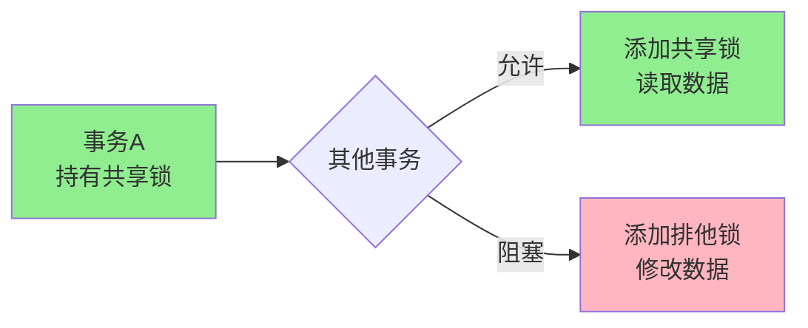
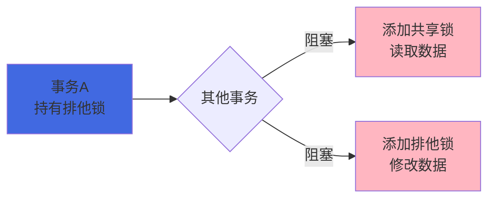
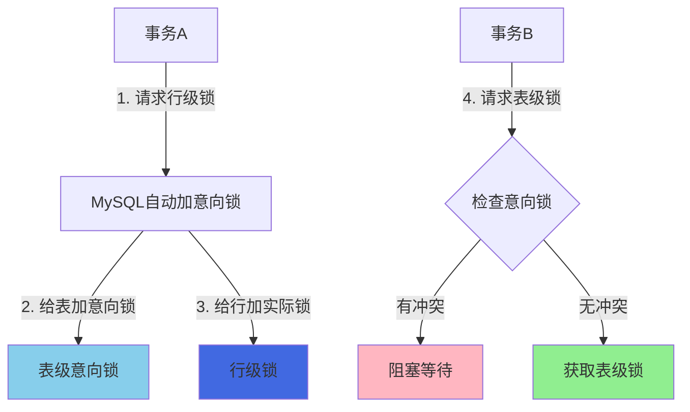
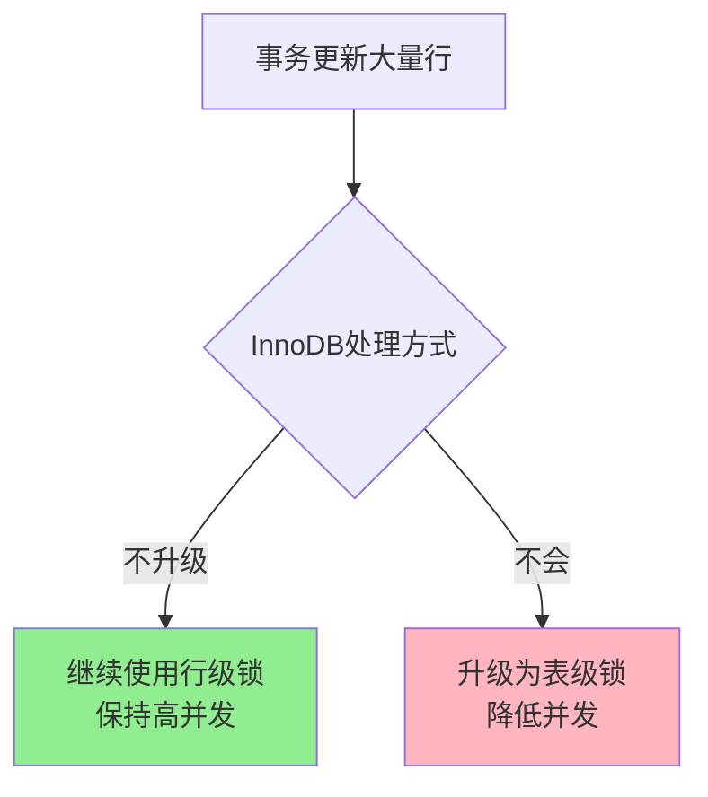

# MySQL锁机制概述

## 锁机制的作用与意义

在多用户并发访问数据库的场景下,如果没有适当的并发控制机制,就可能出现数据不一致的问题。例如,两个用户同时修改同一条记录,后提交的事务可能会覆盖前一个事务的修改结果,造成数据丢失。为了解决这类问题,数据库引入了锁机制。

锁机制是数据库用来管理并发访问的重要手段,它通过对数据资源进行锁定,确保在同一时刻只有符合条件的事务可以访问特定的数据,从而保证数据的一致性和完整性。

## 锁的基本分类

InnoDB 存储引擎中的锁可以从多个维度进行分类:

### 按锁级别分类

从锁级别的角度,InnoDB 中的锁主要分为两大类:

**共享锁(Shared Lock, S锁)**

共享锁也称为读锁,当一个事务对某个数据资源加上共享锁后:
- 该事务可以读取这个数据资源
- 其他事务也可以对该资源继续加共享锁
- 但任何事务都不能对该资源加排他锁,也就不能修改数据



在 MySQL 中可以通过以下语句显式加共享锁:

```sql
SELECT * FROM products WHERE product_id = 1001 LOCK IN SHARE MODE;
```

这条语句会对查询结果中的每一行都加上共享锁。被加锁的记录可以被其他事务成功加共享锁并读取,但不能被加排他锁进行修改。

**排他锁(Exclusive Lock, X锁)**

排他锁也称为写锁,当一个事务对某个数据资源加上排他锁后:
- 该事务既可以读取也可以修改这个数据资源
- 其他事务不能再对该资源加任何类型的锁(包括共享锁和排他锁)
- 其他事务必须等待该事务释放锁后才能访问



在 MySQL 中可以通过以下语句显式加排他锁:

```sql
SELECT * FROM products WHERE product_id = 1001 FOR UPDATE;
```

这条语句会对查询命中的每条记录加上排他锁。当没有其他事务对查询结果集中的任何一行持有锁时,可以成功申请排他锁,否则当前事务会被阻塞等待。

**锁兼容性总结**

| 当前锁状态 | 申请共享锁 | 申请排他锁 |
|---------|--------|--------|
| 无锁 | ✅ 允许 | ✅ 允许 |
| 已有共享锁 | ✅ 允许 | ❌ 阻塞 |
| 已有排他锁 | ❌ 阻塞 | ❌ 阻塞 |

### 按锁粒度分类

按照锁定资源的范围大小,InnoDB 中的锁可以分为:

- **全局锁**: 锁定整个数据库实例
- **表级锁**: 锁定整张表
- **行级锁**: 锁定表中的某一行或某几行数据

不同粒度的锁有不同的应用场景,我们会在后续章节详细介绍。

### 按加锁方式分类

- **自动锁**: 由数据库系统自动管理的锁,如意向锁、AUTO-INC锁
- **显式锁**: 需要用户通过SQL语句显式申请的锁,如 `SELECT ... FOR UPDATE`

### 按使用方式分类

- **乐观锁**: 假设冲突很少发生,不实际加锁,而是在更新时检查版本号
- **悲观锁**: 假设冲突经常发生,先加锁再进行操作

## 意向锁机制

### 什么是意向锁

在理解意向锁之前,我们先看一个问题场景:

假设事务A对表 `orders` 中的某一行记录加了行级排他锁,这时另一个事务B想要对整个 `orders` 表加表级排他锁。那么事务B在加锁前,需要先检查表中是否有其他事务持有的行级锁。

如果让事务B逐行检查表中所有记录是否被加锁,这个过程会非常低效,特别是对于大表来说。为了解决这个问题,MySQL 引入了意向锁机制。

**意向锁是一种表级锁,用于表示事务打算在表中的某些行上加共享锁或排他锁。** 当事务请求获取行级锁时,MySQL 会自动为相应的表加上意向锁。



### 意向锁的类型

意向锁分为两种:

**意向共享锁(Intention Shared Lock, IS锁)**
- 表示事务打算在表中的某些行上设置共享锁(读锁)
- 当事务对某行加共享锁时,会自动给表加IS锁

**意向排他锁(Intention Exclusive Lock, IX锁)**
- 表示事务打算在表中的某些行上设置排他锁(写锁)  
- 当事务对某行加排他锁时,会自动给表加IX锁

### 意向锁的作用

意向锁的主要作用是提高表级锁的获取效率:

1. **快速冲突检测**: 当事务B想要获取表级锁时,只需检查表上的意向锁,无需逐行扫描
2. **不同粒度锁的协调**: 协调行级锁和表级锁之间的关系,避免冲突
3. **自动管理**: 由MySQL自动维护,开发者无需手动管理

### 意向锁的兼容性

以下是MySQL官方文档给出的各种锁之间的兼容性矩阵:

| | X | IX | S | IS |
|---|---|---|---|---|
| X | ❌ 冲突 | ❌ 冲突 | ❌ 冲突 | ❌ 冲突 |
| IX | ❌ 冲突 | ✅ 兼容 | ❌ 冲突 | ✅ 兼容 |
| S | ❌ 冲突 | ❌ 冲突 | ✅ 兼容 | ✅ 兼容 |
| IS | ❌ 冲突 | ✅ 兼容 | ✅ 兼容 | ✅ 兼容 |

从表中可以看出:
- 意向锁之间是相互兼容的(IS与IS、IS与IX、IX与IX都兼容)
- 意向锁的目的不是阻塞行级锁的获取,而是为了方便检测表级锁的冲突

### 意向锁示例

```sql
-- 会话A: 对订单表中的某一行加共享锁
BEGIN;
SELECT * FROM orders WHERE order_id = 10001 LOCK IN SHARE MODE;
-- MySQL自动为orders表加IS锁
-- 同时为order_id=10001的行加S锁

-- 会话B: 尝试获取整个订单表的排他锁
LOCK TABLES orders WRITE;  -- 会被阻塞,因为表上有IS锁,与表级X锁冲突

-- 会话C: 对另一行加排他锁
SELECT * FROM orders WHERE order_id = 10002 FOR UPDATE;  
-- 可以成功,因为IX锁与IX锁兼容
```

### 注意事项

1. **意向锁是表级锁**: 虽然它与行级锁配合使用,但本身是表级别的
2. **自动管理**: 由MySQL自动加锁和释放,无需开发者手动操作
3. **不直接锁定数据**: 意向锁只是一种标识,表明有行级锁存在,它本身不直接锁定数据
4. **随事务释放**: 意向锁会在触发它的事务提交或回滚后自动释放

## 锁升级机制

### 什么是锁升级

锁升级是指数据库系统将多个较小粒度的锁(如行锁)自动合并为一个较大粒度的锁(如表锁)的过程。锁升级的主要目的是减少锁的管理开销。

在某些数据库系统中(如SQL Server),当一个事务持有的行锁数量超过一定阈值时,系统会自动将这些行锁升级为表锁,以减少内存占用和锁管理开销。

### InnoDB不支持锁升级

**InnoDB存储引擎不支持自动锁升级机制**,它始终使用行级锁进行并发控制。

这样设计的原因包括:

1. **保持高并发性能**: 锁升级会将行锁变为表锁,导致锁粒度变大,降低并发度,增加锁等待和冲突
2. **避免性能退化**: 表锁会阻塞其他事务对整张表的访问,即使这些事务访问的是不同的数据行
3. **设计目标一致**: InnoDB的设计目标就是高并发、高性能,行级锁是实现这一目标的关键



### 特殊情况

虽然InnoDB不会自动进行锁升级,但在某些极端情况下,InnoDB可能会评估成本后选择不同的加锁策略:

- 当UPDATE操作需要扫描整个表且更新大量行时,InnoDB可能会评估行级锁的成本
- 但即使在这种情况下,InnoDB也倾向于使用行级锁,而不是自动升级为表锁
- 这种情况在实际应用中非常罕见

## 小结

本文介绍了MySQL InnoDB存储引擎中锁机制的基本概念:

1. **锁的级别**: 共享锁(S锁)用于读操作,排他锁(X锁)用于写操作
2. **意向锁**: IS锁和IX锁是表级锁,用于协调行级锁和表级锁的关系,由MySQL自动管理
3. **锁升级**: InnoDB不支持自动锁升级,始终使用行级锁保持高并发性能

理解这些基础概念对于后续学习表级锁、行级锁、以及锁的优化都非常重要。在实际开发中,我们应该:
- 合理使用共享锁和排他锁,避免不必要的锁竞争
- 了解意向锁的自动管理机制,无需手动干预
- 利用InnoDB的行级锁特性,提高系统并发性能
