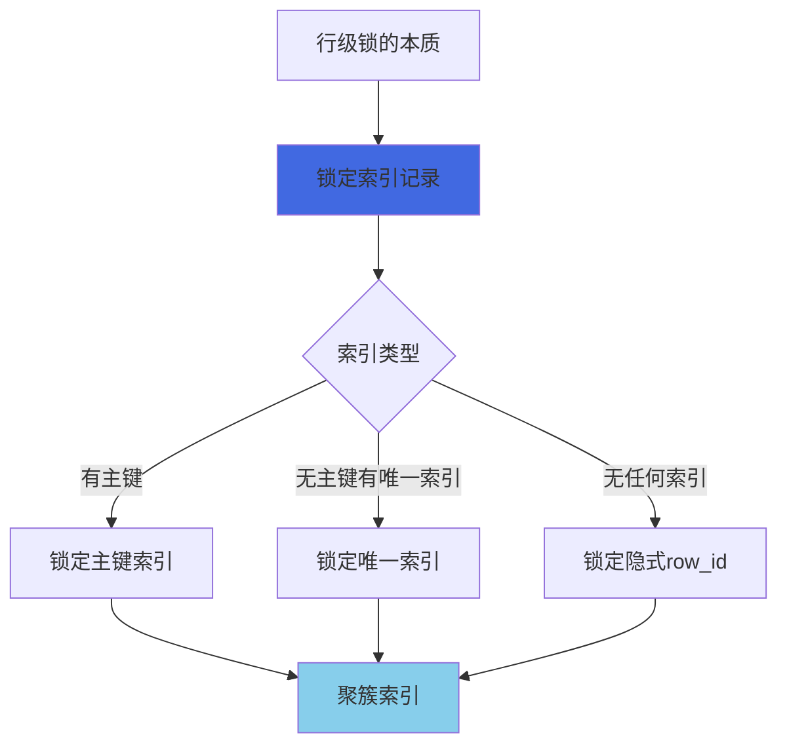
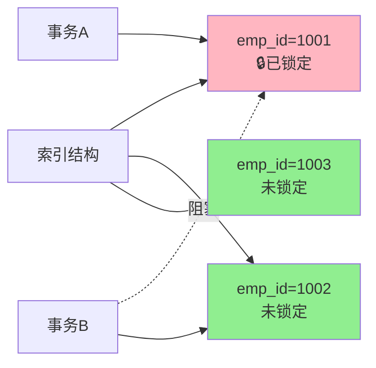
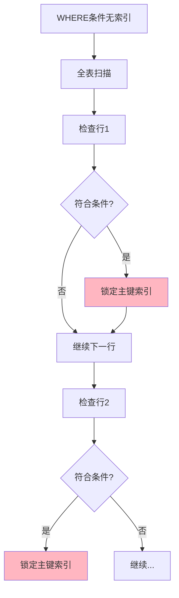
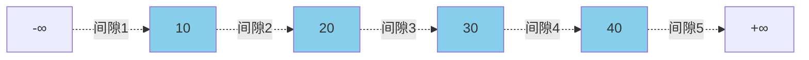
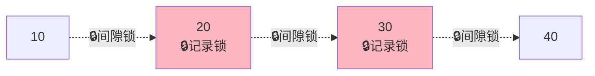
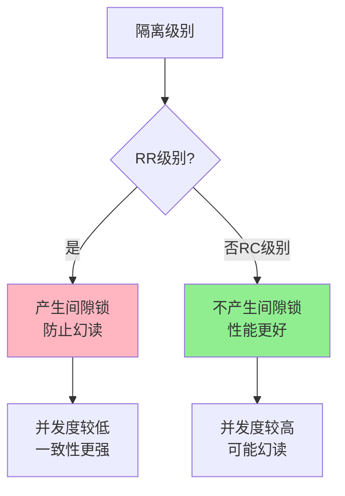
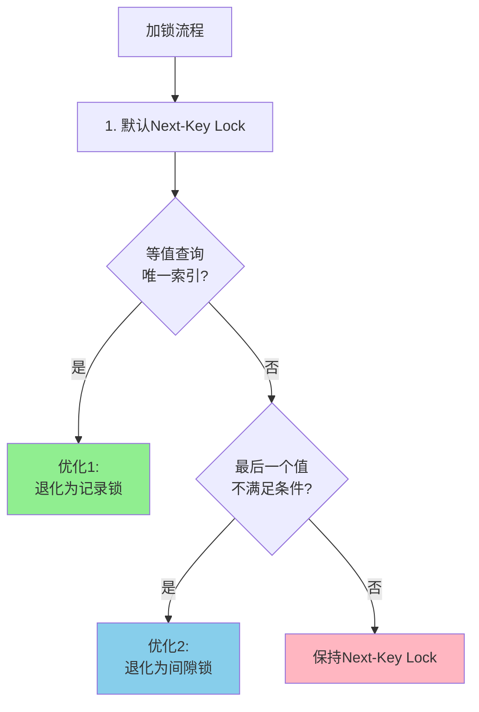
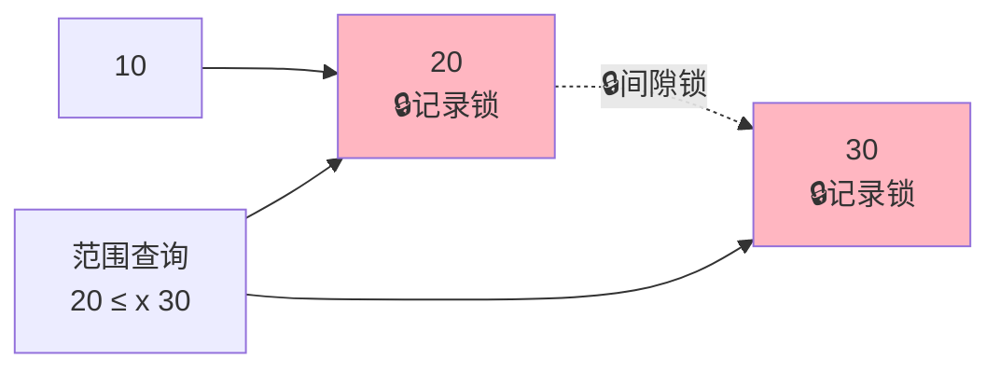
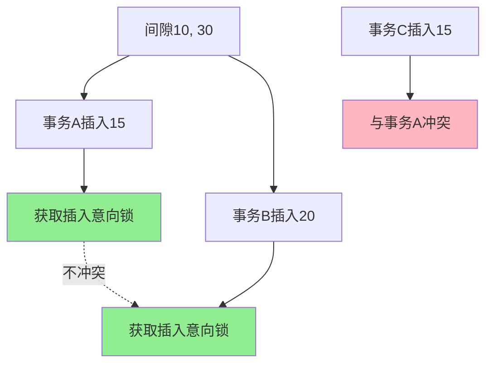
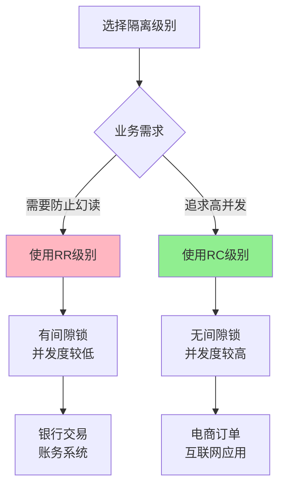

# MySQL行级锁详解

## 行级锁的本质

在深入了解各类行级锁之前,我们需要明确一个重要概念:**MySQL InnoDB的行级锁实际上锁定的是索引,而不是数据行本身**。

这意味着:
- 行级锁是通过给索引项加锁来实现的
- 只有通过索引条件检索数据时,InnoDB才会使用行级锁
- 锁定的是索引记录,而不是物理行



理解这一点对于掌握后续的记录锁、间隙锁和临键锁至关重要。

## 记录锁(Record Lock)

### 记录锁的定义

**记录锁(Record Lock)是加在索引记录上的锁**。它锁定的是具体的一条索引记录,防止其他事务对这条记录进行修改或删除。

```sql
-- 示例: 锁定指定员工记录
SELECT * FROM employees WHERE emp_id = 1001 FOR UPDATE;
```

这条SQL会对 `emp_id = 1001` 的索引记录加上排他的记录锁,阻止其他事务:
- 修改这条记录
- 删除这条记录  
- 对这条记录加排他锁



### 记录锁的特点

1. **锁定精确**: 只锁定符合条件的索引记录
2. **基于索引**: 必须通过索引来定位记录
3. **支持共享和排他**: 可以加共享记录锁(S)或排他记录锁(X)

### 记录锁示例

**示例1: 主键索引上的记录锁**

```sql
-- 创建表
CREATE TABLE product_inventory (
    product_id INT PRIMARY KEY,
    product_name VARCHAR(100),
    stock_quantity INT
);

-- 插入数据
INSERT INTO product_inventory VALUES 
(101, 'Laptop', 50),
(102, 'Mouse', 200),
(103, 'Keyboard', 150);

-- 会话A: 对特定产品加锁
BEGIN;
SELECT * FROM product_inventory 
WHERE product_id = 101 FOR UPDATE;
-- 锁定product_id=101的主键索引记录

-- 会话B: 可以操作其他产品
UPDATE product_inventory 
SET stock_quantity = stock_quantity - 1 
WHERE product_id = 102;  -- 成功,不冲突

-- 会话B: 无法操作被锁定的产品
UPDATE product_inventory 
SET stock_quantity = stock_quantity - 1 
WHERE product_id = 101;  -- 被阻塞
```

**示例2: 唯一索引上的记录锁**

```sql
-- 创建表with唯一索引
CREATE TABLE user_accounts (
    user_id INT PRIMARY KEY,
    email VARCHAR(100) UNIQUE,
    username VARCHAR(50)
);

-- 插入数据
INSERT INTO user_accounts VALUES 
(1, 'alice@example.com', 'alice'),
(2, 'bob@example.com', 'bob');

-- 会话A: 通过唯一索引查询并加锁
BEGIN;
SELECT * FROM user_accounts 
WHERE email = 'alice@example.com' FOR UPDATE;
-- 对email索引和主键索引都加了记录锁

-- 会话B: 尝试修改同一用户
UPDATE user_accounts 
SET username = 'alice_new' 
WHERE email = 'alice@example.com';  -- 被阻塞
```

### 无索引情况下的记录锁

当WHERE条件没有使用索引时,InnoDB仍然会使用记录锁,但锁定范围会更大:

```sql
-- 假设warehouse_name列没有索引
SELECT * FROM product_inventory 
WHERE warehouse_name = 'Beijing' FOR UPDATE;

-- InnoDB的处理流程:
-- 1. 全表扫描所有记录
-- 2. 检查每条记录是否符合条件
-- 3. 对符合条件的记录加主键索引的记录锁
-- 4. 扫描过程中可能产生间隙锁(在RR隔离级别下)
```



## 间隙锁(Gap Lock)

### 间隙锁的定义

**间隙锁(Gap Lock)是加在索引记录之间间隙上的锁**,它锁定的不是具体的索引记录,而是索引记录之间的"空隙"。

间隙锁的主要目的是**防止幻读**,防止其他事务在间隙中插入新的记录。

### 什么是间隙

间隙(Gap)指的是索引数据结构中可以插入新值的位置。

假设某个索引列存在以下值: 10, 20, 30, 40

那么这个索引中的间隙包括:
- (-∞, 10)
- (10, 20)
- (20, 30)
- (30, 40)
- (40, +∞)



### 间隙锁的作用范围

```sql
-- 示例表结构和数据
CREATE TABLE order_records (
    order_id INT PRIMARY KEY,
    customer_id INT,
    order_amount DECIMAL(10,2),
    INDEX idx_customer (customer_id)
);

INSERT INTO order_records VALUES 
(10, 1001, 100.00),
(20, 1002, 200.00),
(30, 1003, 300.00),
(40, 1004, 400.00);

-- 会话A: 范围查询并加锁
BEGIN;
SELECT * FROM order_records 
WHERE order_id > 15 AND order_id < 35 FOR UPDATE;
-- 这会产生间隙锁,锁定(10, 20), (20, 30), (30, 40)这些间隙
```

在RR隔离级别下,这个查询会产生以下锁:
- 记录锁: order_id = 20, 30
- 间隙锁: (10, 20), (20, 30), (30, 40)



### 间隙锁阻止插入

间隙锁的主要作用是防止在间隙中插入新记录:

```sql
-- 会话A: 加间隙锁
BEGIN;
SELECT * FROM order_records 
WHERE order_id > 15 AND order_id < 35 FOR UPDATE;

-- 会话B: 尝试在间隙中插入
INSERT INTO order_records VALUES (25, 1005, 250.00);
-- 被阻塞! 因为25在(20, 30)间隙中,而这个间隙被会话A锁定

-- 会话B: 在间隙外插入
INSERT INTO order_records VALUES (50, 1006, 500.00);
-- 成功! 因为50不在被锁定的间隙中
```

### 间隙锁的生效条件

**间隙锁只在REPEATABLE READ(RR)隔离级别下生效**,在READ COMMITTED(RC)隔离级别下不会产生间隙锁。

```sql
-- 查看当前隔离级别
SELECT @@transaction_isolation;

-- 设置隔离级别为RC
SET SESSION TRANSACTION ISOLATION LEVEL READ COMMITTED;
-- 在RC级别下,上述的范围查询不会产生间隙锁

-- 设置隔离级别为RR
SET SESSION TRANSACTION ISOLATION LEVEL REPEATABLE READ;
-- 在RR级别下,范围查询会产生间隙锁
```



### 间隙锁的特殊性

间隙锁有一些特殊的性质:

1. **间隙锁之间不冲突**: 多个事务可以同时持有同一个间隙的间隙锁
2. **阻止插入操作**: 间隙锁会阻止其他事务在间隙中插入新记录
3. **不锁定已存在的记录**: 间隙锁只影响INSERT操作,不影响UPDATE和DELETE

```sql
-- 会话A: 加间隙锁
BEGIN;
SELECT * FROM order_records 
WHERE order_id = 15 FOR UPDATE;
-- order_id=15不存在,产生间隙锁(10, 20)

-- 会话B: 也可以获取同一间隙的间隙锁
BEGIN;
SELECT * FROM order_records 
WHERE order_id = 18 FOR UPDATE;
-- 成功! 间隙锁之间不冲突

-- 会话C: 尝试插入
INSERT INTO order_records VALUES (15, 1007, 150.00);
-- 被阻塞! 两个间隙锁都会阻止插入
```

## 临键锁(Next-Key Lock)

### 临键锁的定义

**临键锁(Next-Key Lock)是记录锁和间隙锁的组合**,它同时锁定一条索引记录和该记录之前的间隙。

临键锁的范围是**左开右闭**的区间,例如 (10, 20] 表示:
- 不包含10
- 包含20
- 锁定10和20之间的间隙
- 锁定20这条记录


### 临键锁的范围示例

假设索引中存在值: 10, 20, 30, 40

可能的临键锁区间包括:
- (-∞, 10]
- (10, 20]
- (20, 30]
- (30, 40]
- (40, +∞)

```sql
-- 示例表
CREATE TABLE transaction_log (
    log_id INT PRIMARY KEY,
    transaction_type VARCHAR(20),
    amount DECIMAL(10,2)
);

INSERT INTO transaction_log VALUES 
(10, 'deposit', 1000),
(20, 'withdraw', 500),
(30, 'deposit', 2000),
(40, 'transfer', 1500);

-- 会话A: 查询log_id=20的记录
BEGIN;
SELECT * FROM transaction_log 
WHERE log_id = 20 FOR UPDATE;

-- 在RR隔离级别下,这会加临键锁(10, 20]
-- 包括:
--   - 间隙锁: (10, 20)
--   - 记录锁: log_id=20
```

### 临键锁的加锁原则

InnoDB的加锁遵循以下基本原则(来自《MySQL实战45讲》):

**两个基本原则:**
1. 加锁的基本单位是Next-Key Lock,范围是左开右闭区间
2. 查找过程中访问到的对象才会加锁

**两个优化规则:**
1. 索引上的等值查询,给唯一索引加锁时,Next-Key Lock退化为记录锁
2. 索引上的等值查询,向右遍历且最后一个值不满足等值条件时,Next-Key Lock退化为间隙锁

**一个bug:**
1. 唯一索引上的范围查询会访问到不满足条件的第一个值为止



### 临键锁实战示例

**示例1: 等值查询,记录不存在**

```sql
-- 数据: 10, 20, 30, 40
BEGIN;
UPDATE transaction_log SET amount = 0 WHERE log_id = 15;

-- 加锁分析:
-- 1. 原则1: 加锁单位是Next-Key Lock,初始范围(10, 20]
-- 2. 优化2: 等值查询,log_id=20不满足log_id=15的条件
--    Next-Key Lock退化为间隙锁(10, 20)
-- 最终: 间隙锁(10, 20)
```


**示例2: 等值查询,唯一索引**

```sql
-- log_id是主键(唯一索引)
-- 数据: 10, 20, 30, 40
BEGIN;
SELECT * FROM transaction_log 
WHERE log_id = 20 FOR UPDATE;

-- 加锁分析:
-- 1. 原则1: 加锁单位是Next-Key Lock,范围(10, 20]
-- 2. 优化1: 等值查询且是唯一索引,退化为记录锁
-- 最终: 记录锁 log_id=20
```

**示例3: 范围查询,唯一索引**

```sql
-- 数据: 10, 20, 30, 40
BEGIN;
SELECT * FROM transaction_log 
WHERE log_id >= 20 AND log_id < 30 FOR UPDATE;

-- 加锁分析:
-- 1. 从log_id=20开始扫描
-- 2. 加Next-Key Lock (10, 20]
-- 3. 优化1: 等值命中log_id=20,退化为记录锁
-- 4. 继续向右扫描,找到log_id=30
-- 5. 原则2: 访问到的要加锁,加Next-Key Lock (20, 30]
-- 6. bug: 范围查询会访问到不满足条件的第一个值
-- 最终: 记录锁log_id=20 + Next-Key Lock(20, 30]
```



**示例4: 非唯一索引的等值查询**

```sql
-- 创建非唯一索引
CREATE INDEX idx_type ON transaction_log(transaction_type);

-- 假设transaction_type列的值分布:
-- 'deposit' 出现在 log_id=10, 30
-- 'withdraw' 出现在 log_id=20
-- 'transfer' 出现在 log_id=40

BEGIN;
SELECT * FROM transaction_log 
WHERE transaction_type = 'withdraw' 
LOCK IN SHARE MODE;

-- 加锁分析:
-- 1. 在idx_type索引上定位到'withdraw'
-- 2. 加Next-Key Lock,锁定(deposit, withdraw]
-- 3. 向右扫描到'transfer',不满足条件
-- 4. 优化2: 退化为间隙锁(withdraw, transfer)
-- 5. 因为是非唯一索引,还需要在主键索引上加记录锁
-- 最终: 
--   - idx_type索引: Next-Key Lock(deposit, withdraw] + 间隙锁(withdraw, transfer)
--   - 主键索引: 记录锁log_id=20
```

## 插入意向锁(Insert Intention Lock)

### 插入意向锁的定义

插入意向锁是一种特殊的间隙锁,在INSERT操作插入行之前设置。

它表明了插入的意图:**如果多个事务插入到同一索引间隙的不同位置,它们不需要相互等待**。

```sql
-- 假设索引中有值: 10, 30
-- 会话A: 插入15
BEGIN;
INSERT INTO transaction_log VALUES (15, 'payment', 300);
-- 获取间隙(10, 30)的插入意向锁

-- 会话B: 同时插入20
BEGIN;
INSERT INTO transaction_log VALUES (20, 'refund', 200);
-- 也获取间隙(10, 30)的插入意向锁
-- 不会被阻塞,因为15和20是不同的位置
```



### 插入意向锁与间隙锁的关系

- **间隙锁会阻塞插入意向锁**: 如果一个事务持有间隙锁,其他事务无法在该间隙插入
- **插入意向锁之间不冲突**: 多个事务可以同时持有同一间隙的插入意向锁(只要插入位置不同)

```sql
-- 会话A: 加间隙锁
BEGIN;
SELECT * FROM transaction_log 
WHERE log_id = 25 FOR UPDATE;
-- 产生间隙锁(20, 30)

-- 会话B: 尝试插入
INSERT INTO transaction_log VALUES (25, 'bonus', 500);
-- 被阻塞! 间隙锁阻塞插入意向锁
```

## 加锁规则综合实战

### 场景1: 主键索引范围查询

```sql
-- 数据: log_id = 5, 10, 15, 20
BEGIN;
SELECT * FROM transaction_log 
WHERE log_id > 10 AND log_id <= 15 FOR UPDATE;

-- 加锁过程:
-- 1. 定位到log_id=10,加Next-Key Lock(5, 10]
-- 2. log_id=10不满足>10条件,继续向右
-- 3. 定位到log_id=15,加Next-Key Lock(10, 15]
-- 4. log_id=15满足<=15条件
-- 5. bug: 范围查询继续向右扫描到log_id=20
-- 6. 加Next-Key Lock(15, 20]

-- 最终加锁范围:
-- Next-Key Lock: (5, 10], (10, 15], (15, 20]
-- 实际效果: 锁定10, 15, 20三条记录以及它们之间的间隙
```

### 场景2: 非唯一索引范围查询

```sql
-- 假设在amount列上有非唯一索引idx_amount
-- 数据分布: amount = 100, 200, 200, 300

BEGIN;
SELECT * FROM transaction_log 
WHERE amount >= 200 AND amount < 300 FOR UPDATE;

-- 加锁过程:
-- 1. 在idx_amount索引上定位到第一个200
-- 2. 加Next-Key Lock(100, 200]
-- 3. 继续扫描第二个200,加Next-Key Lock(200, 200]
-- 4. 继续扫描到300,加Next-Key Lock(200, 300]
-- 5. 因为是非唯一索引,不会退化
-- 6. 还需要在主键索引上加记录锁

-- 最终: 
-- 二级索引: 多个Next-Key Lock
-- 主键索引: 相应记录的记录锁
```

### 场景3: 覆盖索引查询

```sql
-- 查询只访问索引,不需要回表
BEGIN;
SELECT log_id FROM transaction_log 
WHERE transaction_type = 'deposit' 
LOCK IN SHARE MODE;

-- 加锁分析:
-- 1. 使用覆盖索引,不需要访问主键索引
-- 2. 只在idx_type索引上加锁
-- 3. 主键索引上不加锁

-- 原则2验证: 只有访问到的对象才会加锁
```

## 行级锁的最佳实践

### 如何减少锁冲突

```sql
-- ❌ 不推荐: 不使用索引导致大范围加锁
UPDATE transaction_log 
SET amount = amount * 1.1 
WHERE transaction_type = 'deposit';  -- transaction_type无索引

-- ✅ 推荐: 使用索引精确定位
CREATE INDEX idx_type ON transaction_log(transaction_type);
UPDATE transaction_log 
SET amount = amount * 1.1 
WHERE transaction_type = 'deposit';  -- 使用索引,减少锁范围
```

### 如何避免死锁

```sql
-- ❌ 容易死锁: 不同事务以不同顺序获取锁
-- 会话A
BEGIN;
UPDATE transaction_log SET amount = 100 WHERE log_id = 10;
UPDATE transaction_log SET amount = 200 WHERE log_id = 20;

-- 会话B
BEGIN;
UPDATE transaction_log SET amount = 200 WHERE log_id = 20;  -- 与A相反顺序
UPDATE transaction_log SET amount = 100 WHERE log_id = 10;

-- ✅ 推荐: 统一的顺序获取锁
-- 会话A和会话B都按照log_id升序操作
BEGIN;
UPDATE transaction_log SET amount = 100 WHERE log_id = 10;
UPDATE transaction_log SET amount = 200 WHERE log_id = 20;
```

### 选择合适的隔离级别



- **RR级别**: 需要强一致性,可以接受较低并发度
- **RC级别**: 追求高并发,允许一定程度的幻读

### 优化建议

1. **合理设计索引**: 确保WHERE条件能使用索引,避免全表扫描
2. **缩短事务时间**: 减少锁的持有时间,提高并发性
3. **避免大事务**: 将大事务拆分成多个小事务
4. **使用合适的隔离级别**: 根据业务需求选择RC或RR

```sql
-- ❌ 不推荐: 大事务长时间持有锁
BEGIN;
-- 复杂业务逻辑
UPDATE transaction_log SET status = 'processed' WHERE status = 'pending';
-- 耗时的其他操作...
COMMIT;

-- ✅ 推荐: 拆分成小批次
REPEAT
    UPDATE transaction_log SET status = 'processed' 
    WHERE status = 'pending' LIMIT 100;
UNTIL ROW_COUNT() = 0 END REPEAT;
```

## 小结

本文详细介绍了MySQL InnoDB的三种行级锁:

1. **记录锁(Record Lock)**: 锁定具体的索引记录,精确控制锁定范围
2. **间隙锁(Gap Lock)**: 锁定索引间隙,防止幻读,只在RR级别生效
3. **临键锁(Next-Key Lock)**: 记录锁+间隙锁的组合,左开右闭区间

核心要点:
- 行级锁锁定的是索引,不是数据行
- 加锁遵循两个原则、两个优化、一个bug
- 唯一索引的等值查询会退化为记录锁
- 非唯一索引需要更多的锁来保证一致性
- 选择合适的隔离级别平衡一致性和并发性

在实际开发中,应该:
- 充分利用索引减少锁的范围
- 理解不同场景下的加锁规则
- 避免不必要的间隙锁导致的性能问题
- 根据业务特点选择合适的隔离级别
