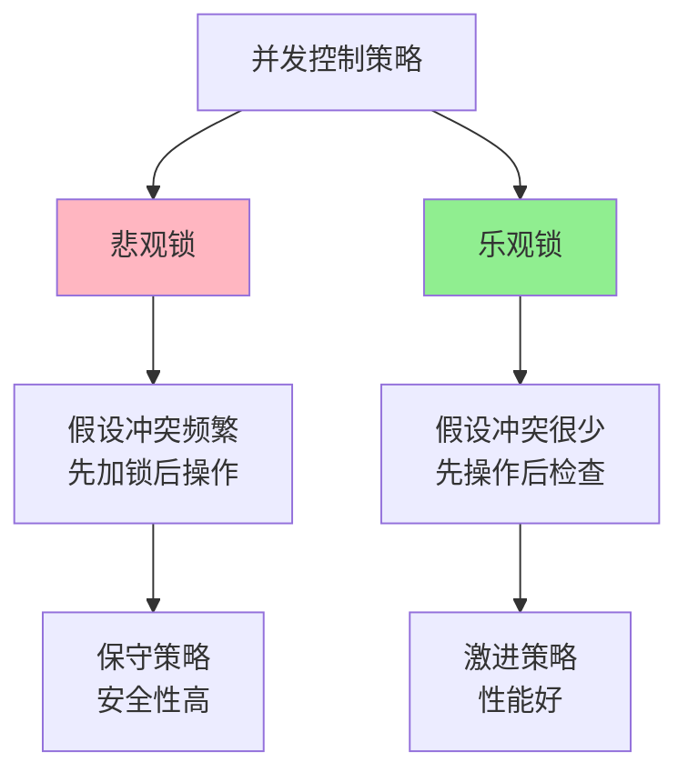
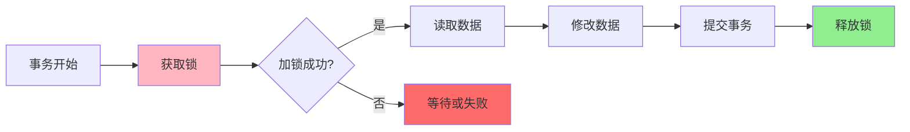
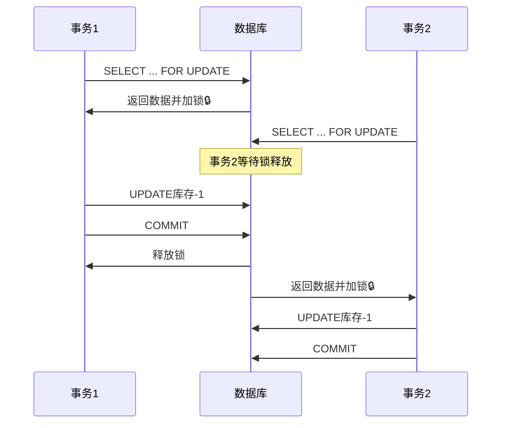
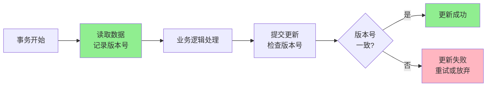
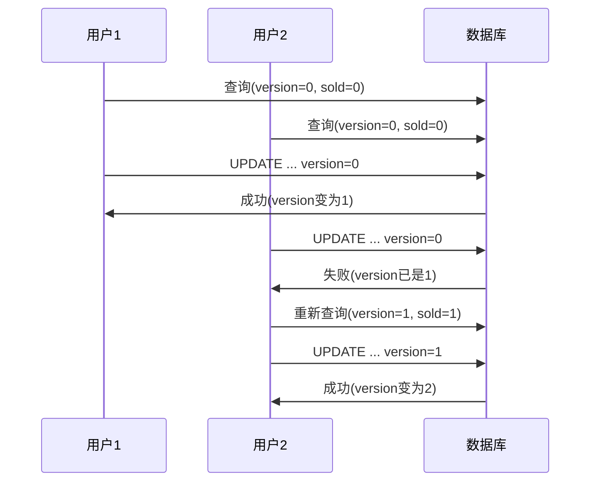
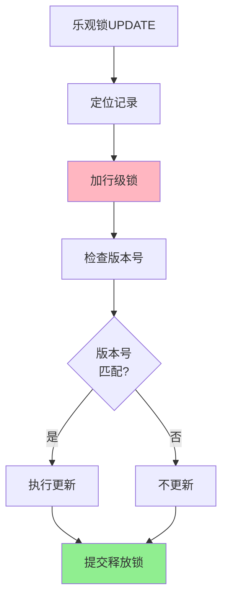
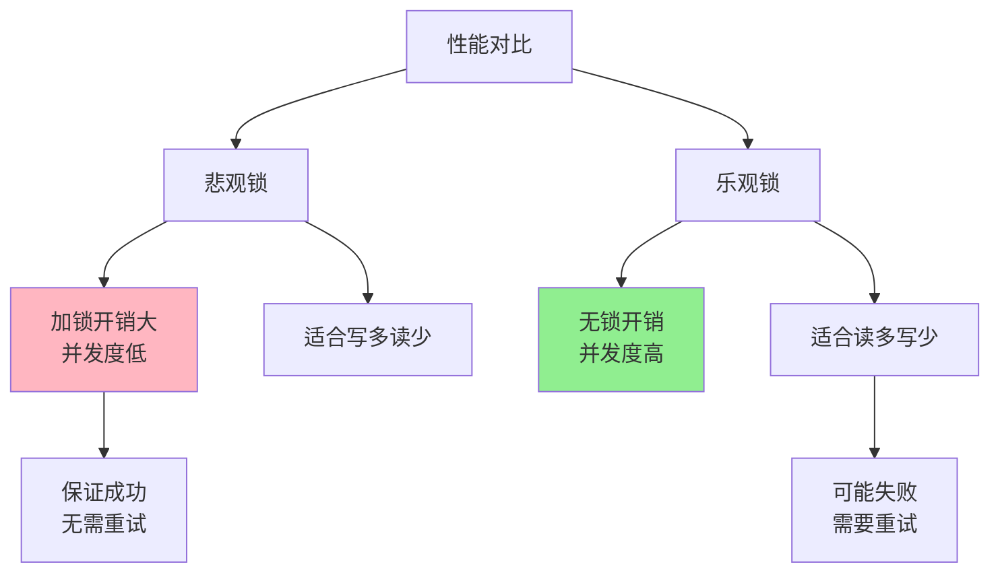
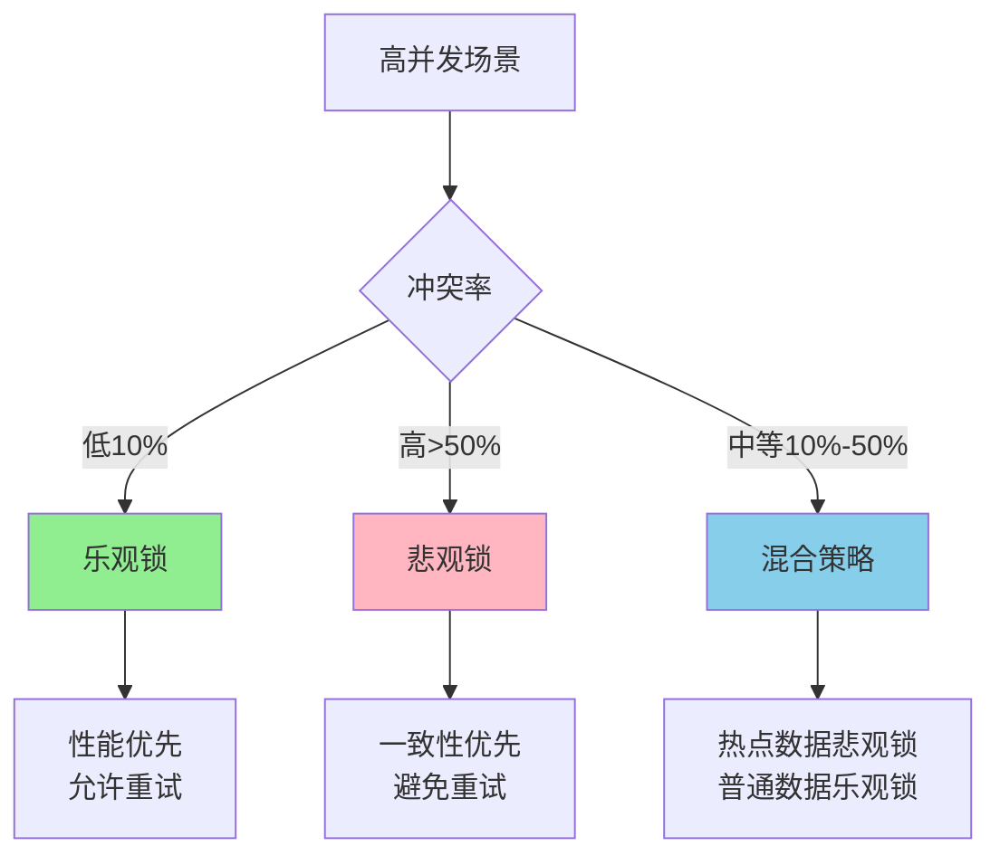

# MySQL乐观锁与悲观锁实战

## 并发控制的两种思想

在多用户并发访问数据库时,需要采用适当的并发控制策略来保证数据的一致性。从并发控制的思想角度,可以分为两大类:乐观并发控制和悲观并发控制。

这两种思想反映了对并发冲突的不同态度:
- **悲观锁**: 认为并发冲突经常发生,因此先加锁再操作
- **乐观锁**: 认为并发冲突很少发生,因此先操作再检查冲突



## 悲观锁机制

### 悲观锁的原理

悲观锁(Pessimistic Concurrency Control, PCC)是一种"先取锁再访问"的保守策略。它假设数据被并发修改的概率较大,因此在访问数据前先加锁,确保在整个操作过程中数据不会被其他事务修改。



### MySQL中的悲观锁实现

在MySQL的InnoDB引擎中,悲观锁通过数据库的锁机制实现,主要使用 `SELECT ... FOR UPDATE` 语句。

**基本语法:**

```sql
-- 关闭自动提交(重要!)
SET autocommit = 0;

-- 开始事务
BEGIN;

-- 查询并加锁
SELECT * FROM table_name WHERE condition FOR UPDATE;

-- 执行业务逻辑
UPDATE table_name SET column = value WHERE condition;

-- 提交事务(释放锁)
COMMIT;
```

### 悲观锁实战示例

**场景1: 电商库存扣减**

```sql
-- 商品库存表
CREATE TABLE product_stock (
    product_id BIGINT PRIMARY KEY,
    product_name VARCHAR(100),
    available_quantity INT,
    reserved_quantity INT,
    update_time DATETIME
);

-- 初始化数据
INSERT INTO product_stock VALUES 
(2001, 'iPhone 15 Pro', 100, 0, NOW());

-- 用户下单流程(悲观锁实现)
BEGIN;

-- 1. 先加排他锁查询库存
SELECT product_id, available_quantity 
FROM product_stock 
WHERE product_id = 2001 FOR UPDATE;

-- 假设查询结果: available_quantity = 100

-- 2. 检查库存是否充足
-- 如果库存不足,回滚事务
-- 如果库存充足,扣减库存

-- 3. 扣减库存
UPDATE product_stock 
SET available_quantity = available_quantity - 1,
    reserved_quantity = reserved_quantity + 1,
    update_time = NOW()
WHERE product_id = 2001;

-- 4. 创建订单(省略订单创建逻辑)

-- 5. 提交事务
COMMIT;
```

在这个流程中:
- `FOR UPDATE` 对 `product_id = 2001` 的记录加排他锁
- 其他事务无法同时修改这条记录
- 保证了在高并发下库存扣减的准确性



**场景2: 银行转账操作**

```sql
-- 账户表
CREATE TABLE bank_account (
    account_id BIGINT PRIMARY KEY,
    account_name VARCHAR(50),
    balance DECIMAL(15,2),
    version INT,
    update_time DATETIME
);

-- 初始化账户数据
INSERT INTO bank_account VALUES 
(10001, 'Alice', 5000.00, 1, NOW()),
(10002, 'Bob', 3000.00, 1, NOW());

-- 转账操作: Alice向Bob转账1000元
BEGIN;

-- 1. 锁定转出账户
SELECT account_id, balance 
FROM bank_account 
WHERE account_id = 10001 FOR UPDATE;

-- 2. 锁定转入账户  
SELECT account_id, balance 
FROM bank_account 
WHERE account_id = 10002 FOR UPDATE;

-- 3. 检查余额是否充足
-- 假设balance = 5000,充足

-- 4. 扣减转出账户余额
UPDATE bank_account 
SET balance = balance - 1000.00,
    update_time = NOW()
WHERE account_id = 10001;

-- 5. 增加转入账户余额
UPDATE bank_account 
SET balance = balance + 1000.00,
    update_time = NOW()
WHERE account_id = 10002;

-- 6. 记录转账日志(省略)

-- 7. 提交事务
COMMIT;
```

### 悲观锁的注意事项

**1. 锁的粒度控制**

```sql
-- ❌ 不推荐: 条件未使用索引,可能锁表
UPDATE product_stock 
SET available_quantity = available_quantity - 1
WHERE product_name = 'iPhone 15 Pro';  -- 如果product_name无索引

-- ✅ 推荐: 使用主键或索引,精确锁行
UPDATE product_stock 
SET available_quantity = available_quantity - 1
WHERE product_id = 2001;  -- product_id是主键
```

**2. 避免死锁**

死锁的产生通常因为不同事务以不同顺序获取锁:

```sql
-- 事务A
BEGIN;
SELECT * FROM bank_account WHERE account_id = 10001 FOR UPDATE;
SELECT * FROM bank_account WHERE account_id = 10002 FOR UPDATE;

-- 事务B(同时执行)
BEGIN;
SELECT * FROM bank_account WHERE account_id = 10002 FOR UPDATE;  -- 与A相反
SELECT * FROM bank_account WHERE account_id = 10001 FOR UPDATE;
-- 可能产生死锁!
```

**解决方案: 统一加锁顺序**

```sql
-- 无论转账方向,都按account_id升序加锁
BEGIN;
SELECT * FROM bank_account 
WHERE account_id IN (10001, 10002) 
ORDER BY account_id FOR UPDATE;
-- 统一的顺序避免死锁
```

**3. 控制事务时间**

```sql
-- ❌ 不推荐: 事务中包含耗时操作
BEGIN;
SELECT * FROM product_stock WHERE product_id = 2001 FOR UPDATE;
-- 调用外部API(耗时)
-- 复杂业务计算(耗时)
UPDATE product_stock SET available_quantity = available_quantity - 1 
WHERE product_id = 2001;
COMMIT;

-- ✅ 推荐: 先完成业务逻辑,再开启事务
-- 1. 先查询数据(不加锁)
SELECT * FROM product_stock WHERE product_id = 2001;

-- 2. 完成业务逻辑计算

-- 3. 开启事务并快速完成更新
BEGIN;
SELECT * FROM product_stock WHERE product_id = 2001 FOR UPDATE;
UPDATE product_stock SET available_quantity = available_quantity - 1 
WHERE product_id = 2001;
COMMIT;
```

## 乐观锁机制

### 乐观锁的原理

乐观锁(Optimistic Locking)假设数据冲突很少发生,因此不在读取时加锁,而是在更新时检查数据是否被其他事务修改过。如果发现冲突,则放弃本次更新或重试。

乐观锁不依赖数据库的锁机制,而是通过版本号或时间戳等方式实现。



### 乐观锁的实现方式

**方式1: 版本号机制(推荐)**

```sql
-- 商品库存表(带版本号)
CREATE TABLE product_inventory (
    product_id BIGINT PRIMARY KEY,
    product_name VARCHAR(100),
    stock_quantity INT,
    version INT DEFAULT 0,
    update_time DATETIME
);

-- 初始化数据
INSERT INTO product_inventory VALUES 
(3001, 'MacBook Pro', 50, 0, NOW());
```

**乐观锁扣减库存流程:**

```sql
-- 步骤1: 查询商品库存和版本号(不加锁)
SELECT product_id, stock_quantity, version 
FROM product_inventory 
WHERE product_id = 3001;

-- 假设查询结果: stock_quantity = 50, version = 0

-- 步骤2: 在应用层进行业务逻辑处理
-- 检查库存是否充足等

-- 步骤3: 更新库存,同时检查版本号
UPDATE product_inventory 
SET stock_quantity = stock_quantity - 1,
    version = version + 1,
    update_time = NOW()
WHERE product_id = 3001 
  AND version = 0;  -- 关键:检查版本号是否仍然是0

-- 步骤4: 检查更新结果
-- 如果affected_rows = 1,说明更新成功
-- 如果affected_rows = 0,说明版本号已变化,更新失败,需要重试
```

**Java代码示例:**

```java
public boolean decreaseStock(Long productId, int quantity) {
    // 最多重试3次
    int maxRetry = 3;
    for (int i = 0; i < maxRetry; i++) {
        // 1. 查询当前库存和版本号
        ProductInventory product = inventoryMapper.selectById(productId);
        
        // 2. 检查库存是否充足
        if (product.getStockQuantity() < quantity) {
            throw new BusinessException("库存不足");
        }
        
        // 3. 尝试更新,带版本号检查
        int rows = inventoryMapper.updateStock(
            productId, 
            quantity, 
            product.getVersion()
        );
        
        // 4. 如果更新成功,返回
        if (rows > 0) {
            return true;
        }
        
        // 5. 更新失败,短暂休眠后重试
        Thread.sleep(50);
    }
    
    throw new BusinessException("库存扣减失败,请重试");
}
```

**方式2: 时间戳机制**

```sql
-- 使用最后更新时间作为版本标识
CREATE TABLE order_status (
    order_id BIGINT PRIMARY KEY,
    status VARCHAR(20),
    last_update_time DATETIME(6),  -- 精确到微秒
    INDEX idx_update_time (last_update_time)
);

-- 查询订单状态
SELECT order_id, status, last_update_time 
FROM order_status 
WHERE order_id = 5001;

-- 假设查询结果: last_update_time = '2024-01-15 10:30:45.123456'

-- 更新订单状态,检查时间戳
UPDATE order_status 
SET status = 'shipped',
    last_update_time = NOW(6)
WHERE order_id = 5001 
  AND last_update_time = '2024-01-15 10:30:45.123456';
```

**方式3: 数据值比对**

```sql
-- 直接使用数据值进行CAS(Compare And Swap)
SELECT stock_quantity FROM product_inventory 
WHERE product_id = 3001;

-- 假设查询结果: stock_quantity = 50

-- 更新时检查数值是否仍然是50
UPDATE product_inventory 
SET stock_quantity = 49,
    update_time = NOW()
WHERE product_id = 3001 
  AND stock_quantity = 50;
```

### 乐观锁实战场景

**场景1: 秒杀系统库存扣减**

```sql
-- 秒杀商品表
CREATE TABLE flash_sale_product (
    sale_id BIGINT PRIMARY KEY,
    product_name VARCHAR(100),
    total_stock INT,
    sold_count INT DEFAULT 0,
    version INT DEFAULT 0
);

-- 初始化秒杀商品
INSERT INTO flash_sale_product VALUES 
(1001, '限量款球鞋', 100, 0, 0);

-- 秒杀抢购(乐观锁实现)
-- 1. 查询秒杀商品信息
SELECT sale_id, total_stock, sold_count, version 
FROM flash_sale_product 
WHERE sale_id = 1001;

-- 2. 应用层检查: 是否还有库存
-- if (sold_count >= total_stock) return "已售罄";

-- 3. 乐观锁更新
UPDATE flash_sale_product 
SET sold_count = sold_count + 1,
    version = version + 1
WHERE sale_id = 1001 
  AND version = ? 
  AND sold_count < total_stock;  -- 双重检查

-- 4. 判断更新结果
-- rows > 0: 抢购成功
-- rows = 0: 抢购失败(版本冲突或已售罄)
```



**场景2: 文章点赞功能**

```sql
-- 文章统计表
CREATE TABLE article_stats (
    article_id BIGINT PRIMARY KEY,
    view_count INT DEFAULT 0,
    like_count INT DEFAULT 0,
    version INT DEFAULT 0
);

-- 增加点赞数(乐观锁)
UPDATE article_stats 
SET like_count = like_count + 1,
    version = version + 1
WHERE article_id = ? 
  AND version = ?;

-- 点赞失败时的重试策略
-- 1. 重新查询最新版本号
-- 2. 再次尝试更新
-- 3. 如果多次失败,可以考虑放入消息队列异步处理
```

### 乐观锁的注意事项

**1. 合理设置重试策略**

```java
// ❌ 不推荐: 无限重试可能导致性能问题
while (true) {
    if (updateWithOptimisticLock()) {
        break;
    }
}

// ✅ 推荐: 限制重试次数
int maxRetry = 3;
for (int i = 0; i < maxRetry; i++) {
    if (updateWithOptimisticLock()) {
        return true;
    }
    Thread.sleep(50);  // 短暂休眠
}
return false;  // 超过重试次数,返回失败
```

**2. 乐观锁并非完全无锁**

虽然乐观锁在读取时不加锁,但UPDATE语句本身仍然会加锁:

```sql
-- UPDATE语句执行时仍然会加行级锁
UPDATE product_inventory 
SET stock_quantity = stock_quantity - 1,
    version = version + 1
WHERE product_id = 3001 AND version = 10;

-- 执行过程:
-- 1. WHERE条件定位记录(可能产生间隙锁、临键锁)
-- 2. 对符合条件的记录加排他锁
-- 3. 执行更新
-- 4. 事务提交,释放锁
```



**乐观锁的优势在于:**
- 读取时不加锁,不阻塞其他事务
- 只在更新时加短暂的锁
- 整体锁持有时间远短于悲观锁

**3. 版本号字段设计**

```sql
-- ✅ 推荐: 使用INT类型,自动递增
version INT DEFAULT 0

-- ❌ 不推荐: 使用TIMESTAMP,可能精度不够
-- 高并发下同一毫秒内多个更新可能导致ABA问题

-- ✅ 可选: 使用BIGINT,适用于超高并发场景
version BIGINT DEFAULT 0
```

## 乐观锁 vs 悲观锁

### 性能对比



| 对比维度 | 悲观锁 | 乐观锁 |
|---------|--------|--------|
| **并发性能** | 较低,阻塞等待 | 较高,无阻塞 |
| **实现方式** | 数据库锁机制 | 版本号/时间戳 |
| **锁持有时间** | 长(整个事务期间) | 短(仅更新时) |
| **冲突处理** | 排队等待 | 更新失败,重试 |
| **适用场景** | 写操作频繁 | 读操作频繁 |
| **数据一致性** | 强一致性 | 最终一致性 |

### 适用场景选择

**使用悲观锁的场景:**

1. **写冲突频繁**: 多个事务经常修改同一数据
2. **重试代价高**: 业务逻辑复杂,重试成本高
3. **强一致性要求**: 必须保证数据实时一致

```sql
-- 示例: 银行转账(必须保证强一致性)
BEGIN;
SELECT balance FROM bank_account 
WHERE account_id = 10001 FOR UPDATE;
-- 业务逻辑
UPDATE bank_account SET balance = balance - 1000 
WHERE account_id = 10001;
COMMIT;
```

**使用乐观锁的场景:**

1. **读多写少**: 查询操作远多于更新操作
2. **冲突概率低**: 并发更新同一数据的概率小
3. **追求高并发**: 需要更高的系统吞吐量

```sql
-- 示例: 文章浏览计数(允许短暂不一致)
UPDATE article_stats 
SET view_count = view_count + 1,
    version = version + 1
WHERE article_id = 101 AND version = 5;
```

### 混合使用策略

在实际项目中,可以根据不同的业务场景灵活选择:

```java
public class InventoryService {
    
    // 秒杀场景: 使用乐观锁(高并发)
    public boolean flashSaleDecrease(Long productId) {
        return optimisticLockUpdate(productId);
    }
    
    // 普通下单: 使用悲观锁(保证准确)
    public boolean normalOrderDecrease(Long productId) {
        return pessimisticLockUpdate(productId);
    }
    
    // 库存盘点: 使用悲观锁(避免冲突)
    public boolean inventoryCheck(Long productId) {
        return pessimisticLockUpdate(productId);
    }
}
```

## 高并发场景的选择策略

### 场景分析



**冲突率评估公式:**

```
冲突率 = (失败的更新次数 / 总更新次数) × 100%
```

- 冲突率 < 10%: 优先使用乐观锁
- 冲突率 10%-50%: 考虑混合策略或分段锁
- 冲突率 > 50%: 使用悲观锁更合适

### 优化建议

**1. 减少锁的粒度**

```sql
-- ❌ 不推荐: 锁定整个订单
SELECT * FROM orders WHERE order_id = 1001 FOR UPDATE;

-- ✅ 推荐: 只锁定需要修改的字段相关行
SELECT order_id, status FROM orders 
WHERE order_id = 1001 FOR UPDATE;
```

**2. 缩短锁的时间**

```java
// ❌ 不推荐: 锁内执行耗时操作
public void processOrder(Long orderId) {
    // 开启事务
    Order order = orderDao.selectForUpdate(orderId);
    
    // 调用外部服务(耗时)
    paymentService.pay(order);
    
    // 更新订单
    orderDao.update(order);
}

// ✅ 推荐: 先完成耗时操作,再加锁更新
public void processOrder(Long orderId) {
    // 1. 先查询数据(不加锁)
    Order order = orderDao.selectById(orderId);
    
    // 2. 执行耗时操作
    PaymentResult result = paymentService.pay(order);
    
    // 3. 快速更新(乐观锁)
    orderDao.updateWithVersion(order);
}
```

**3. 分段锁策略**

对于超高并发场景,可以将数据分段,减少竞争:

```sql
-- 传统方式: 单行库存记录
CREATE TABLE product_stock (
    product_id BIGINT PRIMARY KEY,
    stock INT
);

-- 优化方式: 分段库存记录
CREATE TABLE product_stock_segment (
    product_id BIGINT,
    segment_id INT,
    stock INT,
    PRIMARY KEY (product_id, segment_id)
);

-- 插入10个分段
INSERT INTO product_stock_segment VALUES 
(2001, 1, 10), (2001, 2, 10), (2001, 3, 10), ...
-- 总库存 = 所有分段之和

-- 扣减时随机选择一个分段
UPDATE product_stock_segment 
SET stock = stock - 1
WHERE product_id = 2001 
  AND segment_id = FLOOR(RAND() * 10) + 1
  AND stock > 0;
```

## 小结

本文详细介绍了MySQL中乐观锁和悲观锁的原理与实践:

**悲观锁:**
- 通过 `SELECT ... FOR UPDATE` 实现
- 适合写冲突频繁的场景
- 保证强一致性,但并发度较低
- 需要注意死锁和锁粒度控制

**乐观锁:**
- 通过版本号或时间戳实现
- 适合读多写少的场景  
- 并发度高,但可能需要重试
- UPDATE时仍然会加锁,只是时间很短

**选择建议:**
- 根据业务特点和冲突率选择合适的策略
- 可以在同一系统中混合使用两种锁
- 通过分段、分库等手段降低锁冲突
- 始终关注性能监控,根据实际情况调优

在实际开发中,没有绝对好或坏的方案,只有更适合当前业务场景的方案。理解两种锁的特点,根据具体情况灵活选择,才能设计出高性能、高可用的系统。
