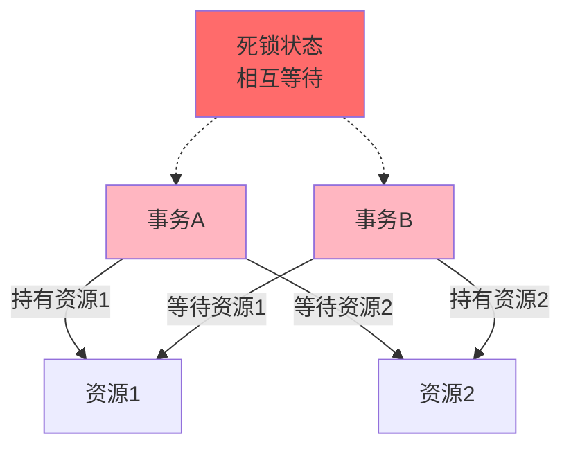
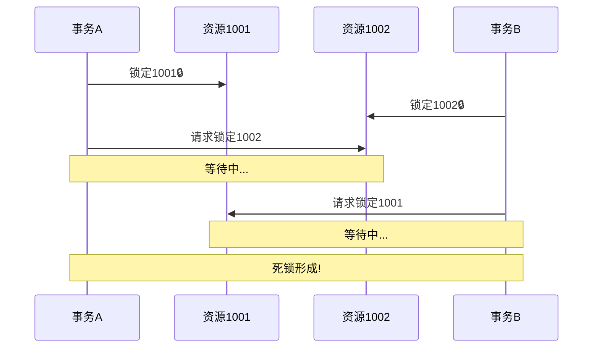
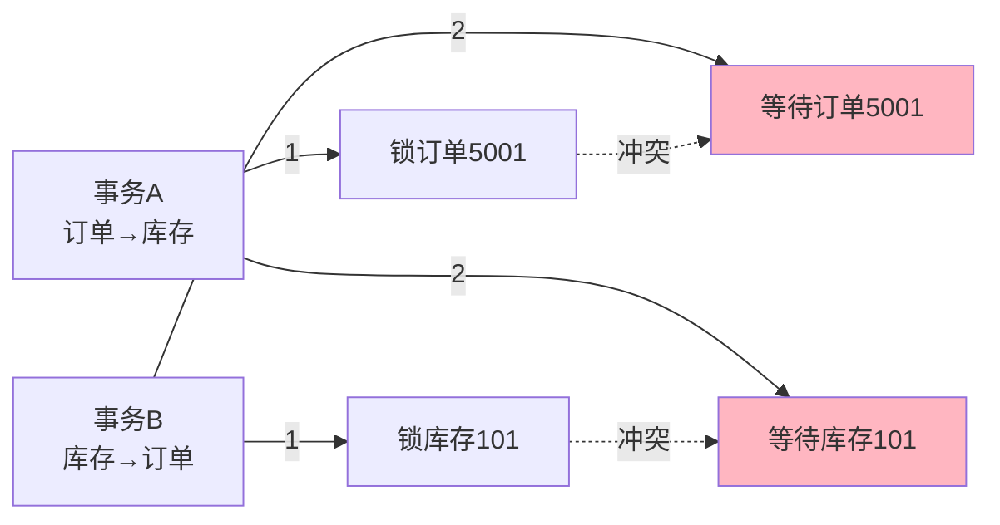
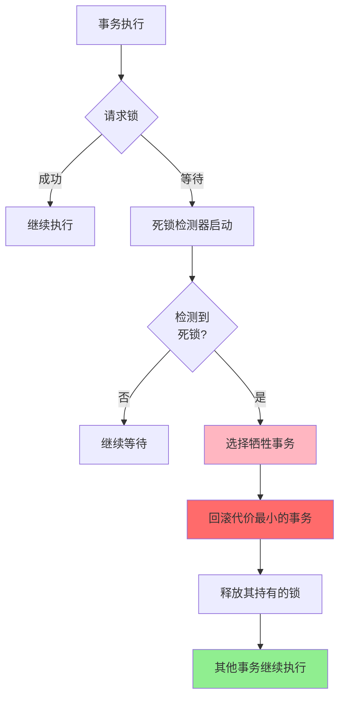
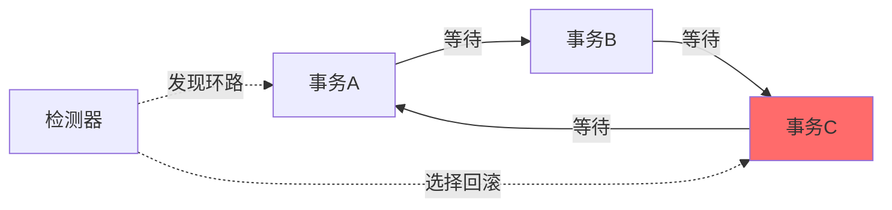
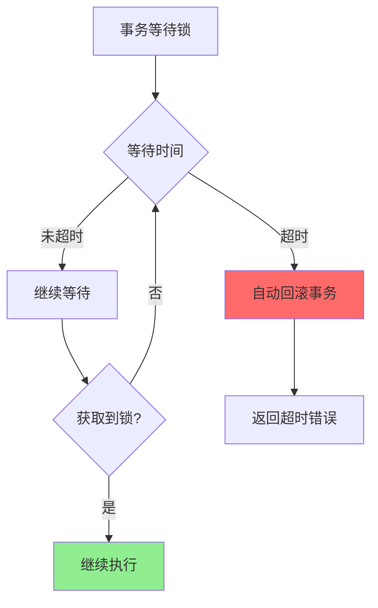
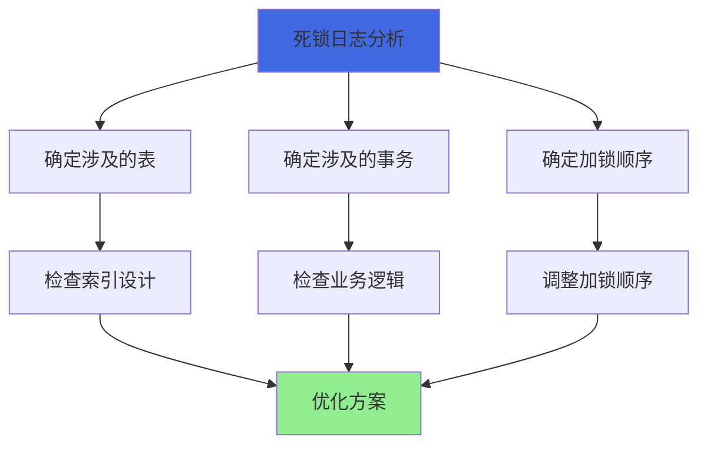
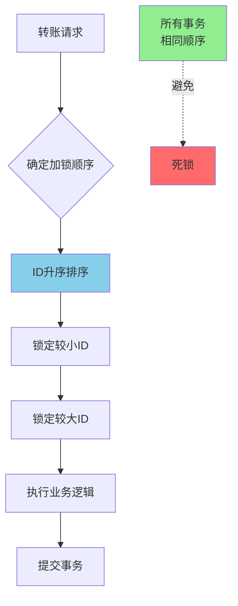
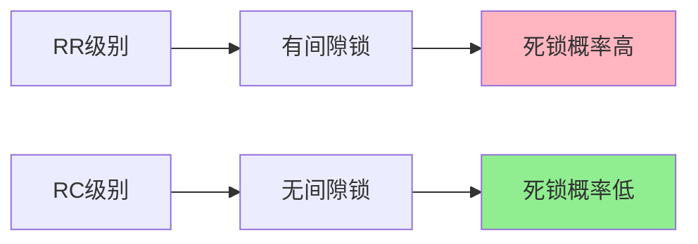
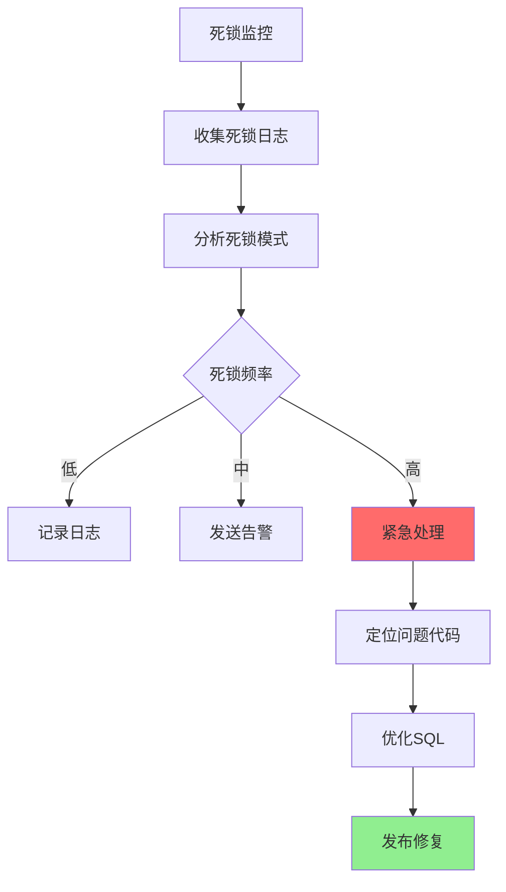

# MySQL死锁问题分析与解决

## 什么是数据库死锁

### 死锁的定义

数据库死锁是指两个或多个事务在执行过程中,因争夺资源而造成的一种相互等待的现象。若无外力干预,这些事务都将无法继续执行下去,形成永久阻塞。



### 死锁的经典示例

```sql
-- 创建测试表
CREATE TABLE account_balance (
    account_id INT PRIMARY KEY,
    account_name VARCHAR(50),
    balance DECIMAL(10,2)
);

INSERT INTO account_balance VALUES 
(1001, 'Alice', 5000.00),
(1002, 'Bob', 3000.00);

-- 时间线: 会话A和会话B并发执行

-- T1时刻: 会话A开始事务
-- 会话A:
BEGIN;
UPDATE account_balance SET balance = balance - 100 
WHERE account_id = 1001;
-- 会话A持有account_id=1001的锁

-- T2时刻: 会话B开始事务
-- 会话B:
BEGIN;
UPDATE account_balance SET balance = balance - 100 
WHERE account_id = 1002;
-- 会话B持有account_id=1002的锁

-- T3时刻: 会话A尝试锁定account_id=1002
-- 会话A:
UPDATE account_balance SET balance = balance + 100 
WHERE account_id = 1002;
-- 会话A等待会话B释放account_id=1002的锁

-- T4时刻: 会话B尝试锁定account_id=1001
-- 会话B:
UPDATE account_balance SET balance = balance + 100 
WHERE account_id = 1001;
-- 会话B等待会话A释放account_id=1001的锁

-- 此时形成死锁:
-- 会话A持有1001,等待1002
-- 会话B持有1002,等待1001
```



## 死锁产生的原因

### 1. 资源竞争与请求顺序不一致

最常见的死锁原因是多个事务以不同的顺序请求相同的资源。

```sql
-- 场景: 订单系统中同时更新订单和库存

-- 事务A: 先更新订单,后更新库存
BEGIN;
UPDATE orders SET status = 'paid' WHERE order_id = 5001;  -- 锁定订单5001
UPDATE inventory SET stock = stock - 1 WHERE product_id = 101;  -- 等待库存锁

-- 事务B: 先更新库存,后更新订单
BEGIN;
UPDATE inventory SET stock = stock - 1 WHERE product_id = 101;  -- 锁定库存101
UPDATE orders SET status = 'paid' WHERE order_id = 5001;  -- 等待订单锁

-- 死锁!
```



### 2. 未及时释放资源

事务在持有锁的同时执行耗时操作,延长了锁的持有时间,增加了死锁概率。

```sql
-- ❌ 问题代码: 锁内执行耗时操作
BEGIN;
SELECT * FROM user_wallet WHERE user_id = 10001 FOR UPDATE;

-- 调用外部支付接口(耗时10秒)
-- 在这10秒内一直持有锁

UPDATE user_wallet SET balance = balance - 100 WHERE user_id = 10001;
COMMIT;
```

### 3. 不同事务执行速度差异

当一个事务执行速度很慢时,会长时间持有锁,导致其他事务等待超时或产生死锁。

```sql
-- 事务A: 快速事务
BEGIN;
UPDATE product_info SET price = 99.99 WHERE product_id = 201;
COMMIT;  -- 1秒内完成

-- 事务B: 慢速事务
BEGIN;
UPDATE product_info SET price = 199.99 WHERE product_id = 201;
-- 大量复杂计算...
-- 持有锁的时间过长
COMMIT;  -- 需要30秒
```

### 4. 操作数据量过大

在持有锁的同时请求更多的锁,增加了锁冲突的概率。

```sql
-- 大批量更新容易产生死锁
BEGIN;
UPDATE order_items SET status = 'processed' 
WHERE order_id IN (
    SELECT order_id FROM orders WHERE create_date < '2024-01-01'
);
-- 可能锁定成千上万行,增加死锁概率
```

### 5. 间隙锁和临键锁引起的死锁

在RR隔离级别下,间隙锁和临键锁可能导致意外的死锁。

```sql
-- 表中存在记录: id = 10, 20, 30

-- 事务A
BEGIN;
SELECT * FROM test_table WHERE id = 15 FOR UPDATE;
-- 产生间隙锁(10, 20)

-- 事务B  
BEGIN;
SELECT * FROM test_table WHERE id = 18 FOR UPDATE;
-- 尝试获取间隙锁(10, 20),与A的间隙锁兼容,成功

-- 事务A
INSERT INTO test_table VALUES (15, 'data');
-- 尝试插入,被B的间隙锁阻塞

-- 事务B
INSERT INTO test_table VALUES (18, 'data');
-- 尝试插入,被A的间隙锁阻塞

-- 死锁!
```

## 死锁的自动检测与处理

### MySQL的死锁检测机制

MySQL InnoDB引擎内置了死锁检测机制,可以自动检测和处理死锁。

**开启死锁检测:**

```sql
-- 查看死锁检测配置
SHOW VARIABLES LIKE 'innodb_deadlock_detect';

-- 开启死锁检测(默认开启)
SET GLOBAL innodb_deadlock_detect = ON;
```



### 死锁检测的工作原理

InnoDB通过**等待图(Wait-for Graph)**算法检测死锁:

1. 构建等待图,节点代表事务,边代表等待关系
2. 检测图中是否存在环路
3. 如果存在环路,说明发生了死锁
4. 选择一个事务进行回滚,打破环路



### 牺牲事务的选择标准

InnoDB在检测到死锁时,会选择一个事务进行回滚,选择标准是:
- 回滚代价最小的事务(修改行数最少的事务)
- 事务的权重(通过 `innodb_lock_wait_timeout` 考虑)

```sql
-- 示例: 两个事务死锁
-- 事务A: 修改了100行数据
-- 事务B: 修改了5行数据
-- InnoDB会选择回滚事务B,因为代价更小
```

### 锁等待超时机制

除了主动检测,MySQL还提供了超时机制:

```sql
-- 查看锁等待超时时间(秒)
SHOW VARIABLES LIKE 'innodb_lock_wait_timeout';

-- 设置超时时间为30秒
SET SESSION innodb_lock_wait_timeout = 30;

-- 设置全局超时时间
SET GLOBAL innodb_lock_wait_timeout = 30;
```

当事务等待锁的时间超过超时时间时,会自动回滚并返回错误:

```
ERROR 1205 (HY000): Lock wait timeout exceeded; try restarting transaction
```



## 如何排查死锁

### 查看死锁日志

MySQL会记录最近一次死锁的详细信息:

```sql
-- 查看最近的死锁信息
SHOW ENGINE INNODB STATUS;
```

输出示例:

```
------------------------
LATEST DETECTED DEADLOCK
------------------------
2024-01-15 10:30:45 0x7f8e5c7fa700
*** (1) TRANSACTION:
TRANSACTION 421234, ACTIVE 5 sec starting index read
mysql tables in use 1, locked 1
LOCK WAIT 3 lock struct(s), heap size 1136, 2 row lock(s)
MySQL thread id 10, OS thread handle 140245678901248, query id 156 localhost root updating
UPDATE account_balance SET balance = balance + 100 WHERE account_id = 1002

*** (1) WAITING FOR THIS LOCK TO BE GRANTED:
RECORD LOCKS space id 58 page no 3 n bits 72 index PRIMARY of table `test`.`account_balance` 
trx id 421234 lock_mode X locks rec but not gap waiting

*** (2) TRANSACTION:
TRANSACTION 421235, ACTIVE 3 sec starting index read
mysql tables in use 1, locked 1
4 lock struct(s), heap size 1136, 3 row lock(s)
MySQL thread id 11, OS thread handle 140245679234816, query id 157 localhost root updating
UPDATE account_balance SET balance = balance + 100 WHERE account_id = 1001

*** (2) HOLDS THE LOCK(S):
RECORD LOCKS space id 58 page no 3 n bits 72 index PRIMARY of table `test`.`account_balance` 
trx id 421235 lock_mode X locks rec but not gap

*** (2) WAITING FOR THIS LOCK TO BE GRANTED:
RECORD LOCKS space id 58 page no 3 n bits 72 index PRIMARY of table `test`.`account_balance` 
trx id 421235 lock_mode X locks rec but not gap waiting

*** WE ROLL BACK TRANSACTION (1)
```

### 分析死锁日志

从日志中可以获取:

1. **死锁发生时间**: `2024-01-15 10:30:45`
2. **涉及的事务**: TRANSACTION 421234 和 421235
3. **持有的锁**: 每个事务持有哪些锁
4. **等待的锁**: 每个事务等待哪些锁
5. **执行的SQL**: 导致死锁的具体语句
6. **回滚决策**: 选择回滚哪个事务



### 开启死锁日志记录

```sql
-- 开启慢查询日志记录死锁
SET GLOBAL slow_query_log = ON;
SET GLOBAL long_query_time = 0;
SET GLOBAL log_queries_not_using_indexes = ON;

-- 或者在my.cnf中配置
[mysqld]
innodb_print_all_deadlocks = 1
```

## 避免死锁的方法

### 1. 固定资源访问顺序

确保所有事务以相同的顺序访问资源,这是避免死锁最有效的方法。

```sql
-- ❌ 容易死锁: 不同事务以不同顺序访问
-- 事务A: 先账户1001,后账户1002
-- 事务B: 先账户1002,后账户1001

-- ✅ 避免死锁: 统一按account_id升序访问
BEGIN;
-- 无论转账方向,都按ID升序锁定
SELECT * FROM account_balance 
WHERE account_id IN (1001, 1002) 
ORDER BY account_id ASC 
FOR UPDATE;

-- 执行转账逻辑
UPDATE account_balance SET balance = balance - 100 WHERE account_id = 1001;
UPDATE account_balance SET balance = balance + 100 WHERE account_id = 1002;

COMMIT;
```

**Java代码示例:**

```java
public void transfer(Long fromAccount, Long toAccount, BigDecimal amount) {
    // 确保总是按照ID升序加锁
    Long firstId = Math.min(fromAccount, toAccount);
    Long secondId = Math.max(fromAccount, toAccount);
    
    // 先锁定ID较小的账户
    Account first = accountDao.selectForUpdate(firstId);
    // 再锁定ID较大的账户
    Account second = accountDao.selectForUpdate(secondId);
    
    // 执行转账逻辑
    if (fromAccount.equals(firstId)) {
        first.setBalance(first.getBalance().subtract(amount));
        second.setBalance(second.getBalance().add(amount));
    } else {
        second.setBalance(second.getBalance().subtract(amount));
        first.setBalance(first.getBalance().add(amount));
    }
    
    accountDao.update(first);
    accountDao.update(second);
}
```



### 2. 减少锁的数量和粒度

通过使用RC隔离级别避免间隙锁和临键锁。

```sql
-- 查看当前隔离级别
SELECT @@transaction_isolation;

-- 设置为READ COMMITTED
SET SESSION TRANSACTION ISOLATION LEVEL READ COMMITTED;

-- 在RC级别下,不会产生间隙锁
BEGIN;
SELECT * FROM orders WHERE order_id > 1000 AND order_id < 2000 FOR UPDATE;
-- 只锁定存在的记录,不锁间隙
COMMIT;
```

**隔离级别对比:**

| 隔离级别 | 间隙锁 | 死锁概率 | 并发性能 |
|---------|--------|---------|---------|
| RR | 有 | 较高 | 较低 |
| RC | 无 | 较低 | 较高 |



### 3. 缩短事务持有锁的时间

优化事务逻辑,减少锁的持有时间。

```sql
-- ❌ 不推荐: 锁内执行耗时操作
BEGIN;
SELECT * FROM order_info WHERE order_id = 5001 FOR UPDATE;

-- 调用外部服务(耗时)
-- 复杂计算(耗时)
-- 文件IO操作(耗时)

UPDATE order_info SET status = 'paid' WHERE order_id = 5001;
COMMIT;

-- ✅ 推荐: 先完成耗时操作,再快速加锁更新
-- 1. 先查询数据(不加锁)
SELECT * FROM order_info WHERE order_id = 5001;

-- 2. 执行耗时操作
-- 调用外部服务
-- 复杂计算

-- 3. 快速更新
BEGIN;
UPDATE order_info SET status = 'paid' WHERE order_id = 5001;
COMMIT;
```

**时间对比:**

```mermaid
gantt
    title 锁持有时间对比
    dateFormat  s
    section 不推荐
    加锁     :done, lock1, 0, 1s
    耗时操作  :active, work1, 1s, 10s
    更新     :done, update1, 11s, 1s
    释放锁   :crit, unlock1, 12s, 0s
    
    section 推荐
    查询(无锁) :done, query2, 0, 1s
    耗时操作  :done, work2, 1s, 10s
    加锁更新  :active, update2, 11s, 1s
    释放锁   :crit, unlock2, 12s, 0s
```

### 4. 减少操作的数据量

将大批量操作拆分成小批次,减少单次事务锁定的行数。

```sql
-- ❌ 不推荐: 一次性更新大量数据
UPDATE order_archive SET is_archived = 1 
WHERE create_time < '2023-01-01';
-- 可能锁定数十万行,容易死锁

-- ✅ 推荐: 分批更新
-- 方式1: 使用LIMIT分批
UPDATE order_archive SET is_archived = 1 
WHERE create_time < '2023-01-01' 
LIMIT 1000;
-- 重复执行直到affected_rows = 0

-- 方式2: 按主键范围分批
UPDATE order_archive SET is_archived = 1 
WHERE order_id BETWEEN 1 AND 10000 
  AND create_time < '2023-01-01';
  
UPDATE order_archive SET is_archived = 1 
WHERE order_id BETWEEN 10001 AND 20000 
  AND create_time < '2023-01-01';
-- 继续...
```

**Java代码示例:**

```java
public int batchArchiveOrders(Date beforeDate) {
    int totalUpdated = 0;
    int batchSize = 1000;
    
    while (true) {
        int updated = orderDao.archiveOrders(beforeDate, batchSize);
        totalUpdated += updated;
        
        if (updated < batchSize) {
            break;  // 已经更新完所有数据
        }
        
        // 短暂休眠,释放资源
        Thread.sleep(100);
    }
    
    return totalUpdated;
}
```

### 5. 使用合适的索引

确保WHERE条件使用索引,避免全表扫描导致的大范围加锁。

```sql
-- ❌ 不推荐: 无索引全表扫描
UPDATE product_catalog SET status = 'active' 
WHERE product_name LIKE '%Phone%';
-- 全表扫描,锁定大量行

-- ✅ 推荐: 使用索引精确定位
CREATE INDEX idx_category ON product_catalog(category_id);

UPDATE product_catalog SET status = 'active' 
WHERE category_id = 101;
-- 通过索引快速定位,只锁定必要的行
```

### 6. 为事务添加重试机制

```java
@Service
public class OrderService {
    
    private static final int MAX_RETRY = 3;
    
    public void processOrder(Long orderId) {
        int retryCount = 0;
        
        while (retryCount < MAX_RETRY) {
            try {
                processOrderInternal(orderId);
                return;  // 成功则返回
                
            } catch (DeadlockLoserDataAccessException e) {
                retryCount++;
                
                if (retryCount >= MAX_RETRY) {
                    throw new BusinessException("处理订单失败,请稍后重试");
                }
                
                // 随机休眠,避免重试时再次冲突
                Thread.sleep(new Random().nextInt(100));
            }
        }
    }
    
    @Transactional
    private void processOrderInternal(Long orderId) {
        // 业务逻辑
    }
}
```

## 死锁处理最佳实践

### 1. 监控和告警

建立死锁监控体系:

```sql
-- 定期检查死锁情况
SELECT 
    COUNT(*) as deadlock_count,
    DATE(create_time) as deadlock_date
FROM mysql.innodb_deadlock_log
WHERE create_time > DATE_SUB(NOW(), INTERVAL 7 DAY)
GROUP BY DATE(create_time);
```



### 2. 业务层面的优化

```java
// 1. 使用分布式锁避免数据库死锁
@Service
public class InventoryService {
    
    @Autowired
    private RedisLock redisLock;
    
    public boolean decreaseStock(Long productId, int quantity) {
        String lockKey = "stock:" + productId;
        
        try {
            // 先获取分布式锁
            if (redisLock.tryLock(lockKey, 5, TimeUnit.SECONDS)) {
                // 再操作数据库,避免多个请求同时竞争数据库锁
                return decreaseStockInternal(productId, quantity);
            }
        } finally {
            redisLock.unlock(lockKey);
        }
        
        return false;
    }
}

// 2. 使用消息队列串行化处理
@Service  
public class OrderService {
    
    @Autowired
    private MessageQueue messageQueue;
    
    public void createOrder(Order order) {
        // 将订单发送到消息队列
        messageQueue.send("order.create", order);
        // 异步处理,避免并发冲突
    }
}
```

### 3. 数据库配置优化

```ini
# my.cnf配置建议

[mysqld]
# 1. 开启死锁检测(默认开启)
innodb_deadlock_detect = ON

# 2. 设置合理的锁等待超时时间
innodb_lock_wait_timeout = 10

# 3. 记录所有死锁到错误日志
innodb_print_all_deadlocks = 1

# 4. 根据业务选择隔离级别
# transaction-isolation = READ-COMMITTED

# 5. 调整缓冲池大小,减少IO等待
innodb_buffer_pool_size = 8G

# 6. 增加并发线程数
innodb_thread_concurrency = 0
```

## 常见死锁场景及解决方案

### 场景1: 订单-库存死锁

```sql
-- 问题代码:
-- 事务A: 创建订单 → 扣减库存
-- 事务B: 扣减库存 → 更新订单

-- 解决方案: 统一操作顺序
BEGIN;
-- 1. 先操作库存
UPDATE inventory SET stock = stock - 1 WHERE product_id = 101;

-- 2. 再创建订单
INSERT INTO orders (order_id, product_id) VALUES (5001, 101);

COMMIT;
```

### 场景2: 唯一索引冲突死锁

```sql
-- 问题: 并发插入相同唯一键值
-- 事务A: INSERT ... ON DUPLICATE KEY UPDATE
-- 事务B: INSERT ... ON DUPLICATE KEY UPDATE

-- 解决方案1: 使用REPLACE INTO
REPLACE INTO user_profile (user_id, nickname) 
VALUES (10001, 'alice');

-- 解决方案2: 先查询再插入/更新
SELECT user_id FROM user_profile WHERE user_id = 10001 FOR UPDATE;
-- 如果存在UPDATE,不存在INSERT
```

### 场景3: 间隙锁死锁

```sql
-- 问题: RR级别下的间隙锁冲突

-- 解决方案1: 改用RC隔离级别
SET SESSION TRANSACTION ISOLATION LEVEL READ COMMITTED;

-- 解决方案2: 使用主键查询避免间隙锁
SELECT * FROM orders WHERE order_id = 5001 FOR UPDATE;
-- 主键等值查询不会产生间隙锁
```

## 小结

本文全面介绍了MySQL死锁的原因、检测、处理和预防:

**死锁产生的原因:**
- 资源竞争且请求顺序不一致
- 未及时释放资源
- 执行速度差异大
- 操作数据量过大
- 间隙锁和临键锁的使用

**死锁的处理机制:**
- InnoDB自动死锁检测(默认开启)
- 选择代价最小的事务回滚
- 锁等待超时机制

**避免死锁的方法:**
1. 固定资源访问顺序(最重要)
2. 减少锁的数量(使用RC隔离级别)
3. 缩短锁的持有时间
4. 减少操作的数据量(分批处理)
5. 使用合适的索引
6. 添加重试机制

**最佳实践:**
- 建立监控和告警机制
- 业务层面使用分布式锁或消息队列
- 优化数据库配置参数
- 定期分析死锁日志,持续优化

在实际开发中,死锁往往是设计不当或并发控制不合理导致的。通过合理的设计、规范的编码以及完善的监控,可以有效避免和解决死锁问题,提升系统的稳定性和性能。
