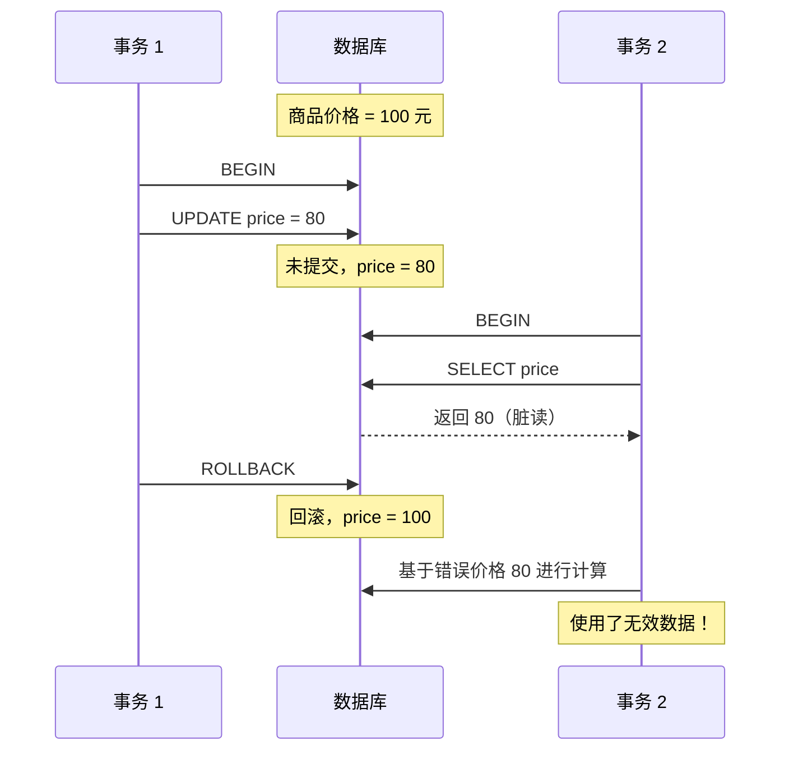
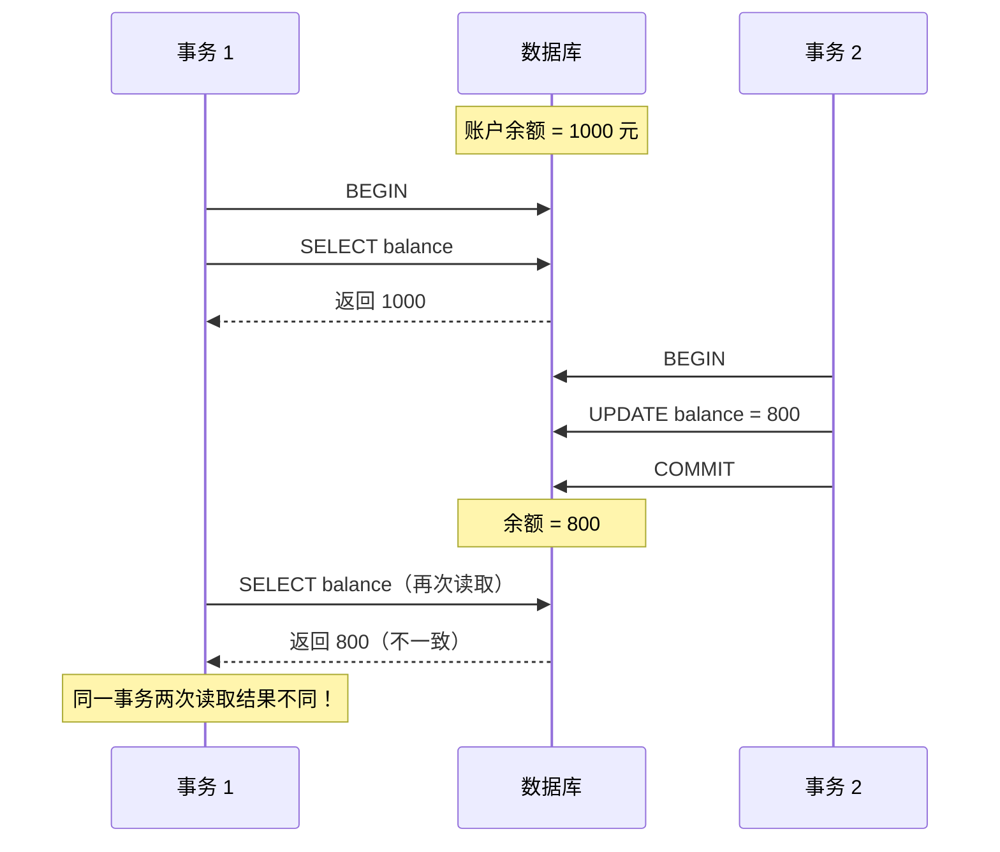
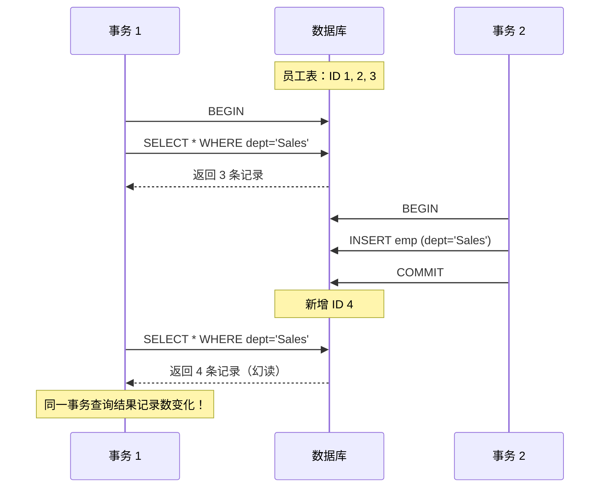
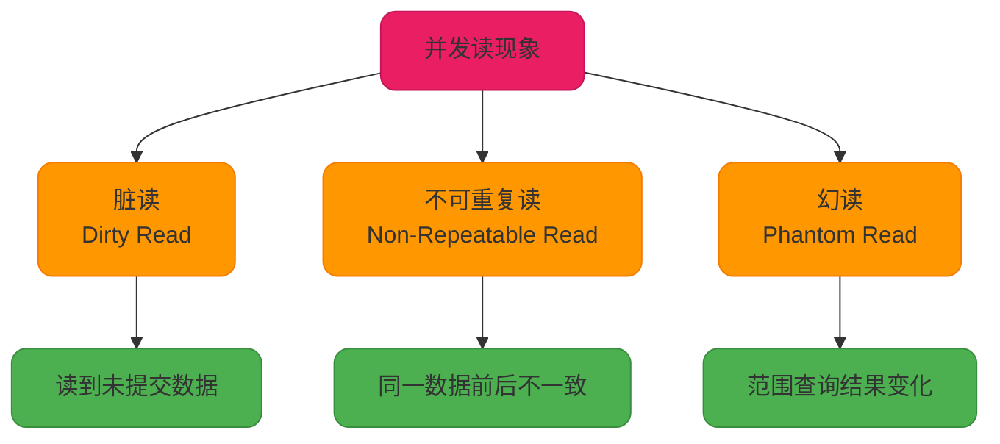
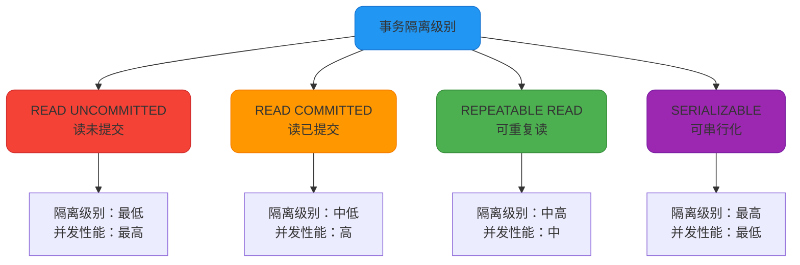

# MySQL事务隔离级别详解

## 事务并发带来的读现象

在数据库系统中，多个事务并发执行是常态。然而，如果没有适当的隔离机制，并发事务可能会导致以下几种异常读现象。

### 脏读（Dirty Read）

**定义：** 脏读是指一个事务读取到了另一个事务尚未提交的数据。

当事务 T1 修改了某个数据但还没有提交时,事务 T2 读取了这个被修改但未提交的数据。如果 T1 随后回滚了操作，那么 T2 读取到的就是无效数据（"脏"数据）。



**示例场景：**

假设商城正在处理订单：

```sql
-- 事务 1：商家修改商品价格
BEGIN;
UPDATE product_price SET price = 80 WHERE product_id = 3001;
-- 此时价格已修改但未提交

-- 事务 2：用户查询商品价格
BEGIN;
SELECT price FROM product_price WHERE product_id = 3001;
-- 读取到 80 元（脏数据）

-- 事务 1：发现修改错误，回滚
ROLLBACK;  -- 价格恢复为 100 元

-- 事务 2：基于 80 元创建订单
INSERT INTO orders (product_id, price) VALUES (3001, 80);
COMMIT;
-- 订单使用了错误的价格！
```

### 不可重复读（Non-Repeatable Read）

**定义：** 不可重复读是指在同一个事务内，多次读取同一数据返回的结果不一致。

在事务 T1 的执行过程中，对同一行数据进行了两次读取。在两次读取之间，事务 T2 修改了该行数据并提交，导致 T1 前后两次读取的结果不同。



**示例场景：**

```sql
-- 事务 1：查询用户账户余额进行风控检查
BEGIN;
SELECT balance FROM user_account WHERE user_id = 5001;
-- 第一次查询：余额 = 1000 元

-- 事务 2：用户发起提现
BEGIN;
UPDATE user_account SET balance = balance - 200 WHERE user_id = 5001;
COMMIT;
-- 余额更新为 800 元

-- 事务 1：再次查询余额
SELECT balance FROM user_account WHERE user_id = 5001;
-- 第二次查询：余额 = 800 元

-- 风控系统逻辑混乱：同一个事务中两次读取结果不同
COMMIT;
```

### 幻读（Phantom Read）

**定义：** 幻读是指在同一个事务内，多次执行相同的范围查询，返回的记录数不一致。

事务 T1 对某个范围的数据进行查询，事务 T2 在这个范围内插入或删除了新记录并提交，导致 T1 再次执行相同查询时，发现多了或少了一些记录，就像出现了"幻觉"。



**示例场景：**

```sql
-- 事务 1：统计销售部门员工并发放奖金
BEGIN;
SELECT COUNT(*) FROM employee WHERE department = 'Sales';
-- 第一次查询：3 个员工

-- 事务 2：HR 新增一个销售人员
BEGIN;
INSERT INTO employee (name, department, salary) 
VALUES ('张三', 'Sales', 8000);
COMMIT;

-- 事务 1：再次统计发放奖金
SELECT * FROM employee WHERE department = 'Sales' FOR UPDATE;
-- 第二次查询：4 个员工（多了一条记录）

-- 预算计算错误：计划给 3 人发奖金，实际需要给 4 人
UPDATE employee SET bonus = 5000 WHERE department = 'Sales';
COMMIT;
```

### 三种读现象的区别总结

| **读现象** | **操作类型** | **核心问题** |
|---|---|---|
| **脏读** | 读取未提交数据 | 读到了其他事务未提交的修改 |
| **不可重复读** | UPDATE/DELETE | 同一数据多次读取结果不同 |
| **幻读** | INSERT | 范围查询记录数发生变化 |



## 事务隔离级别

为了解决上述并发读现象，SQL-92 标准定义了四种事务隔离级别，用于平衡数据一致性和系统并发性能。

事务隔离级别定义了**事务之间的可见性和相互影响程度**。一般来说，隔离级别越高，数据一致性越好，但并发性能可能越低。

### 四种隔离级别



#### 1. READ UNCOMMITTED（读未提交）

**特点：** 最低的隔离级别，允许事务读取其他事务未提交的数据变更。

在这种隔离级别下，一个事务可以看到其他事务尚未提交的修改。这会导致脏读、不可重复读和幻读问题。实际应用中很少使用，因为数据一致性保障太弱。

```sql
-- 设置隔离级别
SET SESSION TRANSACTION ISOLATION LEVEL READ UNCOMMITTED;
```

#### 2. READ COMMITTED（读已提交）

**特点：** 允许事务读取其他事务已提交的数据，可以避免脏读，但不可重复读和幻读仍可能发生。

这是大多数数据库（如 Oracle、SQL Server）的默认隔离级别。在这个级别下，事务只能读取到其他事务已经提交的数据版本。

```sql
SET SESSION TRANSACTION ISOLATION LEVEL READ COMMITTED;
```

#### 3. REPEATABLE READ（可重复读）

**特点：** 保证在同一事务中多次读取相同数据的结果一致，可以阻止脏读和不可重复读，但幻读仍可能发生（SQL-92 标准定义）。

这是 **MySQL InnoDB 存储引擎的默认隔离级别**。InnoDB 通过 MVCC（多版本并发控制）和 Next-Key Locks（间隙锁 + 行锁）在很大程度上解决了幻读问题。

```sql
SET SESSION TRANSACTION ISOLATION LEVEL REPEATABLE READ;
```

#### 4. SERIALIZABLE（可串行化）

**特点：** 最高的隔离级别，完全遵守 ACID 的隔离性。所有事务依次逐个执行，完全避免脏读、不可重复读和幻读。

在这个级别下，事务串行执行，虽然数据一致性最好，但并发性能最差。

```sql
SET SESSION TRANSACTION ISOLATION LEVEL SERIALIZABLE;
```

### 隔离级别与读现象对照表

| **隔离级别** | **脏读** | **不可重复读** | **幻读** |
|---|---|---|---|
| **READ UNCOMMITTED** | ✓ 可能 | ✓ 可能 | ✓ 可能 |
| **READ COMMITTED** | ✗ 不可能 | ✓ 可能 | ✓ 可能 |
| **REPEATABLE READ** | ✗ 不可能 | ✗ 不可能 | ✓ 可能（SQL 标准）<br/>≈ 不可能（InnoDB） |
| **SERIALIZABLE** | ✗ 不可能 | ✗ 不可能 | ✗ 不可能 |

**注意：** InnoDB 在 REPEATABLE READ 级别下，通过 MVCC + Next-Key Lock 很大程度上避免了幻读，但在某些特定场景下仍可能发生。

## MySQL 隔离级别相关操作

### 查看当前隔离级别

MySQL InnoDB 默认使用 **REPEATABLE READ** 隔离级别。

```sql
-- MySQL 8.0 之前
SELECT @@tx_isolation;

-- MySQL 8.0 及之后
SELECT @@transaction_isolation;

-- 查看系统全局隔离级别
SELECT @@global.transaction_isolation;
```

**执行结果：**

```plaintext
+-------------------------+
| @@transaction_isolation |
+-------------------------+
| REPEATABLE-READ         |
+-------------------------+
```

### 设置隔离级别

```sql
-- 设置当前会话的隔离级别
SET SESSION TRANSACTION ISOLATION LEVEL READ COMMITTED;

-- 设置全局隔离级别（影响所有新连接）
SET GLOBAL TRANSACTION ISOLATION LEVEL REPEATABLE READ;

-- 仅对下一个事务设置隔离级别
SET TRANSACTION ISOLATION LEVEL SERIALIZABLE;
```

### 事务控制语句

```sql
-- 开启事务
START TRANSACTION;  -- 或者使用 BEGIN

-- 提交事务
COMMIT;

-- 回滚事务
ROLLBACK;

-- 关闭自动提交（默认开启）
SET autocommit = 0;
```

## InnoDB 的 REPEATABLE READ 优化

虽然 SQL-92 标准定义 REPEATABLE READ 无法完全防止幻读，但 InnoDB 通过以下机制实现了更强的隔离保障：

### 快照读（Snapshot Read）

普通的 SELECT 语句使用快照读，通过 **MVCC** 机制实现：

```sql
-- 快照读示例
SELECT * FROM orders WHERE customer_id = 1001;
```

事务启动时创建数据快照（ReadView），后续的快照读都基于这个版本，从而避免看到其他事务的新插入或修改。

### 当前读（Current Read）

带锁的查询和写操作使用当前读，通过 **Next-Key Lock** 防止幻读：

```sql
-- 当前读示例
SELECT * FROM orders WHERE customer_id = 1001 FOR UPDATE;
SELECT * FROM orders WHERE customer_id = 1001 LOCK IN SHARE MODE;

UPDATE orders SET status = 'SHIPPED' WHERE customer_id = 1001;
DELETE FROM orders WHERE customer_id = 1001;
INSERT INTO orders (customer_id, amount) VALUES (1001, 500);
```

InnoDB 使用 Next-Key Lock（行锁 + 间隙锁）锁定扫描到的索引记录及其间的范围，防止其他事务在这个范围内插入新记录。

**性能对比：**

虽然通常认为隔离级别越高并发性越差，但 InnoDB 通过 MVCC 优化了 REPEATABLE READ 级别。对于只读或读多写少的场景，RR 的性能与 RC 相比可能没有显著差异。

## 总结

事务隔离级别是平衡数据一致性和并发性能的关键机制：

- **READ UNCOMMITTED**：性能最好，但数据一致性无保障，几乎不使用
- **READ COMMITTED**：避免脏读，适合对一致性要求不高的场景
- **REPEATABLE READ**：MySQL 默认级别，通过 MVCC + 锁机制提供较好的一致性
- **SERIALIZABLE**：完全串行化，保证最强一致性，但性能最差

在实际应用中，应根据业务需求选择合适的隔离级别，并理解其底层实现机制，才能设计出高性能、高可靠的数据库应用。
