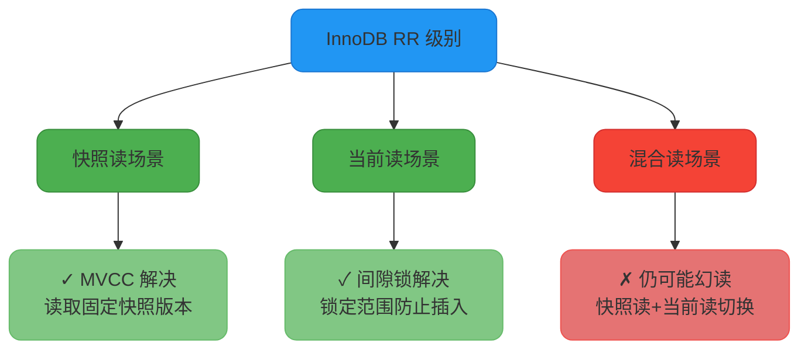
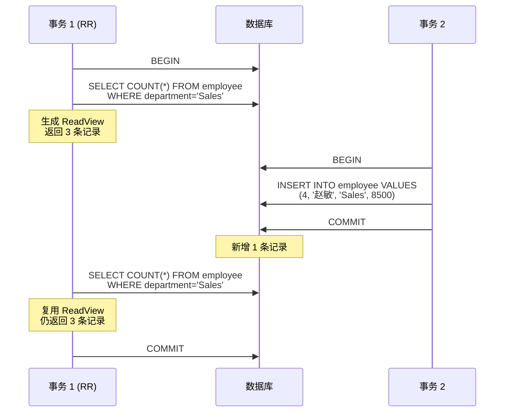
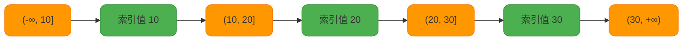
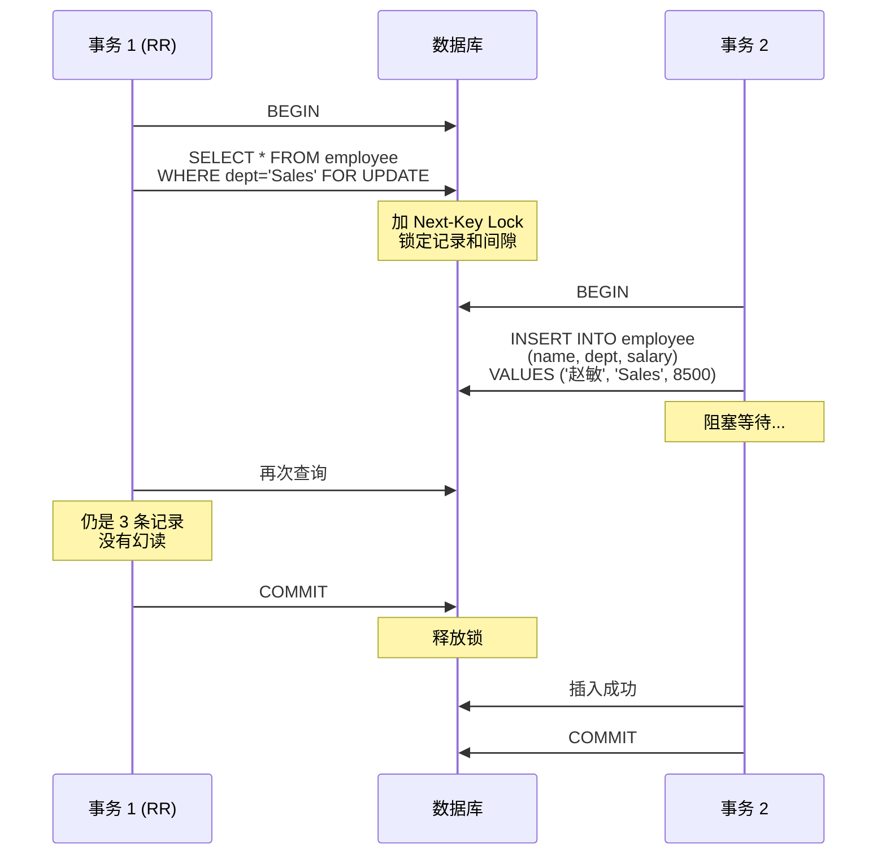
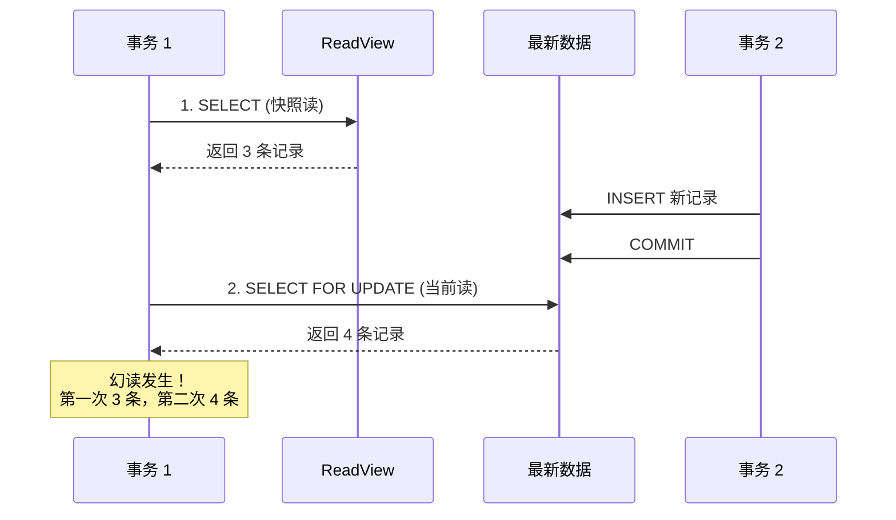
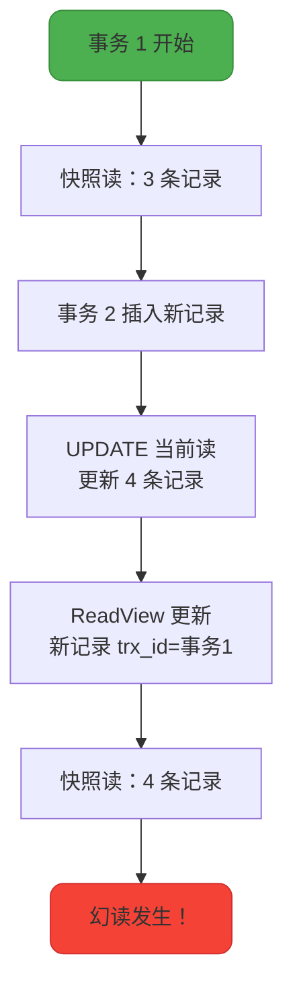

# MySQL幻读问题深度剖析

## InnoDB 的 RR 级别能否完全避免幻读

在 MySQL InnoDB 存储引擎中，REPEATABLE READ（可重复读）是默认的事务隔离级别。虽然 SQL-92 标准定义 RR 级别无法防止幻读，但 InnoDB 通过 **MVCC + 间隙锁** 的组合，在大部分场景下能够避免幻读的发生。

然而，这并不意味着 RR 级别完全解决了幻读问题。在某些特定场景下，幻读依然会发生。

### 核心结论

**InnoDB 的 RR 级别：**
- ✓ 通过 **MVCC** 解决了快照读场景下的幻读
- ✓ 通过 **间隙锁** 解决了部分当前读场景下的幻读
- ✗ **无法完全避免所有幻读**，在混合使用快照读和当前读时仍可能发生

要彻底解决幻读，只能使用 **SERIALIZABLE** 隔离级别。



## MVCC 如何解决快照读的幻读

快照读是指普通的 SELECT 语句（不加锁），在 RR 级别下通过 MVCC 机制实现。

### 快照读工作原理

在 RR 隔离级别下：
- 事务**第一次执行 SELECT** 时生成 ReadView
- 后续所有快照读都复用这个 ReadView
- 只能读取在 ReadView 创建时已存在的数据版本

**示例场景：**

创建测试表：

```sql
CREATE TABLE employee (
    id INT PRIMARY KEY AUTO_INCREMENT,
    name VARCHAR(50),
    department VARCHAR(50),
    salary DECIMAL(10, 2)
) ENGINE=InnoDB;

INSERT INTO employee (name, department, salary) VALUES
('李明', 'Sales', 8000),
('王芳', 'Sales', 9000),
('张伟', 'Sales', 7500);
```

**事务时序：**



**实际操作演示：**

```sql
-- 设置隔离级别
SET SESSION TRANSACTION ISOLATION LEVEL REPEATABLE READ;

-- 事务 1
BEGIN;
SELECT * FROM employee WHERE department = 'Sales';
-- 返回 3 条记录：李明、王芳、张伟

-- 事务 2（在另一个会话中）
BEGIN;
INSERT INTO employee (name, department, salary) 
VALUES ('赵敏', 'Sales', 8500);
COMMIT;

-- 事务 1：再次查询
SELECT * FROM employee WHERE department = 'Sales';
-- 仍然返回 3 条记录（不包括赵敏）
-- 没有发生幻读！

COMMIT;
```

**原理解释：**

事务 1 第一次查询时生成 ReadView，包含当前活跃事务列表。事务 2 插入新记录时，新记录的 `trx_id` 大于事务 1 的 ReadView 范围，因此对事务 1 不可见。

## 间隙锁如何解决当前读的幻读

当前读是指加锁的 SELECT 或写操作（UPDATE、DELETE、INSERT），需要读取最新版本的数据。

### 间隙锁工作原理

在 RR 级别下，当前读会使用 **Next-Key Lock（记录锁 + 间隙锁）** 锁定查询范围：

- **Record Lock**：锁定已存在的索引记录
- **Gap Lock**：锁定索引记录之间的间隙，防止其他事务插入新记录



**示例场景：**

假设员工表有索引 `(department, salary)`，当前数据：

| id | name | department | salary |
|---|---|---|---|
| 1 | 李明 | Sales | 8000 |
| 2 | 王芳 | Sales | 9000 |
| 3 | 张伟 | Sales | 7500 |

```sql
-- 事务 1（RR 级别）
BEGIN;
SELECT * FROM employee 
WHERE department = 'Sales' AND salary > 7000 
FOR UPDATE;
-- 锁定范围：
-- 1. Record Lock: 锁定 id=1,2,3 的记录
-- 2. Gap Lock: 锁定 salary 在 (7000, +∞) 的间隙

-- 事务 2：尝试插入新销售人员
INSERT INTO employee (name, department, salary) 
VALUES ('赵敏', 'Sales', 8500);
-- 阻塞！因为 salary=8500 在锁定的间隙内

-- 事务 2：尝试插入其他部门人员
INSERT INTO employee (name, department, salary) 
VALUES ('孙丽', 'Marketing', 8500);
-- 成功！department 不是 'Sales'，不在锁定范围
```

**事务时序图：**



**通过间隙锁，事务 1 成功避免了幻读。**

## RR 级别无法解决的幻读场景

尽管 MVCC 和间隙锁能解决大部分幻读问题，但在以下场景下，RR 级别仍可能发生幻读。

### 场景 1：快照读后执行当前读

当一个事务先进行快照读，然后在其他事务插入数据后执行当前读，就会发生幻读。

**问题原因：** 快照读和当前读使用不同的读取机制：
- 快照读：基于 ReadView 读取历史版本
- 当前读：读取最新版本并加锁

**示例演示：**

```sql
-- 事务 1
BEGIN;
-- 1. 快照读
SELECT * FROM employee WHERE department = 'Sales';
-- 返回 3 条记录

-- 事务 2（在另一个会话中）
BEGIN;
INSERT INTO employee (name, department, salary) 
VALUES ('赵敏', 'Sales', 8500);
COMMIT;

-- 事务 1
-- 2. 当前读（加锁查询）
SELECT * FROM employee WHERE department = 'Sales' FOR UPDATE;
-- 返回 4 条记录（包括赵敏）
-- 发生幻读！同一事务两次查询结果不同

COMMIT;
```

**时序图分析：**



### 场景 2：快照读后执行 UPDATE

如果事务先进行快照读，然后执行 UPDATE 操作（当前读），再进行快照读，也会发生幻读。

**问题原因：** UPDATE 是当前读操作，会更新事务的 ReadView，后续快照读会读到新版本。

**示例演示：**

```sql
-- 事务 1
BEGIN;
-- 1. 快照读
SELECT * FROM employee WHERE department = 'Sales';
-- 返回 3 条记录

-- 事务 2
BEGIN;
INSERT INTO employee (name, department, salary) 
VALUES ('赵敏', 'Sales', 8500);
COMMIT;

-- 事务 1
-- 2. 更新操作（当前读）
UPDATE employee SET salary = salary + 100 
WHERE department = 'Sales';
-- 更新了 4 条记录（包括赵敏）

-- 3. 快照读
SELECT * FROM employee WHERE department = 'Sales';
-- 返回 4 条记录（包括赵敏）
-- 发生幻读！第一次 3 条，第三次 4 条

COMMIT;
```

**原理解释：**

1. 第一次 SELECT：生成 ReadView，读取 3 条记录
2. 事务 2 插入新记录并提交
3. UPDATE 操作是当前读，能看到事务 2 插入的记录，并更新了这条记录
4. 由于事务 1 修改了新记录，该记录的 `trx_id` 变成了事务 1 的 ID
5. 第三次 SELECT：快照读时，新记录的 `trx_id` 是自己的事务 ID，因此可见



### 场景 3：间隙锁未及时加锁

如果事务开始时没有立即使用当前读加锁，而是先进行了快照读，那么间隙锁无法生效。

**示例演示：**

```sql
-- 事务 1
BEGIN;
-- 1. 快照读（未加锁）
SELECT * FROM employee WHERE department = 'Sales';
-- 此时没有加间隙锁

-- 事务 2
BEGIN;
INSERT INTO employee (name, department, salary) 
VALUES ('赵敏', 'Sales', 8500);
COMMIT;
-- 成功插入！因为事务 1 没有加间隙锁

-- 事务 1
-- 2. 当前读（加锁）
SELECT * FROM employee WHERE department = 'Sales' FOR UPDATE;
-- 返回 4 条记录（包括赵敏）
-- 发生幻读！

COMMIT;
```

**关键点：** 间隙锁只有在当前读时才会加锁。如果事务开始时使用快照读，就无法阻止其他事务插入新记录。

## 如何避免幻读

基于以上分析，在 InnoDB 的 RR 级别下避免幻读的方法：

### 方法 1：使用 SERIALIZABLE 隔离级别（彻底解决）

```sql
SET SESSION TRANSACTION ISOLATION LEVEL SERIALIZABLE;

BEGIN;
SELECT * FROM employee WHERE department = 'Sales';
-- 自动加共享锁，完全串行化
COMMIT;
```

**优点：** 彻底解决幻读
**缺点：** 性能最差，并发度极低

### 方法 2：在 RR 级别下优先使用快照读

```sql
BEGIN;
-- 只使用快照读
SELECT * FROM employee WHERE department = 'Sales';
SELECT * FROM employee WHERE department = 'Sales';
-- 两次查询结果一致，不会幻读
COMMIT;
```

**适用场景：** 只读事务或读多写少的场景

### 方法 3：在 RR 级别下事务开始时立即加锁

```sql
BEGIN;
-- 立即使用当前读加锁
SELECT * FROM employee WHERE department = 'Sales' FOR UPDATE;
-- 加上间隙锁，防止其他事务插入

-- 后续操作
UPDATE employee SET salary = salary + 100 
WHERE department = 'Sales';

COMMIT;
```

**关键：** 事务一开始就用 `FOR UPDATE` 或 `LOCK IN SHARE MODE` 加锁，启用间隙锁保护。

**注意：** 间隙锁可能导致死锁，需谨慎使用。

### 方法 4：避免在同一事务中混用快照读和当前读

```sql
-- 不推荐：混用快照读和当前读
BEGIN;
SELECT * FROM employee WHERE department = 'Sales';  -- 快照读
UPDATE employee SET salary = salary + 100 WHERE department = 'Sales';  -- 当前读
SELECT * FROM employee WHERE department = 'Sales';  -- 快照读
COMMIT;

-- 推荐：统一使用当前读
BEGIN;
SELECT * FROM employee WHERE department = 'Sales' FOR UPDATE;  -- 当前读
UPDATE employee SET salary = salary + 100 WHERE department = 'Sales';  -- 当前读
SELECT * FROM employee WHERE department = 'Sales' FOR UPDATE;  -- 当前读
COMMIT;
```

## 总结

InnoDB 的 RR 隔离级别对幻读的处理：

| **场景** | **是否解决幻读** | **机制** |
|---|---|---|
| 纯快照读 | ✓ 解决 | MVCC，ReadView 固定 |
| 纯当前读（事务开始立即加锁） | ✓ 解决 | 间隙锁防止插入 |
| 快照读 → 当前读 | ✗ 未解决 | ReadView 与最新数据不一致 |
| 快照读 → UPDATE → 快照读 | ✗ 未解决 | UPDATE 更新 ReadView |
| 快照读后其他事务插入 | ✗ 未解决 | 未及时加间隙锁 |

**实践建议：**

1. 对于只读查询，使用快照读，性能高且避免幻读
2. 对于需要修改的事务，开始时立即用 `FOR UPDATE` 加锁
3. 避免在同一事务中混用快照读和当前读
4. 如需彻底避免幻读，使用 SERIALIZABLE 级别（性能代价大）
5. 理解间隙锁的工作原理，避免死锁

幻读问题的根本在于并发事务的数据可见性。理解 MVCC 和锁机制的原理，能够帮助我们设计更可靠的事务逻辑。
