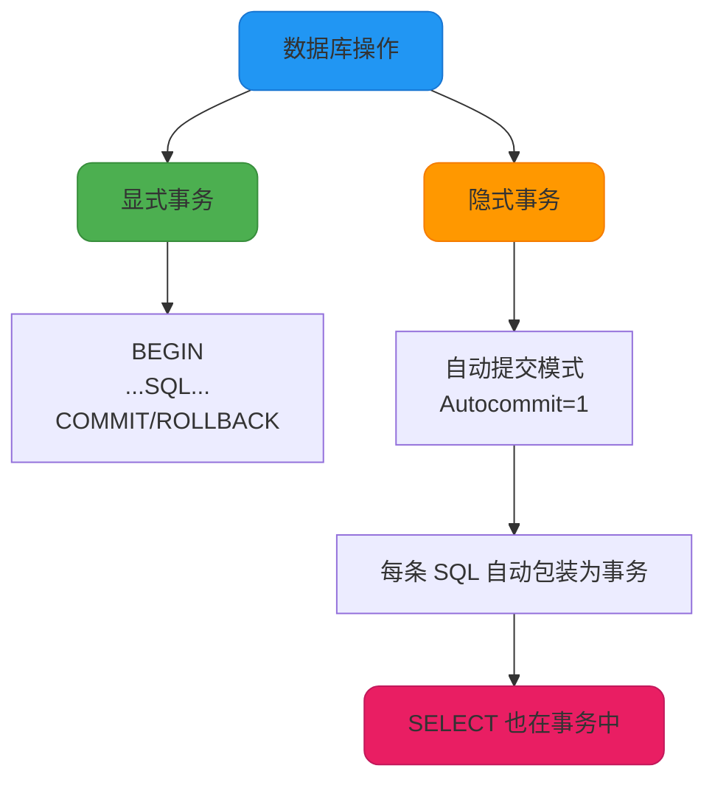
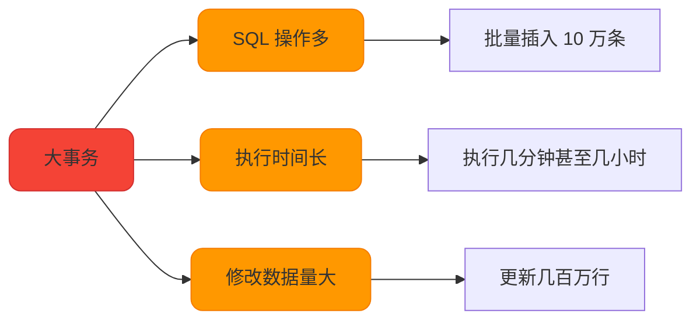
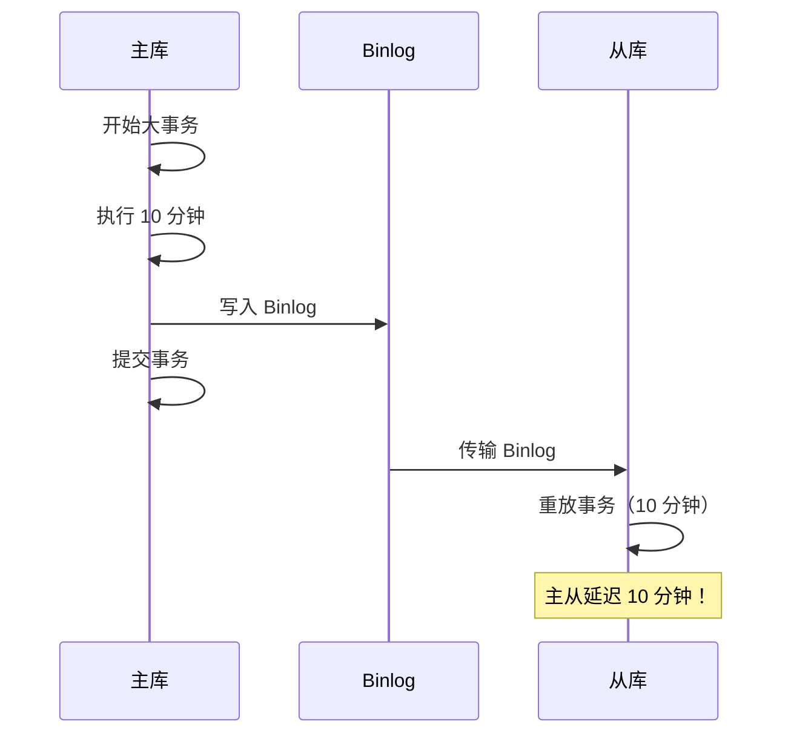

# MySQL事务优化实战

## SELECT 查询与事务的关系

很多开发者认为只有 INSERT、UPDATE、DELETE 等写操作才会使用事务，而 SELECT 查询不涉及事务。这个认识是不准确的。

### SELECT 也在事务中执行

在 InnoDB 存储引擎中，**所有的数据库操作都在事务的上下文中执行**，包括 SELECT 查询语句。即使没有显式开启事务，InnoDB 也会为每个查询自动创建一个隐式事务。



### 自动提交事务（Autocommit）

MySQL 默认开启了自动提交模式（`autocommit=1`），在这种模式下：

```sql
-- 查看自动提交状态
SHOW VARIABLES LIKE 'autocommit';
-- 返回：autocommit = ON

-- 执行查询
SELECT * FROM product_info WHERE product_id = 1001;
-- 等价于：
BEGIN;
SELECT * FROM product_info WHERE product_id = 1001;
COMMIT;
```

每条 SQL 语句自动被包装在一个事务中，执行完毕后立即提交。

### SELECT 在事务中的特点

虽然 SELECT 查询也在事务中执行，但它与写操作有明显区别：

| **特性** | **SELECT 查询** | **写操作（UPDATE/DELETE/INSERT）** |
|---|---|---|
| **是否修改数据** | 否 | 是 |
| **是否持有锁** | 快照读：否<br/>当前读：是（共享锁/排他锁） | 是（排他锁） |
| **事务提交后影响** | 无持久化影响 | 数据持久化保存 |
| **事务回滚影响** | 无影响 | 撤销所有修改 |

**示例对比：**

```sql
-- 查询操作
BEGIN;
SELECT balance FROM user_account WHERE user_id = 1001;
-- 快照读，不加锁，其他事务可以并发读写
COMMIT;
-- 提交后无任何持久化影响

-- 写操作
BEGIN;
UPDATE user_account SET balance = balance - 100 WHERE user_id = 1001;
-- 加排他锁，其他事务等待
COMMIT;
-- 提交后数据持久化
```

### SELECT 何时会持有锁

在以下情况下，SELECT 查询会加锁并影响并发：

#### 1. 使用 FOR UPDATE（排他锁）

```sql
BEGIN;
SELECT * FROM inventory WHERE product_id = 2001 FOR UPDATE;
-- 对查询结果加排他锁（X Lock）
-- 其他事务无法读取或修改这些记录（如果也是当前读）
COMMIT;
```

**应用场景：** 库存扣减、账户余额修改等需要先查询再更新的场景。

#### 2. 使用 LOCK IN SHARE MODE（共享锁）

```sql
BEGIN;
SELECT * FROM order_info WHERE order_id = 3001 LOCK IN SHARE MODE;
-- 对查询结果加共享锁（S Lock）
-- 其他事务可以读取但不能修改
COMMIT;
```

**应用场景：** 需要确保数据在事务期间不被修改，但允许其他事务读取。

#### 3. SERIALIZABLE 隔离级别

```sql
SET SESSION TRANSACTION ISOLATION LEVEL SERIALIZABLE;

BEGIN;
SELECT * FROM product WHERE category = 'Electronics';
-- 自动转换为：SELECT ... LOCK IN SHARE MODE
-- 所有 SELECT 都加共享锁
COMMIT;
```

### 显式事务 vs 自动提交

**关闭自动提交，使用显式事务：**

```sql
-- 关闭自动提交
SET autocommit = 0;

-- 多条 SQL 在同一事务中
SELECT * FROM orders WHERE customer_id = 1001;
SELECT * FROM order_items WHERE order_id = 5001;
-- 两条查询共享同一个 ReadView（RR 级别下）

COMMIT;  -- 手动提交
```

**开启自动提交（默认）：**

```sql
SET autocommit = 1;

-- 每条 SQL 独立事务
SELECT * FROM orders WHERE customer_id = 1001;  -- 事务 1
SELECT * FROM order_items WHERE order_id = 5001;  -- 事务 2
-- 两条查询使用不同的 ReadView
```

## 大事务的危害与优化

大事务（Long Transaction）是指包含大量 SQL 操作或执行时间很长的事务。大事务会对数据库性能和稳定性产生严重影响。

### 什么是大事务

**大事务的特征：**
- 事务中包含大量的 SQL 语句（如批量插入 10 万条数据）
- 事务执行时间很长（如持续几分钟甚至几小时）
- 事务修改的数据量很大（如更新几百万行记录）



### 大事务带来的问题

#### 1. 占用数据库连接

事务执行时间长，会长时间占用数据库连接。由于连接池大小有限，其他请求可能无法获取连接，导致系统响应变慢甚至超时。

```sql
-- 大事务示例
BEGIN;
-- 执行 10 万次插入，耗时 5 分钟
INSERT INTO log_table (user_id, action, created_at) VALUES (...);
-- 重复 100,000 次
COMMIT;
-- 连接被占用 5 分钟，其他请求等待
```

**影响：** 系统吞吐量下降，用户请求超时。

#### 2. 难以回滚

大事务涉及的数据量大，如果需要回滚，需要撤销所有修改，耗时极长。

```sql
BEGIN;
UPDATE user_account SET balance = balance + 100;  -- 更新 100 万行
-- 执行 10 分钟后发现错误
ROLLBACK;  -- 回滚可能需要 20 分钟！
```

**影响：** 回滚时间长，影响数据库可用性。

#### 3. 导致主从延迟

大事务在主库执行时间长，同步到从库时也需要执行很长时间，导致主从数据延迟。



**影响：** 从库数据滞后，读写分离场景下读取到旧数据。

#### 4. 锁竞争激烈

大事务通常需要锁定大量数据，其他并发事务访问这些数据时会被阻塞。

```sql
-- 事务 1：大事务
BEGIN;
UPDATE product SET status = 'ACTIVE' WHERE category = 'Electronics';
-- 锁定 10 万行，执行 5 分钟
-- ...
COMMIT;

-- 事务 2：被阻塞
UPDATE product SET price = 1000 WHERE product_id = 2001;
-- 等待事务 1 释放锁...
```

**影响：** 锁等待时间长，甚至触发死锁。

#### 5. 日志空间占用过大

大事务会生成大量的 Redo Log、Undo Log 和 Binlog，占用大量磁盘空间。

```sql
-- 大事务生成的日志
BEGIN;
INSERT INTO order_history SELECT * FROM orders WHERE created_at < '2023-01-01';
-- 插入 500 万行，Binlog 可能超过 5GB
COMMIT;
```

如果单个事务的 Binlog 超过 `max_binlog_cache_size`，会报错：

```plaintext
Multi-statement transaction required more than 'max_binlog_cache_size' bytes of storage
```

#### 6. 影响 MVCC 性能

大事务导致 Undo Log 中的旧版本长时间存在，影响 MVCC 的 Purge 操作，降低整体性能。

```sql
-- 长事务
BEGIN;
SELECT * FROM orders WHERE created_at > '2024-01-01';
-- 事务未提交，持续 1 小时

-- 期间其他事务的修改生成大量 Undo Log
-- Purge 线程无法清理，导致版本链过长
```

#### 7. 影响索引覆盖优化

长事务修改表时，可能导致其他事务的查询无法使用覆盖索引优化。

```sql
-- 事务 1：长事务修改表
BEGIN;
UPDATE user_info SET status = 'VIP' WHERE user_id < 10000;
-- 修改 1 万行，持续 10 分钟

-- 事务 2：查询受影响
SELECT user_id, name FROM user_info WHERE status = 'ACTIVE';
-- 无法使用覆盖索引，需要回表查询
```

### 大事务优化策略

#### 1. 拆分大事务

将一个大事务拆分为多个小事务，分批处理。

**优化前：**

```sql
BEGIN;
DELETE FROM log_table WHERE created_at < '2023-01-01';
-- 删除 100 万行，执行 10 分钟
COMMIT;
```

**优化后：**

```sql
-- 分批删除，每次 1000 行
SET @batch_size = 1000;

WHILE (SELECT COUNT(*) FROM log_table WHERE created_at < '2023-01-01') > 0 DO
    BEGIN;
    DELETE FROM log_table 
    WHERE created_at < '2023-01-01' 
    LIMIT @batch_size;
    COMMIT;
    
    -- 每批之间休息 100ms，释放锁
    SELECT SLEEP(0.1);
END WHILE;
```

**优点：**
- 每个小事务执行时间短，锁持有时间短
- 即使中途失败，已提交的数据不受影响
- 减少主从延迟

#### 2. 将非事务操作移出事务

事务中只保留必须原子执行的数据库操作，其他操作（如读取、计算、网络调用）移到事务外。

**优化前：**

```sql
BEGIN;
SELECT inventory FROM product WHERE product_id = 1001;  -- 读取库存
-- 业务逻辑计算（耗时 2 秒）
-- 调用第三方支付接口（耗时 5 秒）
UPDATE product SET inventory = inventory - 1 WHERE product_id = 1001;
INSERT INTO order_table (...) VALUES (...);
COMMIT;
-- 事务持续 7+ 秒
```

**优化后：**

```sql
-- 1. 事务外读取数据
SELECT inventory FROM product WHERE product_id = 1001;

-- 2. 事务外执行业务逻辑和网络调用
-- 计算逻辑（2 秒）
-- 调用支付接口（5 秒）

-- 3. 事务内只执行数据修改
BEGIN;
UPDATE product SET inventory = inventory - 1 WHERE product_id = 1001;
INSERT INTO order_table (...) VALUES (...);
COMMIT;
-- 事务持续 < 1 秒
```

#### 3. 使用批量操作替代循环操作

**优化前：**

```sql
BEGIN;
FOR i IN 1..10000 LOOP
    INSERT INTO user_points (user_id, points) VALUES (i, 100);
END LOOP;
COMMIT;
```

**优化后：**

```sql
BEGIN;
INSERT INTO user_points (user_id, points)
SELECT user_id, 100 FROM user WHERE user_id BETWEEN 1 AND 10000;
COMMIT;
-- 或使用批量插入
INSERT INTO user_points (user_id, points) VALUES
(1, 100), (2, 100), ..., (10000, 100);
```

#### 4. 避免在事务中执行慢查询

```sql
-- 不推荐
BEGIN;
SELECT * FROM orders WHERE created_at > '2020-01-01';  -- 慢查询，返回 100 万行
UPDATE user SET last_login = NOW() WHERE user_id = 1001;
COMMIT;

-- 推荐
BEGIN;
UPDATE user SET last_login = NOW() WHERE user_id = 1001;
COMMIT;
-- 慢查询移到事务外
SELECT * FROM orders WHERE created_at > '2020-01-01';
```

#### 5. 设置事务超时时间

```sql
-- 设置事务锁等待超时（默认 50 秒）
SET SESSION innodb_lock_wait_timeout = 10;

-- 设置事务执行超时（MySQL 5.7.8+）
SET SESSION max_execution_time = 30000;  -- 30 秒
```

#### 6. 监控和识别大事务

```sql
-- 查找执行时间超过 60 秒的事务
SELECT * FROM information_schema.INNODB_TRX 
WHERE TIMESTAMPDIFF(SECOND, trx_started, NOW()) > 60;

-- 查看当前活跃事务
SELECT trx_id, trx_state, trx_started, trx_rows_modified 
FROM information_schema.INNODB_TRX;
```

## 总结

### SELECT 与事务的关系

- InnoDB 中所有操作（包括 SELECT）都在事务中执行
- 快照读的 SELECT 不加锁，不影响并发
- 当前读的 SELECT（FOR UPDATE、LOCK IN SHARE MODE）会加锁
- 自动提交模式下，每条 SQL 独立成为一个事务

### 大事务的危害与优化

**大事务的 7 大危害：**

1. 占用数据库连接，降低吞吐量
2. 回滚耗时长，影响可用性
3. 导致主从延迟
4. 锁竞争激烈，引发死锁
5. 日志空间占用过大
6. 影响 MVCC 性能
7. 影响索引覆盖优化

**优化策略：**

1. ✓ 拆分为多个小事务
2. ✓ 非事务操作移出事务
3. ✓ 使用批量操作
4. ✓ 避免慢查询
5. ✓ 设置超时时间
6. ✓ 监控和识别大事务

在实际开发中，应该遵循"事务尽可能短小"的原则，只在必要时使用事务，并尽量减少事务的执行时间和涉及的数据量。
