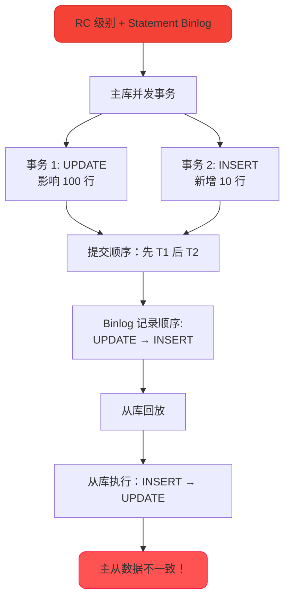
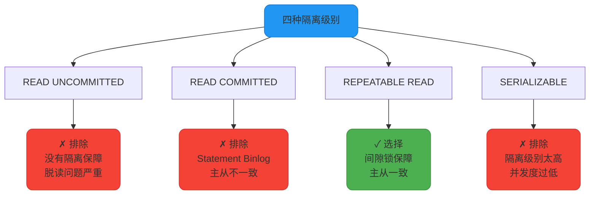
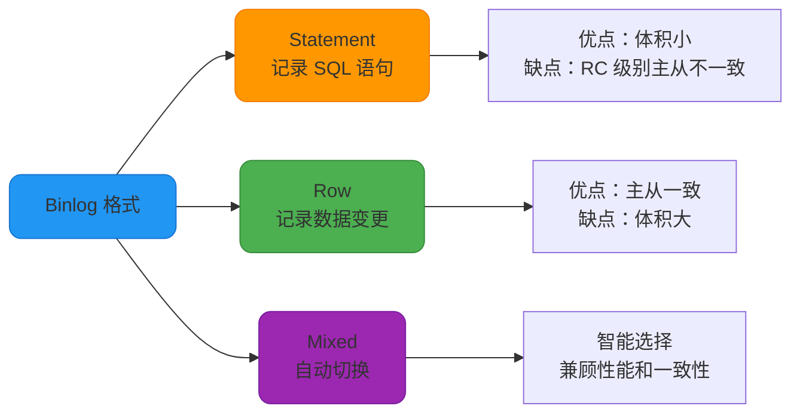

import PaidCTA from '@site/src/components/PaidCTA';

# MySQL事务隔离级别选择策略

## MySQL 默认使用 RR 的历史原因

MySQL InnoDB 存储引擎默认使用 **REPEATABLE READ（可重复读）** 隔离级别，而大多数其他数据库（如 Oracle、SQL Server、PostgreSQL）默认使用 **READ COMMITTED（读已提交）**。

这个设计选择与 MySQL 的历史架构和主从复制机制密切相关。

### 历史背景：Statement 格式的 Binlog

在 MySQL 早期版本中，Binlog 主要使用 **Statement 格式**，即记录执行的原始 SQL 语句。

```sql
-- 主库执行的 SQL
UPDATE orders SET status = 'SHIPPED' WHERE created_at < '2024-01-01';

-- Binlog 记录（Statement 格式）
UPDATE orders SET status = 'SHIPPED' WHERE created_at < '2024-01-01';
-- 从库执行这条 SQL
```

**Statement 格式的优势：**
- Binlog 体积小，节省存储空间
- 网络传输效率高

**Statement 格式的问题：**
在 RC 隔离级别下，Statement 格式的 Binlog 可能导致主从数据不一致。



### RC + Statement 格式的主从不一致问题

**场景示例：**

主库有订单表：

```sql
CREATE TABLE orders (
    order_id INT PRIMARY KEY,
    customer_id INT,
    status VARCHAR(20),
    created_at DATETIME
);

INSERT INTO orders VALUES 
(1, 101, 'PENDING', '2024-01-15 10:00:00'),
(2, 102, 'PENDING', '2024-01-16 10:00:00');
```

**主库事务执行：**

```sql
-- 设置隔离级别为 RC
SET SESSION TRANSACTION ISOLATION LEVEL READ COMMITTED;

-- 时间线
-- T1: 事务 A 开始
BEGIN;
UPDATE orders SET status = 'PROCESSING' 
WHERE created_at < '2024-01-16';
-- 更新 order_id=1

-- T2: 事务 B 开始并提交
BEGIN;
INSERT INTO orders VALUES (3, 103, 'PENDING', '2024-01-15 12:00:00');
COMMIT;
-- 事务 B 先提交

-- T3: 事务 A 提交
COMMIT;
-- 事务 A 后提交
```

**主库 Binlog 记录顺序（按提交顺序）：**

```plaintext
1. INSERT INTO orders VALUES (3, 103, 'PENDING', '2024-01-15 12:00:00');
2. UPDATE orders SET status = 'PROCESSING' WHERE created_at < '2024-01-16';
```

**从库回放 Binlog：**

```sql
-- 从库先执行 INSERT
INSERT INTO orders VALUES (3, 103, 'PENDING', '2024-01-15 12:00:00');
-- 此时从库有 3 条记录：order_id=1,2,3

-- 从库再执行 UPDATE
UPDATE orders SET status = 'PROCESSING' 
WHERE created_at < '2024-01-16';
-- 更新了 order_id=1 和 3（比主库多更新了 order_id=3！）
```

**结果对比：**

| **库** | **order_id=1** | **order_id=2** | **order_id=3** |
|---|---|---|---|
| 主库 | status='PROCESSING' | status='PENDING' | status='PENDING' |
| 从库 | status='PROCESSING' | status='PENDING' | status='**PROCESSING**' |

**主从数据不一致！**

### RR 级别如何解决这个问题

在 RR 隔离级别下，通过 **间隙锁（Gap Lock）** 防止其他事务插入新记录。

```sql
-- 设置隔离级别为 RR
SET SESSION TRANSACTION ISOLATION LEVEL REPEATABLE READ;

-- 事务 A
BEGIN;
UPDATE orders SET status = 'PROCESSING' 
WHERE created_at < '2024-01-16';
-- 不仅锁定 order_id=1，还锁定 created_at < '2024-01-16' 的间隙

-- 事务 B
BEGIN;
INSERT INTO orders VALUES (3, 103, 'PENDING', '2024-01-15 12:00:00');
-- 阻塞！因为 created_at='2024-01-15' 在锁定的间隙内
-- 等待事务 A 提交...

-- 事务 A 提交
COMMIT;
-- 释放锁

-- 事务 B 继续执行
COMMIT;
```

**Binlog 记录顺序（按提交顺序）：**

```plaintext
1. UPDATE orders SET status = 'PROCESSING' WHERE created_at < '2024-01-16';
2. INSERT INTO orders VALUES (3, 103, 'PENDING', '2024-01-15 12:00:00');
```

从库按此顺序回放，与主库执行顺序一致，**主从数据一致**。

### MySQL 禁止 RC + Statement 的组合

MySQL 为了防止主从不一致，直接禁止了 RC 隔离级别 + Statement 格式 Binlog 的组合。

```sql
-- 设置为 RC 隔离级别
SET SESSION TRANSACTION ISOLATION LEVEL READ COMMITTED;
SET SESSION binlog_format = 'STATEMENT';

-- 尝试执行更新
UPDATE orders SET status = 'SHIPPED' WHERE order_id = 1;

-- 报错！
ERROR 1598 (HY000): Binary logging not possible. 
Message: Transaction level 'READ-COMMITTED' in InnoDB is not safe for binlog mode 'STATEMENT'
```

这个错误明确告诉我们：**RC 隔离级别下不安全地使用 Statement 格式**。

### 为什么选择 RR 而不是其他级别

**可选范围分析：**



**结论：**

MySQL 选择 RR 作为默认隔离级别的核心原因：

1. **历史兼容**：兼容早期的 Statement 格式 Binlog
2. **主从一致**：通过间隙锁保证 Statement 格式下的主从数据一致
3. **数据一致性**：提供比 RC 更强的隔离保障，避免不可重复读
4. **平衡设计**：在一致性和性能之间取得平衡

### Row 格式 Binlog 的出现

MySQL 5.1 版本引入了 **Row 格式** 的 Binlog，记录数据的实际变更，而非 SQL 语句。

```sql
-- 主库执行
UPDATE orders SET status = 'SHIPPED' WHERE created_at < '2024-01-01';
-- 假设更新了 100 行

-- Binlog 记录（Row 格式）
### UPDATE `ecommerce`.`orders`
### WHERE
###   @1=1 @2='PENDING'  -- order_id=1, status='PENDING'
### SET
###   @1=1 @2='SHIPPED'  -- order_id=1, status='SHIPPED'
-- 记录 100 行的实际变更
```

**Row 格式的优势：**
- 记录数据实际变更，主从一致性有保障
- 支持 RC 隔离级别
- 更适合复杂的 SQL 操作

**Row 格式的劣势：**
- Binlog 体积大（特别是批量更新）
- 网络传输和存储成本高

**MySQL 5.1.8 引入 Mixed 格式：**
- 默认使用 Statement 格式
- 遇到可能导致不一致的 SQL，自动切换为 Row 格式



## 为什么大厂要从 RR 改为 RC

<PaidCTA />