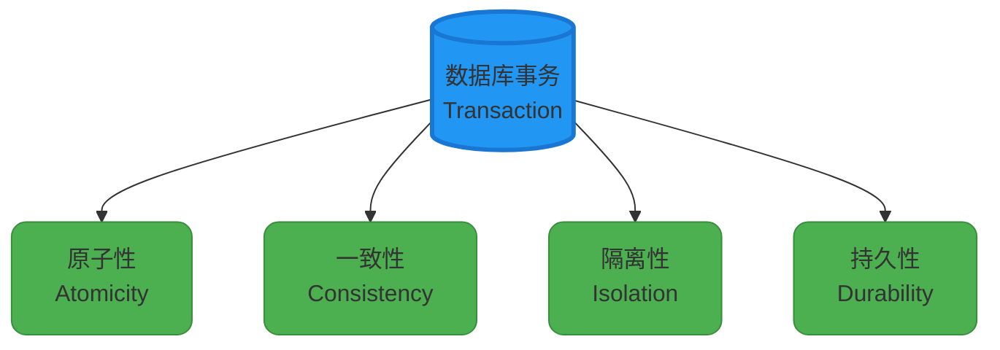
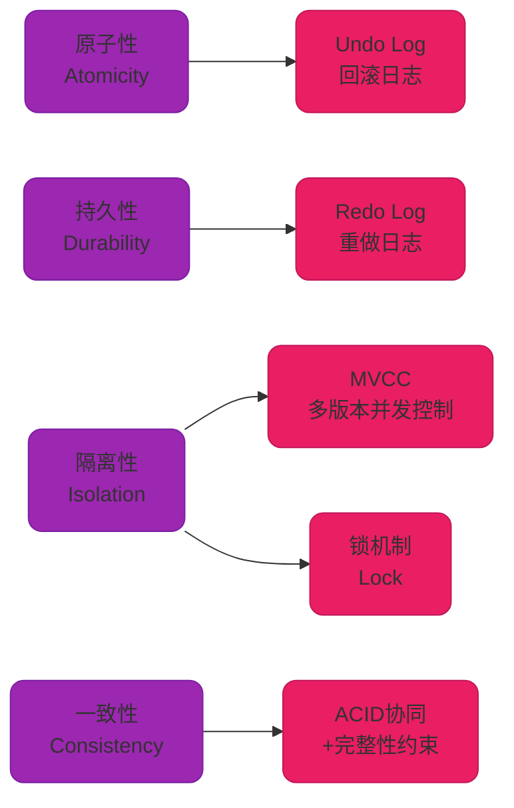

# MySQL事务机制与ACID特性

## 什么是数据库事务

数据库事务（Transaction）是一系列针对数据库的操作序列，这些操作作为一个整体单元执行，要么全部成功完成，要么全部不执行，是一个不可分割的工作单元。事务从开始到结束期间，包含了对数据库的所有操作行为。

需要明确的是，并非所有对数据库的操作序列都构成事务。一个合格的事务必须具备四个核心属性：**原子性（Atomicity）、一致性（Consistency）、隔离性（Isolation）和持久性（Durability）**，这四个特性通常简称为 **ACID**。



## ACID 特性详解

### 原子性（Atomicity）

原子性确保事务中的所有操作作为一个不可分割的整体被执行，事务内的操作要么全部成功提交，要么全部失败回滚。

**场景示例：** 以商城订单支付为例，用户购买商品时涉及以下操作：

1. 从用户钱包表扣除商品金额（余额 1000 元减去 200 元）
2. 将扣除的金额写入用户钱包表（更新为 800 元）
3. 从库存表读取商品库存（当前库存 50 件）
4. 对库存表执行减库存操作（50 - 1）
5. 将更新后的库存写回库存表（更新为 49 件）
6. 在订单表中插入订单记录

如果在执行到第 4 步时，系统突然宕机，那么原子性保证之前的所有操作都会回滚，用户钱包余额仍然是 1000 元，库存仍然是 50 件，不会出现钱扣了但库存没减的情况。

### 一致性（Consistency）

一致性要求事务执行前后，数据库必须从一个一致性状态转换到另一个一致性状态。所谓一致性状态，是指数据库中的数据满足所有完整性约束。

继续上面的订单支付场景：

- **执行前：** 用户钱包 1000 元 + 商家钱包 5000 元 = 6000 元
- **执行后：** 用户钱包 800 元 + 商家钱包 5200 元 = 6000 元

一致性保证了在转账前后，系统的总金额保持不变。同时，一致性还确保账户余额不会出现负数等违反业务规则的情况。

### 隔离性（Isolation）

隔离性规定多个事务并发执行时，一个事务的执行不应该受到其他事务的干扰。每个事务都感觉自己在独占数据库资源。

在订单支付的完整流程中，只要事务还未提交（commit），其他事务查询用户钱包和库存表时，看到的数据都不会发生变化。

假设用户 A 向商家支付的同时，用户 B 也在向同一商家支付，那么当两个事务都结束时，商家账户的余额应该是：原有余额 + A 支付金额 + B 支付金额。两个事务互不干扰。

### 持久性（Durability）

持久性保证一旦事务成功提交，对数据库的修改就会被永久保存，即使系统发生故障也不会丢失。

订单支付成功（事务提交）后，用户钱包和库存的变化会被持久化保存到数据库中，即使数据库服务器突然断电重启，这些数据变更也不会丢失。

## MySQL 如何实现 ACID

MySQL 的 InnoDB 存储引擎通过多种机制共同实现了 ACID 特性。



### 原子性实现 - Undo Log

MySQL 通过 **Undo Log（回滚日志）** 实现原子性。当事务执行过程中，MySQL 会将修改**之前**的数据记录到 Undo Log 中。如果事务需要回滚，就从 Undo Log 中读取相应的记录来撤销事务的修改。

**工作流程：**

```sql
-- 示例：更新商品库存
BEGIN;
UPDATE product_inventory SET stock = stock - 5 WHERE product_id = 1001;
-- 此时 Undo Log 记录了修改前的值：stock = 100

-- 如果发生错误需要回滚
ROLLBACK;
-- MySQL 从 Undo Log 中恢复原值：stock = 100
```

### 持久性实现 - Redo Log

持久性主要依赖 MySQL 的磁盘持久化机制和 **Redo Log（重做日志）**。

**Redo Log** 用于实现崩溃恢复和数据持久性。事务执行过程中，MySQL 将事务**做了什么改动**记录到 Redo Log 中。当系统崩溃或发生异常时，MySQL 利用 Redo Log 中的记录进行恢复操作，将事务的修改持久化到磁盘。

**工作原理：**

```sql
-- 更新操作
UPDATE product_inventory SET stock = 95 WHERE product_id = 1001;
-- Redo Log 记录：将 product_id=1001 的 stock 字段改为 95

-- 系统崩溃后重启
-- MySQL 读取 Redo Log，重新执行修改操作，确保数据不丢失
```

### 隔离性实现 - MVCC + 锁机制

隔离性主要通过 **MVCC（多版本并发控制）** 和 **锁机制** 来保证。

MySQL 支持不同的隔离级别（RU、RC、RR、SERIALIZABLE），这些隔离级别的实现依赖于 MVCC 和不同类型的锁。

**不同隔离级别的实现方式：**

| **隔离级别** | **实现机制** |
|---|---|
| **读未提交（RU）** | 直接读取最新数据，无锁和 MVCC 控制 |
| **读已提交（RC）** | 每次查询生成新 ReadView，读取已提交的最新版本 |
| **可重复读（RR）** | 事务开始时生成 ReadView，后续所有读操作基于此视图 |
| **串行化（SERIALIZABLE）** | 强制加锁，所有操作串行执行 |

**示例代码：**

```sql
-- 设置隔离级别为可重复读
SET SESSION TRANSACTION ISOLATION LEVEL REPEATABLE READ;

-- 事务 A
BEGIN;
SELECT stock FROM product_inventory WHERE product_id = 1001;
-- 返回 stock = 100

-- 此时事务 B 修改了数据并提交
-- 事务 B: UPDATE product_inventory SET stock = 95 WHERE product_id = 1001; COMMIT;

-- 事务 A 再次查询
SELECT stock FROM product_inventory WHERE product_id = 1001;
-- 仍然返回 stock = 100，因为 RR 级别下读取的是事务开始时的快照
COMMIT;
```

### 一致性实现 - ACID 协同保障

一致性是其他三个特性共同作用的结果。MySQL 还提供了主键、外键、唯一性约束、非空约束等完整性约束来保证数据一致性。

**综合实现机制总结：**

| **特性** | **实现机制** |
|---|---|
| **原子性** | Undo Log（回滚日志） |
| **持久性** | Redo Log（重做日志） + 磁盘持久化 |
| **隔离性** | 锁机制（共享锁、排他锁、间隙锁）+ MVCC（版本链、ReadView） |
| **一致性** | 原子性、隔离性、持久性共同保障 + 数据库完整性约束 |

## 总结

数据库事务是保证数据正确性和完整性的核心机制。通过 ACID 四大特性，MySQL 能够在高并发场景下确保数据的可靠性：

- **原子性**保证操作的不可分割性
- **一致性**保证数据状态的正确转换
- **隔离性**保证并发事务互不干扰
- **持久性**保证数据修改的永久保存

在实际应用中，理解这些特性的实现原理，能够帮助我们更好地设计数据库操作，避免数据异常问题。
