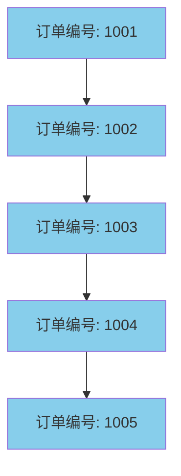
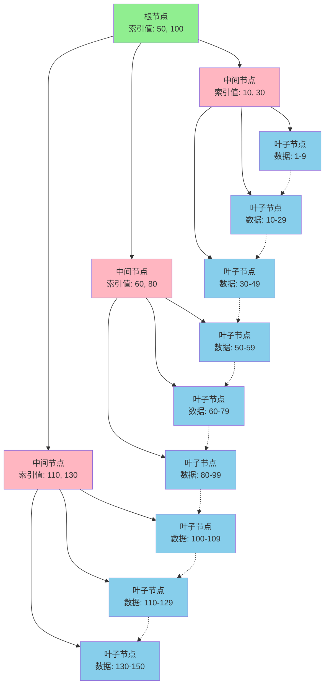
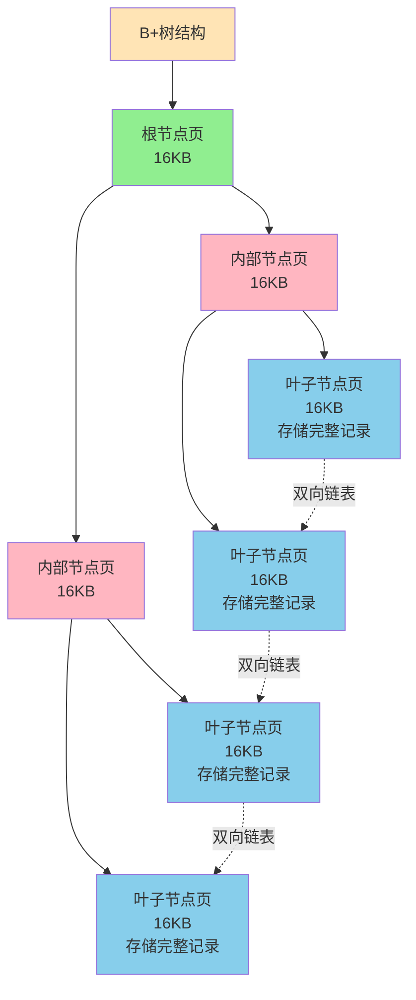

# MySQL索引基础与底层原理

## 什么是索引

索引是数据库中用于提升查询性能的一种数据结构,本质上是一种经过排序组织的数据存储方式。就像图书馆的目录卡片系统一样,索引能够帮助我们快速定位到需要的数据,而不必逐行扫描整张表。

在实际应用中,如果没有索引,数据库需要从第一条记录开始顺序扫描,直到找到匹配的数据。而有了索引后,数据库可以直接定位到数据所在的位置,大大减少了数据扫描量,降低了磁盘I/O次数。

MySQL中,无论是InnoDB还是MyISAM存储引擎,都使用B+树作为索引的底层数据结构。

## 索引的优势与代价

### 索引带来的收益

**1. 查询性能大幅提升**

通过建立索引,数据库可以显著减少需要扫描的数据量。对于包含百万级甚至千万级数据的表,使用索引可以将查询时间从秒级降低到毫秒级,性能提升往往是数量级的。

**2. 确保数据唯一性**

通过创建唯一索引(Unique Index),可以确保表中某列或某几列的组合值是唯一的。比如员工编号、用户手机号等字段,使用唯一索引可以在数据库层面防止重复数据的插入。

**3. 优化排序与分组操作**

如果查询语句中使用了ORDER BY或GROUP BY子句,且涉及的列建立了索引,数据库通常可以直接利用索引已经排好序的特性,避免额外的排序操作,从而提升性能。

### 索引的代价

**1. 写操作性能下降**

创建索引需要耗费时间,特别是对大表操作时。更重要的是,当对表中的数据进行插入、删除、更新操作时,不仅要操作数据本身,相关的索引也必须同步更新和维护,这会降低这些写操作的执行效率。

**2. 额外的存储开销**

索引本质上也是一种数据结构,需要占用磁盘空间。一个表的索引越多、越大,占用的存储空间也就越多。对于大型数据库系统,索引占用的空间可能达到数据本身的几倍。

**3. 可能被误用或失效**

如果索引设计不合理,或者查询语句编写不当,数据库优化器可能不会选择使用索引,甚至可能选错索引,反而导致性能下降。

### 索引不一定总能提升性能

在以下场景中,使用索引可能并不会带来性能提升:

- **数据量过小**: 如果表中只有几百条数据,全表扫描的成本可能比走索引更低
- **查询结果集过大**: 如果查询要返回表中大部分数据(如超过20%-30%),优化器通常会选择全表扫描,因为多次回表的随机I/O成本可能高于一次顺序扫描
- **索引维护不当**: 统计信息过时可能导致优化器做出错误判断

## 索引底层数据结构选型

### 为什么不用哈希表

哈希表能够实现O(1)的查询复杂度,看似是理想的索引结构。通过哈希函数,我们可以快速找到key对应的index,进而获取到value:

```java
hash = hashFunction(key)
index = hash % array_size
```

但哈希表作为索引有致命缺陷:

1. **不支持范围查询**: 对于`SELECT * FROM orders WHERE order_id < 5000`这类范围查询,哈希索引需要对1到4999的每个值都计算哈希,效率极低
2. **不支持排序**: 哈希表中的数据是无序的,无法利用索引优化ORDER BY操作
3. **每次I/O只能取一条记录**: 无法利用磁盘预读特性批量加载数据

虽然MySQL的InnoDB引擎有自适应哈希索引(Adaptive Hash Index),但这是基于B+树的优化,而非完全的哈希索引。

### 为什么不用二叉查找树

二叉查找树(BST)具有以下特点:
- 左子树所有节点的值均小于根节点
- 右子树所有节点的值均大于根节点
- 左右子树也分别为二叉查找树

当二叉查找树保持平衡时,查询时间复杂度为O(log₂N),效率较高。但问题在于,如果插入有序数据,二叉查找树会退化成链表,时间复杂度退化为O(N)。



二叉查找树的性能高度依赖其平衡程度,这使其不适合作为MySQL索引的底层结构。

### 为什么不用AVL树和红黑树

**AVL树**是严格的平衡二叉树,任何节点的左右子树高度差不超过1。虽然查询效率稳定,但频繁的旋转操作会增加写操作的开销,降低插入和删除的性能。

更重要的是,AVL树每个节点只存储一个数据,每次磁盘I/O只能读取一个节点。对于大量数据,这意味着需要进行多次磁盘I/O,而磁盘I/O是数据库操作中最耗时的部分。

**红黑树**通过牺牲严格平衡性来提高写操作效率,插入和删除只需O(1)次旋转。在内存数据结构中(如Java的TreeMap、HashMap),红黑树表现优异。

但对于磁盘存储的数据库索引,红黑树的树高可能较高,导致需要更多次磁盘I/O才能定位到数据,这正是MySQL不选择红黑树的主要原因。

### B+树的优势

B+树(B Plus Tree)是一种多路平衡查找树,具有以下关键特性:

1. **所有数据都在叶子节点**: 非叶子节点只存储索引值和指针,不存储完整数据
2. **叶子节点形成有序链表**: 所有叶子节点通过指针连接,支持高效的范围查询
3. **多路特性**: 每个节点可以有多个子节点,大大降低了树的高度
4. **节点大小与页对齐**: B+树节点大小通常设置为与磁盘页大小一致(如16KB),优化磁盘I/O



**B+树相比B树的优势**:

- **更少的I/O次数**: 非叶子节点不存储数据,可以存储更多索引值,使得相同数据量下树的高度更低
- **稳定的查询效率**: 所有查询都需要到达叶子节点,路径长度一致
- **范围查询友好**: 通过叶子节点的链表可以快速完成范围扫描
- **更适合磁盘存储**: 顺序访问叶子节点链表时可以充分利用磁盘预读

## InnoDB数据页与B+树的关系

InnoDB存储引擎中,数据页是存储数据的基本单位,默认大小为16KB。B+树的每个节点都对应一个数据页,包括根节点、内部节点和叶子节点。



数据页的内部结构包含7个部分:
- **文件头**: 记录页的基本信息
- **页头**: 记录页的状态信息
- **最小和最大记录**: 边界记录
- **用户记录**: 实际存储的数据行
- **空闲空间**: 未使用的空间
- **页目录**: 记录在页中的位置信息
- **文件尾**: 校验信息

通过这种组织方式,InnoDB实现了:
- **高效的磁盘读写**: 每次I/O以16KB为单位
- **快速的数据定位**: 通过B+树索引快速找到目标数据页
- **良好的缓存命中**: 页是InnoDB Buffer Pool的缓存单位

## InnoDB与MyISAM索引实现的区别

### InnoDB的聚簇索引

InnoDB使用聚簇索引(Clustered Index),索引和数据存储在一起。主键索引的叶子节点直接存储完整的数据行,这意味着:

- 通过主键查询可以直接获取数据,无需回表
- 表数据文件本身就是按主键组织的B+树
- 二级索引的叶子节点存储的是主键值

### MyISAM的非聚簇索引

MyISAM使用非聚簇索引,索引和数据是分离存储的:

- 索引文件(.MYI)和数据文件(.MYD)是独立的
- 主键索引和非主键索引的叶子节点都存储数据记录的物理地址
- 查询时需要先通过索引找到地址,再读取数据

这种差异导致InnoDB在大多数场景下性能优于MyISAM,也是MySQL默认使用InnoDB的重要原因之一。
