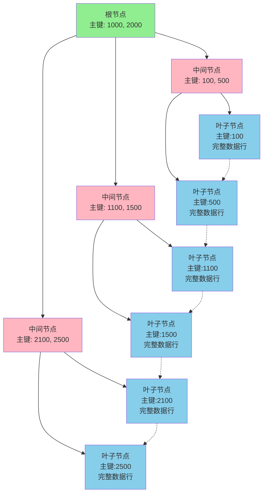
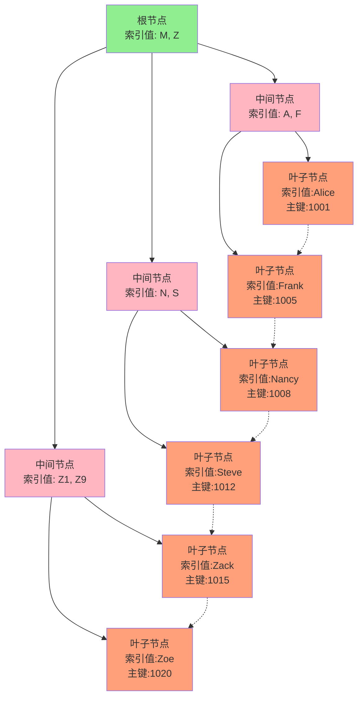
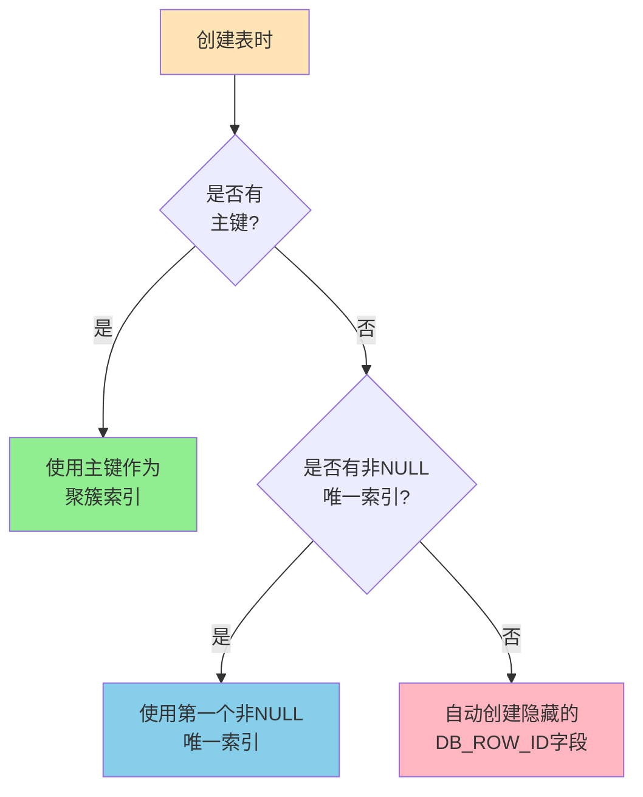

# MySQL索引类型与存储结构

## MySQL索引类型分类

MySQL中的索引可以从多个维度进行分类,不同的分类方式有助于我们从不同角度理解索引的特性和适用场景。

### 按数据结构分类

**1. B+树索引**

B+树索引是MySQL中最常用的索引类型,InnoDB和MyISAM都默认使用B+树。它具有以下特点:
- 非叶子节点只存储索引键值和指针
- 所有数据存储在叶子节点
- 叶子节点之间通过双向链表连接
- 支持范围查询和排序操作

**2. 哈希索引**

InnoDB存储引擎支持自适应哈希索引(Adaptive Hash Index),这是一种自动优化机制:
- 基于B+树索引构建的内存哈希表
- 针对热点数据自动创建
- 适用于等值查询,不支持范围查询
- 用户无法手动控制

**3. 全文索引**

全文索引用于对文本内容进行分词搜索:
- MySQL 5.6之前仅MyISAM支持
- MySQL 5.6之后InnoDB也支持全文索引
- 仅支持CHAR、VARCHAR、TEXT类型
- 实际项目中通常使用ElasticSearch等专业搜索引擎替代

**4. 空间索引(R-Tree)**

空间索引用于地理位置数据:
- 仅支持geometry数据类型
- 优化空间范围查询
- 实际使用较少,通常由专门的GIS系统处理

### 按存储方式分类

**聚簇索引**(Clustered Index)是索引结构和数据一起存放的索引:
- InnoDB的主键索引就是聚簇索引
- 表数据文件本身就是按B+树组织的索引结构
- 叶子节点存储完整的数据行

**非聚簇索引**(Non-Clustered Index)是索引结构和数据分开存放的索引:
- InnoDB的二级索引(辅助索引)
- MyISAM的所有索引(包括主键索引)
- 叶子节点不存储完整数据,只存储索引键和行定位信息

### 按应用维度分类

**1. 主键索引**
- 加速查询 + 列值唯一(不允许NULL) + 一张表只能有一个
- InnoDB中主键索引是聚簇索引
- 如果未显式创建主键,InnoDB会自动创建隐藏主键

**2. 唯一索引**
- 加速查询 + 列值唯一(可以有NULL)
- 可以创建多个唯一索引
- 用于保证数据完整性

**3. 普通索引**
- 仅用于加速查询
- 没有唯一性约束
- 可以创建多个

**4. 前缀索引**
- 对字符串字段的前N个字符创建索引
- 减少索引占用空间
- 适用于较长的字符串字段

**5. 联合索引**(复合索引)
- 由多个列组合创建的索引
- 遵循最左前缀匹配原则
- 合理使用可以覆盖多种查询场景

## 聚簇索引与非聚簇索引

### 聚簇索引详解

聚簇索引将数据与索引存储在一起,找到索引就找到了数据。在InnoDB中,主键索引就是聚簇索引。

**聚簇索引的存储结构**:



**聚簇索引的优点**:

1. **查询速度快**: 通过主键查询时,直接从B+树的叶子节点获取完整数据,无需额外的I/O操作
2. **范围查询高效**: 由于数据按主键顺序存储,范围查询可以利用叶子节点的顺序链表快速扫描
3. **排序查询优化**: 按主键排序的查询可以直接利用索引顺序,避免额外的排序操作

**聚簇索引的缺点**:

1. **依赖有序数据**: 如果插入的数据不是有序的(如使用UUID作为主键),会导致频繁的页分裂,影响性能
2. **更新代价高**: 修改主键值会导致数据行物理位置变化,代价较大,因此主键通常设计为不可修改
3. **二级索引性能影响**: 二级索引需要存储主键值,如果主键过长,会增加二级索引的存储开销

### 非聚簇索引详解

非聚簇索引将数据与索引分开存储。在InnoDB中,除主键索引外的其他索引都是非聚簇索引(也叫二级索引或辅助索引)。

**非聚簇索引的存储结构**:



**非聚簇索引的优点**:

1. **更新代价低**: 修改非主键字段时,只需要更新对应的索引,不会影响数据的物理存储位置
2. **支持多个索引**: 一张表可以创建多个非聚簇索引,满足不同的查询需求

**非聚簇索引的缺点**:

1. **可能需要回表**: 如果查询的字段不在索引中,需要先通过索引找到主键,再通过主键查询完整数据
2. **双重查找**: 通过非聚簇索引查询需要两次B+树遍历,第一次找到主键,第二次通过主键找到数据

### 什么是回表

回表是指通过非聚簇索引查询时,需要额外的数据读取过程:

1. 首先根据非聚簇索引找到对应的主键值
2. 然后根据主键值在聚簇索引中查找完整的数据行

**回表查询示例**:

```sql
-- 假设在customer_name字段上建立了普通索引
SELECT * FROM customers WHERE customer_name = '李明';
```

查询执行流程:
1. 在customer_name索引中查找'李明',获得主键id = 10086
2. 根据主键10086在聚簇索引中查找完整的客户记录


**减少回表次数的方法**:

1. **使用覆盖索引**: 查询的字段都在索引中,无需回表
2. **索引下推**: 在索引遍历过程中尽可能过滤数据,减少回表次数
3. **优先使用主键查询**: 主键索引是聚簇索引,不需要回表

### InnoDB表没有主键会怎样

很多开发者可能会好奇,如果一张InnoDB表没有定义主键,数据库会如何处理?

InnoDB存储引擎要求每张表都必须有聚簇索引,如果没有显式定义主键,InnoDB会按照以下顺序选择聚簇索引:

1. **显式定义的主键**: 如果表有PRIMARY KEY,直接使用
2. **第一个非NULL唯一索引**: 选择第一个所有列都NOT NULL的UNIQUE索引
3. **隐藏的行ID**: 如果以上都没有,InnoDB会自动创建一个6字节的隐藏字段`DB_ROW_ID`作为聚簇索引



虽然InnoDB会自动创建聚簇索引,但强烈建议为每张表显式定义主键,原因包括:
- 隐藏的DB_ROW_ID是全局共享的,并发插入时可能成为瓶颈
- 无法通过隐藏主键进行查询优化
- 不利于数据管理和业务逻辑实现

## 主键索引与唯一索引的区别

虽然主键索引和唯一索引都保证了列值的唯一性,但它们有重要区别:

| 特性 | 主键索引 | 唯一索引 |
|------|---------|---------|
| 唯一性 | 必须唯一 | 必须唯一 |
| NULL值 | 不允许NULL | 允许NULL(可以有多个NULL) |
| 数量限制 | 一张表只能有一个 | 一张表可以有多个 |
| 存储方式 | InnoDB中是聚簇索引 | 非聚簇索引 |
| 主要用途 | 标识记录+加速查询 | 保证数据完整性+加速查询 |

**使用场景示例**:

```sql
-- 用户表:主键用于标识用户,唯一索引用于保证手机号和邮箱唯一
CREATE TABLE users (
    user_id BIGINT PRIMARY KEY AUTO_INCREMENT,
    phone VARCHAR(20) NOT NULL,
    email VARCHAR(100),
    username VARCHAR(50) NOT NULL,
    UNIQUE KEY uk_phone (phone),
    UNIQUE KEY uk_email (email)
) ENGINE=InnoDB;

-- 订单表:主键用于标识订单,唯一索引用于保证订单号唯一
CREATE TABLE orders (
    id BIGINT PRIMARY KEY AUTO_INCREMENT,
    order_no VARCHAR(32) NOT NULL,
    user_id BIGINT NOT NULL,
    total_amount DECIMAL(10,2) NOT NULL,
    UNIQUE KEY uk_order_no (order_no),
    KEY idx_user_id (user_id)
) ENGINE=InnoDB;
```

## MySQL如何保证唯一索引的唯一性

MySQL通过以下机制确保唯一索引的唯一性:

**1. 插入时检查**

当插入新记录时,MySQL会在唯一索引中查找是否存在相同的值:
- 如果存在,返回错误`Duplicate entry`
- 如果不存在,插入新记录并更新索引

**2. 使用锁机制**

在InnoDB中,插入涉及唯一索引的记录时会加锁:
- 对唯一索引加`插入意向锁`
- 如果检测到冲突,会等待或返回错误
- 通过锁机制保证并发情况下的唯一性

**3. NULL值的特殊处理**

唯一索引允许多个NULL值的原因:
- 在SQL标准中,NULL表示未知或不存在
- NULL与任何值(包括NULL)比较结果都是UNKNOWN
- 因此多个NULL被认为是不同的值

```sql
-- 演示唯一索引允许多个NULL
CREATE TABLE test_unique (
    id INT PRIMARY KEY,
    code VARCHAR(20),
    UNIQUE KEY uk_code (code)
);

INSERT INTO test_unique VALUES (1, NULL);  -- 成功
INSERT INTO test_unique VALUES (2, NULL);  -- 成功
INSERT INTO test_unique VALUES (3, NULL);  -- 成功
INSERT INTO test_unique VALUES (4, 'A001');  -- 成功
INSERT INTO test_unique VALUES (5, 'A001');  -- 失败:Duplicate entry
```

## 索引的适用场景与限制

**适合创建索引的场景**:

1. 频繁作为WHERE条件的列
2. 频繁用于JOIN连接的列
3. 频繁用于ORDER BY和GROUP BY的列
4. 需要保证唯一性的列
5. 区分度高的列

**不适合创建索引的场景**:

1. 表数据量很小(几百条以内)
2. 频繁更新的列
3. 区分度很低的列(如性别、状态等只有少数几个值的列)
4. WHERE条件中很少使用的列
5. 字段值为NULL的记录过多

合理使用索引是数据库性能优化的关键,需要根据实际业务场景进行权衡和选择。
