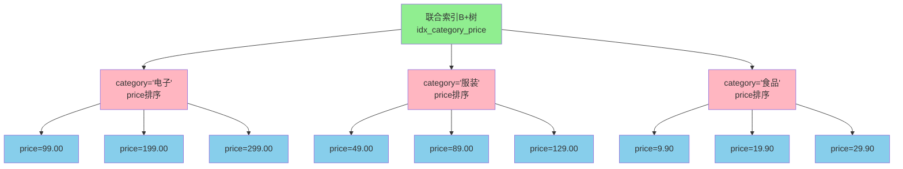
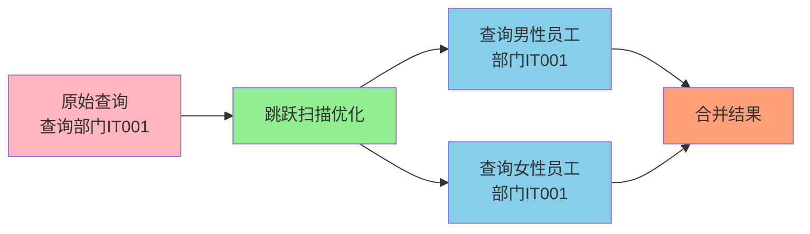
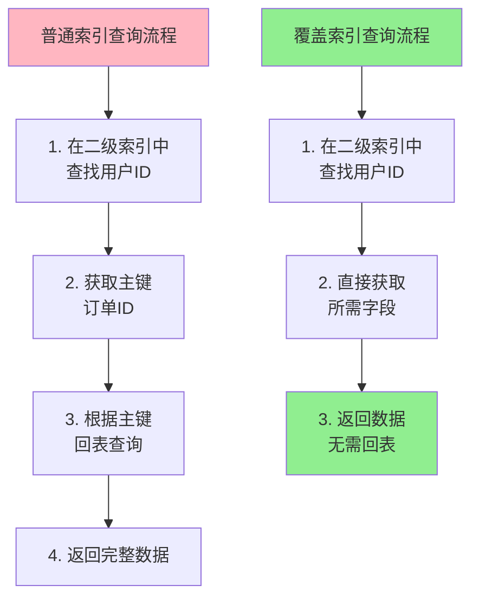
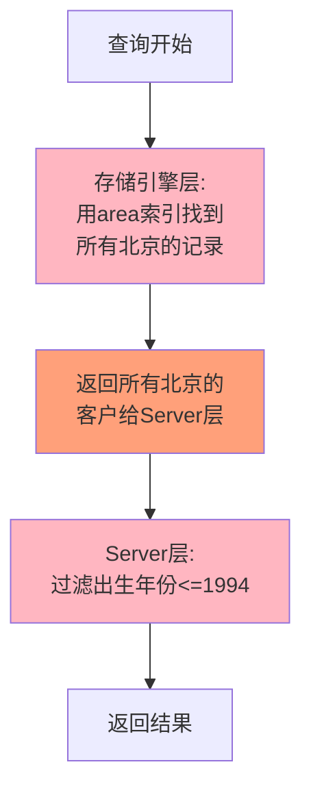
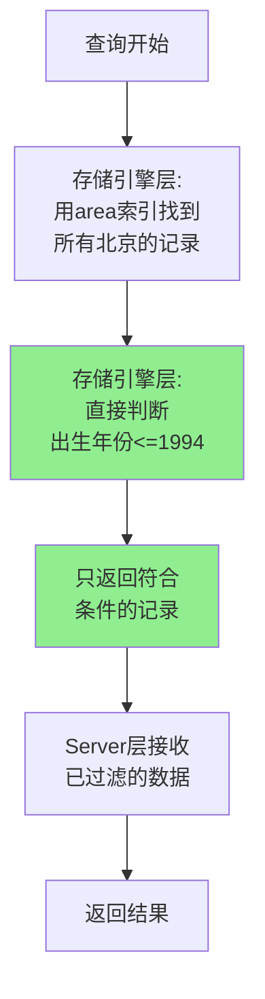

# MySQL联合索引与查询优化

## 联合索引基础

联合索引(也叫复合索引或组合索引)是由多个列组合创建的索引。相比为每个列单独创建索引,联合索引具有更高的空间利用率和查询效率。

**创建联合索引**:

```sql
-- 为商品表创建分类和价格的联合索引
CREATE TABLE products (
    product_id BIGINT PRIMARY KEY AUTO_INCREMENT,
    product_name VARCHAR(100) NOT NULL,
    category VARCHAR(50) NOT NULL,
    price DECIMAL(10,2) NOT NULL,
    stock INT NOT NULL,
    KEY idx_category_price (category, price)
) ENGINE=InnoDB;
```

在上面的例子中,`idx_category_price(category, price)`就是一个联合索引。

## 最左前缀匹配原则

最左前缀匹配是使用联合索引时必须遵循的重要原则。它指的是在使用联合索引查询时,MySQL会根据索引中字段的顺序,从左到右依次匹配查询条件。

### 基本规则

假设创建了联合索引`idx_abc(col_a, col_b, col_c)`,那么以下查询可以使用到索引:

- `WHERE col_a = 1`
- `WHERE col_a = 1 AND col_b = 2`  
- `WHERE col_a = 1 AND col_b = 2 AND col_c = 3`
- `WHERE col_a = 1 AND col_c = 3` (只使用col_a部分)

以下查询无法使用该索引:

- `WHERE col_b = 2` (缺少最左列col_a)
- `WHERE col_c = 3` (缺少最左列col_a)
- `WHERE col_b = 2 AND col_c = 3` (缺少最左列col_a)

### 原理解析

联合索引在B+树中的存储是有序的,排序规则是:
1. 首先按第一个字段排序
2. 第一个字段相同时,按第二个字段排序
3. 第二个字段相同时,按第三个字段排序
4. 以此类推



由于索引是先按category排序,再按price排序,所以:
- 如果查询条件包含category,可以利用索引快速定位
- 如果查询条件只有price,由于price在全局范围内无序,无法利用索引

### 查询条件顺序无关

需要注意的是,WHERE子句中条件的顺序不影响索引的使用。MySQL查询优化器会自动调整条件顺序:

```sql
-- 以下两个查询等价,都能使用idx_category_price索引
SELECT * FROM products WHERE category = '电子' AND price = 199.00;
SELECT * FROM products WHERE price = 199.00 AND category = '电子';
```

### 范围查询的影响

在MySQL 5.7及之前版本,有一个常见误解:最左匹配原则会在遇到范围查询时停止匹配。但实际上:

- 对于`>=`、`<=`、`BETWEEN`这类范围查询,不会停止匹配
- 对于`>`、`<`查询,在某些情况下可能会停止匹配,但具体行为取决于优化器

```sql
-- 假设有索引idx_abc(a, b, c)

-- 这个查询a、b、c都会使用到索引
SELECT * FROM table WHERE a = 1 AND b >= 2 AND c = 3;

-- 这个查询a、b会使用索引,c的使用取决于优化器
SELECT * FROM table WHERE a = 1 AND b > 2 AND c = 3;
```

## 索引跳跃扫描

MySQL 8.0.13引入了索引跳跃扫描(Index Skip Scan)优化,允许在某些情况下不遵循最左前缀原则也能使用索引。

### 适用场景

索引跳跃扫描适用于联合索引第一个字段区分度不高的场景。

```sql
-- 创建测试表
CREATE TABLE employees (
    emp_id INT PRIMARY KEY,
    gender CHAR(1) NOT NULL,  -- 区分度低,只有'M'和'F'两个值
    dept_code VARCHAR(10) NOT NULL,
    salary DECIMAL(10,2) NOT NULL,
    KEY idx_gender_dept (gender, dept_code)
) ENGINE=InnoDB;

-- 在MySQL 8.0.13+中,即使不包含gender条件,也可能使用索引
SELECT * FROM employees WHERE dept_code = 'IT001';
```

### 优化原理

索引跳跃扫描的执行过程:

1. 获取gender字段的所有唯一值(如'M'和'F')
2. 对每个值构造查询条件并执行
3. 合并所有结果返回

相当于执行:

```sql
SELECT * FROM employees WHERE gender = 'M' AND dept_code = 'IT001'
UNION ALL
SELECT * FROM employees WHERE gender = 'F' AND dept_code = 'IT001';
```



### 使用限制

索引跳跃扫描有以下限制:

1. 第一个字段的唯一值数量不能太多(否则性能反而下降)
2. 查询不能有GROUP BY或DISTINCT
3. 查询不能是多表JOIN
4. 查询字段必须是索引包含的列

虽然有索引跳跃扫描,但设计索引时仍然应该:
- 将区分度高的字段放在联合索引左侧
- 将查询频繁的字段放在联合索引左侧
- 不要过度依赖索引跳跃扫描

## 覆盖索引

覆盖索引是指一个索引包含了查询所需的全部字段,使得查询可以仅通过索引就获取所需数据,无需回表。

### 基本概念

```sql
-- 创建联合索引
CREATE TABLE orders (
    order_id BIGINT PRIMARY KEY,
    user_id BIGINT NOT NULL,
    order_no VARCHAR(32) NOT NULL,
    order_status TINYINT NOT NULL,
    total_amount DECIMAL(10,2) NOT NULL,
    KEY idx_user_status (user_id, order_status)
) ENGINE=InnoDB;

-- 以下查询使用覆盖索引,无需回表
SELECT user_id, order_status 
FROM orders 
WHERE user_id = 10086;

-- 以下查询需要回表,因为total_amount不在索引中
SELECT user_id, order_status, total_amount 
FROM orders 
WHERE user_id = 10086;
```

通过`EXPLAIN`可以查看是否使用了覆盖索引:

```sql
EXPLAIN SELECT user_id, order_status FROM orders WHERE user_id = 10086;
```

如果`Extra`列显示`Using index`,说明使用了覆盖索引。

### 覆盖索引的优势



**性能优势**:

1. 减少I/O次数:避免回表,减少一次B+树遍历
2. 减少数据传输:只读取索引,数据量更小
3. 提升查询速度:特别是在高并发场景下效果明显

### 设计覆盖索引的技巧

**1. 分析高频查询语句**

```sql
-- 如果这是一个高频查询
SELECT user_id, order_no, order_status 
FROM orders 
WHERE user_id = ? AND order_status = ?;

-- 可以创建覆盖索引
CREATE INDEX idx_user_status_no ON orders(user_id, order_status, order_no);
```

**2. 平衡索引数量和查询性能**

虽然覆盖索引能提升查询性能,但不能为每个查询都创建覆盖索引,需要权衡:
- 索引会占用存储空间
- 索引会降低写入性能
- 应该针对最核心、最高频的查询创建覆盖索引

**3. 利用主键**

主键会被包含在所有二级索引中,因此查询主键字段可以天然使用覆盖索引:

```sql
-- 即使只有idx_user_id(user_id)索引,以下查询也是覆盖索引
SELECT user_id, order_id FROM orders WHERE user_id = 10086;
```

## 索引下推

索引下推(Index Condition Pushdown, ICP)是MySQL 5.6引入的查询优化技术,默认开启。

### 基本原理

在没有索引下推之前,查询流程是:
1. 存储引擎根据索引条件查找数据
2. 返回全部匹配的记录给Server层
3. Server层进行条件过滤

有了索引下推后:
1. 存储引擎根据索引条件查找数据
2. **在存储引擎层直接用索引中的字段进行条件判断**
3. 只返回满足所有条件的记录给Server层

### 示例说明

```sql
-- 假设有联合索引idx_area_birth(area, birthday)
CREATE TABLE customers (
    id BIGINT PRIMARY KEY,
    name VARCHAR(50),
    area VARCHAR(50),
    birthday DATE,
    phone VARCHAR(20),
    KEY idx_area_birth (area, birthday)
) ENGINE=InnoDB;

-- 查询某地区30岁以上的客户
SELECT * FROM customers 
WHERE area = '北京' AND YEAR(birthday) <= 1994;
```

**没有索引下推时**:



**有索引下推时**:



### 适用场景

索引下推适用于以下情况:

1. **使用联合索引,但部分字段因函数导致索引失效**

```sql
-- area能使用索引,birthday因YEAR函数失效
-- 但通过索引下推,birthday仍可在存储引擎层过滤
WHERE area = '北京' AND YEAR(birthday) = 1990
```

2. **LIKE查询**

```sql
-- zipcode使用索引,lastname的LIKE虽然不能完全使用索引
-- 但可以在存储引擎层过滤
WHERE zipcode = '100000' AND lastname LIKE '%张%'
```

3. **范围查询后的等值查询**

```sql
-- age使用索引,虽然status在age后面
-- 但可以通过索引下推在存储引擎层过滤
WHERE age > 30 AND status = 1
```

### 查看是否使用索引下推

通过`EXPLAIN`查看执行计划:

```sql
EXPLAIN SELECT * FROM customers 
WHERE area = '北京' AND YEAR(birthday) <= 1994;
```

如果`Extra`列显示`Using index condition`,说明使用了索引下推。

### 索引下推的限制

1. 仅支持InnoDB和MyISAM引擎
2. 仅支持range、ref、eq_ref、ref_or_null类型的查询
3. 不支持聚簇索引(主键索引)
4. 不支持子查询和存储过程

## 索引合并

索引合并(Index Merge)是MySQL的一种查询优化技术,允许在一个查询中使用多个索引。

### 索引合并类型

**1. 交集合并(Intersection)**

用于AND连接的多个条件:

```sql
-- 假设age和city都有独立索引
SELECT * FROM employees WHERE age = 30 AND city = '杭州';
```

执行过程:
1. 使用age索引找到所有age=30的记录
2. 使用city索引找到所有city='杭州'的记录  
3. 取两个结果集的交集

**2. 并集合并(Union)**

用于OR连接的多个条件:

```sql
SELECT * FROM employees WHERE age = 30 OR city = '杭州';
```

执行过程:
1. 使用age索引找到所有age=30的记录
2. 使用city索引找到所有city='杭州'的记录
3. 合并两个结果集(去重)

**3. 排序并集合并(Sort-Union)**

用于需要排序的OR查询。

### 查看索引合并

通过`EXPLAIN`查看:

```sql
EXPLAIN SELECT * FROM employees WHERE age = 30 AND city = '杭州';
```

如果使用了索引合并,`type`列会显示`index_merge`,`Extra`列会显示具体的合并策略:
- `Using intersect(...)`
- `Using union(...)`
- `Using sort_union(...)`

### 索引合并的性能考虑

虽然索引合并能提升性能,但通常情况下,创建合适的联合索引比使用索引合并更高效:

```sql
-- 与其让MySQL使用索引合并
-- 不如直接创建联合索引
CREATE INDEX idx_age_city ON employees(age, city);
```

联合索引的优势:
- 只需一次B+树遍历
- 避免了结果集的合并操作  
- 可以利用覆盖索引避免回表

## 单列索引的最左前缀

最左前缀匹配不仅适用于联合索引,也适用于单列字符串字段的模糊查询:

```sql
CREATE TABLE articles (
    id BIGINT PRIMARY KEY,
    title VARCHAR(200),
    KEY idx_title (title)
) ENGINE=InnoDB;

-- 可以使用索引
SELECT * FROM articles WHERE title LIKE '数据库%';

-- 不能使用索引
SELECT * FROM articles WHERE title LIKE '%数据库';
SELECT * FROM articles WHERE title LIKE '%数据库%';
```

原因是索引按字符串从左到右排序,只有从左边开始匹配才能利用索引的有序性。

通过合理运用联合索引、覆盖索引、索引下推等优化技术,可以大幅提升数据库查询性能。
