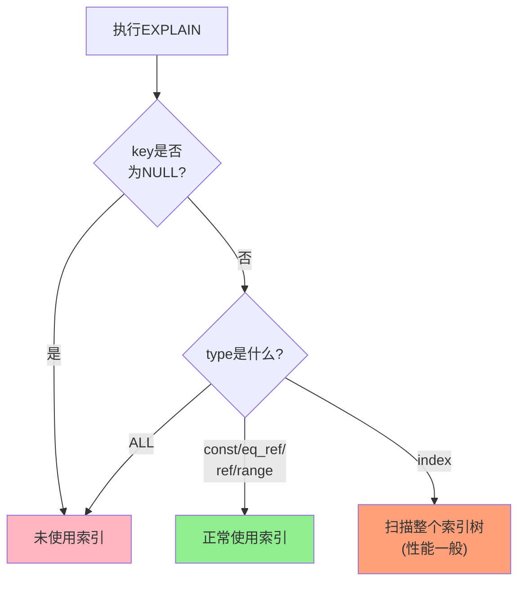
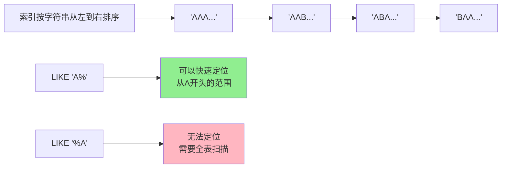
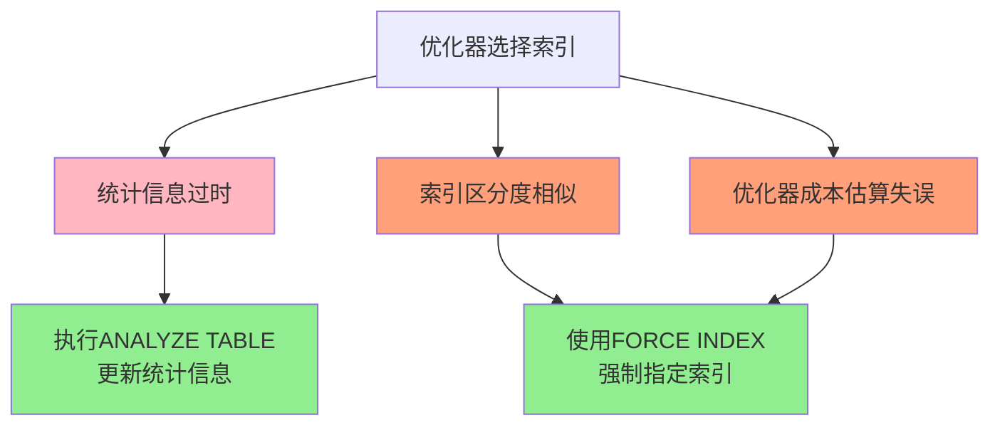

# MySQL索引失效问题排查
## 索引失效问题概述

索引失效是导致慢查询的常见原因之一。当一条SQL语句没有正确使用索引时,数据库可能需要进行全表扫描,导致查询性能大幅下降。

索引失效的本质原因是MySQL优化器基于成本评估,认为不使用索引或使用全表扫描的成本更低。理解索引失效的原因和排查方法,对于数据库性能优化至关重要。

## 排查索引失效的基本流程

### 第一步:获取慢查询SQL

首先需要找到执行缓慢的SQL语句,可以通过以下方式:

1. 查看慢查询日志
2. 使用监控工具(如Prometheus + Grafana)
3. 应用程序日志
4. 数据库性能分析工具

### 第二步:使用EXPLAIN分析执行计划

```sql
EXPLAIN SELECT * FROM orders WHERE customer_id = 10086;
```

重点关注以下字段:

| 字段 | 说明 | 理想值 |
|------|------|--------|
| type | 访问类型 | const、eq_ref、ref、range |
| possible_keys | 可能使用的索引 | 不为NULL |
| key | 实际使用的索引 | 不为NULL |
| key_len | 索引使用的字节数 | 越大越好(使用的索引列越多) |
| rows | 扫描的行数 | 越小越好 |
| Extra | 额外信息 | Using index(覆盖索引)最佳 |

### 第三步:判断是否走索引

**走索引的标志**:
- `key`字段有值(显示使用了哪个索引)
- `type`为ref、eq_ref、range、const等
- `Extra`为NULL、Using index、Using index condition

**未走索引的标志**:
- `type = ALL`(全表扫描)
- `key = NULL`
- `Extra = Using where`(在Server层过滤,未使用索引)



### 第四步:分析未走索引的原因

如果SQL没有走索引,可能的原因包括:

1. 索引未正确创建或不符合最左前缀
2. 索引区分度不高
3. 表数据量太小
4. 查询条件导致索引失效
5. MySQL优化器判断失误

## 常见的索引失效场景

### 1. 索引列参与计算

在索引列上进行计算会导致索引失效:

```sql
-- 索引失效示例
SELECT * FROM orders WHERE order_id + 1 = 10001;
SELECT * FROM products WHERE price * 0.8 < 100;

-- 正确写法
SELECT * FROM orders WHERE order_id = 10001 - 1;
SELECT * FROM products WHERE price < 100 / 0.8;
```

**原因**: 索引存储的是列的原始值,计算后的值无法在索引中定位。

### 2. 对索引列使用函数

```sql
-- 索引失效示例
SELECT * FROM customers WHERE YEAR(birthday) = 1990;
SELECT * FROM users WHERE UPPER(username) = 'ADMIN';
SELECT * FROM orders WHERE DATE(create_time) = '2024-01-01';

-- 部分优化方案
-- 方案1: 改写条件,避免使用函数
SELECT * FROM customers 
WHERE birthday >= '1990-01-01' AND birthday < '1991-01-01';

-- 方案2: 使用生成列(MySQL 5.7+)
ALTER TABLE customers ADD COLUMN birth_year INT AS (YEAR(birthday));
CREATE INDEX idx_birth_year ON customers(birth_year);

-- 方案3: 使用函数索引(MySQL 8.0+)
CREATE INDEX idx_birth_year ON customers((YEAR(birthday)));
```

### 3. 隐式类型转换

字段类型与查询值类型不一致会触发隐式转换:

```sql
-- phone字段是VARCHAR类型
-- 以下查询会导致索引失效
SELECT * FROM users WHERE phone = 13800138000;

-- 正确写法
SELECT * FROM users WHERE phone = '13800138000';
```

**特殊情况**: 如果字段类型是INT,而查询使用字符串,MySQL会将字符串转为INT,此时仍可使用索引:

```sql
-- user_id字段是INT类型,以下查询可以使用索引
SELECT * FROM users WHERE user_id = '12345';
```

**判断规则**:
- 字符串类型字段使用数值查询 → 索引失效
- 数值类型字段使用字符串查询 → 索引有效

### 4. 前导模糊查询

以`%`或`_`开头的LIKE查询无法使用索引:

```sql
-- 索引失效
SELECT * FROM articles WHERE title LIKE '%数据库%';
SELECT * FROM articles WHERE title LIKE '%MySQL';

-- 可以使用索引
SELECT * FROM articles WHERE title LIKE 'MySQL%';
SELECT * FROM articles WHERE title LIKE 'MyS%L';
```

**可视化说明**:



**优化方案**:
- 使用全文索引
- 使用ElasticSearch等搜索引擎
- 业务层面限制只能后模糊匹配

### 5. 使用OR导致索引失效

OR连接的条件比较复杂:

```sql
-- 如果name和age都有索引,且OR两边都是等值,可能使用索引合并
SELECT * FROM students WHERE name = '张三' OR age = 18;

-- 如果OR的一边使用了范围查询,通常会索引失效
SELECT * FROM students WHERE name = '张三' OR age > 18;

-- 如果OR的一边没有索引,整个查询索引失效
SELECT * FROM students WHERE name = '张三' OR address = '北京';
```

**优化建议**:
- 如果两个条件都有索引且查询结果集较小,可以使用UNION替代
- 确保OR两边的字段都有索引
- 考虑业务逻辑是否可以拆分为两个查询

### 6. 不等于操作符

使用`!=`或`<>`可能导致索引失效:

```sql
-- 可能索引失效
SELECT * FROM products WHERE category != '电子产品';
SELECT * FROM orders WHERE status <> 'completed';
```

**是否失效取决于**:
- 数据分布情况
- 结果集大小
- 优化器的成本评估

如果`category != '电子产品'`会返回90%的数据,优化器通常会选择全表扫描。

### 7. IS NOT NULL

```sql
-- 可能索引失效
SELECT * FROM users WHERE email IS NOT NULL;
```

如果表中大部分记录的email都不为NULL,优化器可能判断全表扫描更快。

**IS NULL通常可以使用索引**:

```sql
-- 通常可以使用索引
SELECT * FROM users WHERE email IS NULL;
```

### 8. IN操作符值过多

IN的值数量会影响索引使用:

```sql
-- 值较少时可以使用索引
SELECT * FROM products WHERE category_id IN (1, 2, 3);

-- 值过多时可能索引失效(具体阈值取决于MySQL版本和配置)
SELECT * FROM products WHERE category_id IN (1, 2, 3, ..., 1000);
```

**优化建议**:
- 控制IN中的值数量
- 考虑使用临时表+JOIN替代
- 分批查询

### 9. ORDER BY导致索引失效

```sql
-- 如果数据量较小,可能直接内存排序,不使用索引
SELECT * FROM customers ORDER BY age;

-- 如果排序字段与WHERE条件字段不一致,可能无法同时优化
SELECT * FROM orders WHERE user_id = 10086 ORDER BY create_time;
```

**优化方案**:
- 创建联合索引同时满足WHERE和ORDER BY
- 如果结果集很小,允许文件排序

```sql
-- 针对上面的查询创建联合索引
CREATE INDEX idx_user_time ON orders(user_id, create_time);
```

## MySQL 8.0函数索引

MySQL 8.0引入了函数索引,可以对函数表达式创建索引,解决函数导致的索引失效问题。

### 基本用法

```sql
-- 创建函数索引
CREATE TABLE employees (
    emp_id INT PRIMARY KEY,
    first_name VARCHAR(50),
    last_name VARCHAR(50),
    email VARCHAR(100)
) ENGINE=InnoDB;

-- 对函数表达式创建索引
CREATE INDEX idx_full_name ON employees((CONCAT(first_name, ' ', last_name)));
CREATE INDEX idx_email_domain ON employees((SUBSTRING_INDEX(email, '@', -1)));
CREATE INDEX idx_birth_year ON employees((YEAR(birth_date)));
```

### 使用函数索引

```sql
-- 以下查询可以使用idx_full_name函数索引
SELECT * FROM employees 
WHERE CONCAT(first_name, ' ', last_name) = 'John Smith';

-- 以下查询可以使用idx_email_domain函数索引
SELECT * FROM employees 
WHERE SUBSTRING_INDEX(email, '@', -1) = 'gmail.com';
```

### 适用场景

函数索引适用于:

**1. 日期时间处理**

```sql
CREATE INDEX idx_order_year ON orders((YEAR(order_date)));
CREATE INDEX idx_order_month ON orders((MONTH(order_date)));

-- 查询可以使用索引
SELECT * FROM orders WHERE YEAR(order_date) = 2024;
```

**2. 字符串处理**

```sql
CREATE INDEX idx_lower_username ON users((LOWER(username)));

-- 大小写不敏感查询
SELECT * FROM users WHERE LOWER(username) = 'admin';
```

**3. JSON字段查询**

```sql
CREATE INDEX idx_json_status ON orders(
    (JSON_UNQUOTE(JSON_EXTRACT(order_info, '$.status')))
);

SELECT * FROM orders 
WHERE JSON_UNQUOTE(JSON_EXTRACT(order_info, '$.status')) = 'shipped';
```

**4. 数学运算**

```sql
CREATE INDEX idx_discounted_price ON products(
    (price * (1 - discount_rate))
);

SELECT * FROM products 
WHERE price * (1 - discount_rate) BETWEEN 50 AND 100;
```

### 函数索引的限制

1. **不支持非确定性函数**: NOW()、UUID()、RAND()等
2. **不支持全文检索函数**: MATCH()等
3. **增加维护成本**: 数据变更时需要重新计算索引值

## 索引选择错误的排查

有时候MySQL优化器可能选择了错误的索引,导致性能问题。

### 为什么会选错索引



### 解决方案

**1. 更新统计信息**

```sql
ANALYZE TABLE orders;
```

**2. 强制使用索引**

```sql
SELECT * FROM orders 
FORCE INDEX (idx_user_time)
WHERE user_id = 10086 AND create_time > '2024-01-01';
```

**3. 忽略某个索引**

```sql
SELECT * FROM orders 
IGNORE INDEX (idx_status)
WHERE user_id = 10086;
```

**4. 优化索引设计**

- 删除冗余索引
- 调整联合索引字段顺序
- 根据实际查询创建更合适的索引

## 实战案例分析

### 案例1: LIKE查询优化

**问题**: 以下查询很慢

```sql
SELECT * FROM products WHERE product_name LIKE '%手机%';
```

**分析**: 前导模糊查询无法使用索引

**解决方案**:

```sql
-- 方案1: 使用全文索引(适用于中文需要ngram)
ALTER TABLE products ADD FULLTEXT INDEX ft_name(product_name) WITH PARSER ngram;
SELECT * FROM products WHERE MATCH(product_name) AGAINST('手机' IN BOOLEAN MODE);

-- 方案2: 如果只需要后模糊,改写查询
SELECT * FROM products WHERE product_name LIKE '手机%';

-- 方案3: 使用ElasticSearch
```

### 案例2: 日期查询优化

**问题**: 以下查询很慢

```sql
SELECT * FROM orders WHERE DATE(create_time) = '2024-01-01';
```

**解决方案**:

```sql
-- 方案1: 改写查询,避免使用函数
SELECT * FROM orders 
WHERE create_time >= '2024-01-01 00:00:00' 
  AND create_time < '2024-01-02 00:00:00';

-- 方案2: 使用函数索引(MySQL 8.0+)
CREATE INDEX idx_create_date ON orders((DATE(create_time)));
```

### 案例3: OR查询优化

**问题**: 以下查询很慢

```sql
SELECT * FROM users WHERE name = '张三' OR age = 25;
```

**解决方案**:

```sql
-- 方案1: 使用UNION(如果结果集较小)
SELECT * FROM users WHERE name = '张三'
UNION
SELECT * FROM users WHERE age = 25;

-- 方案2: 确保两个字段都有索引,让MySQL使用索引合并
CREATE INDEX idx_name ON users(name);
CREATE INDEX idx_age ON users(age);

-- 方案3: 创建联合索引(如果经常一起查询)
CREATE INDEX idx_name_age ON users(name, age);
```

## 索引失效检查清单

排查索引失效时,可以按以下清单逐项检查:

- [ ] 索引是否已创建
- [ ] 查询条件是否符合最左前缀匹配
- [ ] 索引列是否参与了计算或函数
- [ ] 是否存在隐式类型转换
- [ ] LIKE是否使用了前导模糊
- [ ] OR条件两边是否都有索引
- [ ] 是否使用了`!=`、`<>`、`IS NOT NULL`
- [ ] IN的值数量是否过多
- [ ] 统计信息是否过时
- [ ] 表数据量是否太小
- [ ] 查询结果集是否过大

通过系统化的排查和优化,可以有效解决索引失效导致的性能问题。
