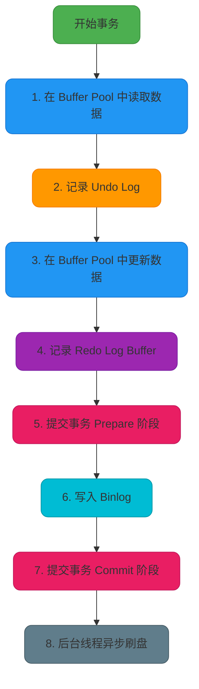
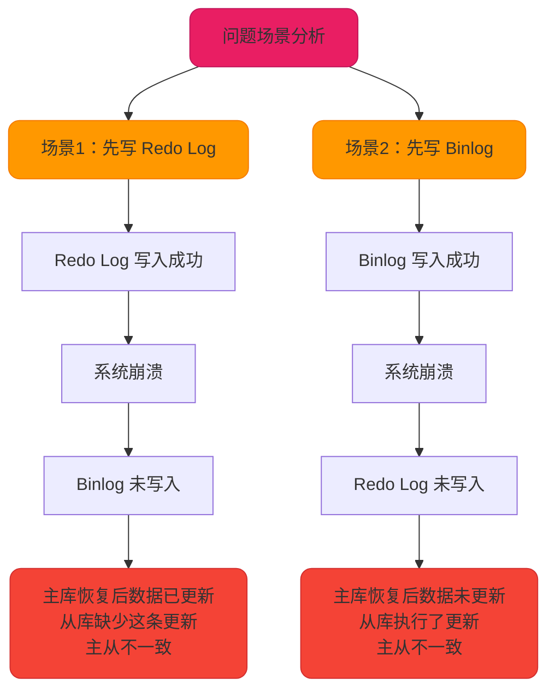
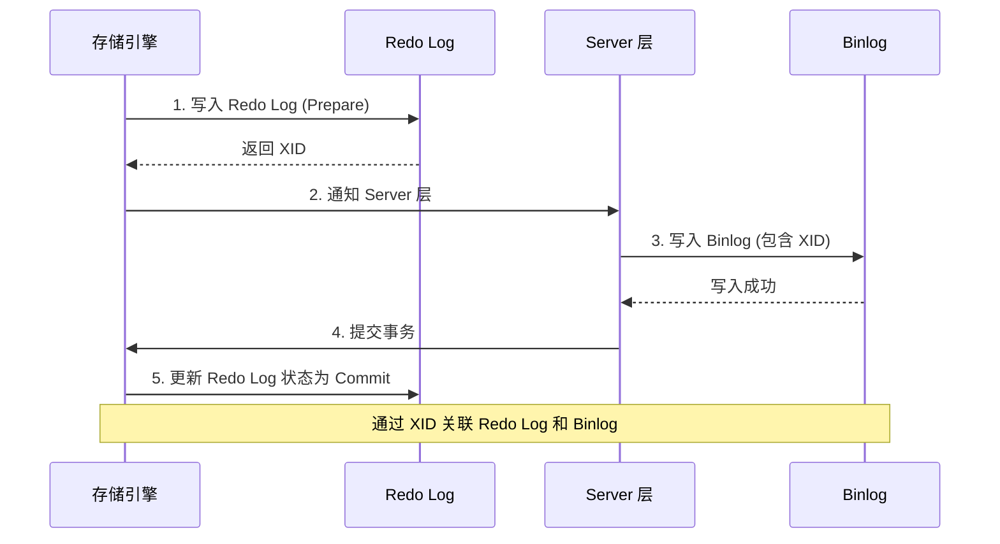

# MySQL事务执行流程与两阶段提交

## InnoDB 事务更新执行流程

在 InnoDB 存储引擎中，一条 UPDATE 语句的执行涉及多个关键组件的协同工作，包括 Buffer Pool、Undo Log、Redo Log、Binlog 以及物理磁盘。理解这个完整的执行流程，对于深入掌握 MySQL 的事务机制至关重要。

### 完整执行流程

一次完整的 InnoDB 更新事务的执行过程包含以下步骤：



### 详细步骤解析

#### 步骤 1：在 Buffer Pool 中读取数据

当 InnoDB 需要更新一条记录时，首先会在 **Buffer Pool（缓冲池）** 中查找该记录所在的数据页。如果数据页不在内存中，则从磁盘读取该页加载到 Buffer Pool。

```sql
-- 示例：更新商品库存
UPDATE product_inventory SET stock = stock - 10 WHERE product_id = 2001;
```

执行这条 SQL 时，InnoDB 会先将 `product_id = 2001` 的数据页加载到 Buffer Pool。

#### 步骤 2：记录 Undo Log

在执行修改操作之前，InnoDB 会在 **Undo Log（回滚日志）** 中记录修改前的原始数据。Undo Log 用于保证事务的原子性和实现 MVCC，在事务回滚或其他事务读取历史版本时使用。

**示例：**

```sql
-- 假设修改前 stock = 100
UPDATE product_inventory SET stock = 90 WHERE product_id = 2001;
-- Undo Log 记录：product_id=2001, stock=100（修改前的值）
```

Undo Log 最初写入内存，然后由后台线程定时刷新到磁盘。

#### 步骤 3：在 Buffer Pool 中更新数据

执行 UPDATE 语句时，InnoDB 会直接在 Buffer Pool 中修改数据，而不是立即写入磁盘。修改后，该数据页会被标记为 **"脏页"（Dirty Page）**，表示该页已被修改但尚未持久化到磁盘。

```sql
-- 在 Buffer Pool 中将 stock 更新为 90
-- 数据页状态：Dirty（脏页）
```

#### 步骤 4：记录 Redo Log Buffer

在更新 Buffer Pool 的同时，InnoDB 会将修改操作记录到 **Redo Log Buffer（重做日志缓冲区）** 中。Redo Log 记录的是"在哪个数据页上做了什么修改"，用于崩溃恢复时重做操作。

```sql
-- Redo Log 记录：product_id=2001, stock 修改为 90
```

Redo Log Buffer 是内存中的缓冲区，后续会在事务提交时刷新到磁盘。

#### 步骤 5：提交事务 - Prepare 阶段

当执行完所有修改操作后，事务进入提交流程。InnoDB 使用 **两阶段提交（2PC）** 协议来保证 Redo Log 和 Binlog 的一致性。

**Prepare 阶段：**
- SQL 已成功执行并生成 Redo Log
- 将 Redo Log 写入磁盘（调用 fsync）
- 在 Redo Log 中记录全局唯一的事务 ID（XID）
- 将 Redo Log 状态标记为 **Prepare**

#### 步骤 6：写入 Binlog

提交事务的第二步是将事务信息记录到 **Binlog（二进制日志）** 中。Binlog 用于实现主从复制和数据恢复。

**Binlog 记录的信息包括：**
- 事务开始时间
- 数据库名、表名
- 事务 ID（XID，与 Redo Log 中的 XID 一致）
- 执行的 SQL 语句（Statement 格式）或数据变更（Row 格式）

```sql
-- Binlog 记录示例（Row 格式）
### UPDATE `ecommerce`.`product_inventory`
### WHERE
###   @1=2001 /* product_id */
###   @2=100  /* stock 旧值 */
### SET
###   @1=2001 /* product_id */
###   @2=90   /* stock 新值 */
```

Binlog 写入磁盘后进入下一阶段。

#### 步骤 7：提交事务 - Commit 阶段

**Commit 阶段：**
- 在存储引擎内部执行 Commit 操作
- 将 Redo Log 状态从 **Prepare** 更新为 **Commit**
- 释放事务持有的锁
- 事务正式提交完成

此时，对外部来说，事务已经成功提交，其他事务可以看到本事务的修改结果。

#### 步骤 8：后台线程异步刷盘

事务提交后，Buffer Pool 中的脏页并不会立即写入磁盘，而是由后台线程（如 Page Cleaner）根据策略异步刷新到磁盘。

MySQL 会在以下时机触发刷盘：
- Buffer Pool 空间不足时
- 定期检查点（Checkpoint）
- 数据库正常关闭时
- Redo Log 空间不足时

这种延迟写入的设计能够显著提升性能，通过批量写入减少磁盘 I/O 次数。

## 两阶段提交（2PC）详解

两阶段提交是 MySQL 为了保证 **Redo Log 和 Binlog 一致性** 而设计的机制。

### 为什么需要两阶段提交？

MySQL 中有两种关键日志：
- **Redo Log**：InnoDB 引擎层的日志，用于崩溃恢复
- **Binlog**：Server 层的日志，用于主从复制和数据恢复

如果这两个日志不一致，会导致严重问题。



**场景 1：先写 Redo Log，再写 Binlog**

假设执行 SQL：
```sql
UPDATE order_info SET status = 'PAID' WHERE order_id = 10001;
```

- Redo Log 写入成功
- 系统崩溃，Binlog 未写入
- MySQL 重启后，根据 Redo Log 恢复，订单状态更新为 `PAID`
- 但 Binlog 中没有这条记录，主从同步时从库订单状态仍为旧值
- **结果：主从数据不一致**

**场景 2：先写 Binlog，再写 Redo Log**

- Binlog 写入成功
- 系统崩溃，Redo Log 未写入
- MySQL 重启后，由于 Redo Log 没写，主库订单状态保持旧值
- 但 Binlog 已写入，主从同步时从库更新为 `PAID`
- **结果：主从数据不一致**

### 两阶段提交流程

为了解决上述问题，MySQL 引入了两阶段提交：



**阶段划分：**

1. **Prepare 阶段**
   - 写入 Redo Log 并标记为 Prepare 状态
   - 在 Redo Log 中记录全局唯一的 XID

2. **Binlog 持久化**
   - 写入 Binlog 到磁盘（调用 fsync）
   - Binlog 中也记录相同的 XID

3. **Commit 阶段**
   - 将 Redo Log 状态从 Prepare 更新为 Commit
   - 事务正式完成

### 崩溃恢复策略

两阶段提交机制能够在崩溃后正确恢复：

**情况 1：Prepare 阶段后崩溃（Binlog 未写入）**

```sql
-- Redo Log: XID=12345, status=Prepare
-- Binlog: 无记录
```

恢复策略：检查 Binlog 中是否存在 XID=12345 的记录
- 不存在 → 回滚事务
- **结果：主库和从库都没有执行这个事务，保持一致**

**情况 2：Binlog 写入后崩溃（Commit 前）**

```sql
-- Redo Log: XID=12345, status=Prepare
-- Binlog: XID=12345 存在且完整
```

恢复策略：检查 Binlog 中是否存在 XID=12345 的记录
- 存在且完整 → 提交事务（将 Redo Log 状态改为 Commit）
- **结果：主库恢复数据，从库通过 Binlog 同步，保持一致**

**情况 3：Commit 阶段崩溃**

```sql
-- Redo Log: XID=12345, status=Commit（或正在更新状态）
-- Binlog: XID=12345 存在
```

恢复策略：同情况 2，直接提交事务
- **结果：数据一致**

### XID 如何保证一致性？

Redo Log 和 Binlog 通过 **XID（事务 ID）** 建立关联：

```plaintext
Redo Log 格式：
+-----------+---------+-----------+
| XID=12345 | Prepare | Data ...  |
+-----------+---------+-----------+

Binlog 格式（Row 格式）：
+-----------+------------------+
| XID=12345 | UPDATE ...       |
+-----------+------------------+
```

MySQL 在崩溃恢复时：
1. 扫描 Redo Log，找到所有 Prepare 状态的事务
2. 检查这些事务的 XID 是否存在于 Binlog 中
3. 如果 Binlog 中有对应的 XID 且完整，则提交事务；否则回滚

### 两阶段提交的关键配置

为了确保两阶段提交的有效性，需要正确配置以下参数：

```sql
-- 设置 Binlog 同步方式
SET GLOBAL sync_binlog = 1;
-- 每次事务提交都立即将 Binlog 刷新到磁盘

-- 设置 Redo Log 刷盘策略
SET GLOBAL innodb_flush_log_at_trx_commit = 1;
-- 每次事务提交都将 Redo Log 刷新到磁盘
```

**性能影响：**
- `sync_binlog=1` 和 `innodb_flush_log_at_trx_commit=1` 提供最高的数据安全性
- 但每次事务都进行磁盘 I/O，会降低性能
- 在高并发场景下，可以适当调整为 `sync_binlog=100`（每 100 个事务刷盘一次）

## 总结

InnoDB 的事务执行流程体现了高性能与数据安全的平衡：

1. **Buffer Pool** 提供内存缓存，减少磁盘 I/O
2. **Undo Log** 保证原子性和 MVCC
3. **Redo Log** 保证持久性和崩溃恢复
4. **Binlog** 实现主从复制和数据归档
5. **两阶段提交** 保证 Redo Log 和 Binlog 的一致性

理解这些机制，能够帮助我们：
- 优化数据库配置，平衡性能和安全性
- 排查主从不一致问题
- 设计更合理的事务操作
