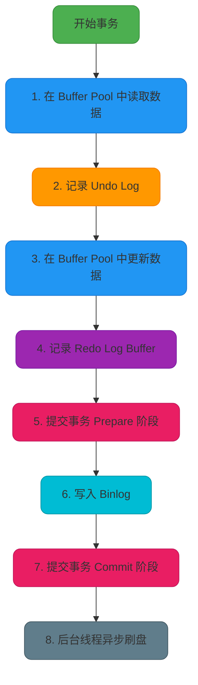
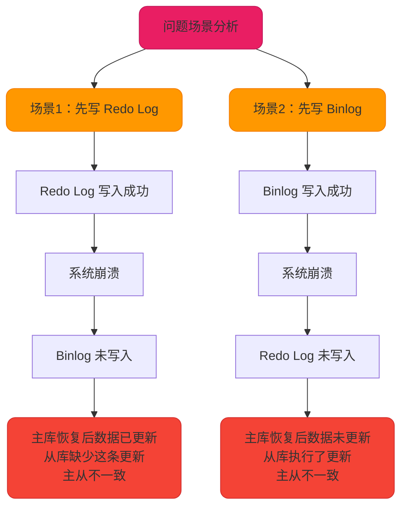
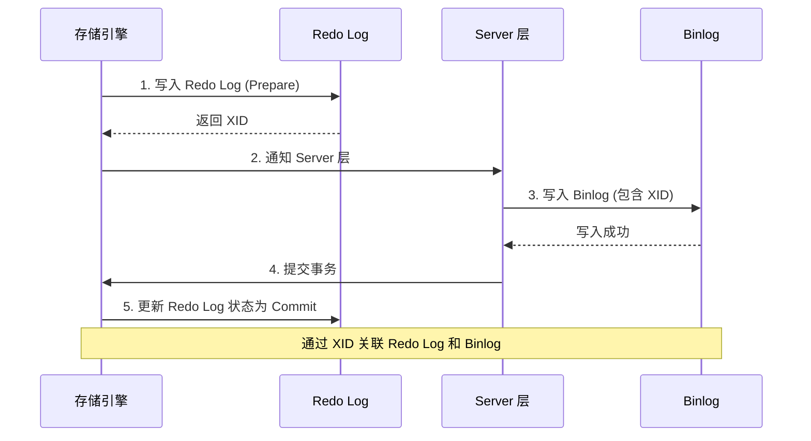
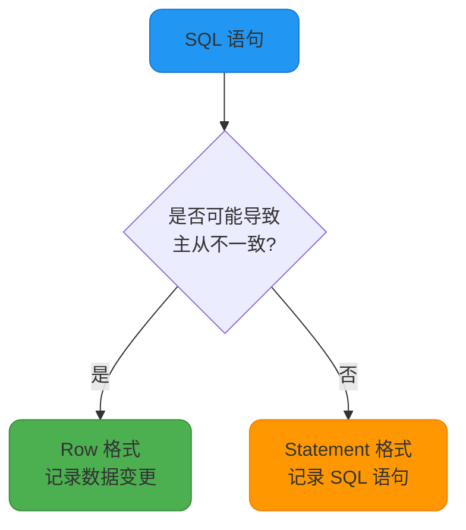
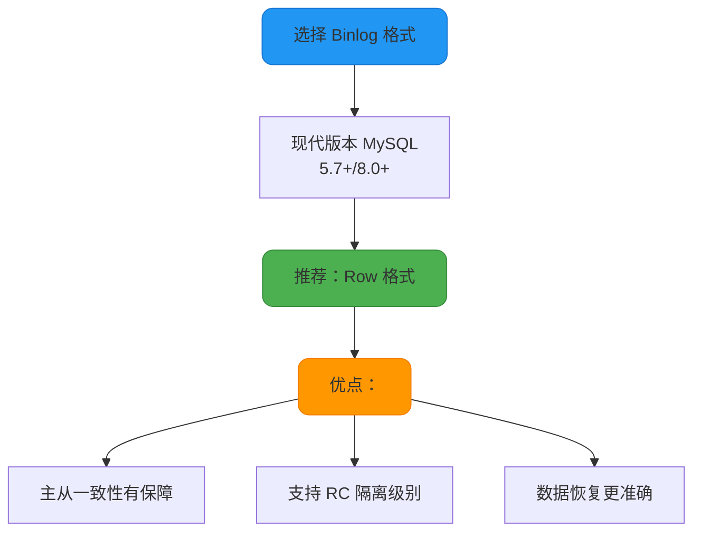
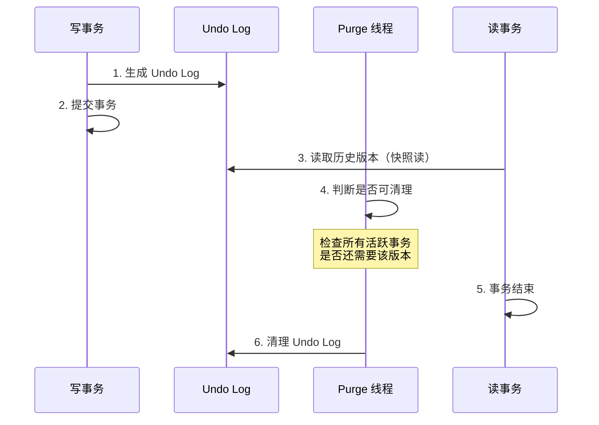
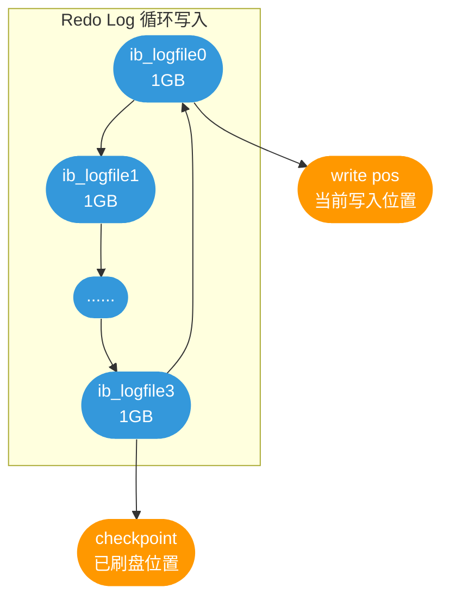
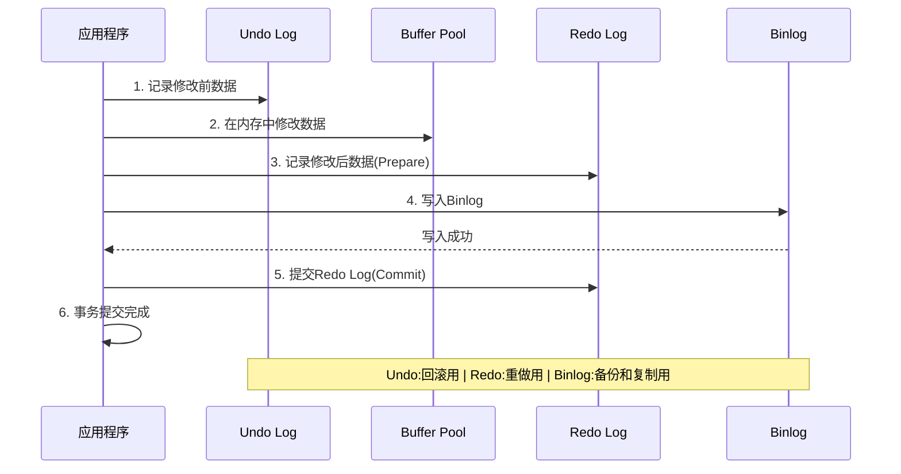
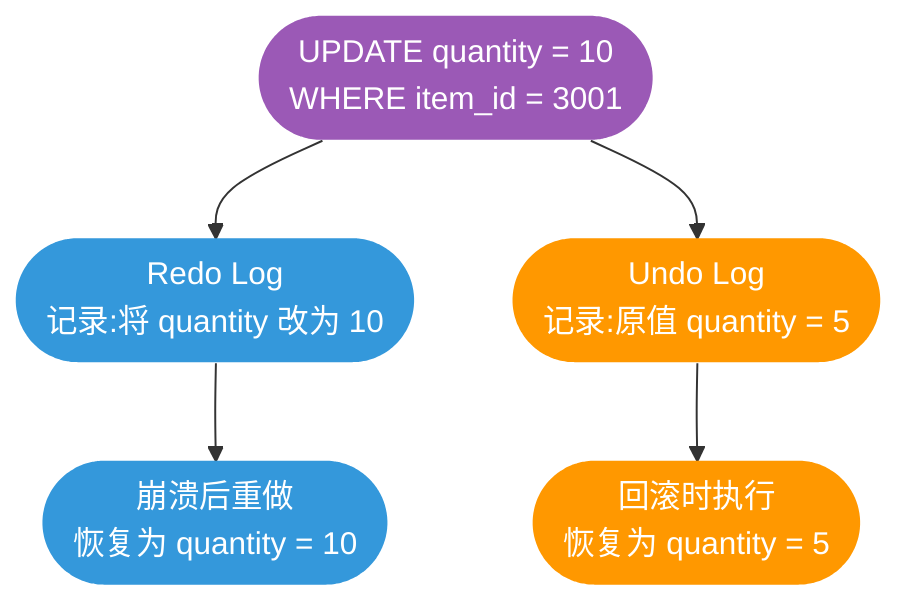

# MySQL事务执行流程与两阶段提交

## InnoDB 事务更新执行流程

在 InnoDB 存储引擎中，一条 UPDATE 语句的执行涉及多个关键组件的协同工作，包括 Buffer Pool、Undo Log、Redo Log、Binlog 以及物理磁盘。理解这个完整的执行流程，对于深入掌握 MySQL 的事务机制至关重要。

### 完整执行流程

一次完整的 InnoDB 更新事务的执行过程包含以下步骤：



### 详细步骤解析

#### 步骤 1：在 Buffer Pool 中读取数据

当 InnoDB 需要更新一条记录时，首先会在 **Buffer Pool（缓冲池）** 中查找该记录所在的数据页。如果数据页不在内存中，则从磁盘读取该页加载到 Buffer Pool。

```sql
-- 示例：更新商品库存
UPDATE product_inventory SET stock = stock - 10 WHERE product_id = 2001;
```

执行这条 SQL 时，InnoDB 会先将 `product_id = 2001` 的数据页加载到 Buffer Pool。

#### 步骤 2：记录 Undo Log

在执行修改操作之前，InnoDB 会在 **Undo Log（回滚日志）** 中记录修改前的原始数据。Undo Log 用于保证事务的原子性和实现 MVCC，在事务回滚或其他事务读取历史版本时使用。

**示例：**

```sql
-- 假设修改前 stock = 100
UPDATE product_inventory SET stock = 90 WHERE product_id = 2001;
-- Undo Log 记录：product_id=2001, stock=100（修改前的值）
```

Undo Log 最初写入内存，然后由后台线程定时刷新到磁盘。

#### 步骤 3：在 Buffer Pool 中更新数据

执行 UPDATE 语句时，InnoDB 会直接在 Buffer Pool 中修改数据，而不是立即写入磁盘。修改后，该数据页会被标记为 **"脏页"（Dirty Page）**，表示该页已被修改但尚未持久化到磁盘。

```sql
-- 在 Buffer Pool 中将 stock 更新为 90
-- 数据页状态：Dirty（脏页）
```

#### 步骤 4：记录 Redo Log Buffer

在更新 Buffer Pool 的同时，InnoDB 会将修改操作记录到 **Redo Log Buffer（重做日志缓冲区）** 中。Redo Log 记录的是"在哪个数据页上做了什么修改"，用于崩溃恢复时重做操作。

```sql
-- Redo Log 记录：product_id=2001, stock 修改为 90
```

Redo Log Buffer 是内存中的缓冲区，后续会在事务提交时刷新到磁盘。

#### 步骤 5：提交事务 - Prepare 阶段

当执行完所有修改操作后，事务进入提交流程。InnoDB 使用 **两阶段提交（2PC）** 协议来保证 Redo Log 和 Binlog 的一致性。

**Prepare 阶段：**
- SQL 已成功执行并生成 Redo Log
- 将 Redo Log 写入磁盘（调用 fsync）
- 在 Redo Log 中记录全局唯一的事务 ID（XID）
- 将 Redo Log 状态标记为 **Prepare**

#### 步骤 6：写入 Binlog

提交事务的第二步是将事务信息记录到 **Binlog（二进制日志）** 中。Binlog 用于实现主从复制和数据恢复。

**Binlog 记录的信息包括：**
- 事务开始时间
- 数据库名、表名
- 事务 ID（XID，与 Redo Log 中的 XID 一致）
- 执行的 SQL 语句（Statement 格式）或数据变更（Row 格式）

```sql
-- Binlog 记录示例（Row 格式）
### UPDATE `ecommerce`.`product_inventory`
### WHERE
###   @1=2001 /* product_id */
###   @2=100  /* stock 旧值 */
### SET
###   @1=2001 /* product_id */
###   @2=90   /* stock 新值 */
```

Binlog 写入磁盘后进入下一阶段。

#### 步骤 7：提交事务 - Commit 阶段

**Commit 阶段：**
- 在存储引擎内部执行 Commit 操作
- 将 Redo Log 状态从 **Prepare** 更新为 **Commit**
- 释放事务持有的锁
- 事务正式提交完成

此时，对外部来说，事务已经成功提交，其他事务可以看到本事务的修改结果。

#### 步骤 8：后台线程异步刷盘

事务提交后，Buffer Pool 中的脏页并不会立即写入磁盘，而是由后台线程（如 Page Cleaner）根据策略异步刷新到磁盘。

MySQL 会在以下时机触发刷盘：
- Buffer Pool 空间不足时
- 定期检查点（Checkpoint）
- 数据库正常关闭时
- Redo Log 空间不足时

这种延迟写入的设计能够显著提升性能，通过批量写入减少磁盘 I/O 次数。

## 两阶段提交（2PC）详解

两阶段提交是 MySQL 为了保证 **Redo Log 和 Binlog 一致性** 而设计的机制。

### 为什么需要两阶段提交？

MySQL 中有两种关键日志：
- **Redo Log**：InnoDB 引擎层的日志，用于崩溃恢复
- **Binlog**：Server 层的日志，用于主从复制和数据恢复

如果这两个日志不一致，会导致严重问题。



**场景 1：先写 Redo Log，再写 Binlog**

假设执行 SQL：
```sql
UPDATE order_info SET status = 'PAID' WHERE order_id = 10001;
```

- Redo Log 写入成功
- 系统崩溃，Binlog 未写入
- MySQL 重启后，根据 Redo Log 恢复，订单状态更新为 `PAID`
- 但 Binlog 中没有这条记录，主从同步时从库订单状态仍为旧值
- **结果：主从数据不一致**

**场景 2：先写 Binlog，再写 Redo Log**

- Binlog 写入成功
- 系统崩溃，Redo Log 未写入
- MySQL 重启后，由于 Redo Log 没写，主库订单状态保持旧值
- 但 Binlog 已写入，主从同步时从库更新为 `PAID`
- **结果：主从数据不一致**

### 两阶段提交流程

为了解决上述问题，MySQL 引入了两阶段提交：



**阶段划分：**

1. **Prepare 阶段**
   - 写入 Redo Log 并标记为 Prepare 状态
   - 在 Redo Log 中记录全局唯一的 XID

2. **Binlog 持久化**
   - 写入 Binlog 到磁盘（调用 fsync）
   - Binlog 中也记录相同的 XID

3. **Commit 阶段**
   - 将 Redo Log 状态从 Prepare 更新为 Commit
   - 事务正式完成

### 崩溃恢复策略

两阶段提交机制能够在崩溃后正确恢复：

**情况 1：Prepare 阶段后崩溃（Binlog 未写入）**

```sql
-- Redo Log: XID=12345, status=Prepare
-- Binlog: 无记录
```

恢复策略：检查 Binlog 中是否存在 XID=12345 的记录
- 不存在 → 回滚事务
- **结果：主库和从库都没有执行这个事务，保持一致**

**情况 2：Binlog 写入后崩溃（Commit 前）**

```sql
-- Redo Log: XID=12345, status=Prepare
-- Binlog: XID=12345 存在且完整
```

恢复策略：检查 Binlog 中是否存在 XID=12345 的记录
- 存在且完整 → 提交事务（将 Redo Log 状态改为 Commit）
- **结果：主库恢复数据，从库通过 Binlog 同步，保持一致**

**情况 3：Commit 阶段崩溃**

```sql
-- Redo Log: XID=12345, status=Commit（或正在更新状态）
-- Binlog: XID=12345 存在
```

恢复策略：同情况 2，直接提交事务
- **结果：数据一致**

### XID 如何保证一致性？

Redo Log 和 Binlog 通过 **XID（事务 ID）** 建立关联：

```plaintext
Redo Log 格式：
+-----------+---------+-----------+
| XID=12345 | Prepare | Data ...  |
+-----------+---------+-----------+

Binlog 格式（Row 格式）：
+-----------+------------------+
| XID=12345 | UPDATE ...       |
+-----------+------------------+
```

MySQL 在崩溃恢复时：
1. 扫描 Redo Log，找到所有 Prepare 状态的事务
2. 检查这些事务的 XID 是否存在于 Binlog 中
3. 如果 Binlog 中有对应的 XID 且完整，则提交事务；否则回滚

### 两阶段提交的关键配置

为了确保两阶段提交的有效性，需要正确配置以下参数：

```sql
-- 设置 Binlog 同步方式
SET GLOBAL sync_binlog = 1;
-- 每次事务提交都立即将 Binlog 刷新到磁盘

-- 设置 Redo Log 刷盘策略
SET GLOBAL innodb_flush_log_at_trx_commit = 1;
-- 每次事务提交都将 Redo Log 刷新到磁盘
```

**性能影响：**
- `sync_binlog=1` 和 `innodb_flush_log_at_trx_commit=1` 提供最高的数据安全性
- 但每次事务都进行磁盘 I/O，会降低性能
- 在高并发场景下，可以适当调整为 `sync_binlog=100`（每 100 个事务刷盘一次）

## Binlog 格式详解

Binlog（二进制日志）是 MySQL 用于记录数据库中所有 DDL 和 DML 语句的日志。它记录了所有对数据库结构和数据的修改操作，主要用于：

- 数据备份和灾难恢复
- 主从复制（主库通过 Binlog 同步数据到从库）
- 数据审计和恢复

MySQL 的 Binlog 主要支持三种格式：**Statement**、**Row** 和 **Mixed**。

### Statement 格式

**特点：** 记录 SQL 语句的原文。

```sql
-- 执行的 SQL
UPDATE order_items SET price = price * 0.9 WHERE order_id = 3001;

-- Binlog 记录（Statement 格式）
UPDATE order_items SET price = price * 0.9 WHERE order_id = 3001;
-- 从库执行相同的 SQL
```

**优点：**
- Binlog 体积小，节省存储空间
- 网络传输效率高

**缺点：**
- 可能导致主从数据不一致

**主从不一致示例：**

```sql
-- 主库执行（没有 ORDER BY）
DELETE FROM user_logs WHERE created_at < '2024-01-01' LIMIT 1000;
-- 删除的具体行取决于执行计划，不确定

-- 从库重放相同 SQL
DELETE FROM user_logs WHERE created_at < '2024-01-01' LIMIT 1000;
-- 可能删除不同的行，导致主从不一致
```

**使用限制：**
- 在 RC（读已提交）隔离级别下，MySQL 禁止使用 Statement 格式
- 因为 RC + Statement 会导致主从数据严重不一致

### Row 格式

**特点：** 记录每个数据行的具体变更。

```sql
-- 执行的 SQL
UPDATE order_items SET price = 90 WHERE item_id = 5001;

-- Binlog 记录（Row 格式）
### UPDATE `shop`.`order_items`
### WHERE
###   @1=5001  /* item_id */
###   @2=100   /* price 旧值 */
### SET
###   @1=5001  /* item_id */
###   @2=90    /* price 新值 */
-- 记录具体的数据变更
```

**优点：**
- 不会导致主从数据不一致
- 记录了准确的数据变更，更安全

**缺点：**
- Binlog 体积大，特别是批量更新时
- 增加磁盘 I/O 和网络 I/O
- 数据恢复耗时较长

**批量更新示例：**

```sql
-- 主库执行
UPDATE product_inventory SET stock = stock + 100 WHERE category = 'Electronics';
-- 假设更新了 10,000 行

-- Statement 格式：只记录 1 条 SQL
-- Row 格式：记录 10,000 行的变更详情
```

### Mixed 格式

**特点：** Statement 和 Row 的混合模式，MySQL 根据 SQL 情况自动选择。



**自动切换规则：**

| **SQL 类型** | **使用格式** | **原因** |
|---|---|---|
| 普通 INSERT/UPDATE/DELETE | Statement | 性能更好 |
| 使用了非确定性函数（NOW()、UUID()） | Row | 避免主从不一致 |
| 使用了 LIMIT 且没有 ORDER BY | Row | 避免不确定性 |
| 修改系统表 | Row | 保证一致性 |

**优点：**
- 智能地平衡性能和一致性
- 默认推荐使用

**配置示例：**

```sql
-- 查看当前 Binlog 格式
SHOW VARIABLES LIKE 'binlog_format';

-- 设置 Binlog 格式为 Row（推荐）
SET GLOBAL binlog_format = 'ROW';

-- 设置为 Mixed
SET GLOBAL binlog_format = 'MIXED';
```

### Binlog 格式选择建议



**现代 MySQL 应用推荐：**
- 使用 **Row 格式** 作为默认选择
- 在高并发场景下使用 **RC 隔离级别**
- 配置 `binlog_row_image=MINIMAL` 减小 Binlog 体积

## Undo Log 清理机制

Undo Log 是 InnoDB 中重要的事务日志，主要作用有两个：

1. **事务回滚**：当事务执行 ROLLBACK 时，使用 Undo Log 将数据恢复到事务开始前的状态
2. **MVCC 支持**：为不同事务提供数据的一致性快照，实现并发控制

### Undo Log 的两种类型

Undo Log 根据操作类型分为两种：

**1. Insert Undo Log**

用于记录 INSERT 操作，主要用于事务回滚。

```sql
-- 插入操作
BEGIN;
INSERT INTO order_items (order_id, product_id, quantity) 
VALUES (1001, 2001, 5);
-- Insert Undo Log 记录：删除 order_id=1001 的记录

-- 如果回滚
ROLLBACK;
-- 执行 Delete 操作恢复
```

**特点：**
- 事务提交后就不再需要，可以立即清理
- 不用于 MVCC

**2. Update Undo Log**

用于记录 UPDATE 和 DELETE 操作，不仅用于回滚，还用于 MVCC 快照读。

```sql
-- 更新操作
BEGIN;
UPDATE order_items SET quantity = 10 WHERE item_id = 3001;
-- Update Undo Log 记录：item_id=3001, quantity=5（旧值）

-- 其他事务可以通过 Undo Log 读取旧版本
COMMIT;
```

**特点：**
- 事务提交后不能立即清理
- 需要等待所有活跃事务不再需要这些快照时才可以清理

### Undo Log 清理时机

InnoDB 通过 **Purge 线程** 在合适的时间进行统一清理。



**清理判断规则：**

对于 Insert Undo Log：
- 事务提交后直接清理

对于 Update Undo Log：
- 必须确保没有活跃事务需要这些日志用于一致性读
- **核心原则：** 如果一个事务在所有当前活跃的读事务开始之前就已经完成并提交，那么这个事务的 Undo Log 就可以清理

**具体实现：**

每个写事务提交时会分配一个递增的事务编号（`trx_no`）。

每个读事务开始时创建 ReadView，记录当前最大的事务提交序号（`m_low_limit_no`）。

```sql
-- 示例场景

-- 时刻 T1：写事务 100 提交，trx_no=100
-- 时刻 T2：读事务 A 开始，m_low_limit_no=101
-- 时刻 T3：写事务 105 提交，trx_no=105
-- 时刻 T4：读事务 B 开始，m_low_limit_no=106

-- Purge 线程判断：
-- 事务 100 的 trx_no < min(所有活跃读事务的 m_low_limit_no)
-- 100 < 101 → 可以清理事务 100 的 Undo Log

-- 事务 105 的 trx_no > min(101, 106) = 101
-- 105 >= 101 → 还不能清理，因为读事务 A 可能需要
```

### 长事务对 Undo Log 的影响

**问题：** 长时间运行的事务会阻止 Purge 线程清理 Undo Log。

```sql
-- 长事务示例
BEGIN;
SELECT * FROM orders WHERE created_at > '2024-01-01';
-- 事务未提交，持续 1 小时

-- 期间其他事务的修改生成大量 Undo Log
-- Purge 线程无法清理，导致版本链过长
```

**影响：**
1. Undo Log 空间持续增长，占用大量磁盘
2. 版本链过长，影响查询性能
3. 可能影响索引覆盖优化

**监控和预防：**

```sql
-- 查找长时间运行的事务
SELECT trx_id, trx_state, trx_started, 
       TIMESTAMPDIFF(SECOND, trx_started, NOW()) as duration_seconds
FROM information_schema.INNODB_TRX 
WHERE TIMESTAMPDIFF(SECOND, trx_started, NOW()) > 300  -- 超过 5 分钟
ORDER BY trx_started;

-- 查看 Undo Log 使用情况
SHOW ENGINE INNODB STATUS\G
-- 查找 "History list length" 指标
```

**最佳实践：**
1. 避免长事务，尽快提交
2. 将大事务拆分为多个小事务
3. 定期监控长时间事务，及时处理
4. 配置合理的 `innodb_max_purge_lag` 参数

## MySQL 三大日志对比:Binlog、Redo Log、Undo Log

在 MySQL 数据库中,Binlog、Redo Log 和 Undo Log 都是日志类型文件,但它们各自的作用和实现方式有所不同。

**核心总结**:
- **Binlog** 主要用来对数据库进行数据备份、崩溃恢复和数据复制等操作
- **Redo Log** 用来做恢复(保证持久性)
- **Undo Log** 用来做回滚(保证原子性和 MVCC)

### 三种日志的核心差异

| **特性** | **Binlog** | **Redo Log** | **Undo Log** |
|---|---|---|---|
| **所属层次** | Server 层 | InnoDB 引擎层 | InnoDB 引擎层 |
| **支持引擎** | 所有引擎 | 仅 InnoDB | 仅 InnoDB |
| **主要作用** | 数据备份、主从复制、崩溃恢复 | 崩溃恢复(重做) | 事务回滚、MVCC |
| **记录内容** | 逻辑日志(SQL语句或数据变更) | 物理日志(数据页修改) | 逻辑日志(修改前的数据) |
| **写入方式** | 追加写入 | 循环写入(覆盖) | 写入 Undo 表空间 |
| **持久化** | 永久保存 | 循环覆盖 | 由 Purge 线程清理 |
| **是否可恢复** | 可用于数据恢复 | 用于崩溃后恢复 | 不用于恢复 |
| **事务关联** | 记录所有已提交事务 | 记录所有修改 | 记录修改前状态 |

### Binlog(二进制日志)

**定义**: Binlog 是 MySQL 用于记录数据库中所有 DDL 和 DML 语句的一种二进制日志。

**主要作用**:
1. **数据备份和灾难恢复**: 通过 Binlog 回放恢复数据
2. **主从复制**: 主库通过 Binlog 同步数据到从库
3. **数据审计**: 记录所有数据变更操作

```sql
-- Binlog 记录示例
UPDATE order_items SET quantity = 5 WHERE item_id = 3001;

-- Binlog 记录(Row 格式)
### UPDATE `shop`.`order_items`
### WHERE
###   @1=3001  /* item_id */
###   @2=3     /* quantity 旧值 */
### SET
###   @1=3001  /* item_id */
###   @2=5     /* quantity 新值 */
```

**特点**:
- 属于 Server 层,所有存储引擎都支持
- 追加写入,不会覆盖旧日志
- 可以永久保存(直到手动删除)
- 支持三种格式:Statement、Row、Mixed

### Redo Log(重做日志)

**定义**: Redo Log 是 InnoDB 用于实现崩溃恢复和数据持久性的一种机制。

**主要作用**:
1. **崩溃恢复**: 系统重启后重做已提交但未刷盘的事务
2. **保证持久性**: 即使数据未写入磁盘,事务也能成功提交

```sql
-- 示例:更新订单状态
UPDATE orders SET status = 'PAID' WHERE order_id = 10001;

-- Redo Log 记录(物理日志)
-- 在表空间 ID=100,页号=50,偏移量=200 处
-- 将 status 字段从 0 修改为 1
```

**特点**:
- 属于 InnoDB 引擎层,仅适用于 InnoDB
- 记录的是数据页的物理修改("做了什么改动")
- 循环写入,空间固定,会覆盖旧日志
- 写入速度快,顺序 I/O



### Undo Log(回滚日志)

**定义**: Undo Log 用于在事务回滚或系统崩溃时撤销事务所做的修改。

**主要作用**:
1. **事务回滚**: ROLLBACK 时恢复数据到事务开始前的状态
2. **MVCC 支持**: 为不同事务提供一致性快照

```sql
-- 示例:更新操作
BEGIN;
UPDATE order_items SET quantity = 10 WHERE item_id = 3001;
-- Undo Log 记录:item_id=3001, quantity=5(旧值)

-- 回滚操作
ROLLBACK;
-- 执行:UPDATE order_items SET quantity = 5 WHERE item_id = 3001
```

**特点**:
- 属于 InnoDB 引擎层,仅适用于 InnoDB
- 记录的是修改前的数据("修改前是什么")
- 由 Purge 线程在合适时机清理
- 支持 MVCC 多版本并发控制

### 三种日志的协同工作



**执行流程详解**:

1. **Undo Log 记录**: 修改数据前,先将旧值写入 Undo Log
2. **修改 Buffer Pool**: 在内存中更新数据页
3. **Redo Log Prepare**: 将修改记录到 Redo Log,状态为 Prepare
4. **写入 Binlog**: 将事务写入 Binlog 并刷盘
5. **Redo Log Commit**: 将 Redo Log 状态改为 Commit
6. **事务完成**: 对外表示事务已提交

### Redo Log vs Undo Log

**目的不同**:
- **Redo Log**: 保证事务的持久性,用于崩溃恢复
- **Undo Log**: 保证事务的原子性和一致性,用于事务回滚

**记录内容不同**:
- **Redo Log**: 记录事务的所有数据更改(这些日志不仅仅记录了数据更改的最终结果,而且还记录了实现这些更改的具体操作)
- **Undo Log**: 记录的是事务执行前的内容



### 记忆技巧

很多人不知道该怎么记忆,可以这么记忆:

1. **Undo** 就是回退的意思,就跟在文本编辑器里面有一个 Undo 按钮一样,你编辑的东西,按一下这个 Undo 按钮就回退到上一个版本了。

2. **Redo** 是 "re"+"do","re" 就是重来一次的意思,"do" 就是做的意思。所以连在一起,就是重新再做一遍,也就是重新再执行一次 SQL。那么什么时候需要重新再执行一次 SQL 呢?执行的数据丢了嘛,自然就需要重新执行一次。

3. **Bin** 就是 "binary" 的缩写,"binary" 就是二进制的意思,可以引申为 "原始" 的意思,所以 Binlog 就是最全最原始的东西,里面包含了一切,所以可以用来做备份,有了它,就有了一切。

## 总结

InnoDB 的事务执行流程体现了高性能与数据安全的平衡：

1. **Buffer Pool** 提供内存缓存，减少磁盘 I/O
2. **Undo Log** 保证原子性和 MVCC
3. **Redo Log** 保证持久性和崩溃恢复
4. **Binlog** 实现主从复制和数据归档
5. **两阶段提交** 保证 Redo Log 和 Binlog 的一致性

理解这些机制，能够帮助我们：
- 优化数据库配置，平衡性能和安全性
- 排查主从不一致问题
- 设计更合理的事务操作
