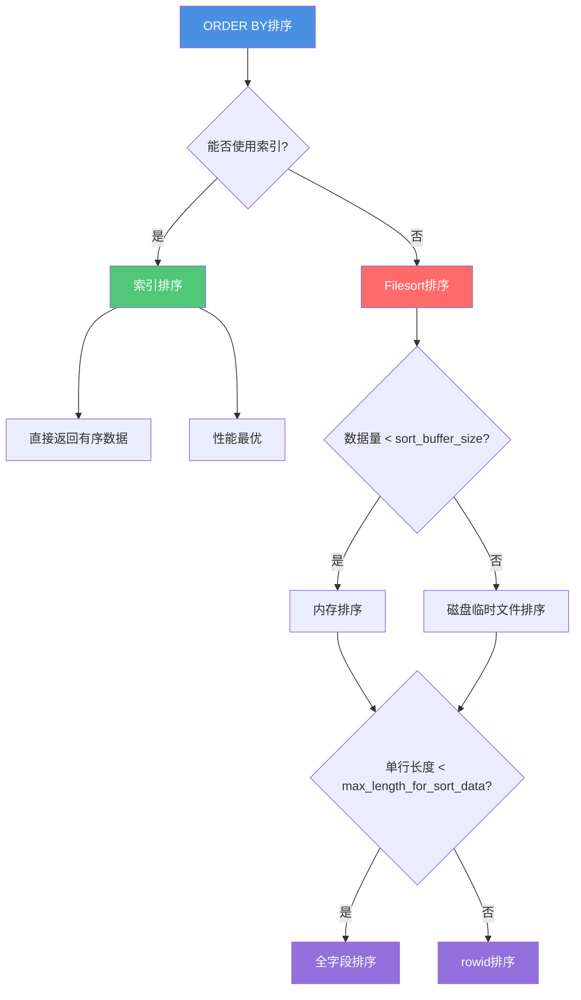
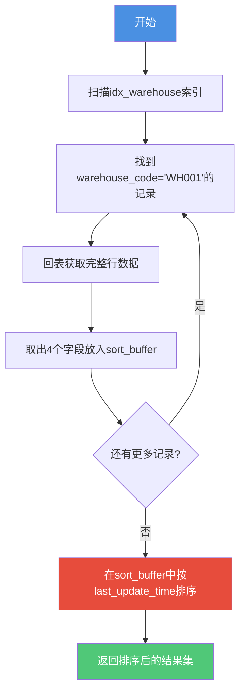
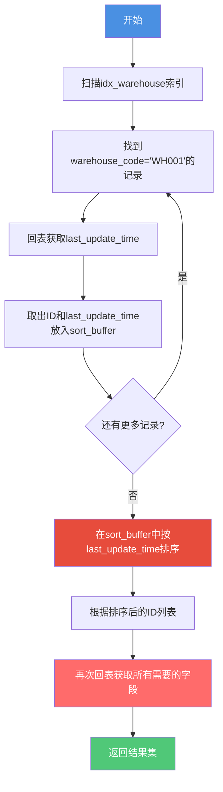
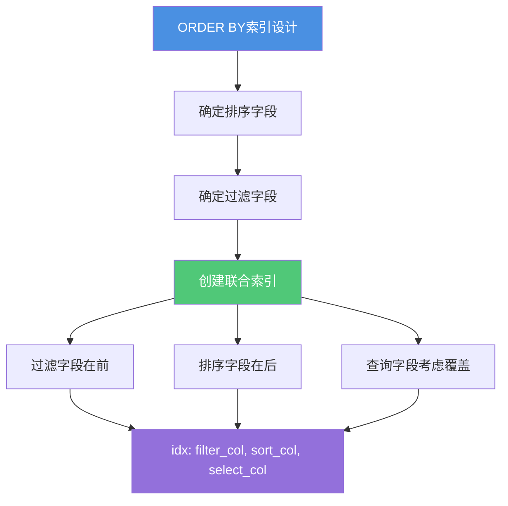

# ORDER BY排序机制与优化

## ORDER BY的执行原理

在MySQL中,ORDER BY子句用于对查询结果进行排序。MySQL会根据查询优化器的成本评估,选择最优的排序方式。主要有两种实现方式:

1. **索引排序** - 利用索引的天然有序性
2. **filesort排序** - 在内存或磁盘中进行额外排序



## 索引排序

索引本身是按照一定顺序组织的B+树结构,因此如果ORDER BY能够利用索引,就可以避免额外的排序操作。

### 使用条件

MySQL优化器会综合考虑以下因素决定是否使用索引排序:

1. **索引覆盖** - 查询字段和排序字段组成联合索引
2. **最左前缀匹配** - WHERE条件符合索引的最左前缀
3. **LIMIT限制** - 使用LIMIT且数量不大
4. **前导列为常量** - 联合索引前导列通过等值条件查询

### 索引排序示例

假设有如下表结构:

```sql
CREATE TABLE product_inventory (
  id INT PRIMARY KEY,
  warehouse_code VARCHAR(64),
  product_code VARCHAR(64),
  stock_quantity INT,
  last_update_time DATETIME,
  KEY idx_warehouse_product (warehouse_code, product_code),
  KEY idx_warehouse (warehouse_code)
) ENGINE=InnoDB;
```

#### 场景一:索引覆盖+最左前缀

```sql
-- 查询和排序字段都在联合索引中
SELECT warehouse_code, product_code, stock_quantity 
FROM product_inventory 
ORDER BY warehouse_code;
```

执行计划:
```
+------+-------+---------------------------+-------+
| type | key   | Extra                     | rows  |
+------+-------+---------------------------+-------+
| index| idx_w_p | Using index             | 5000  |
+------+-------+---------------------------+-------+
```

**分析**: 
- 使用了索引排序,无需filesort
- Using index表示覆盖索引,无需回表

#### 场景二:LIMIT优化

```sql
-- 添加LIMIT限制
SELECT * FROM product_inventory 
ORDER BY warehouse_code 
LIMIT 50;
```

**分析**:
- 即使需要回表,由于LIMIT数量小
- 优化器倾向于使用索引排序
- LIMIT数量过大时(如超过表数据20%),可能不走索引

#### 场景三:前导列常量查询

```sql
-- 前导列通过等值查询
SELECT * FROM product_inventory 
WHERE warehouse_code = 'WH001' 
ORDER BY product_code;
```

执行计划:
```
+------+---------------+-------+
| type | key           | Extra |
+------+---------------+-------+
| ref  | idx_w_p       | NULL  |
+------+---------------+-------+
```

**分析**:
- warehouse_code确定后,按product_code排序可利用索引有序性
- 无需额外排序

### 索引排序失效场景

以下情况无法使用索引排序:

```sql
-- 1. 违反最左前缀(索引:idx_w_p)
SELECT * FROM product_inventory ORDER BY product_code;

-- 2. 排序字段不在索引中
SELECT * FROM product_inventory 
WHERE warehouse_code = 'WH001' 
ORDER BY last_update_time;

-- 3. 混合ASC和DESC(MySQL 8.0之前)
SELECT * FROM product_inventory 
ORDER BY warehouse_code ASC, product_code DESC;

-- 4. 排序字段有函数操作
SELECT * FROM product_inventory 
ORDER BY DATE_FORMAT(last_update_time, '%Y-%m-%d');
```

## Filesort排序详解

当无法使用索引排序时,MySQL会执行filesort操作,在内存或磁盘中完成排序。

### 关键参数

**sort_buffer_size**
- 作用: 控制排序缓冲区大小
- 默认值: 256KB
- 影响:
  - 数据量 ≤ sort_buffer_size → 内存排序
  - 数据量 > sort_buffer_size → 磁盘临时文件排序(归并排序)

**max_length_for_sort_data**
- 作用: 控制单行数据长度阈值
- 默认值: 1024字节
- 影响:
  - 单行长度 ≤ max_length_for_sort_data → 全字段排序
  - 单行长度 > max_length_for_sort_data → rowid排序

### 全字段排序(单路排序)

全字段排序将所有需要查询的字段都放入sort_buffer中进行排序,排序完成后直接返回结果,无需二次回表。

#### 执行流程

```sql
SELECT warehouse_code, product_code, stock_quantity, last_update_time
FROM product_inventory
WHERE warehouse_code = 'WH001'
ORDER BY last_update_time;
```

执行步骤:



1. 从索引idx_warehouse找到warehouse_code='WH001'的第一条记录的主键ID
2. 根据主键ID回表,取出warehouse_code、product_code、stock_quantity、last_update_time四个字段
3. 将这四个字段的值存入sort_buffer
4. 继续查找下一条符合条件的记录,重复步骤1-3
5. 在sort_buffer中按last_update_time字段排序
6. 将排序后的结果直接返回给客户端

#### 优缺点分析

**优点**:
- 只需回表一次
- 排序完成后直接返回,无二次查询
- 整体效率较高

**缺点**:
- 字段多时占用sort_buffer空间大
- 可能导致sort_buffer放不下数据
- 更容易触发磁盘临时文件排序

### rowid排序(双路排序)

rowid排序只将排序字段和主键ID放入sort_buffer,排序完成后再根据ID回表获取其他字段,需要二次回表。

#### 执行流程

```sql
-- 假设这些字段总长度超过max_length_for_sort_data
SELECT warehouse_code, product_code, stock_quantity, last_update_time, 
       description, location
FROM product_inventory
WHERE warehouse_code = 'WH001'
ORDER BY last_update_time;
```

执行步骤:



1. 从索引idx_warehouse找到warehouse_code='WH001'的第一条记录的主键ID
2. 根据主键ID回表,只取出last_update_time字段
3. 将ID和last_update_time存入sort_buffer
4. 继续查找下一条符合条件的记录,重复步骤1-3
5. 在sort_buffer中按last_update_time排序
6. **根据排序后的ID列表,再次回表查询所有需要的字段**
7. 将结果返回给客户端

#### 优缺点分析

**优点**:
- sort_buffer中每行数据占用空间小
- 可以容纳更多记录进行排序
- 不容易触发磁盘临时文件排序

**缺点**:
- 需要两次回表操作
- 增加了随机IO次数
- 整体耗时更长

### 排序算法选择策略

MySQL会智能选择排序算法:

```
if (单行长度 <= max_length_for_sort_data) {
    使用全字段排序;  // 速度优先
} else {
    使用rowid排序;   // 空间优先
}
```

**总体原则**: 速度优先、内存优先、一次回表优先

## Using filesort优化策略

当执行计划中出现`Using filesort`时,说明无法利用索引排序,需要额外的排序操作,这通常是性能优化的关键点。

### 优化方向一:创建合适的索引

最直接的优化方式是创建包含排序字段的索引。

#### 单字段排序

```sql
-- 优化前
SELECT * FROM product_inventory 
WHERE warehouse_code = 'WH001'
ORDER BY last_update_time
LIMIT 20;
```

执行计划显示Using filesort:
```
+------+---------------+------+-------+----------------+
| type | key           | rows | Extra              |
+------+---------------+------+-------+----------------+
| ref  | idx_warehouse | 5000 | Using filesort     |
+------+---------------+------+-------+----------------+
```

**优化方案**:
```sql
-- 创建联合索引
CREATE INDEX idx_warehouse_time ON product_inventory(warehouse_code, last_update_time);
```

优化后:
```
+------+-------------------+------+-------+
| type | key               | rows | Extra |
+------+-------------------+------+-------+
| ref  | idx_warehouse_time| 5000 | NULL  |
+------+-------------------+------+-------+
```

#### 多字段排序

```sql
-- 优化前
SELECT * FROM product_inventory 
ORDER BY warehouse_code, product_code
LIMIT 50;
```

**优化方案**:
```sql
-- 创建复合索引,顺序要与ORDER BY一致
CREATE INDEX idx_w_p_sort ON product_inventory(warehouse_code, product_code);
```

### 优化方向二:调整sort_buffer_size

如果无法通过索引消除filesort,可以通过增大sort_buffer_size来提升排序性能。

#### 查看当前配置

```sql
SHOW VARIABLES LIKE 'sort_buffer_size';
```

#### 调整策略

```sql
-- 会话级别调整(仅影响当前连接)
SET SESSION sort_buffer_size = 2097152;  -- 2MB

-- 全局级别调整(影响新建连接)
SET GLOBAL sort_buffer_size = 4194304;   -- 4MB
```

**注意事项**:
- 不宜设置过大,每个需要排序的线程都会分配这么多内存
- 建议根据实际排序数据量设置
- 典型值: 256KB ~ 4MB

#### 效果对比

sort_buffer_size不足时:
```
# 磁盘临时文件排序,使用归并算法
Sort_merge_passes: 10
Sort_rows: 50000
```

sort_buffer_size充足时:
```
# 内存中完成排序
Sort_merge_passes: 0
Sort_rows: 50000
```

### 优化方向三:减少排序数据量

通过WHERE条件过滤、LIMIT限制等方式减少需要排序的数据量。

```sql
-- 优化前:对所有数据排序
SELECT * FROM product_inventory 
ORDER BY last_update_time DESC 
LIMIT 20;

-- 优化后:先过滤再排序
SELECT * FROM product_inventory 
WHERE last_update_time >= DATE_SUB(NOW(), INTERVAL 7 DAY)
ORDER BY last_update_time DESC 
LIMIT 20;
```

### 优化方向四:覆盖索引避免回表

如果排序字段在索引中,尽量让查询字段也在索引中,形成覆盖索引。

```sql
-- 优化前:需要回表
SELECT warehouse_code, product_code, stock_quantity
FROM product_inventory
ORDER BY warehouse_code, product_code;

-- 优化后:添加stock_quantity到索引
CREATE INDEX idx_w_p_s ON product_inventory(
    warehouse_code, product_code, stock_quantity
);
```

优化后执行计划:
```
+-------+----------+--------------+
| key   | rows     | Extra        |
+-------+----------+--------------+
| idx_w_p_s | 1000 | Using index  |
+-------+----------+--------------+
```

## ORDER BY最佳实践

### 索引设计原则



### 常见陷阱与避免

#### 陷阱一:ORDER BY与WHERE不匹配

```sql
-- 错误:排序字段不在WHERE条件的索引中
-- 索引:idx_warehouse(warehouse_code)
SELECT * FROM product_inventory
WHERE warehouse_code = 'WH001'
ORDER BY product_code;  -- 无法利用索引排序
```

**解决方案**:
```sql
CREATE INDEX idx_warehouse_product ON product_inventory(warehouse_code, product_code);
```

#### 陷阱二:多列排序顺序错误

```sql
-- 错误:索引列顺序与ORDER BY不一致
-- 索引:idx_product_warehouse(product_code, warehouse_code)
SELECT * FROM product_inventory
ORDER BY warehouse_code, product_code;  -- 无法利用索引
```

**解决方案**:
```sql
-- 索引顺序要与ORDER BY一致
CREATE INDEX idx_warehouse_product ON product_inventory(warehouse_code, product_code);
```

#### 陷阱三:范围查询+排序

```sql
-- 索引:idx_w_p(warehouse_code, product_code)
SELECT * FROM product_inventory
WHERE warehouse_code IN ('WH001', 'WH002')  -- 范围查询
ORDER BY product_code;  -- 无法完全利用索引排序
```

**原因**: IN条件视为范围查询,无法保证product_code有序

**解决方案**:
- 减少IN中的值数量
- 考虑拆分为多个查询后在应用层合并

### 性能优化检查清单

在进行ORDER BY优化时,按以下清单检查:

- [ ] 执行计划中是否有`Using filesort`?
- [ ] 排序字段是否有索引?
- [ ] 索引列顺序是否与ORDER BY一致?
- [ ] 是否遵循最左前缀匹配?
- [ ] 是否可以使用覆盖索引避免回表?
- [ ] sort_buffer_size是否足够?
- [ ] 是否可以通过WHERE减少排序数据量?
- [ ] 是否可以在应用层分批排序?

## 排序性能监控

### 关键指标

```sql
-- 查看排序相关状态
SHOW STATUS LIKE 'Sort%';
```

| 指标 | 含义 | 期望值 |
|------|------|--------|
| Sort_merge_passes | 归并排序的趟数 | 越小越好,0最优 |
| Sort_range | 使用范围的排序数 | - |
| Sort_rows | 已排序的行数 | - |
| Sort_scan | 全表扫描后的排序数 | 越小越好 |

### 性能分析示例

```sql
-- 执行前查看状态
SHOW STATUS LIKE 'Sort%';

-- 执行排序查询
SELECT * FROM product_inventory
ORDER BY last_update_time
LIMIT 1000;

-- 再次查看状态
SHOW STATUS LIKE 'Sort%';
```

**分析要点**:
- Sort_merge_passes > 0: 表示使用了磁盘临时文件,考虑增大sort_buffer_size
- Sort_scan较大: 表示大量全表扫描后排序,考虑添加索引

## 总结

ORDER BY的优化核心在于:

1. **优先使用索引排序** - 创建合适的索引,让MySQL利用索引有序性
2. **优化filesort配置** - 调整sort_buffer_size,尽量在内存中完成排序
3. **减少排序数据量** - 通过WHERE过滤、LIMIT限制减少需要排序的行数
4. **使用覆盖索引** - 避免回表操作,提升整体性能

理解全字段排序和rowid排序的区别,有助于我们更好地诊断和优化排序性能问题。在实际应用中,要根据具体场景选择最合适的优化策略。
