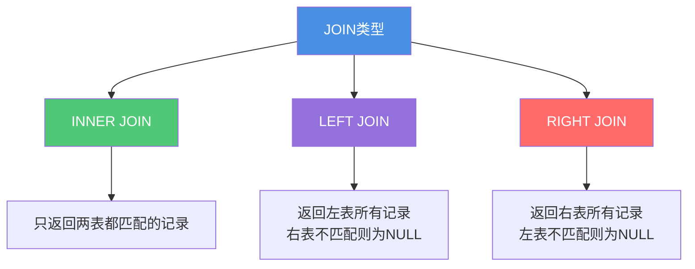
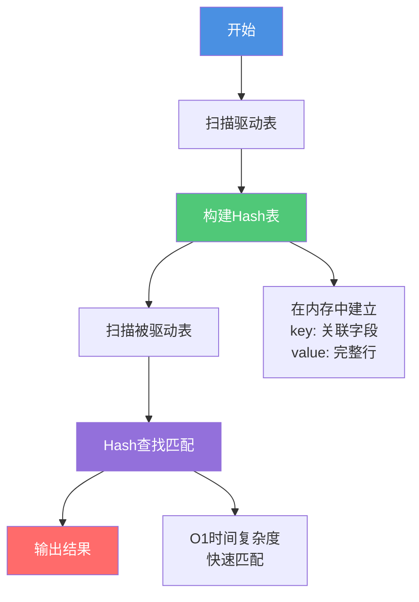
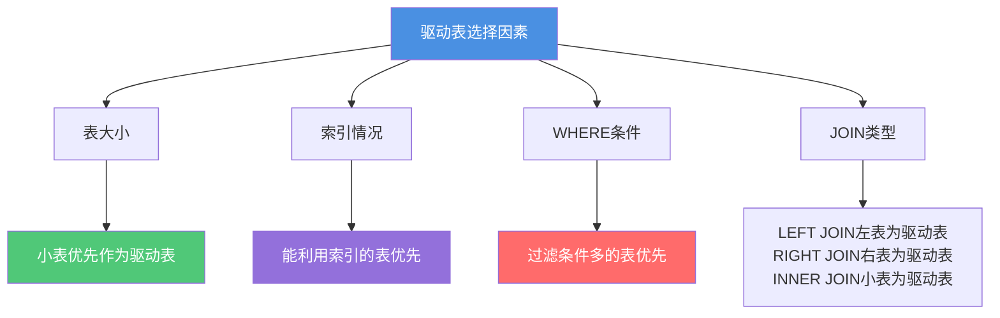
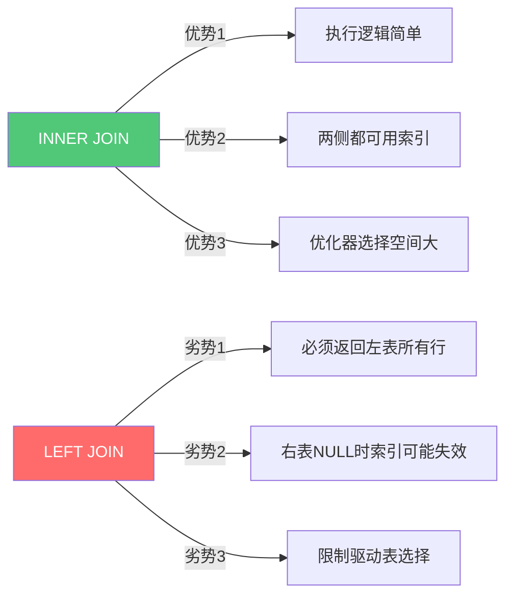

# JOIN查询优化与实战

## 为什么要谨慎使用多表JOIN

在企业级应用开发中,特别是互联网大厂的开发规范中,通常会限制或禁止使用多表JOIN。这并非简单的"一刀切",而是基于性能、可维护性、扩展性等多方面的综合考量。

### JOIN性能问题的根源

MySQL采用嵌套循环(Nested-Loop Join)算法实现关联查询,其本质是通过多层循环进行数据匹配:


#### 复杂度分析

不同JOIN场景下的时间复杂度:

| 表数量 | 算法类型 | 复杂度 | 说明 |
|-------|---------|--------|------|
| 2表JOIN | Simple NLJ | O(N × M) | N,M分别为两表行数 |
| 2表JOIN | Index NLJ | O(N × log M) | 被驱动表有索引 |
| 2表JOIN | Block NLJ | O(N × M) | 使用join buffer优化 |
| 3表JOIN | - | O(N × M × K) | 复杂度指数增长 |
| 4表JOIN | - | O(N × M × K × L) | 性能急剧下降 |

**关键发现**: 
- JOIN表越多,复杂度呈指数级增长
- 即使优化到O(N × log M),在大数据量下仍然很慢
- 多表JOIN会导致笛卡尔积风险

## MySQL的JOIN实现机制

### JOIN类型详解

MySQL支持三种JOIN类型,它们在数据获取范围上有本质区别:



#### INNER JOIN示例

```sql
-- 查询有订单的客户信息
SELECT c.customer_name, o.order_number
FROM customers c
INNER JOIN orders o ON c.customer_id = o.customer_id;
```

**结果**: 只返回既在customers表又在orders表中存在的记录。

#### LEFT JOIN示例

```sql
-- 查询所有客户及其订单(包括没有订单的客户)
SELECT c.customer_name, o.order_number
FROM customers c
LEFT JOIN orders o ON c.customer_id = o.customer_id;
```

**结果**: 返回customers表的所有记录,如果某客户没有订单,order_number为NULL。

#### RIGHT JOIN示例

```sql
-- 查询所有订单及对应客户信息
SELECT c.customer_name, o.order_number
FROM customers c
RIGHT JOIN orders o ON c.customer_id = o.customer_id;
```

**结果**: 返回orders表的所有记录,如果订单没有对应客户,customer_name为NULL。

### 嵌套循环JOIN算法

#### Simple Nested-Loop Join

最基础的嵌套循环算法,逐行扫描两个表进行比较:

```sql
-- 伪代码实现
for (row_c in customers) {          // 外循环:扫描驱动表
    for (row_o in orders) {         // 内循环:扫描被驱动表
        if (row_c.id == row_o.customer_id) {
            output(row_c, row_o);   // 输出匹配记录
        }
    }
}
```

**性能分析**:
```
时间复杂度: O(N × M)
如果customers有1000行,orders有10000行
总比较次数: 1000 × 10000 = 1000万次
```

**问题**: 全表扫描,性能极差,实际生产环境中MySQL很少使用。

#### Index Nested-Loop Join

当被驱动表的关联字段有索引时,可以使用索引加速查询:

```sql
-- 假设orders.customer_id有索引
for (row_c in customers) {                    // 扫描驱动表
    rows = index_lookup(orders, row_c.id);   // 索引查找
    for (row_o in rows) {
        output(row_c, row_o);
    }
}
```

**性能分析**:
```
时间复杂度: O(N × log M)
如果customers有1000行,orders有10000行
总查找次数: 1000 × log₂(10000) ≈ 1000 × 13.3 = 13300次
```

**优势**: 利用索引的B+树结构,大幅减少比较次数。

#### Block Nested-Loop Join

引入join buffer(连接缓冲区)批量处理数据:

```sql
-- 伪代码实现
join_buffer = [];
for (row_c in customers) {
    join_buffer.add(row_c);      // 批量加载到内存
    if (join_buffer.is_full()) {
        for (row_o in orders) {
            for (row_c in join_buffer) {
                if (match(row_c, row_o)) {
                    output(row_c, row_o);
                }
            }
        }
        join_buffer.clear();
    }
}
```

**性能分析**:
```
虽然比较次数仍是O(N × M)
但join buffer在内存中,访问速度快
减少了磁盘IO次数
```

**优势**: 
- 减少被驱动表的扫描次数
- 内存操作速度远快于磁盘IO
- 可通过`join_buffer_size`参数调整缓冲区大小

### Hash Join(MySQL 8.0.18+)

MySQL 8.0.18引入了Hash Join算法,专门优化等值连接(equal join)场景。

#### 执行流程



#### 示例

```sql
-- MySQL 8.0.18+ 自动使用Hash Join
SELECT c.customer_name, o.order_number
FROM customers c
JOIN orders o ON c.customer_id = o.customer_id;
```

执行计划显示:
```
+----+-------------+-------+--------+
| id | select_type | table | Extra  |
+----+-------------+-------+--------+
|  1 | SIMPLE      | c     | NULL   |
|  1 | SIMPLE      | o     | Hash join |
+----+-------------+-------+--------+
```

**性能优势**:
```
时间复杂度: O(N + M)
customers: 1000行 → 构建Hash表: 1000次
orders: 10000行 → Hash查找: 10000次
总操作: 11000次 (vs NLJ的1000万次)
```

#### 适用场景

Hash Join适合:
- 等值连接(ON a.id = b.id)
- 较大数据集的JOIN
- 无索引的表连接

不适合:
- 非等值连接(ON a.id > b.id)
- 范围连接

## 驱动表选择策略

驱动表是JOIN操作中先被访问的表,其选择直接影响查询性能。

### 什么是驱动表

在嵌套循环JOIN中:
- **驱动表**: 外循环遍历的表,先读取
- **被驱动表**: 内循环遍历的表,后读取

```sql
SELECT *
FROM table_a
JOIN table_b ON table_a.id = table_b.foreign_id;

-- 如果table_a是驱动表:
for (row_a in table_a) {      // 驱动表
    for (row_b in table_b) {  // 被驱动表
        if (match) output;
    }
}
```

### 判断驱动表的方法

使用EXPLAIN查看执行计划,第一行出现的表即为驱动表:

```sql
EXPLAIN SELECT *
FROM customers c
JOIN orders o ON c.customer_id = o.customer_id;
```

```
+----+-------------+-------+------+
| id | select_type | table | rows |
+----+-------------+-------+------+
|  1 | SIMPLE      | c     | 100  |  ← 驱动表
|  1 | SIMPLE      | o     | 5000 |  ← 被驱动表
+----+-------------+-------+------+
```

### MySQL的驱动表选择原则

优化器会综合考虑以下因素:



#### 因素一:表大小(小表驱动大表)

假设:
- customers表: 1000行
- orders表: 100000行
- 两表关联字段都有索引

**小表驱动大表**:
```
复杂度: O(1000) × O(log 100000)
      = 1000 × 16.6
      ≈ 16600次操作
```

**大表驱动小表**:
```
复杂度: O(100000) × O(log 1000)
      = 100000 × 10
      = 1000000次操作
```

**结论**: 小表驱动大表效率提升约60倍!

#### 因素二:索引利用

```sql
-- 场景:customers.id有索引,orders.customer_id无索引
SELECT *
FROM customers c
JOIN orders o ON c.id = o.customer_id;

-- 优化器选择orders为驱动表
-- 原因:可以利用customers.id索引加速查找
```

#### 因素三:WHERE条件过滤

```sql
SELECT *
FROM customers c
JOIN orders o ON c.customer_id = o.customer_id
WHERE o.order_date >= '2024-01-01';  -- orders表有过滤条件

-- 优化器倾向选择orders为驱动表
-- 原因:WHERE条件可以先过滤数据,减少后续JOIN量
```

#### 因素四:JOIN类型约束

```sql
-- LEFT JOIN:左表一定是驱动表
SELECT *
FROM customers c
LEFT JOIN orders o ON c.customer_id = o.customer_id;
-- 驱动表:customers(必须返回所有客户)

-- RIGHT JOIN:右表一定是驱动表  
SELECT *
FROM customers c
RIGHT JOIN orders o ON c.customer_id = o.customer_id;
-- 驱动表:orders(必须返回所有订单)

-- INNER JOIN:优化器自动选择
SELECT *
FROM customers c
INNER JOIN orders o ON c.customer_id = o.customer_id;
-- 驱动表:由优化器根据成本选择
```

### 手动指定驱动表

使用`STRAIGHT_JOIN`强制指定JOIN顺序(仅适用于INNER JOIN):

```sql
SELECT *
FROM table1
STRAIGHT_JOIN table2 ON table1.id = table2.foreign_id;
-- 强制table1作为驱动表
```

**使用场景**:
- 优化器选择不当时手动干预
- 已明确知道最优JOIN顺序
- 性能测试和对比

**注意事项**:
- 仅对INNER JOIN有效
- 可能违背优化器的成本评估
- 需要充分测试验证效果

### LEFT JOIN一定是左表驱动吗?

**通常情况**: 是的,LEFT JOIN会选择左表作为驱动表。

**特殊情况**: 也可能选择右表,当:
1. 右表数据量远小于左表
2. 右表有高选择性的索引或过滤条件
3. 通过右表驱动可以大幅减少访问次数

**示例**:
```sql
-- 左表100万行,右表100行
SELECT *
FROM large_table l
LEFT JOIN small_table s ON l.id = s.foreign_id
WHERE s.status = 'active';  -- 强过滤条件

-- 优化器可能选择small_table为驱动表
```

**查看方法**: 通过EXPLAIN查看实际执行计划。

## JOIN查询优化实战

### 优化一:使用索引加速JOIN

在关联字段上创建索引是最基本也最有效的优化手段。

#### 错误示例

```sql
-- 关联字段无索引
SELECT c.customer_name, o.order_number, o.total_amount
FROM customers c
JOIN orders o ON c.customer_id = o.customer_id
WHERE c.region = '华东';
```

执行计划:
```
+-------+------+------------+-------+
| table | type | key        | rows  |
+-------+------+------------+-------+
| c     | ALL  | NULL       | 10000 |
| o     | ALL  | NULL       | 50000 |  ← 全表扫描!
+-------+------+------------+-------+
Extra: Using join buffer (Block Nested Loop)
```

**问题**: 
- 被驱动表全表扫描
- 使用Block NLJ,复杂度O(N × M)
- 极低效率

#### 优化方案

```sql
-- 在关联字段上创建索引
CREATE INDEX idx_customer_id ON orders(customer_id);
CREATE INDEX idx_region ON customers(region);
```

优化后执行计划:
```
+-------+------+----------------+------+
| table | type | key            | rows |
+-------+------+----------------+------+
| c     | ref  | idx_region     | 2000 |
| o     | ref  | idx_customer_id| 5    |  ← 索引查找!
+-------+------+----------------+------+
Extra: NULL
```

**效果**:
- 使用Index NLJ,复杂度O(N × log M)
- 性能提升数十倍

### 优化二:小表驱动大表

确保小表作为驱动表,减少外循环次数。

#### 场景示例

```sql
-- 表信息:
-- customers: 100行
-- orders: 50000行

-- 优化前(大表驱动小表)
SELECT o.order_number, c.customer_name
FROM orders o
JOIN customers c ON o.customer_id = c.customer_id;

-- 执行计划显示orders为驱动表
-- 复杂度: O(50000) × O(log 100) ≈ 50000 × 7 = 350000
```

#### 优化方案

```sql
-- 调整表顺序(INNER JOIN情况下,优化器会自动优化)
SELECT o.order_number, c.customer_name
FROM customers c
JOIN orders o ON c.customer_id = o.customer_id;

-- 或使用STRAIGHT_JOIN强制
SELECT o.order_number, c.customer_name
FROM customers c
STRAIGHT_JOIN orders o ON c.customer_id = o.customer_id;

-- 复杂度: O(100) × O(log 50000) ≈ 100 × 16 = 1600
```

**性能提升**: 约200倍!

### 优化三:过滤后再JOIN

使用子查询或临时表先过滤数据,减小表的实际大小后再JOIN。

#### 优化前

```sql
-- 直接JOIN大表
SELECT c.customer_name, o.order_number, o.total_amount
FROM customers c
JOIN orders o ON c.customer_id = o.customer_id
WHERE o.order_date >= '2024-01-01'
  AND o.status = 'completed';
```

**问题**: JOIN操作在WHERE过滤之前执行,处理了大量无关数据。

#### 优化方案一:使用子查询

```sql
SELECT c.customer_name, filtered_o.order_number, filtered_o.total_amount
FROM customers c
JOIN (
    SELECT customer_id, order_number, total_amount
    FROM orders
    WHERE order_date >= '2024-01-01'
      AND status = 'completed'
) AS filtered_o ON c.customer_id = filtered_o.customer_id;
```

**优势**: 先过滤再JOIN,减少JOIN数据量。

#### 优化方案二:使用临时表

```sql
-- 第一步:创建临时表并过滤
CREATE TEMPORARY TABLE recent_completed_orders AS
SELECT customer_id, order_number, total_amount
FROM orders
WHERE order_date >= '2024-01-01'
  AND status = 'completed';

-- 第二步:在临时表上创建索引
CREATE INDEX idx_customer ON recent_completed_orders(customer_id);

-- 第三步:JOIN查询
SELECT c.customer_name, t.order_number, t.total_amount
FROM customers c
JOIN recent_completed_orders t ON c.customer_id = t.customer_id;

-- 第四步:清理临时表
DROP TEMPORARY TABLE recent_completed_orders;
```

**优势**:
- 数据量大幅减少
- 临时表可以创建专门的索引
- 执行效率更高

### 优化四:优先使用INNER JOIN

在语义允许的情况下,优先使用INNER JOIN而非LEFT/RIGHT JOIN。

#### 原因分析



#### 对比示例

```sql
-- LEFT JOIN:限制多
SELECT c.customer_name, o.order_number
FROM customers c
LEFT JOIN orders o ON c.customer_id = o.customer_id;
-- 必须返回所有客户,即使没有订单
-- customers必须作为驱动表

-- INNER JOIN:灵活性高
SELECT c.customer_name, o.order_number
FROM customers c
INNER JOIN orders o ON c.customer_id = o.customer_id;
-- 只返回有订单的客户
-- 优化器可自由选择驱动表
-- 两侧字段都可使用索引
```

### 优化五:利用Hash Join(MySQL 8.0.18+)

对于等值连接且无法使用索引的场景,Hash Join能提供显著的性能提升。

#### 启用Hash Join

```sql
-- 查看是否启用(MySQL 8.0.18+默认启用)
SELECT @@optimizer_switch LIKE '%hash_join=on%';

-- 手动启用
SET optimizer_switch='hash_join=on';
```

#### 适用场景

```sql
-- 场景:两个大表JOIN,被驱动表无索引
SELECT p.product_name, s.stock_quantity
FROM products p
JOIN inventory s ON p.product_id = s.product_id
WHERE p.category = 'electronics';
```

执行计划:
```
+-------+-------------+-----------+
| table | access_type | Extra     |
+-------+-------------+-----------+
| p     | ALL         | Using where |
| s     | ALL         | Hash join   |  ← 使用Hash Join
+-------+-------------+-----------+
```

**性能对比**:
```
Block NLJ: O(N × M) = O(10000 × 50000) = 5亿次
Hash Join: O(N + M) = O(10000 + 50000) = 6万次
提升: 约8000倍!
```

### 优化六:减少JOIN表数量

将多表JOIN拆分为多个单表查询,在应用层组装数据。

#### 拆分前

```sql
-- 4表JOIN
SELECT 
    c.customer_name,
    o.order_number,
    p.product_name,
    w.warehouse_name
FROM customers c
JOIN orders o ON c.customer_id = o.customer_id
JOIN order_items oi ON o.order_id = oi.order_id
JOIN products p ON oi.product_id = p.product_id
JOIN warehouses w ON p.warehouse_id = w.warehouse_id;

-- 复杂度:O(N × M × K × L),性能极差
```

#### 拆分后

```java
// 第一步:查询订单信息
List<Order> orders = jdbcTemplate.query(
    "SELECT order_id, customer_id, order_number FROM orders WHERE customer_id = ?",
    customerId
);

// 第二步:批量查询客户信息
Set<Integer> customerIds = orders.stream()
    .map(Order::getCustomerId)
    .collect(Collectors.toSet());
Map<Integer, Customer> customers = customerService.batchGet(customerIds);

// 第三步:批量查询商品信息
List<Integer> orderIds = orders.stream()
    .map(Order::getOrderId)
    .collect(Collectors.toList());
List<OrderItem> items = orderItemService.getByOrderIds(orderIds);

// 第四步:在内存中组装
orders.forEach(order -> {
    order.setCustomer(customers.get(order.getCustomerId()));
    order.setItems(items.stream()
        .filter(item -> item.getOrderId().equals(order.getOrderId()))
        .collect(Collectors.toList()));
});
```

**优势**:
- 每个查询都可以充分利用索引
- 复杂度降为O(N) + O(M) + O(K) + O(L)
- 可以利用缓存减少数据库访问
- 支持异步并行查询

## JOIN的替代方案

### 方案一:数据冗余

在表设计时适当冗余字段,避免JOIN。

```sql
-- 冗余前:需要JOIN
-- orders表
CREATE TABLE orders (
    order_id INT,
    customer_id INT,
    ...
);

-- 查询需要JOIN
SELECT o.order_number, c.customer_name
FROM orders o
JOIN customers c ON o.customer_id = c.customer_id;

-- 冗余后:无需JOIN
CREATE TABLE orders (
    order_id INT,
    customer_id INT,
    customer_name VARCHAR(100),  -- 冗余字段
    ...
);

-- 直接查询
SELECT order_number, customer_name
FROM orders;
```

**适用场景**:
- 读多写少的字段
- 不经常变化的数据
- 高频查询的组合

**注意事项**:
- 需要维护数据一致性
- 增加存储空间
- 更新时需要同步多处

### 方案二:宽表设计

将多个相关表的数据打平成一张宽表。

```sql
-- 原始多表结构
customers (customer_id, name, region)
orders (order_id, customer_id, order_date)
order_items (item_id, order_id, product_id, quantity)
products (product_id, name, price)

-- 宽表设计
CREATE TABLE order_wide_table (
    order_id INT,
    customer_id INT,
    customer_name VARCHAR(100),
    customer_region VARCHAR(50),
    order_date DATE,
    product_id INT,
    product_name VARCHAR(200),
    product_price DECIMAL(10,2),
    quantity INT
);
```

**数据同步方式**:
1. 通过ETL任务定时同步
2. 使用Canal监听binlog实时同步
3. 同步到Elasticsearch等搜索引擎

**适用场景**:
- 报表查询
- 数据分析
- 复杂搜索

### 方案三:应用层关联

在代码中实现关联逻辑,利用缓存提升性能。

```java
public class OrderService {
    
    @Autowired
    private OrderRepository orderRepo;
    
    @Autowired
    private CustomerRepository customerRepo;
    
    @Autowired
    private RedisTemplate<String, Object> redis;
    
    public List<OrderDTO> getOrdersWithCustomer(List<Integer> orderIds) {
        // 1. 查询订单
        List<Order> orders = orderRepo.findByIds(orderIds);
        
        // 2. 提取客户ID
        Set<Integer> customerIds = orders.stream()
            .map(Order::getCustomerId)
            .collect(Collectors.toSet());
        
        // 3. 批量从缓存查询客户信息
        Map<Integer, Customer> customerMap = new HashMap<>();
        List<Integer> missIds = new ArrayList<>();
        
        for (Integer customerId : customerIds) {
            String key = "customer:" + customerId;
            Customer customer = (Customer) redis.opsForValue().get(key);
            if (customer != null) {
                customerMap.put(customerId, customer);
            } else {
                missIds.add(customerId);
            }
        }
        
        // 4. 缓存未命中的从数据库查询
        if (!missIds.isEmpty()) {
            List<Customer> customers = customerRepo.findByIds(missIds);
            customers.forEach(c -> {
                customerMap.put(c.getCustomerId(), c);
                redis.opsForValue().set("customer:" + c.getCustomerId(), c, 1, TimeUnit.HOURS);
            });
        }
        
        // 5. 组装数据
        return orders.stream()
            .map(order -> {
                OrderDTO dto = new OrderDTO();
                dto.setOrder(order);
                dto.setCustomer(customerMap.get(order.getCustomerId()));
                return dto;
            })
            .collect(Collectors.toList());
    }
}
```

**优势**:
- 可以利用多级缓存
- 支持并行查询
- 灵活的数据组装逻辑
- 便于降级处理

## JOIN性能监控与诊断

### 关键指标

```sql
-- 查看JOIN相关状态
SHOW STATUS LIKE '%join%';
```

| 指标 | 含义 | 期望 |
|------|------|------|
| Select_full_join | 未使用索引的JOIN数 | 越小越好 |
| Select_full_range_join | 使用范围查询的JOIN数 | - |
| Select_range_check | 每行都检查索引范围的JOIN数 | 越小越好 |

### 慢查询分析

```sql
-- 开启慢查询日志
SET GLOBAL slow_query_log = 'ON';
SET GLOBAL long_query_time = 1;  -- 超过1秒记录

-- 查看慢查询日志
SHOW VARIABLES LIKE 'slow_query_log_file';
```

### EXPLAIN分析要点

```sql
EXPLAIN SELECT ...;
```

重点关注:
- **type**: 是否为ALL(全表扫描)
- **key**: JOIN字段是否使用索引
- **rows**: 扫描行数是否过多
- **Extra**: 是否有Using join buffer

## 总结

多表JOIN性能优化的核心策略:

1. **索引优化** - 在关联字段上创建索引,使用Index NLJ
2. **小表驱动** - 确保小表作为驱动表,减少外循环
3. **过滤优先** - 先用WHERE过滤,减少JOIN数据量
4. **选择INNER JOIN** - 优先使用INNER JOIN,提高优化器灵活性
5. **Hash Join** - MySQL 8.0.18+利用Hash Join优化等值连接
6. **减少表数量** - 拆分多表JOIN,在应用层组装
7. **替代方案** - 数据冗余、宽表设计、应用层关联

理解JOIN的底层实现机制,才能针对性地优化查询性能。在实际应用中,要根据业务特点选择最合适的方案。
