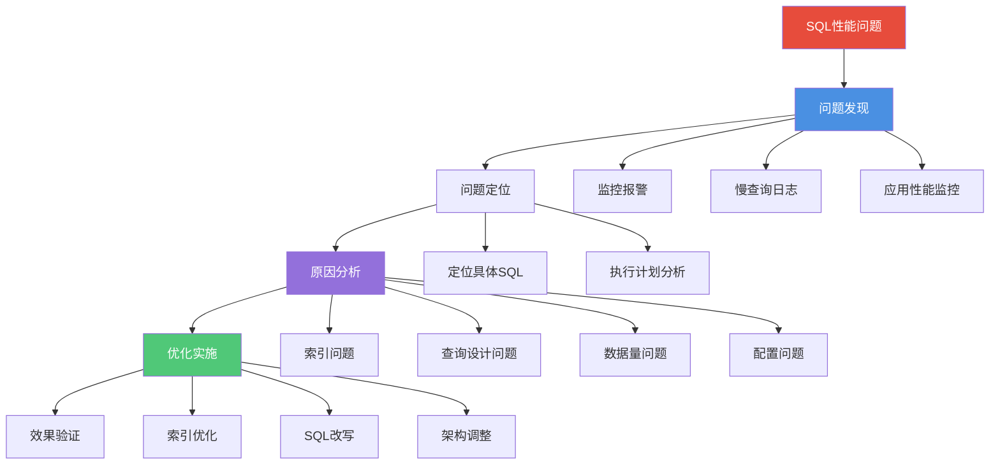
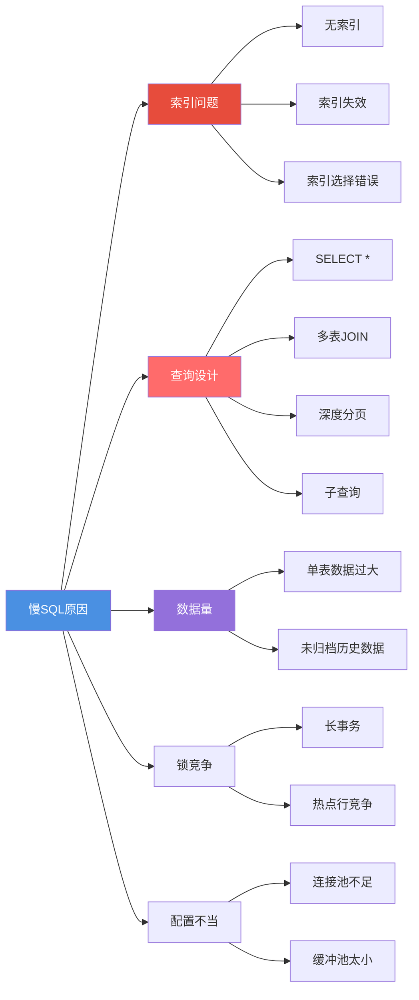
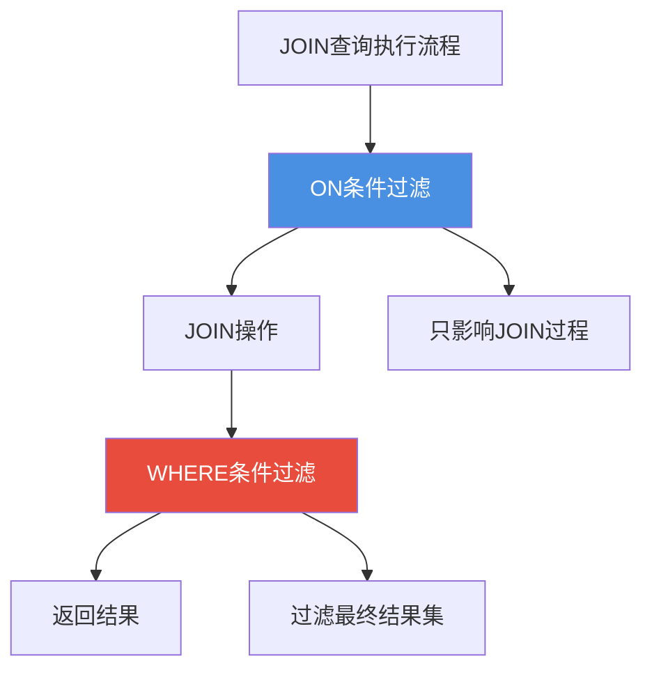
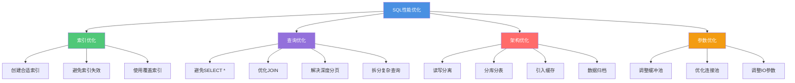

# SQL性能调优全面指南

## SQL性能优化概述

SQL性能优化是数据库应用开发中的核心技能,直接影响系统的响应速度、吞吐量和用户体验。本文将系统介绍SQL调优的完整流程、常见问题及解决方案。

### 优化流程全景图



## 问题发现阶段

### 监控体系建设

#### 慢查询日志配置

```sql
-- 查看慢查询配置
SHOW VARIABLES LIKE 'slow_query%';
SHOW VARIABLES LIKE 'long_query_time';

-- 开启慢查询日志
SET GLOBAL slow_query_log = 'ON';
SET GLOBAL slow_query_log_file = '/var/log/mysql/slow-query.log';
SET GLOBAL long_query_time = 1;  -- 超过1秒记为慢查询

-- 记录未使用索引的查询
SET GLOBAL log_queries_not_using_indexes = 'ON';
```

#### 慢查询日志分析

```bash
# 查看慢查询日志
tail -f /var/log/mysql/slow-query.log

# 使用mysqldumpslow分析
mysqldumpslow -s t -t 10 /var/log/mysql/slow-query.log
# -s t: 按查询时间排序
# -t 10: 显示前10条

# 使用pt-query-digest分析(更强大)
pt-query-digest /var/log/mysql/slow-query.log
```

日志示例:

```
# Time: 2024-11-29T10:30:00.123456Z
# User@Host: app_user[192.168.1.100]:3306
# Query_time: 3.456789  Lock_time: 0.000123 Rows_sent: 150  Rows_examined: 500000
SET timestamp=1732876200;
SELECT p.*, c.category_name 
FROM products p 
JOIN categories c ON p.category_id = c.id 
WHERE p.status = 'active' 
ORDER BY p.created_at DESC;
```

**关键指标解读**:
- Query_time: 3.46秒 → 严重慢查询
- Rows_examined: 50万行 → 扫描行数过多
- Rows_sent: 150行 → 结果集小,存在优化空间

### 应用性能监控(APM)

在应用代码中集成性能监控:

```java
// 使用Spring AOP记录SQL执行时间
@Aspect
@Component
public class SqlPerformanceAspect {
    
    @Around("execution(* com.example.repository.*.*(..))")
    public Object monitorSql(ProceedingJoinPoint joinPoint) throws Throwable {
        long startTime = System.currentTimeMillis();
        
        try {
            return joinPoint.proceed();
        } finally {
            long executionTime = System.currentTimeMillis() - startTime;
            
            if (executionTime > 1000) {  // 超过1秒报警
                String method = joinPoint.getSignature().getName();
                log.warn("慢SQL检测: 方法={}, 耗时={}ms", method, executionTime);
                
                // 发送报警
                alertService.sendSlowSqlAlert(method, executionTime);
            }
        }
    }
}
```

## 问题定位与分析

### 执行计划深度分析

```sql
-- 基础分析
EXPLAIN SELECT ...;

-- JSON格式(查看详细成本)
EXPLAIN FORMAT=JSON SELECT ...;

-- 查看实际执行统计(MySQL 8.0.18+)
EXPLAIN ANALYZE SELECT ...;
```

### 常见慢SQL原因分类



## 索引优化实战

### 问题一:索引缺失

#### 现象

```sql
EXPLAIN SELECT * FROM orders 
WHERE customer_id = 12345 
  AND order_date >= '2024-01-01';
```

```
+------+------+---------------+--------+
| type | key  | rows          | Extra  |
+------+------+---------------+--------+
| ALL  | NULL | 1000000       | Using where |
+------+------+---------------+--------+
```

**分析**: 全表扫描100万行数据。

#### 解决方案

```sql
-- 创建联合索引
CREATE INDEX idx_customer_date ON orders(customer_id, order_date);

-- 优化后
+------+--------------------+------+-------+
| type | key                | rows | Extra |
+------+--------------------+------+-------+
| ref  | idx_customer_date  | 50   | Using index condition |
+------+--------------------+------+-------+
```

**效果**: 扫描行数从100万降至50行。

### 问题二:索引失效

#### 失效场景汇总

```sql
-- 1. 违反最左前缀(索引:idx_abc(a,b,c))
SELECT * FROM products WHERE b = 10;  -- ✗ 跳过a

-- 2. 索引列使用函数
SELECT * FROM orders WHERE YEAR(order_date) = 2024;  -- ✗

-- 3. 隐式类型转换
SELECT * FROM products WHERE product_code = 123;  -- ✗ product_code是VARCHAR

-- 4. 模糊查询前导%
SELECT * FROM users WHERE username LIKE '%admin';  -- ✗

-- 5. OR条件未全部覆盖索引
SELECT * FROM products WHERE category_id = 5 OR description LIKE '%电脑%';  -- ✗

-- 6. 不等于操作
SELECT * FROM orders WHERE status != 'cancelled';  -- ✗ 可能失效

-- 7. NULL判断
SELECT * FROM users WHERE email IS NULL;  -- ✗ 可能失效
```

#### 优化示例

**问题**: 索引列使用函数

```sql
-- 优化前
SELECT * FROM orders 
WHERE DATE_FORMAT(order_date, '%Y-%m') = '2024-11';

-- 执行计划:全表扫描
+------+------+----------+
| type | key  | rows     |
+------+------+----------+
| ALL  | NULL | 1000000  |
+------+------+----------+
```

**优化方案**:

```sql
-- 方案一:改写SQL,避免函数
SELECT * FROM orders 
WHERE order_date >= '2024-11-01' 
  AND order_date < '2024-12-01';

-- 执行计划:使用索引
+-------+---------------+------+
| type  | key           | rows |
+-------+---------------+------+
| range | idx_order_date| 5000 |
+-------+---------------+------+

-- 方案二:创建虚拟列索引(MySQL 5.7+)
ALTER TABLE orders 
ADD COLUMN order_month VARCHAR(7) 
GENERATED ALWAYS AS (DATE_FORMAT(order_date, '%Y-%m')) STORED;

CREATE INDEX idx_order_month ON orders(order_month);

SELECT * FROM orders WHERE order_month = '2024-11';
```

### 问题三:索引区分度低

#### 误区澄清

很多人认为"区分度低的字段不应该建索引",这是片面的。

```sql
-- 性别字段(区分度低)
CREATE TABLE users (
    user_id INT PRIMARY KEY,
    username VARCHAR(50),
    gender TINYINT,  -- 0:女, 1:男
    age INT,
    ...
);

-- 数据分布:100万用户,男女比例接近1:1
```

#### 场景分析

**场景一**: 单独使用gender查询

```sql
SELECT * FROM users WHERE gender = 1;
-- 返回约50万行,即使有索引也会全表扫描
```

**结论**: 单独查询时索引效果不佳。

**场景二**: 组合查询

```sql
-- 创建联合索引
CREATE INDEX idx_gender_age ON users(gender, age);

SELECT * FROM users 
WHERE gender = 1 
  AND age BETWEEN 20 AND 30;
-- 先通过gender过滤50%,再通过age精确定位
```

**结论**: 联合索引中即使区分度低的字段也有价值。

**场景三**: 特殊业务需求

```sql
-- 电商平台,女性用户占95%,男性用户仅5%
SELECT * FROM users WHERE gender = 1;  -- 查询男性用户
-- 只需扫描5%的数据,索引非常有效!
```

**结论**: 数据倾斜时,查询少数值可以有效利用索引。

### 问题四:覆盖索引未利用

#### 优化前

```sql
SELECT product_id, product_name, price 
FROM products 
WHERE category_id = 10;

-- 索引:idx_category(category_id)
-- 执行计划
+------+---------------+------+-------+
| type | key           | rows | Extra |
+------+---------------+------+-------+
| ref  | idx_category  | 500  | NULL  |
+------+---------------+------+-------+
```

**问题**: 虽然使用了索引,但需要回表500次获取product_name和price。

#### 优化方案

```sql
-- 创建覆盖索引
CREATE INDEX idx_category_cover ON products(
    category_id, 
    product_id, 
    product_name, 
    price
);

-- 执行计划
+------+--------------------+------+---------------+
| type | key                | rows | Extra         |
+------+--------------------+------+---------------+
| ref  | idx_category_cover | 500  | Using index   |
+------+--------------------+------+---------------+
```

**效果**: 
- 无需回表,直接从索引获取所有数据
- IO次数大幅减少
- 查询速度提升数倍

## 查询设计优化

### 避免SELECT *

#### 问题分析

```sql
-- 不良写法
SELECT * FROM products WHERE category_id = 5;

-- 表结构:20个字段,包括大字段description(TEXT)
```

**危害**:
1. **无效IO**: 传输不需要的数据
2. **无法使用覆盖索引**: SELECT *包含所有字段
3. **网络开销**: 数据传输量大
4. **内存占用**: 应用层对象占用更多内存
5. **数据泄露风险**: 可能返回敏感字段

#### 优化方案

```sql
-- 只查询需要的字段
SELECT product_id, product_name, price 
FROM products 
WHERE category_id = 5;
```

**收益**:
- 可以使用覆盖索引
- 减少网络传输
- 降低内存占用

### 深度分页优化

#### 问题现象

```sql
-- 查询第100万页的数据
SELECT * FROM orders 
ORDER BY created_at DESC 
LIMIT 1000000, 20;

-- 执行时间:5秒+
```

**原因**: MySQL需要扫描并跳过前100万行数据。


#### 优化方案一:子查询优化

```sql
-- 使用子查询先定位ID
SELECT * FROM orders 
WHERE order_id >= (
    SELECT order_id 
    FROM orders 
    ORDER BY created_at DESC 
    LIMIT 1000000, 1
)
ORDER BY created_at DESC 
LIMIT 20;
```

**原理**: 子查询使用覆盖索引,速度快。

#### 优化方案二:记录上次位置

```sql
-- 第一次查询
SELECT * FROM orders 
ORDER BY created_at DESC, order_id DESC 
LIMIT 20;
-- 返回:last_created_at='2024-11-29 10:00:00', last_order_id=999980

-- 第二次查询(基于上次结果)
SELECT * FROM orders 
WHERE (created_at, order_id) < ('2024-11-29 10:00:00', 999980)
ORDER BY created_at DESC, order_id DESC 
LIMIT 20;
```

**优势**:
- 无需跳过前面的数据
- 始终是索引范围查询
- 性能稳定,不受页码影响

**适用场景**: 移动端滚动加载,只有"下一页"操作。

#### 优化方案三:搜索引擎

对于复杂的分页搜索,使用Elasticsearch:

```java
// Elasticsearch深度分页
SearchRequest request = new SearchRequest("orders");
SearchSourceBuilder builder = new SearchSourceBuilder();
builder.query(QueryBuilders.matchAllQuery());
builder.from(1000000);  // ES可以高效处理深度分页
builder.size(20);
request.source(builder);

SearchResponse response = client.search(request, RequestOptions.DEFAULT);
```

### 慎用子查询

#### IN子查询问题

```sql
-- 不良写法
SELECT * FROM products 
WHERE category_id IN (
    SELECT category_id 
    FROM categories 
    WHERE region = '华东'
);
```

**问题**: 
- 子查询可能被执行多次
- 优化器处理不佳时性能差

#### 优化方案

```sql
-- 改写为JOIN
SELECT p.* 
FROM products p
INNER JOIN categories c ON p.category_id = c.category_id
WHERE c.region = '华东';

-- 或使用EXISTS
SELECT * FROM products p
WHERE EXISTS (
    SELECT 1 FROM categories c 
    WHERE c.category_id = p.category_id 
      AND c.region = '华东'
);
```

### ON vs WHERE的区别

在JOIN查询中,ON和WHERE的应用时机不同,影响查询结果和性能。

#### 执行顺序差异



#### LEFT JOIN场景对比

```sql
-- 表数据
employees: (emp_id, name, dept_id)
departments: (dept_id, dept_name, region)

-- 示例一:条件放在ON
SELECT e.name, d.dept_name
FROM employees e
LEFT JOIN departments d 
  ON e.dept_id = d.dept_id 
  AND d.region = '北京';

-- 结果:返回所有员工
-- 北京部门的员工:dept_name有值
-- 非北京部门的员工:dept_name为NULL

-- 示例二:条件放在WHERE
SELECT e.name, d.dept_name
FROM employees e
LEFT JOIN departments d 
  ON e.dept_id = d.dept_id
WHERE d.region = '北京';

-- 结果:只返回北京部门的员工
-- WHERE在JOIN后过滤,NULL行被过滤掉
```

**选择建议**:
- **ON**: 控制JOIN的匹配条件
- **WHERE**: 过滤最终结果集
- LEFT/RIGHT JOIN时尤其要注意区别

## 数据量优化

### 表数据量过大

#### 问题阈值

- 单表超过**1000万行**: 查询性能开始下降
- 单表超过**5000万行**: 即使有索引也可能很慢
- 单表超过**1亿行**: 需要分库分表

#### 解决方案一:数据归档

```sql
-- 创建归档表
CREATE TABLE orders_archive LIKE orders;

-- 归档历史数据(保留6个月内数据)
INSERT INTO orders_archive
SELECT * FROM orders 
WHERE created_at < DATE_SUB(NOW(), INTERVAL 6 MONTH);

-- 删除已归档数据
DELETE FROM orders 
WHERE created_at < DATE_SUB(NOW(), INTERVAL 6 MONTH);

-- 优化表(回收空间)
OPTIMIZE TABLE orders;
```

**定期归档策略**:

```java
@Scheduled(cron = "0 0 2 1 * ?")  // 每月1号凌晨2点
public void archiveOrders() {
    LocalDateTime cutoffDate = LocalDateTime.now().minusMonths(6);
    
    // 分批归档,避免长事务
    int batchSize = 10000;
    int archivedCount = 0;
    
    do {
        archivedCount = orderRepository.archiveBatch(cutoffDate, batchSize);
        log.info("归档订单: {}条", archivedCount);
    } while (archivedCount > 0);
}
```

#### 解决方案二:分区表

```sql
-- 按月分区
CREATE TABLE orders (
    order_id BIGINT PRIMARY KEY,
    customer_id INT,
    order_date DATE,
    total_amount DECIMAL(10,2),
    ...
)
PARTITION BY RANGE (YEAR(order_date) * 100 + MONTH(order_date)) (
    PARTITION p202401 VALUES LESS THAN (202402),
    PARTITION p202402 VALUES LESS THAN (202403),
    PARTITION p202403 VALUES LESS THAN (202404),
    ...
    PARTITION p202412 VALUES LESS THAN (202501)
);

-- 查询自动分区裁剪
SELECT * FROM orders 
WHERE order_date >= '2024-11-01' 
  AND order_date < '2024-12-01';
-- 只扫描p202411分区
```

**优势**:
- 查询只扫描相关分区
- 便于删除历史数据(DROP PARTITION)
- 维护简单

#### 解决方案三:分库分表

使用ShardingSphere等中间件:

```yaml
# sharding-jdbc配置
shardingsphere:
  datasource:
    names: ds0,ds1,ds2,ds3
  sharding:
    tables:
      orders:
        actual-data-nodes: ds$->{0..3}.orders_$->{0..15}
        table-strategy:
          standard:
            sharding-column: customer_id
            algorithm-expression: orders_$->{customer_id % 16}
        database-strategy:
          standard:
            sharding-column: customer_id
            algorithm-expression: ds$->{customer_id % 4}
```

### 连接池耗尽

#### 问题现象

```
com.mysql.jdbc.exceptions.jdbc4.MySQLNonTransientConnectionException:
Data source rejected establishment of connection, message from server: "Too many connections"
```

#### 原因排查

```sql
-- 查看当前连接数
SHOW STATUS LIKE 'Threads_connected';

-- 查看最大连接数
SHOW VARIABLES LIKE 'max_connections';

-- 查看连接详情
SHOW PROCESSLIST;

-- 查看长时间运行的查询
SELECT * FROM information_schema.PROCESSLIST 
WHERE TIME > 10 
ORDER BY TIME DESC;
```

#### 解决方案

**方案一**: 优化慢SQL和长事务

```java
// 慢SQL导致连接占用
// 优化前:
@Transactional
public List<Order> getOrders() {
    return jdbcTemplate.query(
        "SELECT * FROM orders WHERE status = 'pending'",  // 全表扫描
        new OrderRowMapper()
    );
}

// 优化后:添加索引,优化查询
@Transactional
public List<Order> getOrders() {
    return jdbcTemplate.query(
        "SELECT order_id, customer_id, total_amount FROM orders " +
        "WHERE status = 'pending' AND created_at >= ? " +
        "ORDER BY created_at DESC LIMIT 100",
        new OrderRowMapper(),
        DateUtils.addDays(new Date(), -7)
    );
}
```

**方案二**: 调整连接池参数

```yaml
# HikariCP配置
spring:
  datasource:
    hikari:
      maximum-pool-size: 20          # 最大连接数
      minimum-idle: 5                # 最小空闲连接
      connection-timeout: 30000      # 连接超时30秒
      idle-timeout: 600000           # 空闲连接超时10分钟
      max-lifetime: 1800000          # 连接最大存活30分钟
      leak-detection-threshold: 60000  # 连接泄漏检测
```

**方案三**: 分库分表,分散连接压力

## 数据库参数优化

### 关键参数调优

```sql
-- 1. InnoDB缓冲池大小(最重要)
-- 建议设置为服务器内存的70-80%
SHOW VARIABLES LIKE 'innodb_buffer_pool_size';
SET GLOBAL innodb_buffer_pool_size = 8589934592;  -- 8GB

-- 2. IO线程数
-- 建议设置为CPU核心数的一半
SHOW VARIABLES LIKE 'innodb_%_io_threads';
SET GLOBAL innodb_read_io_threads = 8;
SET GLOBAL innodb_write_io_threads = 8;

-- 3. 事务日志大小
-- 建议设置为高峰期2小时的日志量,或内存的1/4
SHOW VARIABLES LIKE 'innodb_log_file_size';
-- 修改需要重启MySQL
# my.cnf
innodb_log_file_size = 1G

-- 4. 排序缓冲区
SHOW VARIABLES LIKE 'sort_buffer_size';
SET SESSION sort_buffer_size = 2097152;  -- 2MB

-- 5. JOIN缓冲区
SHOW VARIABLES LIKE 'join_buffer_size';
SET SESSION join_buffer_size = 2097152;  -- 2MB
```

### 参数优化实例

```bash
# my.cnf完整配置示例
[mysqld]
# 基础配置
port = 3306
datadir = /var/lib/mysql

# InnoDB配置
innodb_buffer_pool_size = 8G
innodb_log_file_size = 1G
innodb_flush_log_at_trx_commit = 2  # 性能优先场景
innodb_read_io_threads = 8
innodb_write_io_threads = 8
innodb_io_capacity = 2000
innodb_io_capacity_max = 4000

# 查询缓存(MySQL 5.7,8.0已移除)
# query_cache_type = 0
# query_cache_size = 0

# 连接配置
max_connections = 500
max_connect_errors = 1000
wait_timeout = 600
interactive_timeout = 600

# 慢查询
slow_query_log = 1
slow_query_log_file = /var/log/mysql/slow-query.log
long_query_time = 1
log_queries_not_using_indexes = 1

# 其他
character_set_server = utf8mb4
collation_server = utf8mb4_unicode_ci
```

## SQL调优综合案例

### 案例:电商订单查询优化

#### 初始状况

```sql
-- 业务需求:查询用户最近订单
SELECT 
    o.order_id,
    o.order_number,
    o.total_amount,
    o.status,
    c.customer_name,
    c.phone,
    p.product_name,
    p.price,
    oi.quantity
FROM orders o
LEFT JOIN customers c ON o.customer_id = c.customer_id
LEFT JOIN order_items oi ON o.order_id = oi.order_id
LEFT JOIN products p ON oi.product_id = p.product_id
WHERE c.customer_id = 12345
ORDER BY o.created_at DESC;

-- 执行时间:8秒
-- 扫描行数:500万行
```

#### 问题分析

```sql
EXPLAIN ...

+-------+-------+------+--------+-------------+
| table | type  | key  | rows   | Extra       |
+-------+-------+------+--------+-------------+
| c     | const | PRI  | 1      | NULL        |
| o     | ALL   | NULL | 500000 | Using where |
| oi    | ALL   | NULL | 2000000| Using where |
| p     | eq_ref| PRI  | 1      | NULL        |
+-------+-------+------+--------+-------------+
```

**问题点**:
1. orders表缺少customer_id索引,全表扫描
2. order_items表缺少order_id索引,全表扫描
3. 查询了所有字段,无法使用覆盖索引
4. 多表JOIN,性能差

#### 优化步骤

**步骤一:添加索引**

```sql
-- orders表添加索引
CREATE INDEX idx_customer_created ON orders(customer_id, created_at);

-- order_items表添加索引
CREATE INDEX idx_order ON order_items(order_id);
```

**步骤二:拆分查询**

```java
// 第一步:查询订单信息
List<Order> orders = jdbcTemplate.query(
    "SELECT order_id, order_number, total_amount, status, created_at " +
    "FROM orders " +
    "WHERE customer_id = ? " +
    "ORDER BY created_at DESC " +
    "LIMIT 20",
    new OrderRowMapper(),
    customerId
);

// 第二步:批量查询订单项
List<Long> orderIds = orders.stream()
    .map(Order::getOrderId)
    .collect(Collectors.toList());

List<OrderItem> items = jdbcTemplate.query(
    "SELECT oi.order_id, oi.product_id, oi.quantity, p.product_name, p.price " +
    "FROM order_items oi " +
    "INNER JOIN products p ON oi.product_id = p.product_id " +
    "WHERE oi.order_id IN (" + StringUtils.join(orderIds, ",") + ")",
    new OrderItemRowMapper()
);

// 第三步:在内存中组装数据
Map<Long, List<OrderItem>> itemMap = items.stream()
    .collect(Collectors.groupingBy(OrderItem::getOrderId));

orders.forEach(order -> {
    order.setItems(itemMap.getOrDefault(order.getOrderId(), Collections.emptyList()));
});
```

**步骤三:添加缓存**

```java
@Cacheable(value = "orders", key = "#customerId", unless = "#result.isEmpty()")
public List<OrderDTO> getCustomerOrders(Long customerId) {
    // ... 上述查询逻辑
}
```

#### 优化效果

| 指标 | 优化前 | 优化后 | 提升 |
|------|--------|--------|------|
| 执行时间 | 8秒 | 50ms | 160倍 |
| 扫描行数 | 500万 | 120 | 4.2万倍 |
| CPU使用率 | 80% | 5% | 降低94% |

## SQL优化最佳实践

### 开发规范

```java
/**
 * SQL编写规范检查清单
 */
public class SqlBestPractices {
    
    // ✓ 明确指定查询字段
    String good1 = "SELECT id, name, price FROM products WHERE category_id = ?";
    
    // ✗ 避免使用SELECT *
    String bad1 = "SELECT * FROM products WHERE category_id = ?";
    
    // ✓ 使用LIMIT限制结果集
    String good2 = "SELECT * FROM orders ORDER BY created_at DESC LIMIT 100";
    
    // ✗ 避免无限制查询
    String bad2 = "SELECT * FROM orders ORDER BY created_at DESC";
    
    // ✓ WHERE条件字段有索引
    String good3 = "SELECT * FROM users WHERE user_id = ?";  // user_id是主键
    
    // ✗ 未索引字段作为条件
    String bad3 = "SELECT * FROM users WHERE nickname = ?";  // nickname无索引
    
    // ✓ JOIN字段有索引
    String good4 = "SELECT * FROM orders o " +
                   "JOIN customers c ON o.customer_id = c.customer_id";
    
    // ✓ 避免索引列使用函数
    String good5 = "SELECT * FROM orders " +
                   "WHERE created_at >= ? AND created_at < ?";
    
    // ✗ 索引列使用函数
    String bad5 = "SELECT * FROM orders WHERE DATE(created_at) = ?";
    
    // ✓ 批量操作
    String good6 = "INSERT INTO orders VALUES (?,?,?), (?,?,?), (?,?,?)";
    
    // ✗ 逐条插入
    String bad6 = "INSERT INTO orders VALUES (?,?,?)";  // 循环执行多次
}
```

### 性能监控指标

建立SQL性能监控体系:

```java
@Component
public class SqlMetricsCollector {
    
    @Autowired
    private MeterRegistry registry;
    
    public void recordQueryTime(String sqlId, long duration) {
        Timer.builder("sql.query.duration")
            .tag("sql_id", sqlId)
            .register(registry)
            .record(duration, TimeUnit.MILLISECONDS);
        
        // 慢SQL计数
        if (duration > 1000) {
            Counter.builder("sql.slow.count")
                .tag("sql_id", sqlId)
                .register(registry)
                .increment();
        }
    }
    
    public void recordRowsScanned(String sqlId, long rows) {
        Gauge.builder("sql.rows.scanned", () -> rows)
            .tag("sql_id", sqlId)
            .register(registry);
    }
}
```

## 总结

SQL性能优化是一个系统工程,需要从多个维度综合施策:

### 核心优化方向



### 优化优先级

1. **索引优化** (投入产出比最高)
2. **SQL改写** (成本低,见效快)
3. **数据归档** (解决数据量问题)
4. **参数调优** (充分利用硬件资源)
5. **架构改造** (解决根本性能瓶颈)

### 持续优化

- 建立完善的监控体系
- 定期Review慢SQL
- 制定SQL开发规范
- 进行性能测试和压测
- 持续学习新技术和最佳实践

SQL优化没有银弹,需要根据具体业务场景,选择合适的优化策略,持续迭代改进。
