# MySQL存储引擎与高级特性

## MySQL 存储引擎概述

存储引擎是 MySQL 的核心组件,负责数据的实际存储和读取。MySQL 采用**可插拔式存储引擎架构**,允许为不同的表选择不同的存储引擎。

### 存储引擎是表级别的

与其他数据库不同,MySQL 的存储引擎是**基于表的**,而不是基于整个数据库。这意味着同一个数据库中的不同表可以使用不同的存储引擎。

```sql
-- 查看 MySQL 支持的存储引擎
SHOW ENGINES;

-- 查看当前默认存储引擎
SHOW VARIABLES LIKE '%storage_engine%';

-- 查看某个表使用的存储引擎
SHOW CREATE TABLE products;
```

### 指定存储引擎

```sql
-- 创建表时指定存储引擎
CREATE TABLE session_data (
    session_id VARCHAR(64) PRIMARY KEY,
    user_id BIGINT,
    data TEXT,
    expire_time DATETIME
) ENGINE=MEMORY;  -- 使用内存引擎

-- 修改表的存储引擎
ALTER TABLE session_data ENGINE=InnoDB;
```

## 主流存储引擎对比

MySQL 提供了多种存储引擎,各有特点和适用场景:

### InnoDB 引擎

**InnoDB 是 MySQL 5.5+ 的默认存储引擎**,也是最常用的引擎。

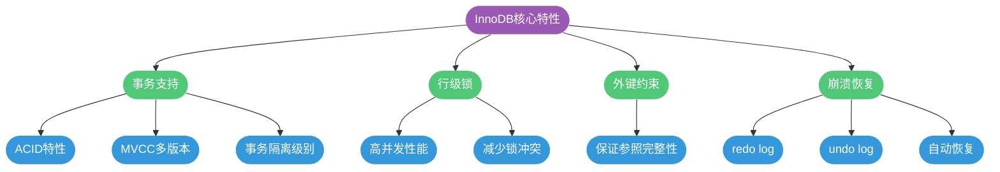

**适用场景**:
- 需要事务支持的业务(订单、支付、账户)
- 高并发读写场景
- 对数据一致性要求高的场景

```sql
-- 典型应用:电商订单表
CREATE TABLE orders (
    id BIGINT UNSIGNED PRIMARY KEY AUTO_INCREMENT,
    order_no VARCHAR(32) UNIQUE NOT NULL,
    user_id BIGINT NOT NULL,
    total_amount DECIMAL(10, 2) NOT NULL,
    status TINYINT NOT NULL DEFAULT 0,
    created_at DATETIME NOT NULL,
    updated_at DATETIME NOT NULL,
    INDEX idx_user_id (user_id),
    INDEX idx_status (status)
) ENGINE=InnoDB DEFAULT CHARSET=utf8mb4;
```

### MyISAM 引擎

MyISAM 是 MySQL 5.5 之前的默认引擎,现已逐渐被淘汰。

**特点**:
- 不支持事务
- 使用表级锁(并发性能差)
- 不支持外键
- 支持全文索引(MySQL 5.6+ InnoDB 也支持)

```sql
-- MyISAM 适用于只读或读多写少的场景
CREATE TABLE article_archive (
    id BIGINT PRIMARY KEY AUTO_INCREMENT,
    title VARCHAR(200),
    content TEXT,
    created_at DATETIME,
    FULLTEXT INDEX ft_content (content)
) ENGINE=MyISAM;
```

**缺点**:
- 写操作锁整张表,并发性能差
- 崩溃后恢复困难,可能丢失数据

### Memory 引擎

Memory 引擎将数据存储在内存中,提供极快的读写速度。

```sql
-- 创建内存表
CREATE TABLE active_sessions (
    session_id VARCHAR(64) PRIMARY KEY,
    user_id BIGINT NOT NULL,
    login_time DATETIME NOT NULL,
    last_active DATETIME NOT NULL,
    INDEX idx_user_id (user_id)
) ENGINE=MEMORY;
```

**特点**:
- 数据存储在内存,速度极快
- 服务器重启后数据丢失
- 不支持 TEXT/BLOB 类型
- 使用表级锁

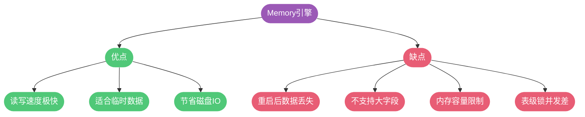

**适用场景**:
- 会话管理(Session)
- 缓存数据
- 临时计算结果
- 实时统计数据

```sql
-- 实时在线用户统计
CREATE TABLE online_users (
    user_id BIGINT PRIMARY KEY,
    login_ip VARCHAR(50),
    login_time DATETIME,
    heartbeat_time DATETIME
) ENGINE=MEMORY;
```

### 存储引擎对比表

| 特性 | InnoDB | MyISAM | Memory |
|------|--------|--------|--------|
| 事务支持 | ✓ | ✗ | ✗ |
| 行级锁 | ✓ | ✗ | ✗ |
| 外键约束 | ✓ | ✗ | ✗ |
| 崩溃恢复 | ✓ | ✗ | ✗ |
| 全文索引 | ✓(5.6+) | ✓ | ✗ |
| 存储位置 | 磁盘 | 磁盘 | 内存 |
| 数据持久化 | ✓ | ✓ | ✗ |
| MVCC | ✓ | ✗ | ✗ |
| 适用场景 | OLTP(在线事务) | OLAP(分析查询) | 临时数据 |

## 断电与崩溃恢复机制

在生产环境中，服务器意外断电是一个不可忽视的风险。MySQL 对于这种场景的处理能力，取决于所使用的存储引擎以及相关配置参数。

### InnoDB 的数据保护机制

InnoDB 存储引擎通过 **事务日志（redo log）** 机制来保证数据的持久性。所有的数据更改操作都会先写入 redo log，而不是直接写入数据文件。这种 **预写日志（Write-Ahead Logging，WAL）** 策略是保证数据安全的核心。

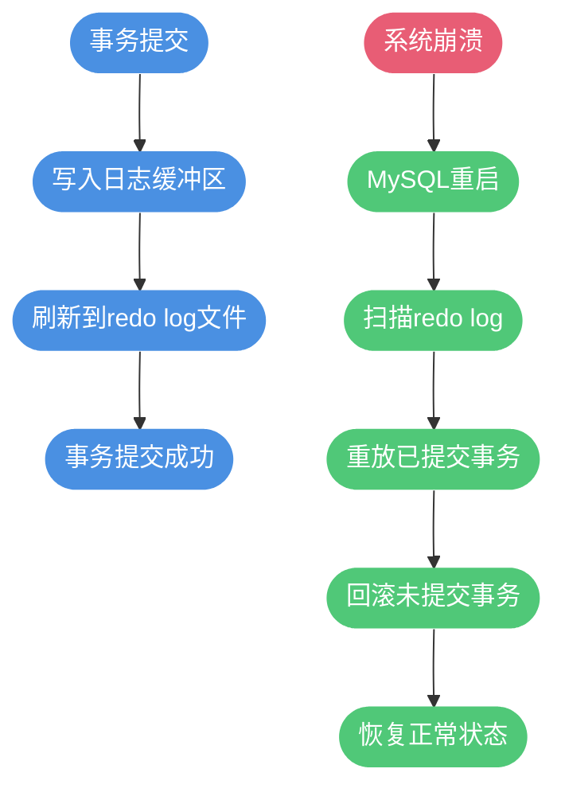

**崩溃恢复过程**：

当 MySQL 服务器意外断电后重启时，InnoDB 会执行以下恢复操作：

1. **扫描 redo log**：读取所有已记录的事务操作
2. **重放已提交事务**：将已提交但未写入数据文件的变更重新应用
3. **回滚未提交事务**：通过 undo log 回滚在崩溃时未完成的事务

这个过程确保了**已提交的事务数据不会丢失**，而**未提交的事务会被回滚**。

### innodb_flush_log_at_trx_commit 参数

这个参数控制 redo log 的刷盘策略，直接影响数据安全性和性能之间的平衡：

| 参数值 | 刷盘策略 | 数据安全性 | 性能 |
|-------|---------|-----------|------|
| 0 | 每秒将日志缓存写入日志文件并刷新到磁盘，事务提交时不主动刷盘 | 低 | 高 |
| 1 | 每次事务提交时都将日志缓存写入日志文件并刷新到磁盘（**默认值**） | 高 | 低 |
| 2 | 每次事务提交时将日志缓存写入日志文件，但只是每秒刷新一次磁盘 | 中 | 中 |

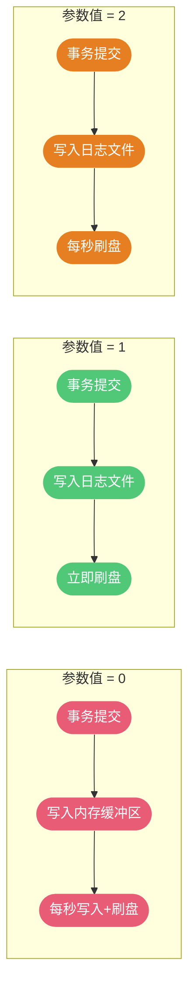

**参数选择建议**：

- **值为 1（默认）**：最安全，确保每次事务提交都持久化到磁盘，适用于对数据一致性要求极高的金融、支付等场景
- **值为 2**：在操作系统不崩溃的情况下不会丢失数据，适用于对性能有一定要求但也关注数据安全的场景
- **值为 0**：性能最好但最不安全，最多可能丢失 1 秒的数据，适用于可以容忍少量数据丢失的场景

```sql
-- 查看当前设置
SHOW VARIABLES LIKE 'innodb_flush_log_at_trx_commit';

-- 设置为最安全模式（推荐生产环境使用）
SET GLOBAL innodb_flush_log_at_trx_commit = 1;
```

### sync_binlog 参数

除了 redo log，binlog 的刷盘策略同样重要，由 `sync_binlog` 参数控制：

```sql
-- 查看当前设置
SHOW VARIABLES LIKE 'sync_binlog';

-- 每次事务提交时同步binlog到磁盘
SET GLOBAL sync_binlog = 1;
```

- **sync_binlog = 0**：由操作系统决定何时刷新 binlog 到磁盘
- **sync_binlog = 1**：每次事务提交时都刷新 binlog 到磁盘（最安全）
- **sync_binlog = N**：每 N 个事务后刷新一次

**双 1 配置**：在生产环境中，通常建议将 `innodb_flush_log_at_trx_commit = 1` 和 `sync_binlog = 1` 同时配置，这被称为"双 1 配置"，可以最大程度保证数据安全。

### MyISAM 的断电风险

与 InnoDB 不同，MyISAM 存储引擎**没有事务日志机制**，因此在断电情况下风险较大：

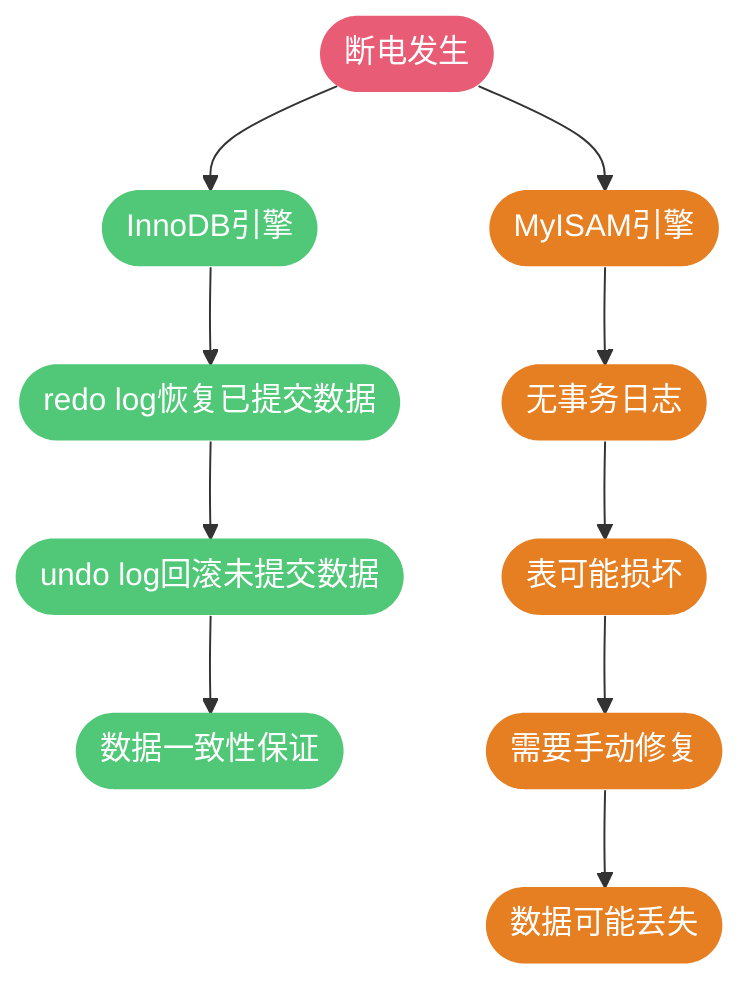

**MyISAM 的问题**：

- 写操作直接修改数据文件和索引文件
- 断电时可能导致数据文件和索引文件不一致
- 需要使用 `myisamchk` 或 `REPAIR TABLE` 修复损坏的表
- 修复过程可能导致数据丢失

```sql
-- 修复损坏的MyISAM表
REPAIR TABLE table_name;
```

### 操作系统与硬件缓存的风险

即使 MySQL 配置正确，操作系统和硬件层面的缓存也可能带来数据丢失风险：

**操作系统缓存**：

现代操作系统会对磁盘写入进行缓存（Page Cache），数据先写入内存缓存，再由操作系统决定何时真正写入磁盘。如果在缓存未刷新时断电，这部分数据将丢失。

**硬件写缓存**：

很多磁盘控制器和硬盘本身也有写缓存。当数据从操作系统刷到磁盘时，可能只是写到了磁盘的缓存中，而非真正的持久化存储。

**解决方案**：

1. **禁用磁盘写缓存**：通过操作系统或 BIOS 设置禁用磁盘写缓存
2. **使用带电池备份的 RAID 卡**：BBU（Battery Backup Unit）可以在断电时保护 RAID 卡缓存中的数据
3. **使用企业级 SSD**：具有掉电保护（PLP）功能的 SSD 可以在断电时保存缓存数据

```bash
# Linux 下禁用磁盘写缓存
hdparm -W 0 /dev/sda
```

### UPS 不间断电源

在企业级生产环境中，**UPS（Uninterruptible Power Supply）不间断电源**是防止断电数据丢失的重要硬件保障：

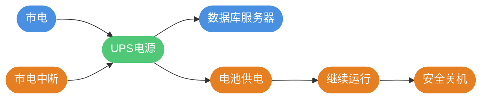

**UPS 的作用**：

1. **短时间断电**：UPS 电池可以维持服务器运行，等待市电恢复
2. **长时间断电**：为服务器提供足够时间完成数据刷盘并安全关机
3. **电力质量保护**：过滤电压波动、尖峰等电力问题

**最佳实践**：

- 配置 UPS 与服务器的通信，实现自动监控和安全关机
- 定期测试 UPS 电池状态和切换能力
- 根据服务器功耗和预期运行时间选择合适容量的 UPS

### 断电恢复总结

| 因素 | InnoDB | MyISAM | 建议 |
|-----|--------|--------|------|
| 存储引擎特性 | 有 redo log，支持崩溃恢复 | 无事务日志，可能损坏 | 使用 InnoDB |
| innodb_flush_log_at_trx_commit | 设为 1 最安全 | 不适用 | 生产环境设为 1 |
| sync_binlog | 设为 1 最安全 | 不适用 | 生产环境设为 1 |
| 操作系统缓存 | 可能影响 | 可能影响 | 关注刷盘策略 |
| 硬件保护 | 建议使用 | 建议使用 | BBU RAID 或 PLP SSD |
| UPS | 强烈建议 | 强烈建议 | 生产环境必备 |

**结论**：对于 InnoDB 存储引擎，如果配置得当（`innodb_flush_log_at_trx_commit = 1`，`sync_binlog = 1`），加上合适的硬件保护措施，在突然断电后**已提交的事务数据不会丢失**。只有未提交的事务会在重启后被回滚，这是符合事务 ACID 特性的正常行为。

## Hash Join 原理与应用

Hash Join 是 MySQL 8.0.18 引入的一种高效的多表关联算法,用于优化等值连接(equal-join)场景。

### 传统 Nested-Loop Join 的问题

在 Hash Join 出现之前,MySQL 使用嵌套循环(Nested-Loop Join)实现表关联:

```sql
-- 学生选课查询
SELECT s.student_name, c.course_name
FROM students s
INNER JOIN course_selections cs ON s.id = cs.student_id
INNER JOIN courses c ON cs.course_id = c.id
WHERE s.grade = 3;
```

**嵌套循环的执行过程**:

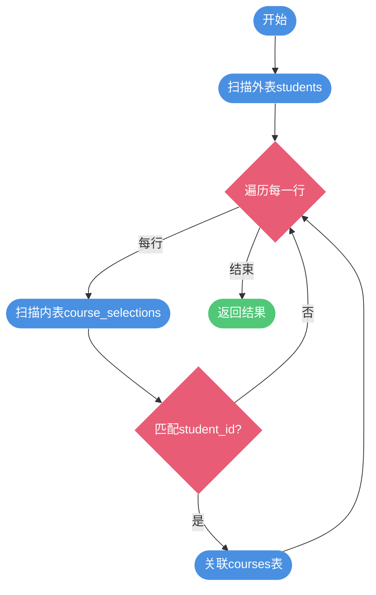

**性能问题**:
- 对内表的扫描次数 = 外表行数
- 如果外表 10000 行,内表被扫描 10000 次

### Hash Join 的优化原理

Hash Join 通过构建哈希表,将嵌套循环优化为哈希查找:

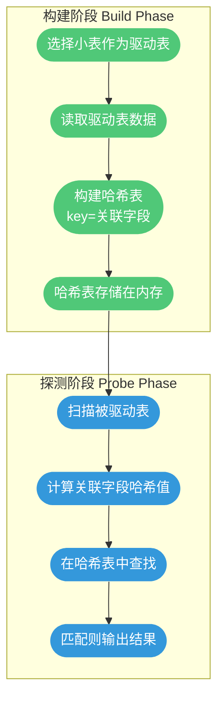

**示例**: 学生和课程关联

```sql
-- 假设 students 表 5000 行,courses 表 500 行

-- Hash Join 执行过程:
-- 1. 构建阶段:将 courses(小表)构建成哈希表
-- 2. 探测阶段:扫描 students,在哈希表中查找匹配

SELECT s.student_name, s.student_id, c.course_name
FROM students s
LEFT JOIN courses c ON s.major_course_id = c.id;
```

**Hash Join 的优势**:

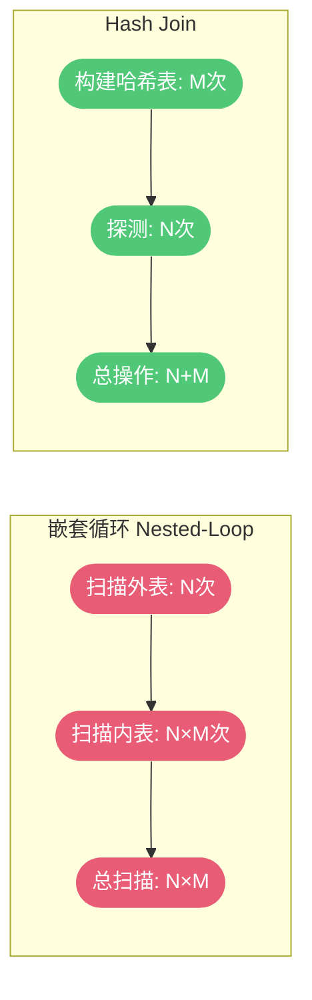

- **时间复杂度**: O(N+M) vs O(N×M)
- **IO次数**: 大幅减少
- **内存利用**: 充分利用内存加速

### 基于磁盘的 Hash Join

当驱动表数据量过大,内存无法容纳完整哈希表时,MySQL 使用**分区 Hash Join**:

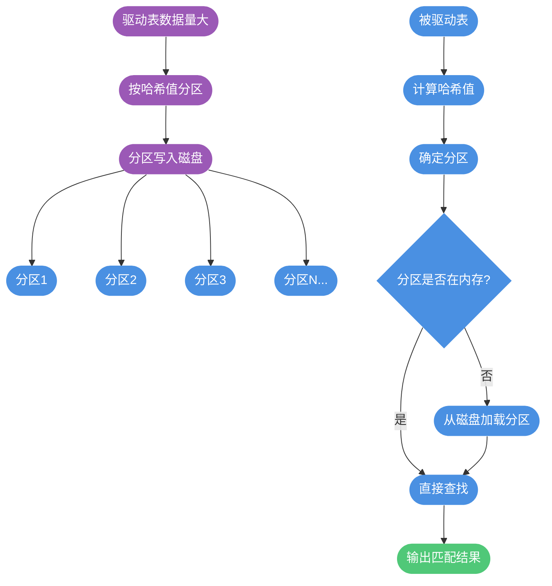

**分区策略**:
1. 对驱动表使用哈希函数分区
2. 将分区写入磁盘
3. 被驱动表使用相同哈希函数确定分区
4. 按需加载分区到内存
5. 在内存中完成哈希匹配

**性能优化**:
- 减少内存压力
- 避免全部数据加载到内存
- 利用磁盘空间扩展容量

## 数据删除操作:DROP、TRUNCATE、DELETE

MySQL 提供了三种删除数据的命令,它们的实现原理和适用场景完全不同。

### 三种删除操作对比

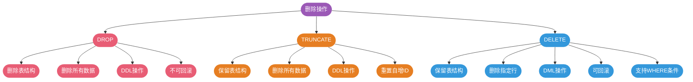

### DROP TABLE

**最彻底的删除**,连表结构一起删除:

```sql
-- 删除整张表
DROP TABLE old_orders;

-- 条件删除(表存在才删除)
DROP TABLE IF EXISTS temp_data;
```

**特点**:
- DDL(数据定义语言)操作
- 删除表结构和所有数据
- 不记录 binlog(表级操作)
- 不可回滚
- 执行速度最快

**适用场景**:
- 临时表使用完毕
- 废弃的业务表
- 测试环境清理

### TRUNCATE TABLE

**快速清空表数据**,保留表结构:

```sql
-- 清空表数据
TRUNCATE TABLE session_logs;
```

**特点**:
- DDL 操作
- 保留表结构,删除所有数据
- 不记录行级 binlog
- 不可回滚
- 重置自增 ID
- 执行速度快

```sql
-- 演示自增ID重置
CREATE TABLE test_truncate (
    id INT PRIMARY KEY AUTO_INCREMENT,
    name VARCHAR(50)
) ENGINE=InnoDB;

-- 插入数据
INSERT INTO test_truncate (name) VALUES ('A'), ('B'), ('C');
-- id: 1, 2, 3, AUTO_INCREMENT=4

-- 删除部分数据
DELETE FROM test_truncate WHERE id = 3;
-- AUTO_INCREMENT 仍然是 4

-- 插入新数据
INSERT INTO test_truncate (name) VALUES ('D');
-- id = 4(不连续)

-- TRUNCATE 清空表
TRUNCATE TABLE test_truncate;
-- AUTO_INCREMENT 重置为 1

-- 再次插入
INSERT INTO test_truncate (name) VALUES ('E');
-- id = 1(从1开始)
```

**适用场景**:
- 开发环境重置测试数据
- 清空日志表
- 定期清理临时数据表

### DELETE FROM

**最灵活的删除**,支持条件删除和事务回滚:

```sql
-- 删除指定条件的记录
DELETE FROM orders WHERE status = 4 AND created_at < '2023-01-01';

-- 删除所有记录(不推荐,用TRUNCATE更快)
DELETE FROM temp_logs;

-- 限制删除数量
DELETE FROM error_logs ORDER BY created_at LIMIT 1000;
```

**特点**:
- DML(数据操作语言)操作
- 支持 WHERE 条件筛选
- 逐行删除,记录 binlog
- 在事务中可回滚
- 不重置自增 ID
- 执行速度较慢(相对 TRUNCATE)

**执行流程**:

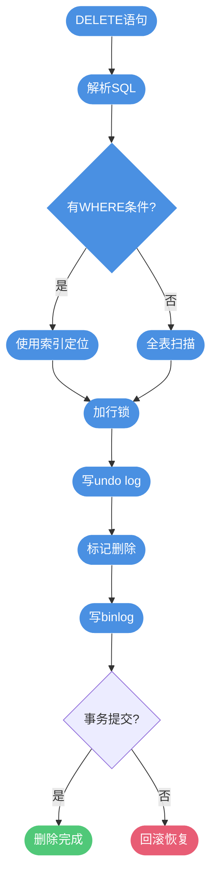

**事务回滚示例**:

```sql
-- 开启事务
START TRANSACTION;

-- 误删除数据
DELETE FROM users WHERE department = 'IT';

-- 发现错误,回滚
ROLLBACK;

-- 数据恢复,未真正删除
```

### 对比总结表

| 操作 | 操作类型 | 删除内容 | 记录binlog | 支持回滚 | WHERE条件 | 速度 | 主键重置 |
|------|---------|---------|-----------|---------|----------|------|---------|
| DROP | DDL | 表结构+数据 | 否 | 否 | 否 | 最快 | N/A |
| TRUNCATE | DDL | 所有数据 | 否 | 否 | 否 | 快 | 是 |
| DELETE | DML | 指定数据 | 是 | 是 | 是 | 慢 | 否 |

### 数据恢复方案

**DROP 恢复**:

1. **数据库备份**: 从最近的全量备份恢复
2. **binlog 回放**: 通过二进制日志恢复(DROP 前的数据)
3. **数据恢复工具**: Percona Data Recovery Tool
4. **文件系统备份**: 恢复数据库文件目录

```bash
# 从 binlog 恢复
mysqlbinlog --start-datetime="2024-11-20 00:00:00" \
            --stop-datetime="2024-11-20 23:59:59" \
            mysql-bin.000001 | mysql -u root -p
```

**TRUNCATE/DELETE 恢复**:

虽然 TRUNCATE 不可回滚,但可以通过以下方式恢复:
1. 全量备份 + binlog 增量恢复
2. 主从复制架构中,延迟从库未同步时可恢复

## 总结

MySQL 的存储引擎和高级特性为不同场景提供了灵活的解决方案:

1. **存储引擎选择**:
   - InnoDB: 默认选择,支持事务和高并发
   - MyISAM: 已逐渐淘汰,不推荐使用
   - Memory: 临时数据和缓存场景

2. **Hash Join**:
   - 优化等值连接性能
   - 构建哈希表 + 探测匹配
   - 大数据量时使用分区策略

3. **数据删除**:
   - DROP: 删除表,最彻底
   - TRUNCATE: 清空数据,重置自增
   - DELETE: 条件删除,支持回滚

理解这些特性的原理和适用场景,能够帮助我们在实际开发中做出正确的技术选型,提升系统性能和可靠性。


