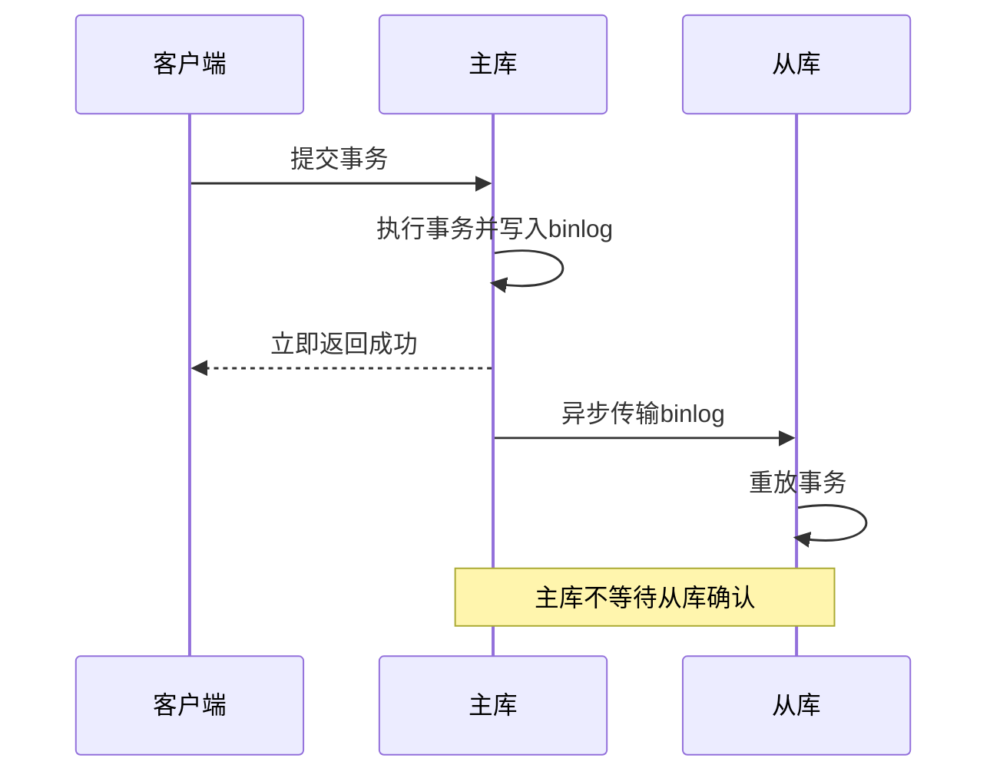
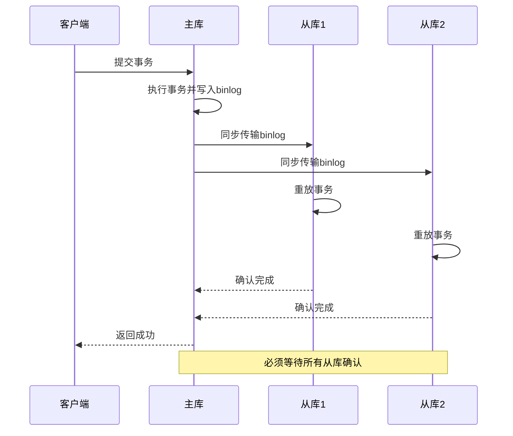
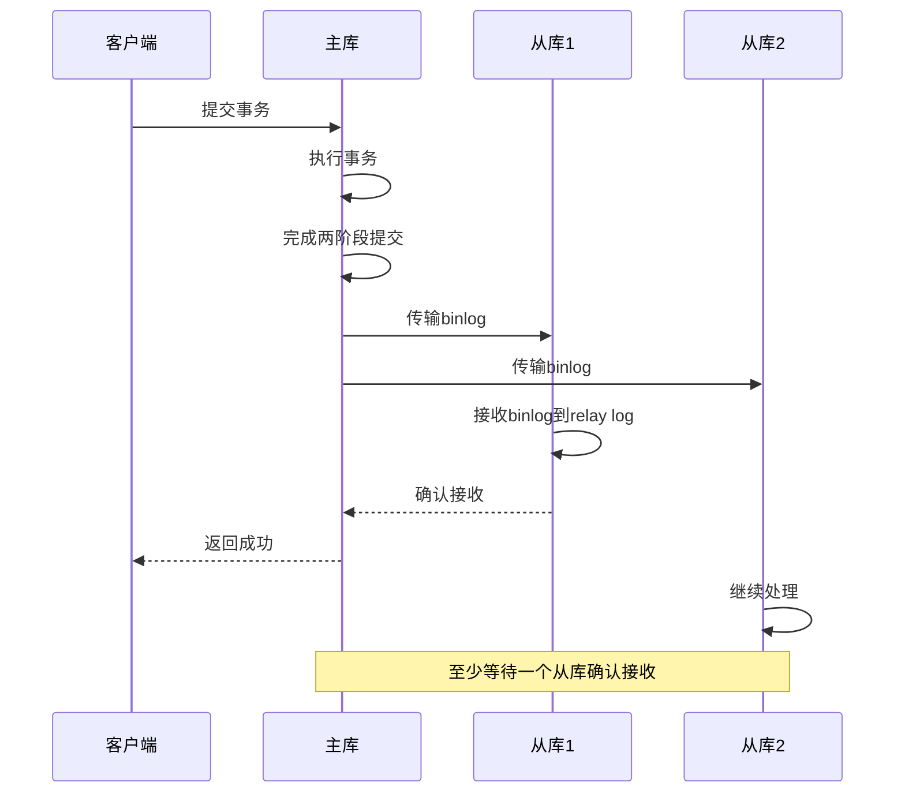
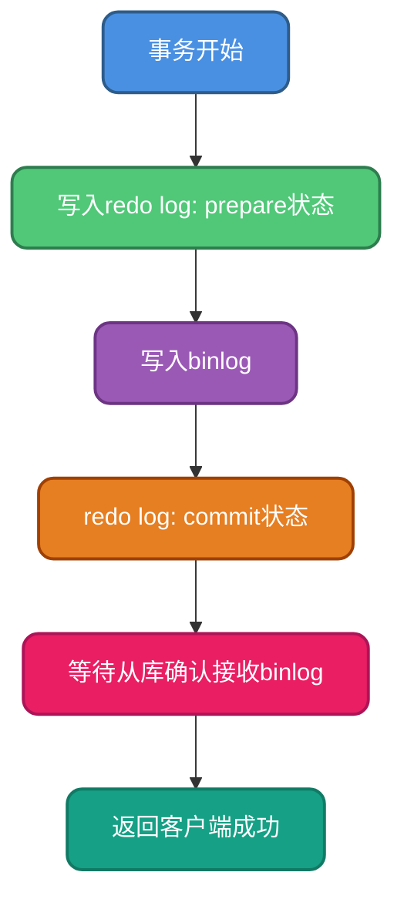
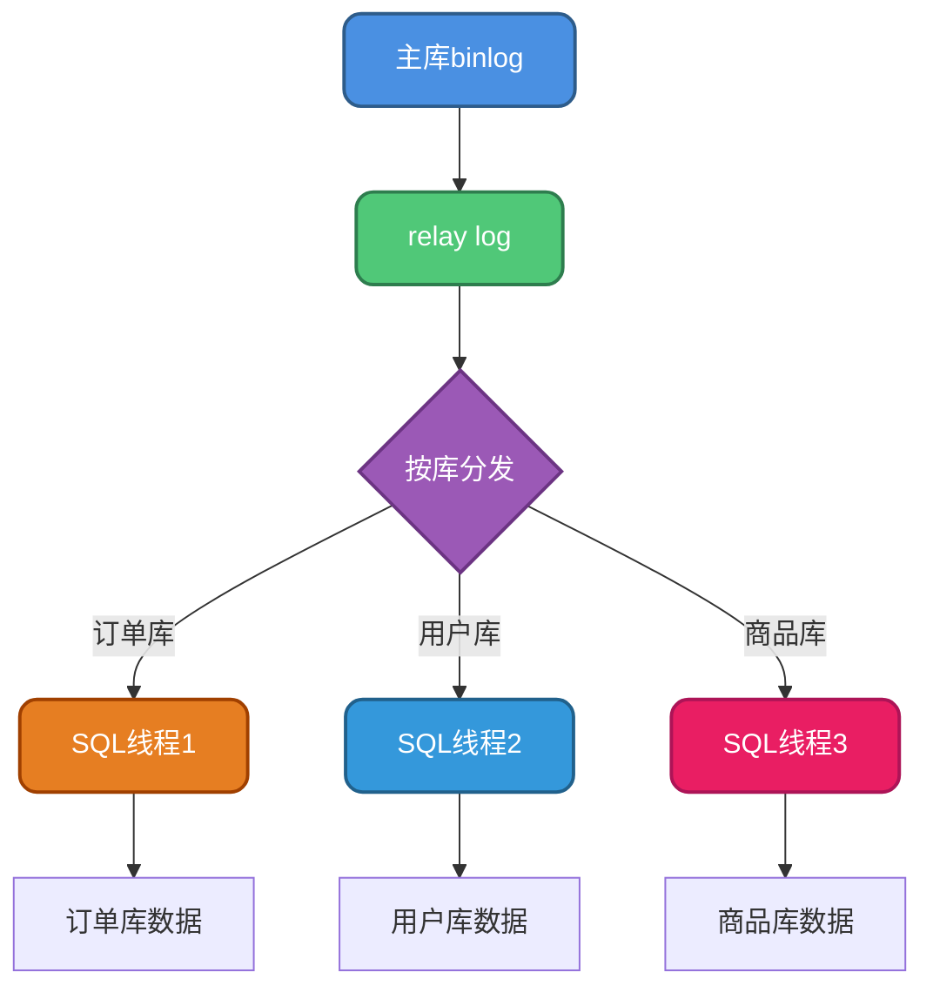
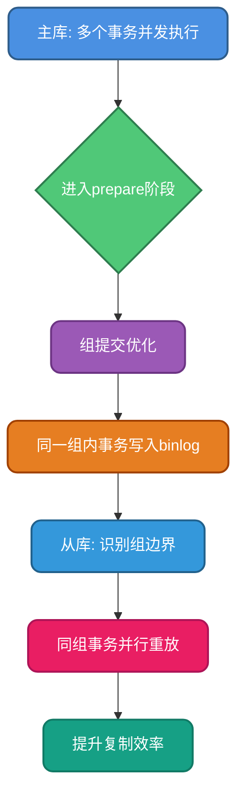
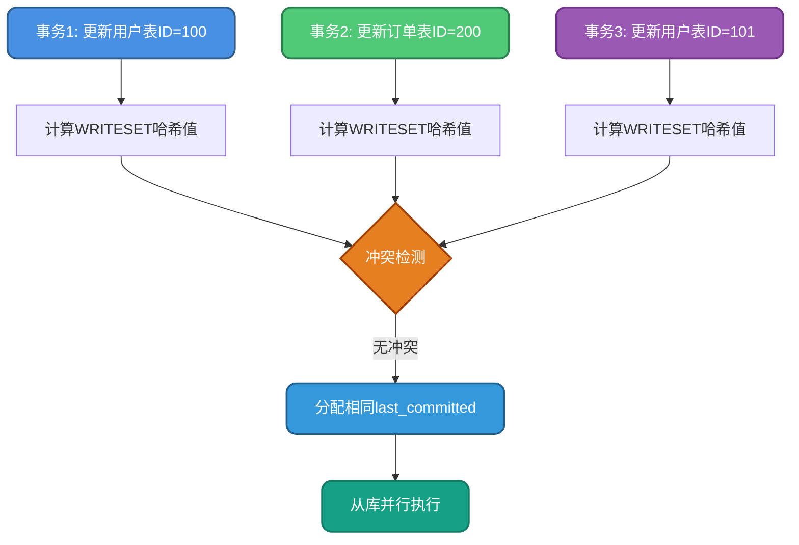
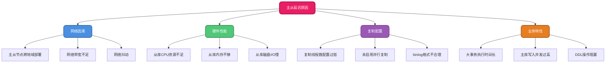
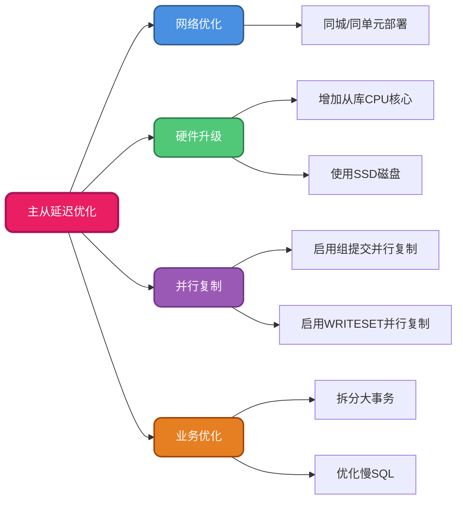

## MySQL主从复制架构概述

MySQL的主从复制是一种数据同步技术，它允许将一个MySQL数据库服务器（主库）的数据自动复制到一个或多个MySQL数据库服务器（从库）。这种架构广泛应用于读写分离、数据备份、故障转移等场景中。

主从复制的核心依赖于MySQL的二进制日志（binlog），通过记录主库上的所有数据变更操作，并将这些变更传递到从库进行重放，从而实现数据的一致性。

## 主从复制工作原理

### 复制流程详解

在深入了解主从复制之前，建议先熟悉binlog、redo log等日志机制的作用及其写入流程。MySQL的主从复制完整流程如下：


### 复制过程的关键步骤

**步骤1：从库线程初始化**

当从库开启主从复制功能后，系统会自动创建两个核心线程：
- **I/O线程**：负责与主库通信，拉取binlog日志数据
- **SQL线程**：负责解析和执行relay log中的SQL语句

**步骤2：建立主从连接**

从库的I/O线程主动向主库发起连接请求。主库端会启动一个专门的binlog dump线程，用于响应从库的请求并传输binlog数据。

**步骤3：确定同步起点**

从库I/O线程会告知主库的dump线程自己需要从哪个binlog文件的哪个位置（position）开始接收数据。这个位置信息通常保存在从库的`master.info`文件中。

**步骤4：主库记录变更**

主库在执行数据变更操作时，会根据配置的binlog格式（ROW、STATEMENT或MIXED）将变更内容记录到binlog文件中。不同格式记录的内容粒度和详细程度各有差异。

**步骤5：日志数据拉取**

当binlog dump线程检测到binlog文件发生变化时，会从指定位置开始读取新的日志内容。此时，从库的I/O线程会主动拉取这些日志数据。

**重要说明**：很多资料描述这一步是主库"推送"数据到从库，但实际上采用的是从库"拉取"（pull）模式。这种设计使得从库能够自主管理同步进度，更灵活地处理延迟和故障恢复。

**步骤6：写入中继日志**

从库I/O线程接收到binlog事件后，会将其写入本地的relay log（中继日志）文件中。relay log的格式与binlog相同，作为主库binlog在从库的临时存储。

**步骤7：SQL语句重放**

从库的SQL线程持续监控relay log文件，读取其中的事件并解析成具体的SQL操作，最后在从库上执行这些操作，完成数据的同步更新。

## 主从复制模式类型

MySQL提供了多种复制模式，以适应不同的业务场景和数据一致性需求。

### 异步复制（Asynchronous Replication）

异步复制是MySQL的默认复制模式，其工作流程如下：



**特点分析**：
- 主库执行完事务后立即向客户端返回成功响应，无需等待从库完成同步
- 性能最佳，主库写入操作不受从库影响
- 存在数据丢失风险：如果主库在事务提交后、binlog同步到从库之前发生故障，从库可能丢失最新的数据变更

**适用场景**：对性能要求高、可容忍短暂数据不一致的场景，如日志系统、分析报表等。

### 全同步复制（Fully Synchronous Replication）

全同步复制要求主库必须等待所有从库完成数据复制后才返回成功：



**特点分析**：
- 数据一致性最强，确保所有从库都已完成数据同步
- 性能最差，事务响应时间受最慢从库影响
- 从库数量越多，整体延迟越高

**适用场景**：对数据一致性要求极高的金融、支付等关键业务系统。

### 半同步复制（Semi-Synchronous Replication）

半同步复制是异步复制和全同步复制的折中方案：



**特点分析**：
- 主库等待至少一个从库确认接收到binlog事件后才返回成功
- 在事务的两阶段提交（prepare和commit）都完成后，等待从库确认
- 平衡了性能和数据安全性

**适用场景**：大多数生产环境的推荐选择，既保证一定的数据可靠性，又不会严重影响性能。

### 半同步复制的执行时序

在事务执行的完整流程中，半同步复制的等待点如下：



## 并行复制优化机制

在传统的单线程复制模式下，从库只有一个SQL线程串行执行relay log中的事务，当主库写入压力较大时，从库的单线程重放速度可能跟不上，导致主从延迟不断累积。为了解决这个问题，MySQL在不同版本中引入了多种并行复制策略。

### 基于库级别的并行复制（MySQL 5.6）

MySQL 5.6首次引入并行复制功能，采用的是基于Schema（数据库）级别的并行策略：



**工作原理**：
- 为每个数据库分配独立的SQL工作线程
- 不同数据库的事务可以并行执行
- 同一数据库内的事务仍然串行执行

**局限性**：
- 大多数应用系统采用单库多表设计，这种并行策略无法发挥作用
- 对于单库场景，退化为串行复制，性能提升有限
- 业界对该方案的实用性评价较低

### 基于组提交的并行复制（MySQL 5.7）

MySQL 5.7推出了革命性的基于组提交（Group Commit）的并行复制机制，也称为MTS（Enhanced Multi-Threaded Slave）：



**核心原理**：

组提交是MySQL为了提高事务吞吐量而采用的优化技术。当多个事务同时进入prepare阶段时，可以将它们合并成一个组，一次性刷盘，减少I/O次数。

**关键洞察**：如果多个事务能够在主库上进入同一个组进行提交，说明这些事务在锁资源上没有冲突。换句话说，它们操作的是不同的数据行，彼此互不影响。

既然这些事务在主库上可以并发执行而不冲突，那么在从库上重放时，同样可以并发执行，不会产生数据不一致的问题。

**实现方式**：
- 从库通过binlog中的last_committed和sequence_number字段识别组边界
- 具有相同last_committed值的事务属于同一组，可以并行回放
- 每个组内的事务由不同的工作线程并发执行

**配置示例**：

```sql
-- 设置并行复制的工作线程数
SET GLOBAL slave_parallel_workers = 8;

-- 设置并行类型为逻辑时钟（基于组提交）
SET GLOBAL slave_parallel_type = 'LOGICAL_CLOCK';
```

**优势**：
- 真正意义上的并行复制，不受数据库或表的限制
- 充分利用主库的并发能力，主库并发度越高，从库并行效果越好
- 显著降低主从延迟

**局限性**：
- 依赖主库的并发事务数量，如果主库事务串行执行，从库也无法并行
- 受组提交参数（binlog_group_commit_sync_delay、binlog_group_commit_sync_no_delay_count）的影响

### 基于WRITESET的并行复制（MySQL 8.0）

MySQL 8.0进一步优化，引入了基于WRITESET的并行复制机制，解决了组提交方案对主库并发度的依赖问题：



**核心思想**：

不再依赖主库的组提交行为，而是通过分析事务修改的数据行来判断事务之间是否存在冲突。即使主库上的事务是串行提交的，只要它们修改的数据行不冲突，在从库上就可以并行回放。

**WRITESET机制**：

WRITESET是一个哈希值集合，每个事务都会生成自己的WRITESET，其中包含该事务修改的所有行的哈希值。哈希值的计算基于表的主键和唯一键。

**配置启用WRITESET**：

```sql
-- 启用WRITESET依赖追踪
SET GLOBAL binlog_transaction_dependency_tracking = 'WRITESET';

-- 设置哈希算法（可选MURMUR32或XXHASH64）
SET GLOBAL transaction_write_set_extraction = 'XXHASH64';
```

**冲突检测流程**：

1. 每个事务提交时，计算其修改行的哈希值，生成WRITESET
2. 将新事务的WRITESET与历史事务的WRITESET进行比对
3. 如果没有相同的哈希值，说明没有冲突，可以共享相同的last_committed
4. 从库根据last_committed值判断哪些事务可以并行执行

**WRITESET的数据结构**：

```cpp
// C++ STL set容器存储哈希值
std::set<uint64> write_set_unique;
```

**优势**：
- 不依赖主库的并发度，即使主库串行提交，从库仍可并行
- 并行粒度更细，基于行级别的冲突检测
- 适应更多的应用场景，显著提升复制性能

**注意事项**：
- 需要维护历史事务的WRITESET信息，增加一定的内存开销
- 只对包含主键或唯一键的表有效
- 哈希冲突虽然概率极低，但理论上可能影响并行度

## 主从延迟问题分析与解决

### 什么是主从延迟

主从延迟是指从库上的数据与主库上的数据之间存在的时间差。具体表现为：主库上已经提交的事务，在从库上可能需要经过一段时间才能执行完成并反映到数据中。

可以通过从库上的以下命令查看延迟情况：

```sql
SHOW SLAVE STATUS\G

-- 关注以下字段：
-- Seconds_Behind_Master: 从库落后主库的秒数
-- Slave_SQL_Running_State: SQL线程的当前状态
```

### 主从延迟的常见原因



#### 网络延迟

主库和从库之间的网络连接质量直接影响binlog的传输速度。跨地域、跨机房部署时，网络延迟会更加明显。

#### 从库性能瓶颈

从库的硬件资源（CPU、内存、磁盘I/O）不足时，无法及时处理接收到的relay log，导致SQL线程执行缓慢。

#### 复制线程数量不足

当从库只有单个或少量SQL线程时，无法充分利用多核CPU的优势，数据回放速度受限。

#### 大事务问题

如果主库执行了一个涉及大量数据修改的长事务（例如批量更新百万行数据），该事务的binlog会很大，从库在重放时同样需要耗费很长时间，期间会阻塞其他事务的执行。

### 主从延迟的解决方案



#### 优化网络连接

- 确保主从节点部署在网络延迟低的环境中，优先选择同城或同单元部署
- 增加网络带宽，保障binlog传输的稳定性
- 使用专用网络链路，避免与其他业务竞争带宽

#### 提升从库硬件性能

- 增加从库的CPU核心数，提升并行处理能力
- 扩容内存，增大InnoDB缓冲池（innodb_buffer_pool_size）
- 使用高性能SSD磁盘，减少I/O等待时间

#### 启用并行复制

根据MySQL版本选择合适的并行复制策略：

**MySQL 5.7配置示例**：

```sql
-- 设置并行工作线程数（建议设置为CPU核心数的1-2倍）
SET GLOBAL slave_parallel_workers = 16;

-- 使用逻辑时钟方式（基于组提交）
SET GLOBAL slave_parallel_type = 'LOGICAL_CLOCK';
```

**MySQL 8.0配置示例**：

```sql
-- 启用WRITESET依赖追踪
SET GLOBAL binlog_transaction_dependency_tracking = 'WRITESET';

-- 设置哈希算法
SET GLOBAL transaction_write_set_extraction = 'XXHASH64';

-- 设置并行工作线程数
SET GLOBAL slave_parallel_workers = 16;

-- 并行类型
SET GLOBAL slave_parallel_type = 'LOGICAL_CLOCK';
```

#### 避免大事务

大事务会严重影响主从复制的效率，应采取以下措施：

- **拆分大事务**：将一次性修改大量数据的操作拆分为多个小事务，分批执行

```sql
-- 不推荐：一次更新100万行
UPDATE user_table SET status = 1 WHERE register_date < '2020-01-01';

-- 推荐：分批更新，每批1000行
DELIMITER $$
CREATE PROCEDURE update_user_status()
BEGIN
    DECLARE rows_affected INT DEFAULT 0;
    REPEAT
        UPDATE user_table SET status = 1 
        WHERE register_date < '2020-01-01' 
        AND status = 0
        LIMIT 1000;
        
        SET rows_affected = ROW_COUNT();
        COMMIT;
    UNTIL rows_affected = 0 END REPEAT;
END$$
DELIMITER ;

CALL update_user_status();
```

- **异步处理**：将非实时性的批量操作放到消息队列中异步处理
- **归档历史数据**：定期将冷数据迁移到归档表或历史库，减少单表数据量

#### 优化慢SQL

- 为查询和更新操作添加合适的索引
- 避免全表扫描和大范围的数据修改
- 使用EXPLAIN分析SQL执行计划，优化查询逻辑

#### 监控和告警

建立主从延迟监控体系：

```sql
-- 定期检查主从延迟
SELECT 
    CASE 
        WHEN Seconds_Behind_Master IS NULL THEN '复制未运行'
        WHEN Seconds_Behind_Master = 0 THEN '无延迟'
        WHEN Seconds_Behind_Master < 10 THEN '延迟较小'
        ELSE CONCAT('延迟', Seconds_Behind_Master, '秒')
    END AS 延迟状态
FROM information_schema.REPLICA_HOST_STATUS;
```

- 设置延迟告警阈值（如超过10秒），及时发现问题
- 监控从库的CPU、内存、磁盘I/O使用率
- 记录慢查询日志，分析耗时操作

## 主从复制最佳实践

### 配置建议

1. **选择合适的binlog格式**：
   - ROW格式：记录数据行的实际变化，更安全，推荐用于生产环境
   - STATEMENT格式：记录SQL语句，占用空间小，但可能导致主从数据不一致
   - MIXED格式：混合模式，MySQL自动选择

```sql
SET GLOBAL binlog_format = 'ROW';
```

2. **启用GTID模式**（MySQL 5.6+）：

```sql
-- 主库和从库都需要配置
SET GLOBAL gtid_mode = ON;
SET GLOBAL enforce_gtid_consistency = ON;
```

GTID（Global Transaction Identifier）为每个事务分配全局唯一标识符，简化故障切换和主从切换操作。

3. **配置半同步复制**：

```sql
-- 主库安装插件
INSTALL PLUGIN rpl_semi_sync_master SONAME 'semisync_master.so';
SET GLOBAL rpl_semi_sync_master_enabled = 1;
SET GLOBAL rpl_semi_sync_master_timeout = 10000; -- 超时时间10秒

-- 从库安装插件
INSTALL PLUGIN rpl_semi_sync_slave SONAME 'semisync_slave.so';
SET GLOBAL rpl_semi_sync_slave_enabled = 1;
```

### 运维建议

1. **定期检查主从状态**：
   - 确认I/O线程和SQL线程都在正常运行
   - 监控Seconds_Behind_Master指标

2. **做好从库的读负载均衡**：
   - 使用中间件（如ProxySQL、MyCat）分发读请求
   - 根据从库延迟情况动态调整读流量

3. **制定主从切换预案**：
   - 定期演练主从切换流程
   - 准备自动化切换脚本
   - 使用MHA、Orchestrator等高可用工具

4. **数据一致性校验**：
   - 使用pt-table-checksum工具定期校验主从数据一致性
   - 发现不一致时使用pt-table-sync进行修复

## 总结

MySQL主从复制是实现数据冗余、读写分离、高可用架构的重要技术手段。理解其工作原理、复制模式和并行复制机制，对于构建高性能、高可靠的数据库系统至关重要。

在实际应用中，应根据业务特点选择合适的复制模式和并行策略，并通过持续监控和优化，将主从延迟控制在可接受范围内，确保系统的稳定性和数据一致性。
