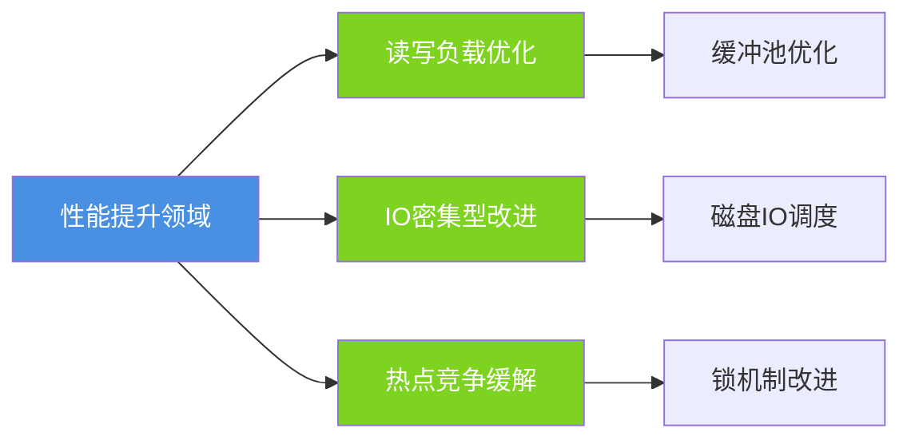
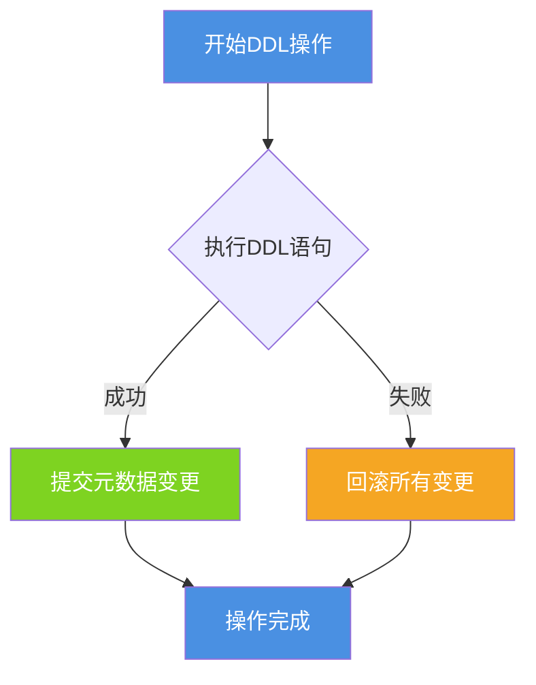
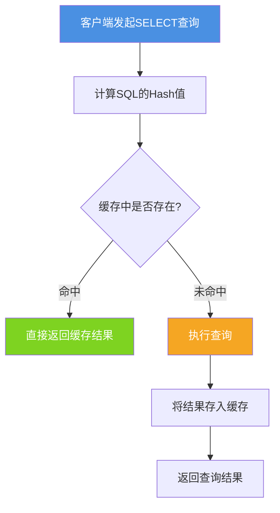
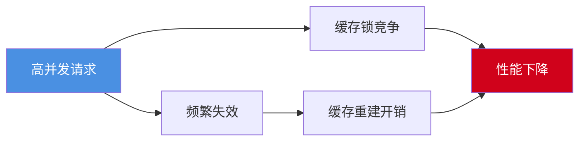
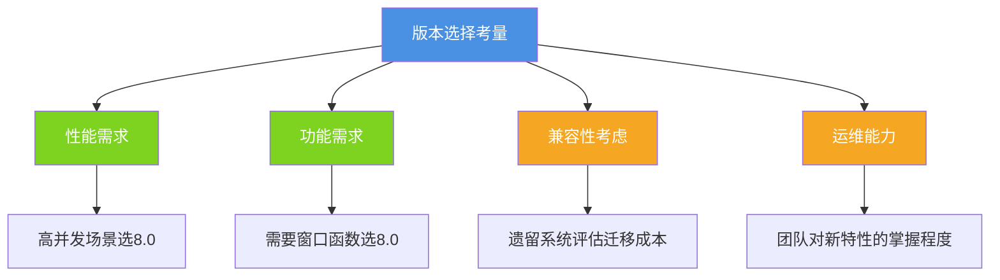

## MySQL版本发展历程

MySQL作为最流行的开源关系型数据库之一,经历了多个重要版本的迭代。从MySQL 5.x到MySQL 8.0,数据库在性能、功能和安全性方面都有了质的飞跃。理解不同版本之间的核心差异,对于数据库选型和系统架构设计至关重要。

## MySQL 8.0相较于5.x的核心变化

### 性能显著提升

MySQL 8.0的整体性能相比5.7提升了约2倍,这种性能提升体现在多个维度:



在高并发场景下,MySQL 8.0通过改进缓冲池管理、优化锁机制以及提升索引查询效率,实现了显著的性能突破。特别是在处理热点数据更新时,新版本能够更有效地应对竞争问题。

### NoSQL文档存储功能增强

从MySQL 5.7开始引入的NoSQL存储功能,在8.0版本中得到了大幅增强。MySQL文档存储提供了对JSON文档的原生支持,并具备以下特性:

- **无模式设计**:支持灵活的JSON文档存储,无需预定义严格的表结构
- **事务完整性**:为JSON文档提供完整的ACID事务保证
- **多文档事务**:支持跨多个文档的原子性操作

这消除了在某些场景下对独立NoSQL数据库的依赖,使得MySQL能够同时应对结构化和半结构化数据的存储需求。

示例代码:

```sql
-- 创建包含JSON字段的商品表
CREATE TABLE products (
    product_id INT PRIMARY KEY AUTO_INCREMENT,
    product_name VARCHAR(100),
    specifications JSON,
    created_at TIMESTAMP DEFAULT CURRENT_TIMESTAMP
);

-- 插入带有JSON规格的商品数据
INSERT INTO products (product_name, specifications) VALUES 
('智能手机', '{"brand": "TechBrand", "screen": "6.5英寸", "ram": "8GB", "storage": "256GB"}'),
('笔记本电脑', '{"brand": "ComputeCorp", "cpu": "Intel i7", "ram": "16GB", "disk": "512GB SSD"}');

-- 使用JSON路径查询特定属性
SELECT product_name, 
       JSON_EXTRACT(specifications, '$.brand') AS brand,
       JSON_EXTRACT(specifications, '$.ram') AS memory
FROM products
WHERE JSON_EXTRACT(specifications, '$.ram') = '8GB';
```

### 窗口函数支持

MySQL 8.0引入了窗口函数(Window Functions),这是SQL标准中的重要特性。与传统的聚合函数不同,窗口函数能够在保留每一行数据的同时进行计算,无需使用GROUP BY。

```sql
-- 员工薪资排名示例
SELECT 
    employee_id,
    department_name,
    salary,
    RANK() OVER (PARTITION BY department_name ORDER BY salary DESC) AS dept_rank,
    AVG(salary) OVER (PARTITION BY department_name) AS dept_avg_salary
FROM employees;
```

窗口函数支持的常用操作:
- `ROW_NUMBER()`: 为结果集中的行分配唯一序号
- `RANK()`/`DENSE_RANK()`: 计算排名
- `LAG()`/`LEAD()`: 访问前后行的数据
- `SUM()`/`AVG()` OVER: 在窗口内进行聚合计算

### 隐藏索引功能

MySQL 8.0新增了隐藏索引特性,允许DBA在不删除索引的情况下测试索引的影响:

```sql
-- 创建订单表并添加索引
CREATE TABLE orders (
    order_id INT PRIMARY KEY,
    customer_id INT,
    order_date DATE,
    total_amount DECIMAL(10,2),
    INDEX idx_customer (customer_id)
);

-- 隐藏索引进行性能测试
ALTER TABLE orders ALTER INDEX idx_customer INVISIBLE;

-- 观察查询性能变化后,可以恢复索引
ALTER TABLE orders ALTER INDEX idx_customer VISIBLE;

-- 如果性能无影响,可考虑删除
ALTER TABLE orders DROP INDEX idx_customer;
```

这个特性对于生产环境的索引优化非常有价值,避免了直接删除索引可能带来的风险。

### 降序索引支持

在MySQL 8.0之前,虽然可以在创建索引时指定DESC,但数据库内部仍然是升序存储的。MySQL 8.0实现了真正的降序索引:

```sql
-- 创建混合排序的复合索引
CREATE TABLE user_activities (
    user_id INT,
    activity_time TIMESTAMP,
    activity_type VARCHAR(50),
    INDEX idx_user_time (user_id ASC, activity_time DESC)
);

-- 该查询可以高效利用索引
SELECT * FROM user_activities 
WHERE user_id = 1001 
ORDER BY activity_time DESC 
LIMIT 10;
```

这对于需要按不同方向排序的查询场景有明显的性能提升。

### 通用表表达式(CTE)

CTE(Common Table Expressions)使复杂查询的可读性大大提高:

```sql
-- 使用CTE计算部门总薪资和平均薪资
WITH department_summary AS (
    SELECT 
        department_id,
        COUNT(*) AS employee_count,
        SUM(salary) AS total_salary,
        AVG(salary) AS avg_salary
    FROM employees
    GROUP BY department_id
)
SELECT 
    d.department_name,
    ds.employee_count,
    ds.total_salary,
    ds.avg_salary
FROM departments d
JOIN department_summary ds ON d.department_id = ds.department_id
WHERE ds.avg_salary > 60000;
```

CTE特别适合处理分层数据和递归查询场景。

### SELECT FOR UPDATE增强

MySQL 8.0为行锁操作增加了NOWAIT和SKIP LOCKED选项:

```sql
-- 传统方式:如果行被锁定则等待
SELECT * FROM inventory WHERE product_id = 100 FOR UPDATE;

-- NOWAIT:如果行被锁定则立即返回错误
SELECT * FROM inventory WHERE product_id = 100 FOR UPDATE NOWAIT;

-- SKIP LOCKED:跳过已锁定的行
SELECT * FROM inventory WHERE stock > 0 LIMIT 10 FOR UPDATE SKIP LOCKED;
```

这对于秒杀系统等高并发场景特别有用,可以避免大量事务阻塞等待。

### UTF-8编码优化

MySQL 8.0将`utf8mb4`作为默认字符集,彻底解决了传统utf8(实际是utf8mb3)无法存储4字节字符(如emoji表情)的问题:

```sql
-- MySQL 8.0中默认使用utf8mb4
CREATE TABLE social_posts (
    post_id INT PRIMARY KEY,
    content TEXT,  -- 可以直接存储emoji等特殊字符
    created_at TIMESTAMP
) DEFAULT CHARSET=utf8mb4 COLLATE=utf8mb4_unicode_ci;

-- 插入包含emoji的内容
INSERT INTO social_posts (post_id, content) 
VALUES (1, '今天天气真好 ☀️🌈 心情愉快! 😊');
```

### JSON功能增强

MySQL 8.0大幅扩展了JSON处理能力:

```sql
-- JSON聚合函数示例
SELECT 
    department_id,
    JSON_ARRAYAGG(employee_name) AS employees,
    JSON_OBJECTAGG(employee_id, salary) AS salary_map
FROM employees
GROUP BY department_id;

-- JSON_TABLE将JSON转换为关系表
SELECT details.*
FROM product_catalog,
JSON_TABLE(
    specifications,
    '$[*]' COLUMNS(
        feature VARCHAR(50) PATH '$.name',
        value VARCHAR(100) PATH '$.value'
    )
) AS details;
```

### DDL原子性保证

InnoDB在8.0版本中实现了DDL操作的原子性,表的DDL操作要么完全成功,要么完全回滚:



这避免了之前版本中DDL操作部分成功导致的数据不一致问题。

### 高可用性与安全性提升

- **InnoDB集群**:提供原生的高可用解决方案,支持自动故障转移
- **安全增强**:改进的OpenSSL支持,新的默认身份验证插件(caching_sha2_password)
- **权限管理**:引入SQL角色(Roles)概念,简化权限管理
- **密码策略**:内置密码强度验证和过期策略

```sql
-- 创建角色并分配权限
CREATE ROLE 'report_reader';
GRANT SELECT ON analytics.* TO 'report_reader';

-- 将角色授予用户
CREATE USER 'analyst1'@'%' IDENTIFIED BY 'SecurePass123!';
GRANT 'report_reader' TO 'analyst1'@'%';
SET DEFAULT ROLE 'report_reader' TO 'analyst1'@'%';
```

## 查询缓存的废除

### 查询缓存的工作机制

在MySQL 8.0之前的版本中,查询缓存是一个重要的性能优化特性。其工作流程如下:



查询缓存要求SQL语句完全一致(包括大小写、空格、注释等),任何细微差异都会导致无法命中缓存。

### 查询缓存的局限性

尽管查询缓存在特定场景下能提升性能,但存在诸多限制:

**严格的匹配规则**

查询缓存基于SQL文本的精确匹配,以下查询会被视为完全不同:

```sql
-- 这三个查询虽然逻辑相同,但缓存是独立的
SELECT * FROM users WHERE id = 1;
select * from users where id = 1;
SELECT * FROM users WHERE id=1;
```

**频繁的缓存失效**

查询缓存是表级管理,任何对表的修改都会导致该表相关的所有缓存失效:

```sql
-- 场景:用户表有大量查询缓存
SELECT * FROM users WHERE status = 'active';
SELECT * FROM users WHERE created_at > '2024-01-01';
SELECT * FROM users WHERE email LIKE '%@company.com';

-- 任何一次更新都会清空所有相关缓存
UPDATE users SET last_login = NOW() WHERE id = 1001;
-- 上述所有查询的缓存全部失效
```

**内存开销显著**

查询缓存需要存储完整的查询文本和结果集:

```sql
-- 大结果集占用大量内存
SELECT * FROM order_details 
WHERE order_date BETWEEN '2024-01-01' AND '2024-12-31';
-- 如果结果有数十万行,会占用大量缓存空间
```

**不支持的查询类型**

以下类型的查询不会被缓存:

```sql
-- 包含非确定性函数
SELECT *, NOW() FROM users;
SELECT *, RAND() FROM products;

-- 使用临时表
SELECT * FROM (SELECT * FROM users WHERE status = 'active') AS temp;

-- 包含用户变量
SELECT * FROM users WHERE created_at > @start_date;
```

### 性能负面影响

在高并发写场景下,查询缓存可能成为性能瓶颈:



在电商秒杀、社交媒体等写入频繁的场景中,查询缓存的维护成本往往超过其带来的收益。

### 更好的替代方案

MySQL 8.0移除查询缓存后,推荐使用以下方案:

**应用层缓存**

使用Redis、Memcached等专业缓存系统:

```java
// 使用Redis作为查询缓存
public User getUserById(Long userId) {
    String cacheKey = "user:" + userId;
    
    // 尝试从Redis获取
    String cachedUser = redisTemplate.opsForValue().get(cacheKey);
    if (cachedUser != null) {
        return JSON.parseObject(cachedUser, User.class);
    }
    
    // 缓存未命中,查询数据库
    User user = userMapper.selectById(userId);
    
    // 存入Redis,设置过期时间
    redisTemplate.opsForValue().set(cacheKey, JSON.toJSONString(user), 30, TimeUnit.MINUTES);
    
    return user;
}
```

**优化查询本身**

```sql
-- 创建合适的索引
CREATE INDEX idx_status_created ON users(status, created_at);

-- 使用覆盖索引避免回表
SELECT user_id, user_name, status FROM users WHERE status = 'active';
```

**结果集缓存**

对于复杂的统计查询,可以将结果物化:

```sql
-- 创建汇总表定期更新
CREATE TABLE daily_sales_summary (
    summary_date DATE PRIMARY KEY,
    total_orders INT,
    total_revenue DECIMAL(15,2),
    updated_at TIMESTAMP
);

-- 定时任务更新汇总数据
INSERT INTO daily_sales_summary
SELECT 
    DATE(order_date) AS summary_date,
    COUNT(*) AS total_orders,
    SUM(order_amount) AS total_revenue,
    NOW() AS updated_at
FROM orders
WHERE order_date >= CURDATE()
GROUP BY DATE(order_date)
ON DUPLICATE KEY UPDATE
    total_orders = VALUES(total_orders),
    total_revenue = VALUES(total_revenue),
    updated_at = VALUES(updated_at);
```

## 版本选择建议

在选择MySQL版本时,应考虑以下因素:



**推荐使用MySQL 8.0的场景:**
- 新项目启动
- 对性能有较高要求
- 需要使用窗口函数、CTE等新特性
- 有完善的测试和运维体系

**继续使用MySQL 5.7的场景:**
- 遗留系统且迁移成本高
- 依赖特定版本的第三方工具
- 团队对新版本不熟悉且无充足测试时间

总体而言,MySQL 8.0代表了数据库技术的显著进步,在性能、功能和安全性方面都有质的提升,是未来MySQL应用的主流选择。
