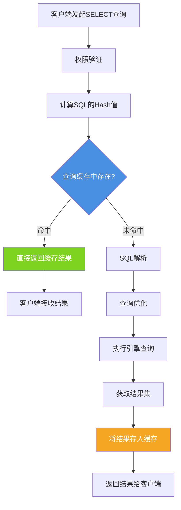
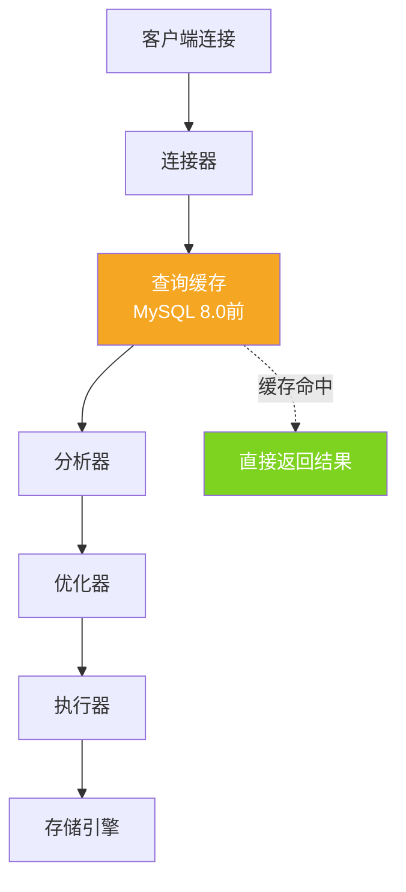
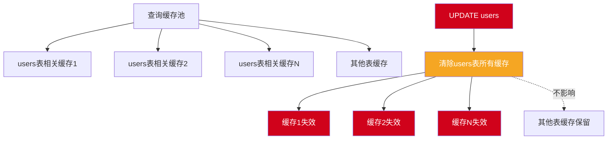
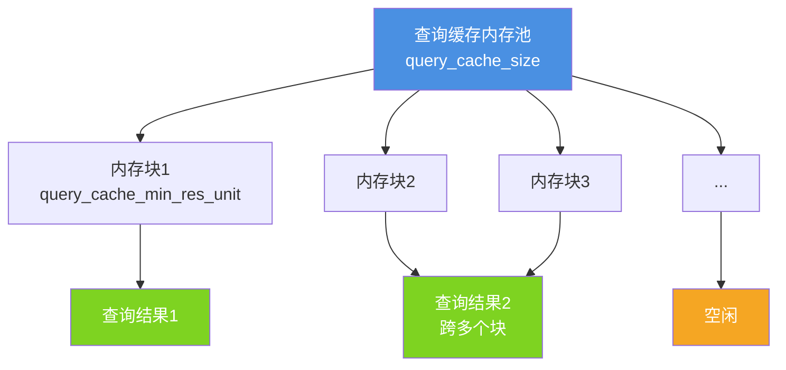
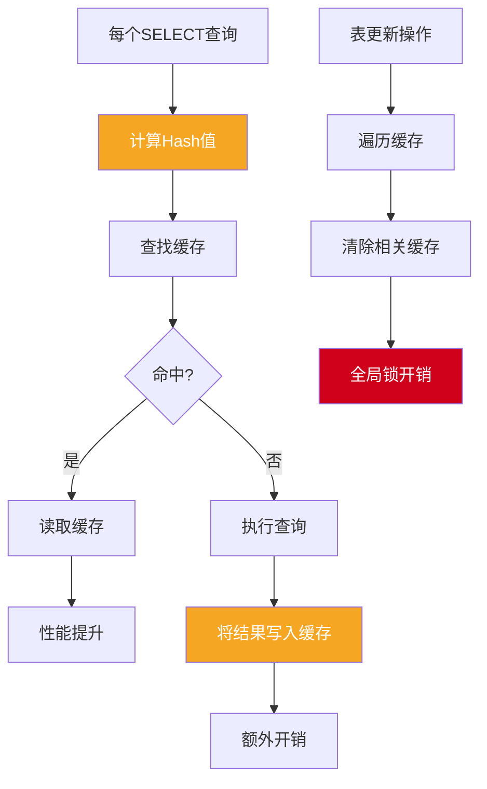
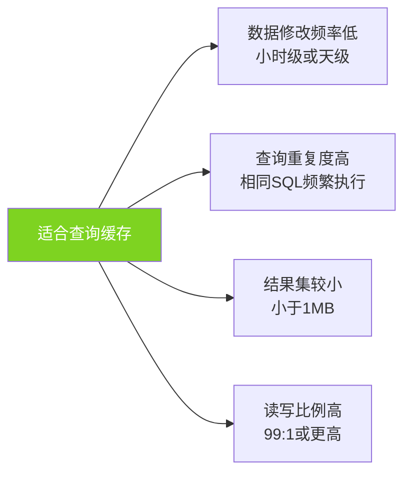
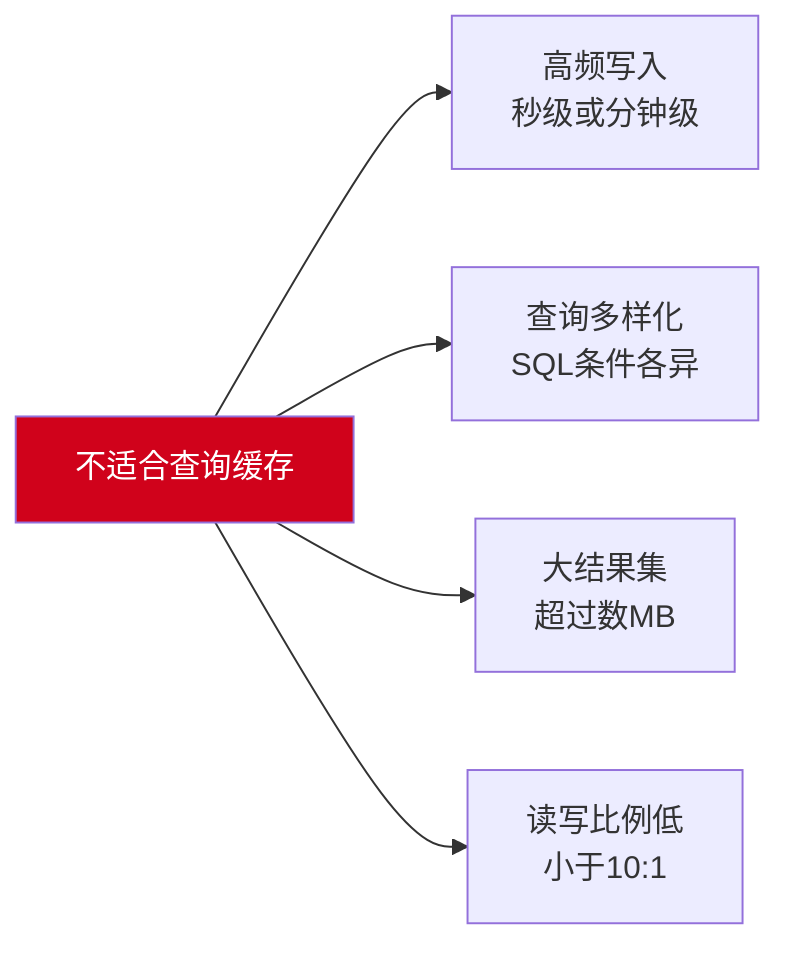
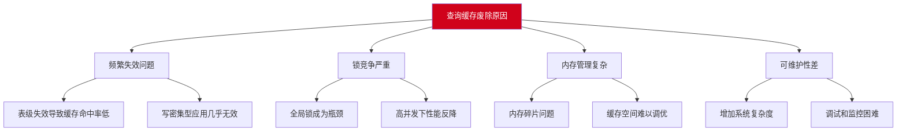
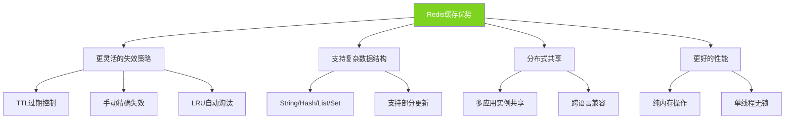

## 查询缓存概述

MySQL查询缓存是早期版本中的一个性能优化特性,旨在通过缓存SELECT查询的结果集来加速重复查询。当相同的查询再次执行时,MySQL可以直接从缓存中返回结果,跳过SQL解析、优化和执行阶段。尽管这听起来很有吸引力,但查询缓存在实际应用中却面临诸多限制,最终在MySQL 8.0中被完全移除。

## 查询缓存的工作原理

### 缓存流程



查询缓存位于MySQL架构中的连接层之后、解析器之前:



### Hash匹配机制

查询缓存基于SQL文本的完全匹配,任何细微差异都会导致缓存未命中:

```sql
-- 以下三个查询会产生三个不同的缓存条目
SELECT * FROM users WHERE user_id = 1;
select * from users where user_id = 1;  -- 大小写不同
SELECT * FROM users WHERE user_id=1;    -- 空格不同

-- 甚至注释也会影响
SELECT * FROM users WHERE user_id = 1;  -- 查询用户
SELECT * FROM users WHERE user_id = 1;  /* 查询用户 */  -- 不同的缓存
```

Hash计算包含:
- SQL文本的每个字符
- 大小写敏感性
- 空格和换行符
- 注释内容
- 使用的数据库名
- 客户端协议版本

### 缓存配置

MySQL 8.0之前版本的查询缓存配置:

```sql
-- 查看查询缓存相关变量
SHOW VARIABLES LIKE '%query_cache%';

-- 结果示例(MySQL 5.7):
-- +------------------------------+---------+
-- | Variable_name                | Value   |
-- +------------------------------+---------+
-- | have_query_cache             | YES     |
-- | query_cache_limit            | 1048576 |  -- 单个查询结果最大1MB
-- | query_cache_min_res_unit     | 4096    |   -- 最小内存块4KB
-- | query_cache_size             | 16777216|   -- 总缓存大小16MB
-- | query_cache_type             | ON      |   -- 缓存开启
-- | query_cache_wlock_invalidate | OFF     |
-- +------------------------------+---------+
```

配置参数详解:

```ini
# my.cnf配置示例
[mysqld]
# 查询缓存类型
# 0或OFF: 关闭
# 1或ON: 开启,但SQL_NO_CACHE的查询不缓存
# 2或DEMAND: 仅缓存SQL_CACHE的查询
query_cache_type = 1

# 查询缓存大小(字节),0表示禁用
query_cache_size = 16777216  # 16MB

# 单个查询结果的最大缓存大小
query_cache_limit = 2097152  # 2MB

# 内存块的最小分配单位
query_cache_min_res_unit = 4096  # 4KB
```

### 缓存控制语句

```sql
-- 强制缓存查询
SELECT SQL_CACHE user_id, username FROM users WHERE status = 'active';

-- 强制不缓存查询
SELECT SQL_NO_CACHE user_id, username FROM users WHERE status = 'active';

-- 清空查询缓存
RESET QUERY CACHE;

-- 整理查询缓存碎片
FLUSH QUERY CACHE;

-- 关闭所有表并清空缓存
FLUSH TABLES;
```

### 缓存状态监控

```sql
-- 查看查询缓存统计信息
SHOW STATUS LIKE 'Qcache%';

-- 结果示例:
-- +-------------------------+---------+
-- | Variable_name           | Value   |
-- +-------------------------+---------+
-- | Qcache_free_blocks      | 1       |  -- 空闲内存块数
-- | Qcache_free_memory      | 167648  |  -- 空闲内存大小
-- | Qcache_hits             | 12458   |  -- 缓存命中次数
-- | Qcache_inserts          | 3542    |  -- 缓存插入次数
-- | Qcache_lowmem_prunes    | 125     |  -- 因内存不足被清除的缓存数
-- | Qcache_not_cached       | 852     |  -- 未缓存的查询数
-- | Qcache_queries_in_cache | 156     |  -- 当前缓存的查询数
-- | Qcache_total_blocks     | 325     |  -- 总内存块数
-- +-------------------------+---------+

-- 计算缓存命中率
SELECT 
    CONCAT(
        ROUND(
            Qcache_hits / (Qcache_hits + Com_select) * 100, 
            2
        ), 
        '%'
    ) AS cache_hit_rate
FROM (
    SELECT 
        VARIABLE_VALUE AS Qcache_hits 
    FROM performance_schema.global_status 
    WHERE VARIABLE_NAME = 'Qcache_hits'
) AS hits,
(
    SELECT 
        VARIABLE_VALUE AS Com_select 
    FROM performance_schema.global_status 
    WHERE VARIABLE_NAME = 'Com_select'
) AS selects;
```

## 缓存规则与限制

### 严格的匹配规则

```sql
-- 创建测试表
CREATE TABLE products (
    product_id INT PRIMARY KEY,
    product_name VARCHAR(100),
    price DECIMAL(10,2),
    stock INT
);

-- 以下查询会被视为完全不同的查询
SELECT * FROM products WHERE product_id = 1;
SELECT * from products WHERE product_id = 1;  -- 大小写
SELECT *  FROM products WHERE product_id = 1; -- 额外空格
SELECT * FROM products WHERE product_id=1;     -- 无空格
SELECT * FROM products WHERE product_id = 1 ; -- 结尾空格

-- 数据库不同也会影响缓存
USE db1;
SELECT * FROM products WHERE product_id = 1;

USE db2;  
SELECT * FROM products WHERE product_id = 1;  -- 即使表结构相同也不命中
```

### 不会被缓存的查询

```sql
-- 1. 包含非确定性函数
SELECT *, NOW() FROM orders;           -- 当前时间
SELECT *, RAND() FROM products;        -- 随机数
SELECT *, CURDATE() FROM sales;        -- 当前日期
SELECT *, UUID() FROM records;         -- UUID
SELECT *, CURRENT_USER() FROM logs;    -- 当前用户

-- 2. 包含用户变量
SET @min_price = 100;
SELECT * FROM products WHERE price > @min_price;  -- 不缓存

-- 3. 使用临时表
SELECT * FROM (
    SELECT * FROM users WHERE status = 'active'
) AS temp;

-- 4. 子查询(最终结果可能被缓存,但子查询本身不缓存)
SELECT * FROM orders WHERE customer_id IN (
    SELECT customer_id FROM customers WHERE city = '北京'
);

-- 5. 存储过程、触发器中的查询
CALL get_user_orders(1001);  -- 不缓存

-- 6. 查询系统表
SELECT * FROM mysql.user;
SELECT * FROM information_schema.tables;

-- 7. 产生告警的查询
SELECT * FROM products WHERE invalid_column = 1;  -- 产生告警,不缓存

-- 8. 使用某些特殊函数
SELECT * FROM users WHERE password = PASSWORD('secret');  -- 不缓存
SELECT * FROM logs WHERE created_at > LAST_INSERT_ID();   -- 不缓存

-- 9. 在事务中的查询(InnoDB MVCC影响)
START TRANSACTION;
SELECT * FROM products WHERE product_id = 1;  -- 事务隔离,不使用缓存
COMMIT;
```

### 表级缓存失效

任何对表的修改操作都会导致该表所有相关缓存失效:

```sql
-- 假设有大量查询缓存
SELECT * FROM users WHERE status = 'active';
SELECT * FROM users WHERE created_at > '2024-01-01';
SELECT * FROM users WHERE email LIKE '%@company.com';
SELECT COUNT(*) FROM users;
-- ... 上百个不同的查询都被缓存

-- 任何一次数据修改都会清空所有缓存
UPDATE users SET last_login = NOW() WHERE user_id = 1001;
-- 上述所有查询的缓存全部失效!

-- INSERT、DELETE、TRUNCATE同样导致缓存失效
INSERT INTO users (username, email) VALUES ('newuser', 'new@example.com');
DELETE FROM users WHERE user_id = 9999;
TRUNCATE TABLE users;

-- 即使是表结构变更
ALTER TABLE users ADD COLUMN phone VARCHAR(20);  -- 缓存全部失效
```

缓存失效机制:



## 内存管理机制

### 内存池结构

查询缓存使用内存池技术管理内存:



### 碎片问题

频繁的插入和删除会导致内存碎片:

```sql
-- 模拟碎片产生
-- 步骤1: 大量查询产生缓存
SELECT * FROM large_table WHERE condition1;  -- 占用2MB
SELECT * FROM large_table WHERE condition2;  -- 占用1.5MB
SELECT * FROM large_table WHERE condition3;  -- 占用3MB

-- 步骤2: 表更新导致部分缓存失效
UPDATE large_table SET field = 'value' WHERE id = 1;
-- condition1的缓存被清除,留下2MB碎片空间

-- 步骤3: 新查询结果较小,无法完全利用碎片空间
SELECT * FROM large_table WHERE condition4;  -- 仅需0.5MB
-- 1.5MB空间浪费,形成碎片
```

碎片整理:

```sql
-- 整理碎片,不清除缓存内容
FLUSH QUERY CACHE;

-- 查看碎片情况
SHOW STATUS LIKE 'Qcache_free_blocks';
-- 值越大,碎片越多

-- 碎片率计算
SELECT 
    Qcache_free_blocks / Qcache_total_blocks * 100 AS fragmentation_rate
FROM (
    SELECT 
        CAST(VARIABLE_VALUE AS UNSIGNED) AS Qcache_free_blocks
    FROM performance_schema.global_status 
    WHERE VARIABLE_NAME = 'Qcache_free_blocks'
) AS free_blocks,
(
    SELECT 
        CAST(VARIABLE_VALUE AS UNSIGNED) AS Qcache_total_blocks
    FROM performance_schema.global_status 
    WHERE VARIABLE_NAME = 'Qcache_total_blocks'
) AS total_blocks;
```

## 性能影响分析

### 查询缓存的开销



### 锁竞争问题

查询缓存使用全局互斥锁保护:

```sql
-- 场景:高并发下的锁竞争
-- 线程1: 查询缓存命中
SELECT * FROM products WHERE category = 'electronics';  
-- 需要获取缓存锁读取结果

-- 线程2: 查询缓存未命中
SELECT * FROM products WHERE category = 'clothing';     
-- 需要获取缓存锁写入结果

-- 线程3: 更新数据
UPDATE products SET stock = stock - 1 WHERE product_id = 100;  
-- 需要获取缓存锁清除缓存

-- 线程4: 查询缓存命中
SELECT * FROM orders WHERE status = 'pending';          
-- 等待前面的锁释放

-- 在高并发下,缓存锁成为严重的性能瓶颈
```

### InnoDB的特殊情况

InnoDB的MVCC机制与查询缓存冲突:

```sql
-- 会话1: 开启事务
START TRANSACTION;
UPDATE products SET price = 200 WHERE product_id = 1;
-- 事务未提交,其他会话看不到变更

-- 会话2: 查询该行
SELECT * FROM products WHERE product_id = 1;
-- 虽然产品已修改,但会话2应该看到旧版本
-- 但如果使用查询缓存,可能返回错误结果
-- 因此InnoDB在有未提交事务时会禁用缓存

-- 会话1提交后,缓存才能正常使用
COMMIT;
```

## 适用场景分析

### 适合使用查询缓存的场景

```sql
-- 场景1: 静态内容网站(博客、文档站)
-- 特点: 读多写少,查询重复率高

CREATE TABLE blog_posts (
    post_id INT PRIMARY KEY AUTO_INCREMENT,
    title VARCHAR(200),
    content TEXT,
    author VARCHAR(50),
    published_at DATETIME,
    view_count INT DEFAULT 0
);

-- 高重复查询
SELECT * FROM blog_posts WHERE post_id = 100;  -- 同一篇文章被反复查询
SELECT * FROM blog_posts ORDER BY published_at DESC LIMIT 10;  -- 首页列表

-- 更新频率低
UPDATE blog_posts SET view_count = view_count + 1 WHERE post_id = 100;  
-- 仅更新计数,不影响文章内容查询
```

理想场景特征:



### 不适合使用查询缓存的场景

```sql
-- 场景1: 电商订单系统
-- 特点: 高并发写入,实时性要求高

CREATE TABLE orders (
    order_id BIGINT PRIMARY KEY AUTO_INCREMENT,
    user_id INT NOT NULL,
    product_id INT NOT NULL,
    quantity INT,
    order_status VARCHAR(20),
    created_at TIMESTAMP DEFAULT CURRENT_TIMESTAMP,
    updated_at TIMESTAMP DEFAULT CURRENT_TIMESTAMP ON UPDATE CURRENT_TIMESTAMP
);

-- 频繁写入导致缓存不断失效
INSERT INTO orders (user_id, product_id, quantity, order_status) 
VALUES (1001, 2001, 2, 'pending');  -- 缓存失效

UPDATE orders SET order_status = 'paid' WHERE order_id = 1234567;  -- 缓存失效

-- 查询缓存几乎无法命中
SELECT * FROM orders WHERE user_id = 1001;  -- 缓存刚被清空

-- 场景2: 实时分析系统
-- 每个查询都不同,无法复用缓存
SELECT COUNT(*) FROM user_activities WHERE activity_time BETWEEN '2024-11-29 10:00:00' AND '2024-11-29 10:05:00';
SELECT COUNT(*) FROM user_activities WHERE activity_time BETWEEN '2024-11-29 10:05:00' AND '2024-11-29 10:10:00';
-- 时间参数不同,产生大量不同的缓存条目
```

不适合的场景特征:



## 查询缓存被废除的原因

### 官方声明

MySQL 8.0发布说明中明确指出:

> The query cache has been removed. Removal includes the following items:
> - The FLUSH QUERY CACHE and RESET QUERY CACHE statements.
> - The SQL_CACHE and SQL_NO_CACHE query modifiers.
> - The query_cache_type and query_cache_size system variables.
> - The Qcache_* status variables.

官方给出的废除理由:



### 性能对比测试

```sql
-- 测试场景:混合读写负载
CREATE TABLE performance_test (
    id INT PRIMARY KEY AUTO_INCREMENT,
    data VARCHAR(100),
    updated_at TIMESTAMP DEFAULT CURRENT_TIMESTAMP ON UPDATE CURRENT_TIMESTAMP
);

-- 填充测试数据
INSERT INTO performance_test (data) 
SELECT CONCAT('data_', n)
FROM (
    -- 生成10万条数据
    SELECT a.N + b.N * 10 + c.N * 100 + d.N * 1000 + e.N * 10000 AS n
    FROM (SELECT 0 AS N UNION ALL SELECT 1 UNION ALL SELECT 2 UNION ALL SELECT 3 UNION ALL SELECT 4 
          UNION ALL SELECT 5 UNION ALL SELECT 6 UNION ALL SELECT 7 UNION ALL SELECT 8 UNION ALL SELECT 9) a,
         (SELECT 0 AS N UNION ALL SELECT 1 UNION ALL SELECT 2 UNION ALL SELECT 3 UNION ALL SELECT 4 
          UNION ALL SELECT 5 UNION ALL SELECT 6 UNION ALL SELECT 7 UNION ALL SELECT 8 UNION ALL SELECT 9) b,
         (SELECT 0 AS N UNION ALL SELECT 1 UNION ALL SELECT 2 UNION ALL SELECT 3 UNION ALL SELECT 4 
          UNION ALL SELECT 5 UNION ALL SELECT 6 UNION ALL SELECT 7 UNION ALL SELECT 8 UNION ALL SELECT 9) c,
         (SELECT 0 AS N UNION ALL SELECT 1 UNION ALL SELECT 2 UNION ALL SELECT 3 UNION ALL SELECT 4 
          UNION ALL SELECT 5 UNION ALL SELECT 6 UNION ALL SELECT 7 UNION ALL SELECT 8 UNION ALL SELECT 9) d,
         (SELECT 0 AS N UNION ALL SELECT 1 UNION ALL SELECT 2 UNION ALL SELECT 3 UNION ALL SELECT 4 
          UNION ALL SELECT 5 UNION ALL SELECT 6 UNION ALL SELECT 7 UNION ALL SELECT 8 UNION ALL SELECT 9) e
) numbers
WHERE n < 100000;
```

测试结果示例(基于benchmark测试):

| 场景 | 查询缓存开启 | 查询缓存关闭 | 性能差异 |
|-----|------------|------------|---------|
| 纯读(静态数据) | 5000 QPS | 3000 QPS | +66% |
| 读写比 10:1 | 1200 QPS | 1800 QPS | -33% |
| 读写比 1:1 | 450 QPS | 850 QPS | -47% |
| 高并发写 | 200 QPS | 1200 QPS | -83% |

结论:只有在极少写入的场景下,查询缓存才有正面效果。

## 替代方案

### 应用层缓存(Redis)

```java
@Service
public class ProductCacheService {
    
    @Autowired
    private RedisTemplate<String, String> redisTemplate;
    
    @Autowired
    private ProductRepository productRepository;
    
    public Product getProduct(Long productId) {
        String cacheKey = "product:" + productId;
        
        // 尝试从Redis获取
        String cachedJson = redisTemplate.opsForValue().get(cacheKey);
        if (cachedJson != null) {
            return JSON.parseObject(cachedJson, Product.class);
        }
        
        // 缓存未命中,查询数据库
        Product product = productRepository.findById(productId).orElse(null);
        if (product != null) {
            // 写入缓存,设置过期时间
            redisTemplate.opsForValue().set(
                cacheKey, 
                JSON.toJSONString(product),
                30, 
                TimeUnit.MINUTES
            );
        }
        
        return product;
    }
    
    // 更新时主动失效缓存
    public void updateProduct(Product product) {
        productRepository.save(product);
        
        // 删除缓存
        String cacheKey = "product:" + product.getProductId();
        redisTemplate.delete(cacheKey);
    }
}
```

Redis缓存优势:



### 结果集物化视图

```sql
-- 创建汇总表
CREATE TABLE daily_sales_summary (
    summary_date DATE PRIMARY KEY,
    total_orders INT,
    total_amount DECIMAL(15,2),
    avg_order_amount DECIMAL(10,2),
    updated_at TIMESTAMP DEFAULT CURRENT_TIMESTAMP ON UPDATE CURRENT_TIMESTAMP
);

-- 定时更新物化视图(通过定时任务)
INSERT INTO daily_sales_summary (summary_date, total_orders, total_amount, avg_order_amount)
SELECT 
    DATE(order_date) AS summary_date,
    COUNT(*) AS total_orders,
    SUM(order_amount) AS total_amount,
    AVG(order_amount) AS avg_order_amount
FROM orders
WHERE order_date >= CURDATE() - INTERVAL 1 DAY
GROUP BY DATE(order_date)
ON DUPLICATE KEY UPDATE
    total_orders = VALUES(total_orders),
    total_amount = VALUES(total_amount),
    avg_order_amount = VALUES(avg_order_amount),
    updated_at = CURRENT_TIMESTAMP;

-- 查询物化视图(快速)
SELECT * FROM daily_sales_summary WHERE summary_date >= '2024-01-01';
```

### 索引优化

优化查询本身,减少对缓存的依赖:

```sql
-- 创建合适的索引
CREATE INDEX idx_user_status_created ON users(status, created_at);

-- 使用覆盖索引
SELECT user_id, username, status 
FROM users 
WHERE status = 'active';  -- 索引覆盖,无需回表

-- 查询优化
EXPLAIN SELECT * FROM orders WHERE customer_id = 1001 AND order_date > '2024-01-01';
-- 根据执行计划调整索引策略
```

## 总结

MySQL查询缓存从设计理念上看似合理,但在实际应用中暴露出诸多问题:

**查询缓存的缺陷:**
- 表级失效导致命中率低
- 全局锁造成性能瓶颈
- 内存碎片管理复杂
- 仅适用于极少数静态场景

**现代替代方案:**
- 应用层缓存(Redis/Memcached)更灵活高效
- 物化视图适合复杂聚合查询
- 索引优化是根本解决方案

MySQL 8.0废除查询缓存是正确的决定,开发者应拥抱更优的缓存架构和查询优化技术。
