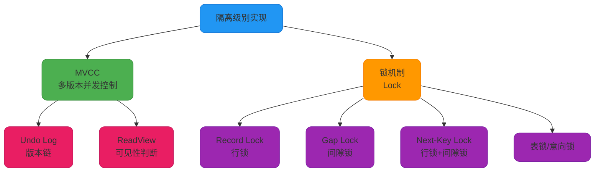
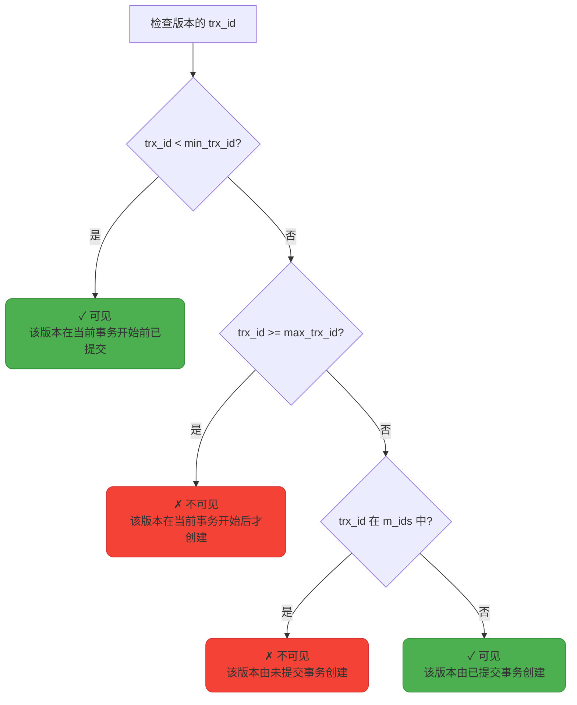
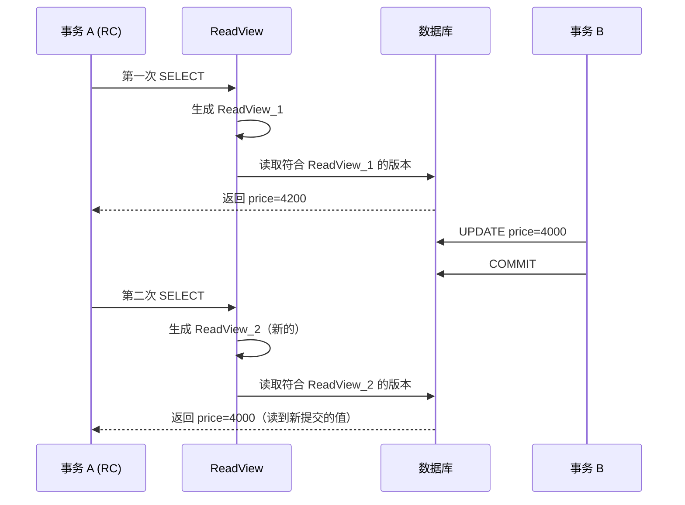
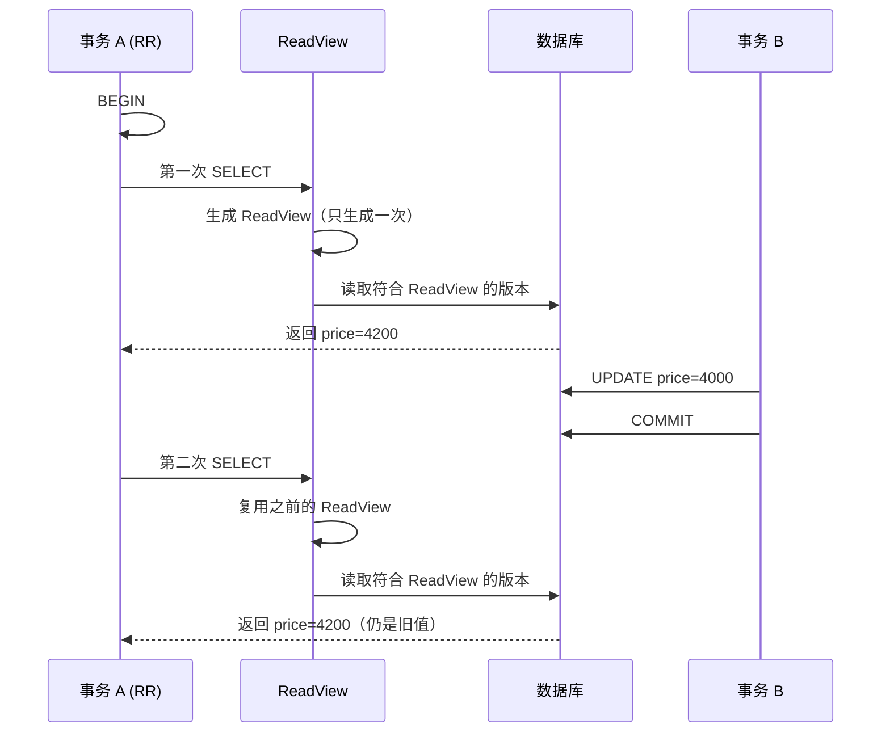
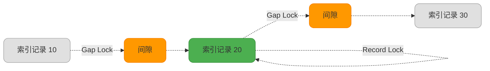
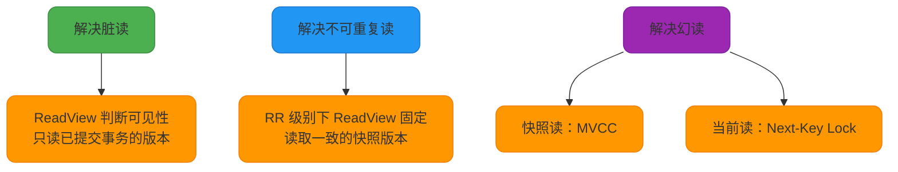

# MySQL隔离级别实现原理

## MySQL 如何实现不同隔离级别

MySQL 通过 **多版本并发控制（MVCC）** 和 **锁机制** 的组合实现了不同的事务隔离级别。不同的隔离级别采用不同的并发控制策略，从而在数据一致性和系统性能之间取得平衡。

### 隔离级别实现机制总览

| **隔离级别** | **脏读** | **不可重复读** | **幻读** | **实现机制** |
|---|---|---|---|---|
| **READ UNCOMMITTED** | 可能 | 可能 | 可能 | 直接读取最新数据（无版本控制，无锁） |
| **READ COMMITTED** | 不可能 | 可能 | 可能 | 每次查询生成新 ReadView |
| **REPEATABLE READ** | 不可能 | 不可能 | 可能 | 事务开始时生成 ReadView + Next-Key Lock |
| **SERIALIZABLE** | 不可能 | 不可能 | 不可能 | 所有读操作加共享锁，写操作加排他锁 |



## MVCC（多版本并发控制）

MVCC（Multi-Version Concurrency Control）是 InnoDB 实现高并发的核心机制。它通过保存数据的多个历史版本，使得读操作不需要加锁，从而大幅提升并发性能。

### MVCC 核心组成

MVCC 依赖两个关键组件：**Undo Log** 和 **ReadView**。

#### 1. Undo Log（版本链）

Undo Log 记录数据修改前的旧版本，形成一个版本链。每条记录都包含以下隐藏字段：

- **DB_TRX_ID**：最后修改该行的事务 ID
- **DB_ROLL_PTR**：指向 Undo Log 中上一个版本的指针
- **DB_ROW_ID**：隐藏的自增 ID（如果没有主键）

**版本链示例：**

假设有一张商品表：

```sql
CREATE TABLE product (
    id INT PRIMARY KEY,
    name VARCHAR(100),
    price DECIMAL(10, 2)
);

INSERT INTO product (id, name, price) VALUES (1, '笔记本电脑', 5000.00);
```

多个事务依次修改价格：

```sql
-- 事务 100：修改价格为 4800
UPDATE product SET price = 4800 WHERE id = 1;

-- 事务 200：修改价格为 4500
UPDATE product SET price = 4500 WHERE id = 1;

-- 事务 300：修改价格为 4200
UPDATE product SET price = 4200 WHERE id = 1;
```

形成的版本链：


#### 2. ReadView（读视图）

ReadView 是事务在某个时刻对数据库状态的快照，用于判断版本链中哪些版本对当前事务可见。

**ReadView 包含的关键信息：**

- **m_ids（trx_ids）**：生成 ReadView 时所有活跃（未提交）的事务 ID 列表
- **min_trx_id（up_limit_id）**：活跃事务中最小的事务 ID
- **max_trx_id（low_limit_id）**：系统应该分配给下一个事务的 ID（当前最大事务 ID + 1）
- **creator_trx_id**：创建这个 ReadView 的事务 ID

**可见性判断规则：**

对于版本链中的每个版本，其 `DB_TRX_ID` 记为 `trx_id`，判断流程如下：



**示例代码：**

```sql
-- 假设当前活跃事务：150, 180, 210
-- ReadView: m_ids=[150, 180, 210], min_trx_id=150, max_trx_id=220

-- 版本 1：trx_id=100
-- 100 < 150 → 可见（在事务开始前已提交）

-- 版本 2：trx_id=180
-- 180 在 m_ids 中 → 不可见（事务 180 未提交）

-- 版本 3：trx_id=200
-- 150 <= 200 < 220 且 200 不在 m_ids 中 → 可见（事务 200 已提交）

-- 版本 4：trx_id=230
-- 230 >= 220 → 不可见（在当前事务开始后才创建）
```

### 不同隔离级别下的 MVCC 行为

#### READ UNCOMMITTED（RU）

**实现方式：** 直接读取最新版本的数据，不使用 MVCC 和 ReadView。

```sql
SET SESSION TRANSACTION ISOLATION LEVEL READ UNCOMMITTED;

-- 事务 A
BEGIN;
SELECT price FROM product WHERE id = 1;
-- 直接读取最新值，即使是未提交的修改
```

**特点：** 没有任何隔离保护，性能最高但数据一致性最差。

#### READ COMMITTED（RC）

**实现方式：** 每次 SELECT 语句执行时都生成新的 ReadView。

```sql
SET SESSION TRANSACTION ISOLATION LEVEL READ COMMITTED;

-- 事务 A
BEGIN;
SELECT price FROM product WHERE id = 1;
-- 第一次查询，生成 ReadView_1，读取已提交的最新版本

-- 事务 B 修改并提交
-- UPDATE product SET price = 4000 WHERE id = 1; COMMIT;

SELECT price FROM product WHERE id = 1;
-- 第二次查询，生成 ReadView_2，读取事务 B 提交后的新值
COMMIT;
```

**工作流程：**



**特点：** 避免脏读，但会出现不可重复读和幻读。

#### REPEATABLE READ（RR）

**实现方式：** 事务第一次执行 SELECT 时生成 ReadView，后续所有快照读都使用这个 ReadView。

```sql
SET SESSION TRANSACTION ISOLATION LEVEL REPEATABLE READ;

-- 事务 A
BEGIN;
SELECT price FROM product WHERE id = 1;
-- 第一次查询，生成 ReadView，读取 price=4200

-- 事务 B 修改并提交
-- UPDATE product SET price = 4000 WHERE id = 1; COMMIT;

SELECT price FROM product WHERE id = 1;
-- 第二次查询，仍使用之前的 ReadView，读取 price=4200
COMMIT;
```

**工作流程：**



**特点：** 避免脏读和不可重复读，快照读场景下避免幻读。

## 锁机制与幻读处理

MVCC 只能解决快照读（普通 SELECT）的并发问题。对于当前读（加锁的 SELECT、UPDATE、DELETE、INSERT），需要通过锁机制来保证隔离性。

### 快照读 vs 当前读

| **读类型** | **SQL 示例** | **是否加锁** | **读取版本** |
|---|---|---|---|
| **快照读** | `SELECT * FROM table WHERE ...` | 否 | 基于 ReadView 读取历史版本 |
| **当前读** | `SELECT ... FOR UPDATE`<br/>`SELECT ... LOCK IN SHARE MODE`<br/>`UPDATE / DELETE / INSERT` | 是 | 读取最新版本，加锁 |

**示例代码：**

```sql
-- 快照读（不加锁）
SELECT * FROM orders WHERE order_id = 1001;

-- 当前读（加排他锁）
SELECT * FROM orders WHERE order_id = 1001 FOR UPDATE;

-- 当前读（加共享锁）
SELECT * FROM orders WHERE order_id = 1001 LOCK IN SHARE MODE;

-- 当前读（加排他锁）
UPDATE orders SET status = 'PAID' WHERE order_id = 1001;
DELETE FROM orders WHERE order_id = 1001;
INSERT INTO orders (order_id, amount) VALUES (1001, 500);
```

### Next-Key Lock（间隙锁 + 行锁）

在 REPEATABLE READ 级别下，InnoDB 使用 **Next-Key Lock** 防止当前读场景下的幻读。

**Next-Key Lock 组成：**

- **Record Lock（行锁）**：锁定索引记录本身
- **Gap Lock（间隙锁）**：锁定索引记录之间的间隙



**示例场景：**

假设订单表有索引 `(user_id)`，当前记录：

| order_id | user_id | amount |
|---|---|---|
| 101 | 10 | 100 |
| 102 | 20 | 200 |
| 103 | 30 | 300 |

```sql
-- 事务 A（RR 隔离级别）
BEGIN;
SELECT * FROM orders WHERE user_id > 15 AND user_id < 25 FOR UPDATE;
-- 锁定范围：(10, 20] 的 Next-Key Lock + (20, 30) 的 Gap Lock
-- 即锁定 user_id 在 (10, 30) 范围内的所有记录和间隙

-- 事务 B 尝试插入
INSERT INTO orders (order_id, user_id, amount) VALUES (104, 18, 150);
-- 阻塞！因为 user_id=18 在锁定的间隙内

-- 事务 B 尝试插入
INSERT INTO orders (order_id, user_id, amount) VALUES (105, 35, 400);
-- 成功！user_id=35 不在锁定范围内
```

### SERIALIZABLE（串行化）

**实现方式：** 所有读操作自动加共享锁（`LOCK IN SHARE MODE`），写操作加排他锁。

```sql
SET SESSION TRANSACTION ISOLATION LEVEL SERIALIZABLE;

-- 事务 A
BEGIN;
SELECT * FROM orders WHERE user_id = 1001;
-- 自动转换为：SELECT ... LOCK IN SHARE MODE

-- 事务 B 尝试修改
UPDATE orders SET amount = 600 WHERE user_id = 1001;
-- 阻塞！等待事务 A 释放共享锁
```

**特点：** 完全串行化执行，避免所有并发问题，但性能最差。

## InnoDB 如何解决三种读现象

| **读现象** | **解决方式** | **使用机制** |
|---|---|---|
| **脏读** | RC 及以上级别 | 每次查询生成新 ReadView，只读取已提交版本 |
| **不可重复读** | RR 及以上级别 | 事务开始时生成 ReadView，后续复用同一视图 |
| **幻读** | MVCC（快照读）+ Next-Key Lock（当前读）| RR：快照读避免幻读，当前读用间隙锁防止插入<br/>SERIALIZABLE：强制串行化 |

**实现原理总结：**



## 总结

MySQL 通过 MVCC 和锁机制的协同工作实现了不同的隔离级别：

1. **MVCC** 提供高效的快照读，避免读写冲突
2. **ReadView** 控制版本可见性，实现不同隔离级别的语义
3. **锁机制** 保护当前读和写操作，防止并发冲突
4. **Next-Key Lock** 在 RR 级别下防止幻读

理解这些机制，能够帮助我们：
- 根据业务需求选择合适的隔离级别
- 优化查询性能（优先使用快照读）
- 避免死锁和锁等待问题
- 设计更可靠的并发控制方案
