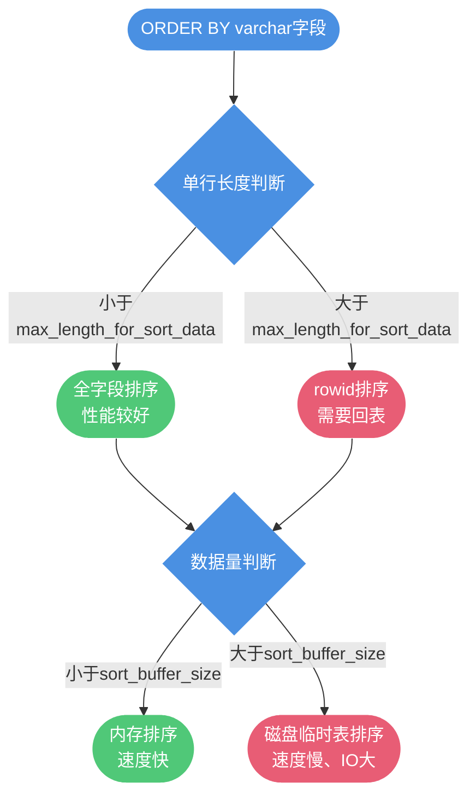
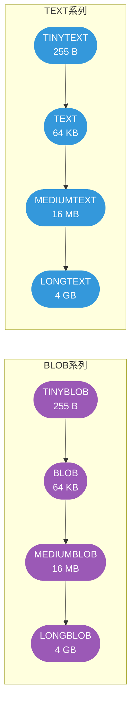

# MySQL字段类型与设计规范

## 字符串类型选择:CHAR vs VARCHAR

在 MySQL 中,存储字符串数据主要使用 `CHAR` 和 `VARCHAR` 两种类型。它们在存储方式、性能表现和适用场景上存在显著差异。

### 核心区别

**CHAR 是定长字符类型**,存储时会自动在末尾填充空格至指定长度。例如 `CHAR(50)` 定义的字段,无论实际存储多少字符,都会占用 50 个字符的存储空间。

**VARCHAR 是变长字符类型**,只存储实际的字符内容,不会填充空格。`VARCHAR(50)` 存储 10 个字符时,实际只占用 10 个字符的空间(加上 1-2 字节的长度信息)。


### VARCHAR 的特性与权衡

**优势**:
1. **节省存储空间**:变长存储,实际占用空间更小
2. **兼容性好**:适应不同长度的字符串数据

**劣势**:
1. **需要额外开销**:1-2 字节用于存储长度信息(长度≤255 用 1 字节,否则 2 字节)
2. **可能产生内存碎片**:频繁的更新操作可能导致存储碎片
3. **可能触发页分裂**:当字符串变长时,原位置无法容纳新数据

**页分裂示例**:

```sql
-- 商品评论表
CREATE TABLE product_reviews (
    id BIGINT PRIMARY KEY AUTO_INCREMENT,
    product_code VARCHAR(20),
    reviewer_name VARCHAR(50),
    comment VARCHAR(500)  -- 初始短评论,后续可能追加内容
);

-- 初始插入短评论
INSERT INTO product_reviews VALUES (1, 'SKU-2024-001', '张三', '商品不错');

-- 后续用户追加大量内容,原位置无法存储
UPDATE product_reviews SET comment = '商品不错,经过一个月使用...(此处省略400字)' 
WHERE id = 1;  -- 可能触发页分裂
```

### CHAR 的特性与权衡

**优势**:
1. **避免内存碎片**:定长存储,空间固定
2. **无需额外长度字节**:节省长度信息开销
3. **避免页分裂**:更新不会改变占用空间

**劣势**:
1. **浪费存储空间**:短字符串也占用全部空间
2. **丢失末尾空格**:存储 `"MySQL "` 会丢失末尾空格信息

```sql
-- 国家代码表(固定2位)
CREATE TABLE countries (
    code CHAR(2) PRIMARY KEY,  -- 'CN', 'US', 'JP' 固定长度
    name VARCHAR(100)
);

-- 订单流水号(固定20位)
CREATE TABLE order_records (
    order_no CHAR(20) PRIMARY KEY,  -- 'ORD20241120000001' 固定格式
    amount DECIMAL(10, 2)
);
```

### VARCHAR 长度定义的影响

虽然 `VARCHAR(10)` 和 `VARCHAR(100)` 在存储相同内容时占用空间相同,但在某些场景下仍有差异:

**排序操作的内存开销**:

MySQL 执行 `ORDER BY` 时,会在 `sort_buffer` 中为每行预留空间。VARCHAR 字段会按照定义的最大长度预留内存:

```sql
-- 场景1: VARCHAR(10)
SELECT * FROM users ORDER BY nickname;  
-- sort_buffer 为每个 nickname 预留 10字符 + 长度字节

-- 场景2: VARCHAR(100)  
SELECT * FROM users ORDER BY nickname;
-- sort_buffer 为每个 nickname 预留 100字符 + 长度字节
```

**影响**:
- 当单行长度超过 `max_length_for_sort_data`,会触发 rowid 排序(需要回表)
- 当数据量超过 `sort_buffer_size`,会使用磁盘临时表(性能下降)



**建议**:根据实际需要定义 VARCHAR 长度,避免过度设计。

## 大数据类型:BLOB vs TEXT

BLOB 和 TEXT 都用于存储大量数据,但用途和特性不同。

### 核心区别

| 特性 | BLOB | TEXT |
|------|------|------|
| 存储内容 | 二进制数据(图片、音频、视频) | 文本数据(文章、评论、描述) |
| 字符集处理 | 不进行字符集转换 | 支持字符集转换 |
| 排序支持 | 不支持排序 | 支持排序 |

### 类型变种与容量

两者都提供了多个容量级别的变种:



### 使用场景与限制

**BLOB 典型场景**(不推荐直接存储):
```sql
-- 文件元数据表(推荐只存路径)
CREATE TABLE file_metadata (
    id BIGINT PRIMARY KEY AUTO_INCREMENT,
    file_name VARCHAR(255),
    file_path VARCHAR(500),  -- 存储文件在OSS的URL
    file_size BIGINT,
    upload_time DATETIME
);

-- 不推荐:直接存储二进制内容
-- file_data BLOB  -- 影响数据库性能
```

**TEXT 典型场景**:
```sql
-- 博客文章表
CREATE TABLE blog_posts (
    id BIGINT PRIMARY KEY AUTO_INCREMENT,
    title VARCHAR(200),
    author VARCHAR(50),
    content MEDIUMTEXT,  -- 存储文章正文
    created_at DATETIME
);

-- 商品详情表
CREATE TABLE product_details (
    product_id BIGINT PRIMARY KEY,
    basic_info VARCHAR(500),  -- 基本信息
    full_description TEXT     -- 详细描述
);
```

**性能注意事项**:

1. **内存临时表不支持**:包含 BLOB/TEXT 字段的查询无法使用内存临时表,必须使用磁盘临时表
2. **只能使用前缀索引**:MySQL 对索引字段长度有限制
3. **不能有默认值**:TEXT 列不支持默认值设置

```sql
-- 为 TEXT 字段创建前缀索引
CREATE INDEX idx_content_prefix ON blog_posts(content(100));

-- 查询时避免 SELECT *
SELECT id, title, author FROM blog_posts WHERE id = 1;  -- 推荐
-- SELECT * FROM blog_posts WHERE id = 1;  -- 不推荐,会查询大字段
```

**最佳实践**:
- 将 BLOB/TEXT 字段分离到扩展表
- 查询时明确指定字段,避免 `SELECT *`
- 二进制文件存储到对象存储服务(OSS/S3),数据库只存 URL

```sql
-- 主表:常用字段
CREATE TABLE articles (
    id BIGINT PRIMARY KEY AUTO_INCREMENT,
    title VARCHAR(200),
    author VARCHAR(50),
    summary VARCHAR(500),
    created_at DATETIME
);

-- 扩展表:大字段
CREATE TABLE article_contents (
    article_id BIGINT PRIMARY KEY,
    full_content MEDIUMTEXT,
    FOREIGN KEY (article_id) REFERENCES articles(id)
);
```

## 其他字段类型设计建议

### 避免使用 ENUM 类型

虽然 ENUM 看似方便,但存在诸多限制:

```sql
-- 不推荐:使用 ENUM
CREATE TABLE orders (
    id BIGINT PRIMARY KEY,
    status ENUM('pending', 'paid', 'shipped', 'completed')
);

-- 修改 ENUM 值需要 ALTER TABLE(锁表)
ALTER TABLE orders MODIFY status ENUM('pending', 'paid', 'shipped', 'completed', 'cancelled');
```

**推荐方案**:使用 TINYINT + 常量定义

```sql
CREATE TABLE orders (
    id BIGINT PRIMARY KEY,
    status TINYINT NOT NULL COMMENT '0-待付款 1-已付款 2-已发货 3-已完成 4-已取消'
);

-- 应用层定义常量
public class OrderStatus {
    public static final int PENDING = 0;
    public static final int PAID = 1;
    public static final int SHIPPED = 2;
    public static final int COMPLETED = 3;
    public static final int CANCELLED = 4;
}
```

### 优先使用 NOT NULL

除非有特殊理由,否则字段应定义为 `NOT NULL`:

```sql
-- 用户信息表
CREATE TABLE user_profiles (
    user_id BIGINT PRIMARY KEY,
    username VARCHAR(50) NOT NULL,
    email VARCHAR(100) NOT NULL,
    phone VARCHAR(20) NOT NULL DEFAULT '',  -- 用空串代替 NULL
    nickname VARCHAR(50) NOT NULL DEFAULT '',
    bio VARCHAR(500) NOT NULL DEFAULT '',
    created_at DATETIME NOT NULL DEFAULT CURRENT_TIMESTAMP
);
```

**原因**:
1. NULL 需要额外存储空间标识
2. NULL 参与比较和计算需要特殊处理
3. 索引 NULL 列需要额外空间

### 选择合适的数值类型

```sql
-- 用户表
CREATE TABLE users (
    id BIGINT UNSIGNED PRIMARY KEY AUTO_INCREMENT,  -- 非负整数用 UNSIGNED
    age TINYINT UNSIGNED,      -- 年龄 0-255
    status TINYINT,            -- 状态标识
    login_count INT UNSIGNED,  -- 登录次数
    balance DECIMAL(10, 2)     -- 余额,使用精确小数
);

-- IP地址存储优化
CREATE TABLE access_logs (
    id BIGINT PRIMARY KEY AUTO_INCREMENT,
    ip_address INT UNSIGNED,  -- 使用 INET_ATON() 转换
    access_time DATETIME
);

-- 插入数据
INSERT INTO access_logs (ip_address, access_time) 
VALUES (INET_ATON('192.168.1.100'), NOW());

-- 查询数据
SELECT id, INET_NTOA(ip_address) AS ip, access_time 
FROM access_logs;
```

### 时间类型选择

```sql
-- 订单表
CREATE TABLE order_records (
    id BIGINT PRIMARY KEY AUTO_INCREMENT,
    order_no VARCHAR(32) NOT NULL,
    created_at DATETIME NOT NULL,      -- 不需要时区,范围大
    paid_at TIMESTAMP NULL,            -- 需要时区转换
    amount DECIMAL(10, 2) NOT NULL
);
```

**类型对比**:

| 类型 | 存储空间 | 范围 | 时区支持 | 推荐场景 |
|------|---------|------|---------|---------|
| DATETIME | 5-8字节 | 1000-9999年 | 否 | 业务时间,不需要时区转换 |
| TIMESTAMP | 4-7字节 | 1970-2038年 | 是 | 需要时区转换的场景 |
| INT | 4字节 | 时间戳 | 否 | 高性能场景,应用层转换 |

## 总结

字段类型选择直接影响数据库的性能和存储效率:

1. **字符串类型**:
   - 定长数据用 `CHAR`(国家代码、订单号)
   - 变长数据用 `VARCHAR`(姓名、地址)
   - VARCHAR 长度按需定义,避免过度设计

2. **大字段类型**:
   - 二进制数据推荐存储到对象存储,数据库只存 URL
   - TEXT 字段分离到扩展表
   - 避免 `SELECT *`,明确指定字段

3. **通用原则**:
   - 优先使用 `NOT NULL`
   - 非负数使用 `UNSIGNED`
   - 金额使用 `DECIMAL`
   - IP 地址转换为 `INT`
   - 避免使用 `ENUM`

合理的字段类型设计能够有效提升数据库性能,减少存储开销,降低维护成本。
