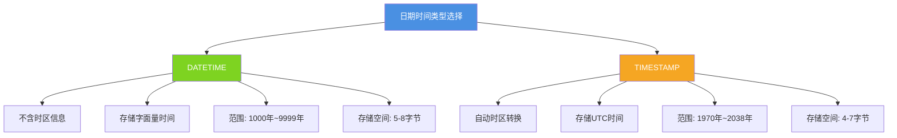
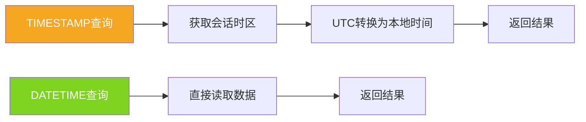
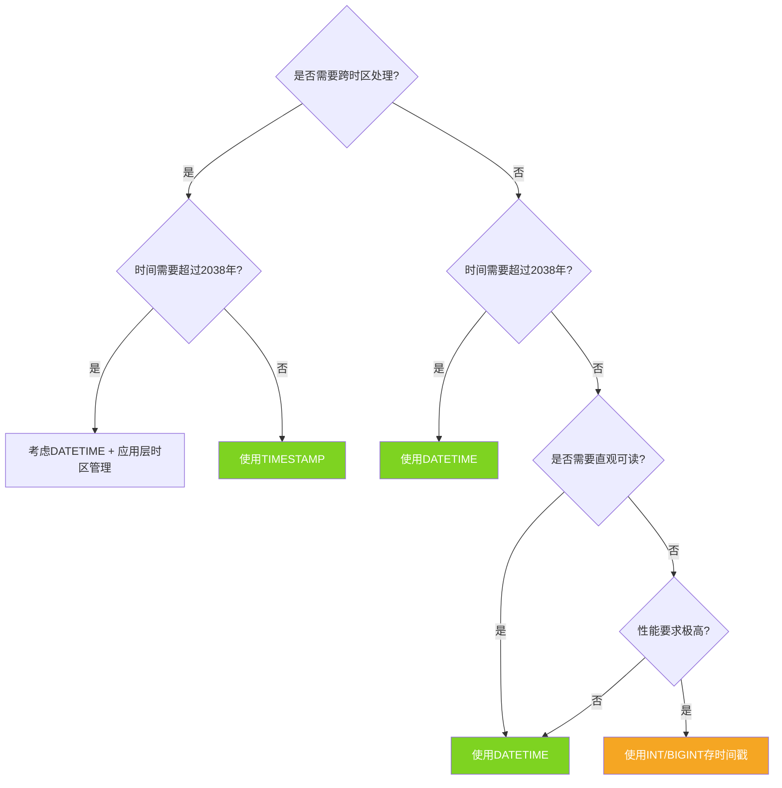
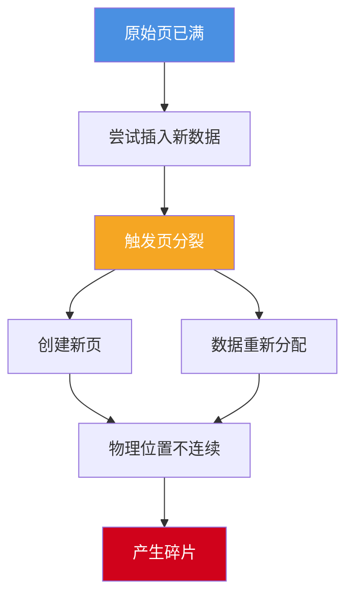

# MySQL数据存储优化策略

## 数据存储优化的重要性

在数据库应用开发中,数据存储方式的选择直接影响系统的性能、稳定性和可维护性。合理的字段类型选择、有效的碎片管理策略,能够显著提升数据库的整体表现。本文将深入探讨MySQL中的日期类型选择和存储碎片问题。

## 日期时间类型的选择

### 不要使用字符串存储日期

许多初学者会尝试使用VARCHAR等字符串类型来存储日期时间,这种做法存在严重问题:

**空间浪费**

字符串类型存储日期需要更多空间:

```sql
-- 错误示范:使用VARCHAR存储日期
CREATE TABLE event_logs_bad (
    log_id INT PRIMARY KEY AUTO_INCREMENT,
    event_name VARCHAR(100),
    event_time VARCHAR(30),  -- 占用30字节
    created_by VARCHAR(50)
);

-- 正确做法:使用DATETIME
CREATE TABLE event_logs_good (
    log_id INT PRIMARY KEY AUTO_INCREMENT,
    event_name VARCHAR(100),
    event_time DATETIME,  -- 仅占用5-8字节
    created_by VARCHAR(50)
);
```

**查询效率低下**

字符串日期的比较和计算极其低效:

```sql
-- 字符串日期比较问题
-- '2024-1-10' < '2024-05-01' 返回False(字典序比较)
SELECT * FROM event_logs_bad 
WHERE event_time > '2024-1-10'  -- 结果可能不符合预期
AND event_time < '2024-12-31';

-- 无法使用日期函数
SELECT DATE_FORMAT(event_time, '%Y-%m') FROM event_logs_bad;  -- 需要先转换
```

**索引性能差**

字符串类型的索引在处理日期范围查询时效率远低于原生日期类型。

### DATETIME与TIMESTAMP的对比

MySQL提供了两种主要的日期时间类型,各有特点:



### 时区处理差异

**DATETIME的时区无关性**

```sql
-- 创建测试表
CREATE TABLE appointment_records (
    record_id INT PRIMARY KEY AUTO_INCREMENT,
    client_name VARCHAR(100),
    appointment_time DATETIME,
    booking_timestamp TIMESTAMP
);

-- 插入数据(当前时区假设为UTC+0)
INSERT INTO appointment_records (client_name, appointment_time, booking_timestamp) 
VALUES ('张先生', NOW(), NOW());

-- 查询数据
SELECT appointment_time, booking_timestamp FROM appointment_records;
-- 结果: appointment_time: 2024-11-29 10:30:00
--      booking_timestamp: 2024-11-29 10:30:00

-- 修改会话时区为东八区
SET time_zone = '+8:00';

-- 再次查询
SELECT appointment_time, booking_timestamp FROM appointment_records;
-- 结果: appointment_time: 2024-11-29 10:30:00  (未变化)
--      booking_timestamp: 2024-11-29 18:30:00  (自动转换为+8时区)
```

DATETIME存储的是字面量时间,不受时区影响;而TIMESTAMP会根据当前会话时区自动转换显示。

**时区管理命令**

```sql
-- 查看当前会话时区
SELECT @@session.time_zone;

-- 设置会话时区
SET time_zone = '+8:00';          -- 使用偏移量
SET time_zone = 'Asia/Shanghai';  -- 使用时区名称

-- 查看全局时区设置
SELECT @@global.time_zone;

-- 设置全局时区(需要SUPER权限)
SET GLOBAL time_zone = '+8:00';
```

### 存储空间比较

从MySQL 5.6.4开始,两种类型的存储空间会根据小数秒精度动态变化:

| 小数秒精度 | DATETIME存储空间 | TIMESTAMP存储空间 |
|---------|--------------|-----------------|
| 0       | 5字节         | 4字节            |
| 1,2     | 6字节         | 5字节            |
| 3,4     | 7字节         | 6字节            |
| 5,6     | 8字节         | 7字节            |

```sql
-- 定义不同精度的时间字段
CREATE TABLE time_precision_demo (
    id INT PRIMARY KEY,
    time_sec DATETIME(0),     -- 精确到秒
    time_ms DATETIME(3),      -- 精确到毫秒
    time_us DATETIME(6)       -- 精确到微秒
);

-- 插入高精度时间
INSERT INTO time_precision_demo VALUES 
(1, NOW(), NOW(3), NOW(6));

-- 查看精度差异
SELECT * FROM time_precision_demo;
-- 结果示例:
-- time_sec: 2024-11-29 10:30:45
-- time_ms:  2024-11-29 10:30:45.123
-- time_us:  2024-11-29 10:30:45.123456
```

### 时间范围限制

**TIMESTAMP的2038年问题**

TIMESTAMP使用4字节整数存储Unix时间戳,最大值为2147483647(对应2038年1月19日):

```sql
-- TIMESTAMP的范围限制
CREATE TABLE timestamp_test (
    id INT PRIMARY KEY,
    expire_time TIMESTAMP
);

-- 尝试插入2038年之后的日期
INSERT INTO timestamp_test VALUES (1, '2040-01-01 00:00:00');
-- 错误: Incorrect datetime value

-- DATETIME不受此限制
CREATE TABLE datetime_test (
    id INT PRIMARY KEY,
    expire_time DATETIME
);

INSERT INTO datetime_test VALUES (1, '2100-12-31 23:59:59');
-- 成功插入
```

### 性能考量

TIMESTAMP在存储和检索时需要进行时区转换,在极高并发场景下可能产生微小的性能开销:



建议在应用层或数据库连接级别统一设置`time_zone`参数,避免频繁的时区计算。

### 数值时间戳方案

除了原生日期类型,也可以使用整数存储Unix时间戳:

```sql
-- 使用INT存储时间戳
CREATE TABLE activity_logs (
    log_id BIGINT PRIMARY KEY AUTO_INCREMENT,
    user_id INT,
    activity_type VARCHAR(50),
    activity_timestamp INT UNSIGNED,  -- 存储秒级时间戳
    INDEX idx_timestamp (activity_timestamp)
);

-- 插入当前时间戳
INSERT INTO activity_logs (user_id, activity_type, activity_timestamp) 
VALUES (10086, 'login', UNIX_TIMESTAMP());

-- 查询最近7天的活动
SELECT * FROM activity_logs 
WHERE activity_timestamp >= UNIX_TIMESTAMP(DATE_SUB(NOW(), INTERVAL 7 DAY));

-- 时间戳转换为可读格式
SELECT 
    log_id,
    FROM_UNIXTIME(activity_timestamp) AS activity_time,
    activity_type
FROM activity_logs;
```

**数值时间戳的优缺点**

优点:
- 比较和排序效率最高
- 跨系统传输方便
- 存储空间固定(4或8字节)

缺点:
- 可读性差,无法直观理解时间含义
- 需要手动转换才能展示
- 容易出现时区理解偏差

### 选择建议



**推荐方案总结:**

| 场景 | 推荐类型 | 理由 |
|-----|---------|-----|
| 多时区应用 | TIMESTAMP | 自动时区转换 |
| 长期历史数据 | DATETIME | 不受2038年限制 |
| 高性能排序 | INT/BIGINT时间戳 | 比较效率最高 |
| 通用业务场景 | DATETIME | 可读性好,适用范围广 |

## 存储碎片问题

### 碎片产生的原因

数据库表的存储碎片是影响性能的重要因素,主要由频繁的DML操作引起。

**INSERT操作导致的碎片**

当主键非顺序插入时,可能触发页分裂:

```sql
-- 使用UUID作为主键(非顺序)
CREATE TABLE user_profiles (
    user_uuid CHAR(36) PRIMARY KEY,  -- UUID主键
    user_name VARCHAR(100),
    email VARCHAR(100),
    created_at DATETIME
);

-- 插入数据
INSERT INTO user_profiles VALUES 
(UUID(), '李明', 'liming@example.com', NOW()),
(UUID(), '王芳', 'wangfang@example.com', NOW()),
(UUID(), '张伟', 'zhangwei@example.com', NOW());
-- UUID的随机性导致数据页频繁分裂
```

页分裂过程示意:



**UPDATE操作导致的碎片**

```sql
-- 可变长度字段的更新
CREATE TABLE article_content (
    article_id INT PRIMARY KEY AUTO_INCREMENT,
    title VARCHAR(200),
    content TEXT,  -- 可变长度字段
    author VARCHAR(50)
);

-- 初始插入
INSERT INTO article_content (title, content, author) 
VALUES ('技术分享', '这是一篇简短的文章', '作者A');

-- 更新为更长的内容
UPDATE article_content 
SET content = '这是一篇经过大幅扩充的文章,包含了更多的技术细节和实战案例...(更多内容)'
WHERE article_id = 1;
-- 如果原位置空间不足,行数据需要迁移,留下碎片
```

**DELETE操作导致的碎片**

InnoDB中DELETE并不立即释放空间:

```sql
-- 删除部分数据
DELETE FROM user_profiles WHERE created_at < '2020-01-01';

-- 数据页中留下空洞,但空间未回收
```


### 碎片的危害

**查询性能下降**

```sql
-- 碎片化表的扫描需要更多IO
SELECT * FROM user_profiles WHERE created_at > '2024-01-01';
-- 数据分散在不连续的磁盘块上,增加随机IO
```

**空间浪费**

```sql
-- 查看表的实际大小和数据大小
SELECT 
    table_name,
    ROUND((data_length + index_length) / 1024 / 1024, 2) AS total_mb,
    ROUND(data_free / 1024 / 1024, 2) AS fragmented_mb
FROM information_schema.TABLES 
WHERE table_schema = 'your_database' 
AND table_name = 'user_profiles';
-- fragmented_mb 显示碎片占用的空间
```

**备份恢复效率降低**

碎片化的表会增大备份文件体积,延长备份和恢复时间。

### 避免碎片的策略

**使用顺序主键**

```sql
-- 推荐:使用AUTO_INCREMENT
CREATE TABLE orders_good (
    order_id BIGINT PRIMARY KEY AUTO_INCREMENT,  -- 顺序增长
    order_no VARCHAR(50) UNIQUE,
    customer_id INT,
    order_amount DECIMAL(10,2),
    INDEX idx_customer (customer_id)
);

-- 不推荐:使用UUID主键
CREATE TABLE orders_bad (
    order_id CHAR(36) PRIMARY KEY DEFAULT (UUID()),  -- 随机值
    order_no VARCHAR(50),
    customer_id INT
);
```

**合理选择字段类型**

```sql
-- 固定长度字段减少碎片
CREATE TABLE user_status (
    user_id INT PRIMARY KEY,
    user_name VARCHAR(50),
    status CHAR(10),      -- 固定长度,不是VARCHAR
    level TINYINT,
    created_at DATETIME
);
```

**避免在高变化列上建索引**

```sql
-- 谨慎对待频繁更新的字段
CREATE TABLE product_inventory (
    product_id INT PRIMARY KEY,
    product_name VARCHAR(100),
    stock_quantity INT,  -- 频繁变化,不建议单独索引
    last_updated TIMESTAMP,
    INDEX idx_name (product_name)  -- 相对稳定的字段
);
```

### 清理碎片的方法

**OPTIMIZE TABLE命令**

```sql
-- 重组表和索引,消除碎片
OPTIMIZE TABLE user_profiles;

-- 查看优化效果
SHOW TABLE STATUS LIKE 'user_profiles'\G
-- 关注Data_free字段(碎片空间)
```

OPTIMIZE TABLE的工作原理:


**ALTER TABLE重建表**

```sql
-- 通过ALTER TABLE触发表重建
ALTER TABLE user_profiles ENGINE=InnoDB;

-- 效果与OPTIMIZE TABLE类似,但语法更通用
```

**定期维护策略**

```sql
-- 创建维护脚本
DELIMITER $$

CREATE PROCEDURE optimize_fragmented_tables()
BEGIN
    DECLARE done INT DEFAULT FALSE;
    DECLARE tbl_name VARCHAR(100);
    DECLARE frag_mb DECIMAL(10,2);
    
    -- 游标:查找碎片超过100MB的表
    DECLARE cur CURSOR FOR
        SELECT table_name, ROUND(data_free / 1024 / 1024, 2)
        FROM information_schema.TABLES
        WHERE table_schema = DATABASE()
        AND data_free > 100 * 1024 * 1024;
    
    DECLARE CONTINUE HANDLER FOR NOT FOUND SET done = TRUE;
    
    OPEN cur;
    
    read_loop: LOOP
        FETCH cur INTO tbl_name, frag_mb;
        IF done THEN
            LEAVE read_loop;
        END IF;
        
        SET @sql = CONCAT('OPTIMIZE TABLE ', tbl_name);
        PREPARE stmt FROM @sql;
        EXECUTE stmt;
        DEALLOCATE PREPARE stmt;
        
        SELECT CONCAT('Optimized table: ', tbl_name, ', Freed: ', frag_mb, 'MB');
    END LOOP;
    
    CLOSE cur;
END$$

DELIMITER ;

-- 定期执行(建议在业务低峰期)
CALL optimize_fragmented_tables();
```

## 综合优化实践

结合日期类型选择和碎片管理,设计高效的表结构:

```sql
-- 优化后的订单表设计
CREATE TABLE orders_optimized (
    -- 使用顺序主键
    order_id BIGINT PRIMARY KEY AUTO_INCREMENT,
    
    -- 使用DATETIME存储订单时间(长期存储)
    order_date DATETIME NOT NULL,
    
    -- 固定长度字段
    order_status CHAR(20) NOT NULL,
    
    -- 用户ID(外键,但不使用外键约束)
    user_id INT NOT NULL,
    
    -- 订单金额
    total_amount DECIMAL(12,2) NOT NULL,
    
    -- 创建和更新时间使用TIMESTAMP(自动时区管理)
    created_at TIMESTAMP DEFAULT CURRENT_TIMESTAMP,
    updated_at TIMESTAMP DEFAULT CURRENT_TIMESTAMP ON UPDATE CURRENT_TIMESTAMP,
    
    -- 合理建立索引
    INDEX idx_user_date (user_id, order_date),
    INDEX idx_order_date (order_date),
    INDEX idx_status (order_status)
) ENGINE=InnoDB 
  DEFAULT CHARSET=utf8mb4 
  COLLATE=utf8mb4_unicode_ci
  ROW_FORMAT=DYNAMIC;  -- 使用动态行格式,优化可变长度字段
```

通过合理的数据类型选择、主键设计和定期维护,可以显著提升MySQL的存储效率和查询性能。
