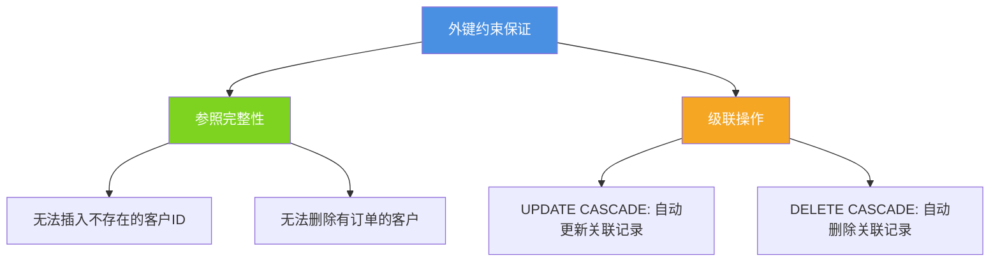
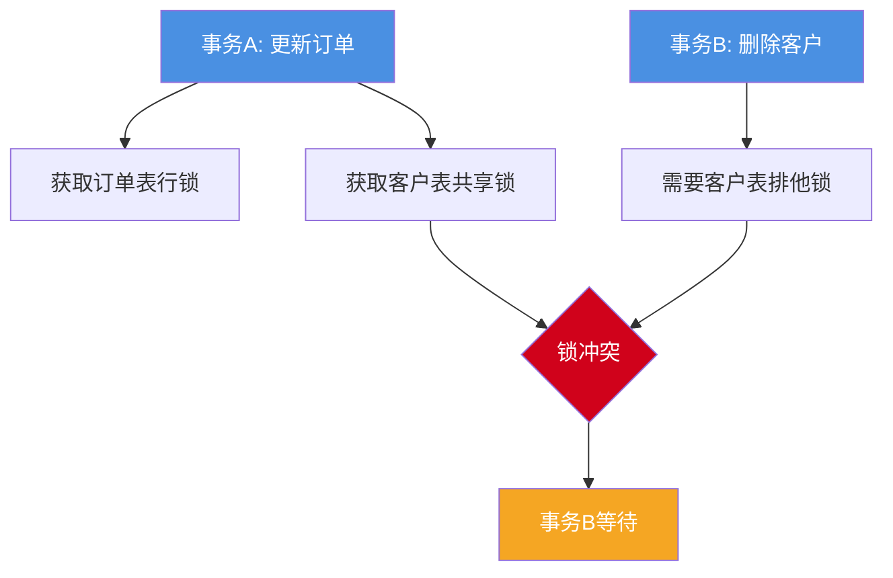

import PaidCTA from '@site/src/components/PaidCTA';

# MySQL高级特性与最佳实践

## MySQL高级特性权衡

在MySQL的众多高级特性中,外键约束、存储过程等功能在理论上能够提供数据完整性保证和逻辑封装,但在大规模互联网应用中却较少使用。本文将深入分析这些特性的利弊,并探讨实用的数据转换技术。

## 外键约束的权衡

### 外键的基本概念

外键用于建立表之间的引用关系,维护数据的参照完整性:

```sql
-- 创建客户表
CREATE TABLE customers (
    customer_id INT PRIMARY KEY AUTO_INCREMENT,
    customer_name VARCHAR(100) NOT NULL,
    email VARCHAR(100),
    phone VARCHAR(20),
    created_at DATETIME DEFAULT CURRENT_TIMESTAMP
);

-- 创建订单表(带外键约束)
CREATE TABLE orders_with_fk (
    order_id INT PRIMARY KEY AUTO_INCREMENT,
    customer_id INT NOT NULL,
    order_date DATETIME NOT NULL,
    total_amount DECIMAL(10,2),
    order_status VARCHAR(20),
    FOREIGN KEY (customer_id) REFERENCES customers(customer_id)
        ON DELETE RESTRICT    -- 限制删除有订单的客户
        ON UPDATE CASCADE     -- 客户ID更新时级联更新订单
);
```

外键约束的作用:



### 外键的性能影响

**索引维护开销**

外键会自动创建索引,增加写操作负担:

```sql
-- 查看外键创建的索引
SHOW INDEX FROM orders_with_fk;

-- 每次插入订单都需要:
-- 1. 检查customers表是否存在对应customer_id
-- 2. 维护orders_with_fk表的customer_id索引
-- 3. 在customers表的主键索引上查找

INSERT INTO orders_with_fk (customer_id, order_date, total_amount, order_status)
VALUES (1001, NOW(), 299.99, 'pending');
-- 需要额外的索引查找和维护操作
```

**数据一致性检查成本**

```sql
-- 插入操作的额外检查
INSERT INTO orders_with_fk (customer_id, order_date, total_amount, order_status)
VALUES (9999, NOW(), 299.99, 'pending');
-- 错误: Cannot add or update a child row: a foreign key constraint fails
-- 每次插入都要验证客户是否存在
```

### 锁竞争问题

外键会引入额外的锁,增加死锁风险:

```sql
-- 会话1: 更新订单
START TRANSACTION;
UPDATE orders_with_fk SET total_amount = 399.99 WHERE order_id = 100;
-- 此操作会在customers表的相关行上加共享锁

-- 会话2: 删除客户(可能阻塞)
START TRANSACTION;
DELETE FROM customers WHERE customer_id = 1001;
-- 需要检查是否有订单引用,可能与会话1产生锁冲突
```

锁竞争示意图:



<PaidCTA />