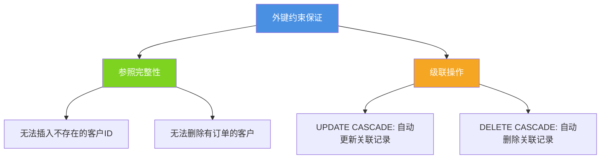
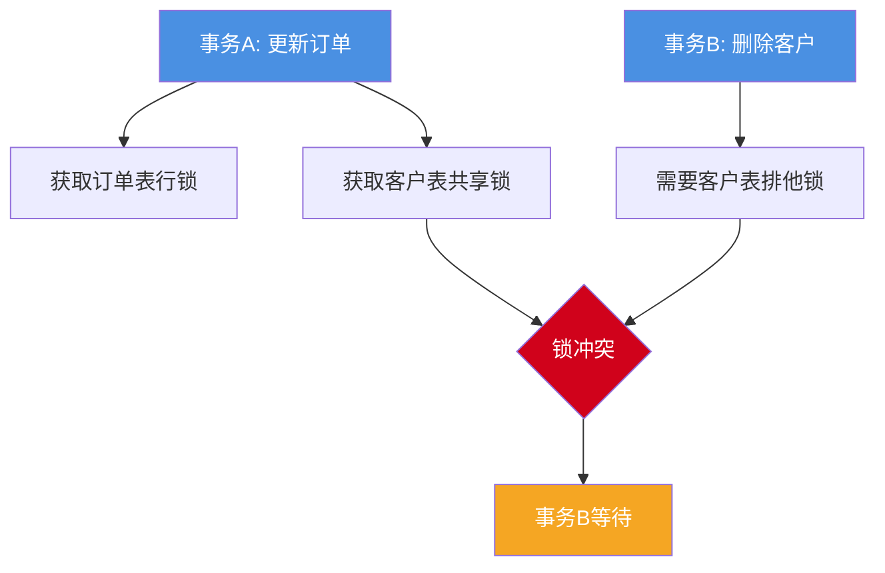
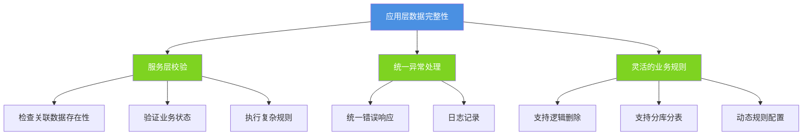
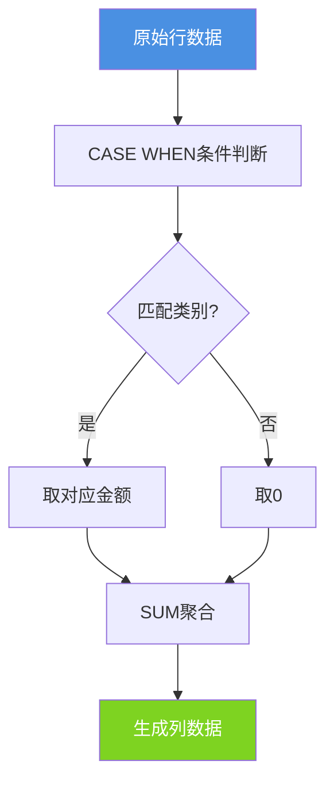
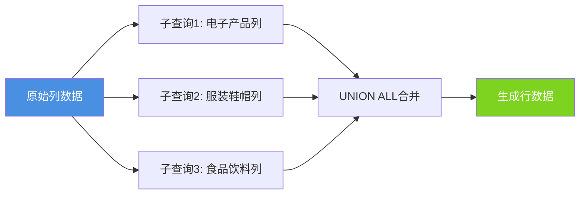
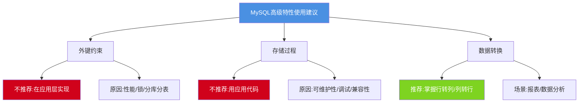

## MySQL高级特性权衡

在MySQL的众多高级特性中,外键约束、存储过程等功能在理论上能够提供数据完整性保证和逻辑封装,但在大规模互联网应用中却较少使用。本文将深入分析这些特性的利弊,并探讨实用的数据转换技术。

## 外键约束的权衡

### 外键的基本概念

外键用于建立表之间的引用关系,维护数据的参照完整性:

```sql
-- 创建客户表
CREATE TABLE customers (
    customer_id INT PRIMARY KEY AUTO_INCREMENT,
    customer_name VARCHAR(100) NOT NULL,
    email VARCHAR(100),
    phone VARCHAR(20),
    created_at DATETIME DEFAULT CURRENT_TIMESTAMP
);

-- 创建订单表(带外键约束)
CREATE TABLE orders_with_fk (
    order_id INT PRIMARY KEY AUTO_INCREMENT,
    customer_id INT NOT NULL,
    order_date DATETIME NOT NULL,
    total_amount DECIMAL(10,2),
    order_status VARCHAR(20),
    FOREIGN KEY (customer_id) REFERENCES customers(customer_id)
        ON DELETE RESTRICT    -- 限制删除有订单的客户
        ON UPDATE CASCADE     -- 客户ID更新时级联更新订单
);
```

外键约束的作用:



### 外键的性能影响

**索引维护开销**

外键会自动创建索引,增加写操作负担:

```sql
-- 查看外键创建的索引
SHOW INDEX FROM orders_with_fk;

-- 每次插入订单都需要:
-- 1. 检查customers表是否存在对应customer_id
-- 2. 维护orders_with_fk表的customer_id索引
-- 3. 在customers表的主键索引上查找

INSERT INTO orders_with_fk (customer_id, order_date, total_amount, order_status)
VALUES (1001, NOW(), 299.99, 'pending');
-- 需要额外的索引查找和维护操作
```

**数据一致性检查成本**

```sql
-- 插入操作的额外检查
INSERT INTO orders_with_fk (customer_id, order_date, total_amount, order_status)
VALUES (9999, NOW(), 299.99, 'pending');
-- 错误: Cannot add or update a child row: a foreign key constraint fails
-- 每次插入都要验证客户是否存在
```

### 锁竞争问题

外键会引入额外的锁,增加死锁风险:

```sql
-- 会话1: 更新订单
START TRANSACTION;
UPDATE orders_with_fk SET total_amount = 399.99 WHERE order_id = 100;
-- 此操作会在customers表的相关行上加共享锁

-- 会话2: 删除客户(可能阻塞)
START TRANSACTION;
DELETE FROM customers WHERE customer_id = 1001;
-- 需要检查是否有订单引用,可能与会话1产生锁冲突
```

锁竞争示意图:



### 分库分表的限制

在分布式环境中,外键约束几乎无法使用:

```sql
-- 分库场景:客户和订单可能在不同数据库
-- Database: customer_db
CREATE TABLE customers (
    customer_id INT PRIMARY KEY,
    customer_name VARCHAR(100)
);

-- Database: order_db_0 (订单分库)
CREATE TABLE orders (
    order_id INT PRIMARY KEY,
    customer_id INT NOT NULL
    -- 无法创建跨库外键约束
    -- FOREIGN KEY (customer_id) REFERENCES customer_db.customers(customer_id)  -- 不支持
);
```

### 逻辑删除的冲突

现代应用多采用逻辑删除,外键约束会带来困扰:

```sql
-- 逻辑删除的客户表
CREATE TABLE customers_logical_delete (
    customer_id INT PRIMARY KEY AUTO_INCREMENT,
    customer_name VARCHAR(100),
    is_deleted TINYINT DEFAULT 0,  -- 0:未删除, 1:已删除
    deleted_at DATETIME
);

CREATE TABLE orders_logical (
    order_id INT PRIMARY KEY AUTO_INCREMENT,
    customer_id INT NOT NULL,
    order_date DATETIME,
    FOREIGN KEY (customer_id) REFERENCES customers_logical_delete(customer_id)
);

-- 问题:逻辑删除客户时,外键仍然有效
UPDATE customers_logical_delete SET is_deleted = 1, deleted_at = NOW() 
WHERE customer_id = 1001;
-- 外键约束无法感知逻辑删除,仍允许插入该客户的订单

-- 需要应用层额外检查
INSERT INTO orders_logical (customer_id, order_date) 
VALUES (1001, NOW());  -- 外键允许,但业务上应禁止
```

### 应用层替代方案

大型互联网公司普遍在应用层实现数据完整性:

```java
// 在应用层保证数据完整性
@Service
public class OrderService {
    
    @Autowired
    private CustomerRepository customerRepository;
    
    @Autowired
    private OrderRepository orderRepository;
    
    @Transactional
    public Order createOrder(Long customerId, OrderDTO orderDTO) {
        // 应用层检查客户是否存在
        Customer customer = customerRepository.findById(customerId)
            .orElseThrow(() -> new BusinessException("客户不存在"));
        
        // 检查客户状态(逻辑删除等)
        if (customer.getIsDeleted()) {
            throw new BusinessException("客户已被删除,无法创建订单");
        }
        
        // 创建订单
        Order order = new Order();
        order.setCustomerId(customerId);
        order.setOrderDate(new Date());
        order.setTotalAmount(orderDTO.getTotalAmount());
        
        return orderRepository.save(order);
    }
}
```



### 不使用外键的最佳实践

```sql
-- 推荐的表设计(无外键约束)
CREATE TABLE customers_best (
    customer_id INT PRIMARY KEY AUTO_INCREMENT,
    customer_name VARCHAR(100) NOT NULL,
    email VARCHAR(100),
    is_deleted TINYINT DEFAULT 0,
    created_at DATETIME DEFAULT CURRENT_TIMESTAMP,
    INDEX idx_email (email)
);

CREATE TABLE orders_best (
    order_id INT PRIMARY KEY AUTO_INCREMENT,
    customer_id INT NOT NULL,  -- 不使用外键约束
    order_date DATETIME NOT NULL,
    total_amount DECIMAL(10,2),
    order_status VARCHAR(20),
    created_at DATETIME DEFAULT CURRENT_TIMESTAMP,
    
    -- 创建普通索引用于查询优化
    INDEX idx_customer (customer_id),
    INDEX idx_order_date (order_date)
) ENGINE=InnoDB;
```

## 存储过程的局限性

### 存储过程基础

存储过程是预编译的SQL代码块:

```sql
-- 创建工资调整存储过程
DELIMITER $$

CREATE PROCEDURE adjust_employee_salary(
    IN emp_id INT,
    IN adjustment_amount DECIMAL(10,2),
    OUT new_salary DECIMAL(10,2)
)
BEGIN
    DECLARE current_salary DECIMAL(10,2);
    
    -- 获取当前工资
    SELECT salary INTO current_salary 
    FROM employees 
    WHERE employee_id = emp_id;
    
    -- 验证调整金额
    IF adjustment_amount <= 0 THEN
        SIGNAL SQLSTATE '45000'
            SET MESSAGE_TEXT = '调整金额必须为正数';
    END IF;
    
    -- 更新工资
    UPDATE employees 
    SET salary = salary + adjustment_amount,
        updated_at = NOW()
    WHERE employee_id = emp_id;
    
    -- 返回新工资
    SET new_salary = current_salary + adjustment_amount;
    
    -- 记录日志
    INSERT INTO salary_change_logs (employee_id, old_salary, new_salary, change_date)
    VALUES (emp_id, current_salary, new_salary, NOW());
END$$

DELIMITER ;

-- 调用存储过程
CALL adjust_employee_salary(1001, 500.00, @new_sal);
SELECT @new_sal;
```

### 可维护性问题

存储过程的代码分散在数据库中,难以管理:

```sql
-- 复杂的业务逻辑存储过程
DELIMITER $$

CREATE PROCEDURE process_monthly_settlement()
BEGIN
    DECLARE done INT DEFAULT FALSE;
    DECLARE emp_id INT;
    DECLARE base_salary DECIMAL(10,2);
    
    -- 复杂的游标逻辑
    DECLARE emp_cursor CURSOR FOR 
        SELECT employee_id, salary FROM employees WHERE is_active = 1;
    
    DECLARE CONTINUE HANDLER FOR NOT FOUND SET done = TRUE;
    
    -- 大量嵌套的IF-ELSE
    OPEN emp_cursor;
    
    read_loop: LOOP
        FETCH emp_cursor INTO emp_id, base_salary;
        IF done THEN
            LEAVE read_loop;
        END IF;
        
        -- 复杂的计算逻辑...
        -- 难以理解和维护
    END LOOP;
    
    CLOSE emp_cursor;
END$$

DELIMITER ;
```

**维护难点:**
- 无法使用IDE的代码提示和重构功能
- 难以进行代码审查(Code Review)
- 版本控制不便
- 难以单元测试

### 调试困难

```sql
-- 存储过程中的错误难以定位
DELIMITER $$

CREATE PROCEDURE calculate_bonus()
BEGIN
    -- 无法方便地打印日志
    -- 无法设置断点
    -- 错误信息有限
    
    DECLARE bonus DECIMAL(10,2);
    
    SELECT SUM(sales_amount) * 0.1 INTO bonus
    FROM sales
    WHERE sales_date = CURDATE();
    
    -- 如果这里出错,很难定位原因
    UPDATE employees SET bonus = bonus WHERE department = 'Sales';
END$$

DELIMITER ;
```

相比之下,应用层代码调试更便捷:

```java
public BigDecimal calculateBonus(String department) {
    logger.info("开始计算奖金,部门: {}", department);
    
    BigDecimal totalSales = salesRepository.getTotalSalesByDate(
        department, LocalDate.now());
    logger.debug("总销售额: {}", totalSales);
    
    BigDecimal bonus = totalSales.multiply(new BigDecimal("0.1"));
    logger.info("计算得奖金: {}", bonus);
    
    employeeRepository.updateBonusByDepartment(department, bonus);
    
    return bonus;
}
```

### 跨数据库兼容性差

存储过程语法在不同数据库间差异很大:

```sql
-- MySQL存储过程
DELIMITER $$
CREATE PROCEDURE get_employee_count(OUT emp_count INT)
BEGIN
    SELECT COUNT(*) INTO emp_count FROM employees;
END$$
DELIMITER ;

-- PostgreSQL存储过程(语法完全不同)
CREATE OR REPLACE FUNCTION get_employee_count()
RETURNS INTEGER AS $$
DECLARE
    emp_count INTEGER;
BEGIN
    SELECT COUNT(*) INTO emp_count FROM employees;
    RETURN emp_count;
END;
$$ LANGUAGE plpgsql;

-- Oracle存储过程(又是不同的语法)
CREATE OR REPLACE PROCEDURE get_employee_count(emp_count OUT NUMBER) IS
BEGIN
    SELECT COUNT(*) INTO emp_count FROM employees;
END;
```

数据库迁移时需要重写所有存储过程,成本巨大。

### 安全性隐患

```sql
-- 存储过程可能引入SQL注入风险
DELIMITER $$

CREATE PROCEDURE search_user_unsafe(IN search_term VARCHAR(100))
BEGIN
    -- 危险:动态拼接SQL
    SET @sql = CONCAT('SELECT * FROM users WHERE user_name LIKE ''%', search_term, '%''');
    PREPARE stmt FROM @sql;
    EXECUTE stmt;
    DEALLOCATE PREPARE stmt;
END$$

DELIMITER ;

-- 恶意调用
CALL search_user_unsafe("' OR '1'='1");  -- SQL注入风险
```

### 应用层替代方案更优

```java
@Service
public class EmployeeService {
    
    @Autowired
    private EmployeeRepository employeeRepository;
    
    @Autowired
    private SalaryLogRepository salaryLogRepository;
    
    @Transactional
    public BigDecimal adjustSalary(Long employeeId, BigDecimal adjustment) {
        // 清晰的业务逻辑
        Employee employee = employeeRepository.findById(employeeId)
            .orElseThrow(() -> new NotFoundException("员工不存在"));
        
        // 参数验证
        if (adjustment.compareTo(BigDecimal.ZERO) <= 0) {
            throw new IllegalArgumentException("调整金额必须为正数");
        }
        
        BigDecimal oldSalary = employee.getSalary();
        BigDecimal newSalary = oldSalary.add(adjustment);
        
        // 更新工资
        employee.setSalary(newSalary);
        employee.setUpdatedAt(new Date());
        employeeRepository.save(employee);
        
        // 记录日志
        SalaryLog log = new SalaryLog();
        log.setEmployeeId(employeeId);
        log.setOldSalary(oldSalary);
        log.setNewSalary(newSalary);
        log.setChangeDate(new Date());
        salaryLogRepository.save(log);
        
        return newSalary;
    }
}
```

**应用层优势:**
- 易于调试和测试
- 版本控制友好
- 便于代码审查
- 跨数据库兼容
- 丰富的日志和监控

## 行转列与列转行

### 行转列实现

行转列是将行数据转换为列展示,常用于数据透视:

原始销售数据:

```sql
-- 创建销售记录表
CREATE TABLE product_sales (
    sale_id INT PRIMARY KEY AUTO_INCREMENT,
    sale_year INT,
    product_category VARCHAR(50),
    sales_amount DECIMAL(12,2)
);

-- 插入测试数据
INSERT INTO product_sales (sale_year, product_category, sales_amount) VALUES
(2023, '电子产品', 120000),
(2023, '服装鞋帽', 85000),
(2023, '食品饮料', 95000),
(2024, '电子产品', 158000),
(2024, '服装鞋帽', 92000),
(2024, '食品饮料', 108000);
```

**使用CASE WHEN实现行转列:**

```sql
-- 将产品类别转为列
SELECT 
    sale_year AS 年份,
    SUM(CASE WHEN product_category = '电子产品' THEN sales_amount ELSE 0 END) AS 电子产品,
    SUM(CASE WHEN product_category = '服装鞋帽' THEN sales_amount ELSE 0 END) AS 服装鞋帽,
    SUM(CASE WHEN product_category = '食品饮料' THEN sales_amount ELSE 0 END) AS 食品饮料
FROM product_sales
GROUP BY sale_year
ORDER BY sale_year;

-- 结果:
-- 年份 | 电子产品 | 服装鞋帽 | 食品饮料
-- 2023 | 120000  | 85000   | 95000
-- 2024 | 158000  | 92000   | 108000
```

**使用IF函数简化:**

```sql
SELECT 
    sale_year,
    SUM(IF(product_category = '电子产品', sales_amount, 0)) AS 电子产品,
    SUM(IF(product_category = '服装鞋帽', sales_amount, 0)) AS 服装鞋帽,
    SUM(IF(product_category = '食品饮料', sales_amount, 0)) AS 食品饮料
FROM product_sales
GROUP BY sale_year;
```

行转列过程可视化:



**动态类别的行转列:**

```sql
-- 使用GROUP_CONCAT生成动态SQL
SET @sql = NULL;

SELECT
  GROUP_CONCAT(DISTINCT
    CONCAT(
      'SUM(IF(product_category = ''', product_category, ''', sales_amount, 0)) AS `', product_category, '`'
    )
  ) INTO @sql
FROM product_sales;

SET @sql = CONCAT('SELECT sale_year, ', @sql, ' FROM product_sales GROUP BY sale_year');

PREPARE stmt FROM @sql;
EXECUTE stmt;
DEALLOCATE PREPARE stmt;
```

### 列转行实现

列转行是将列数据拆分为多行,便于数据分析:

原始数据:

```sql
-- 创建年度销售汇总表
CREATE TABLE annual_sales_summary (
    year INT PRIMARY KEY,
    electronics DECIMAL(12,2),
    clothing DECIMAL(12,2),
    food DECIMAL(12,2)
);

-- 插入数据
INSERT INTO annual_sales_summary VALUES
(2023, 120000, 85000, 95000),
(2024, 158000, 92000, 108000);
```

**使用UNION ALL实现列转行:**

```sql
-- 将各类别列转换为行
SELECT 
    year AS 年份,
    '电子产品' AS 产品类别,
    electronics AS 销售额
FROM annual_sales_summary

UNION ALL

SELECT 
    year,
    '服装鞋帽',
    clothing
FROM annual_sales_summary

UNION ALL

SELECT 
    year,
    '食品饮料',
    food
FROM annual_sales_summary

ORDER BY year, 产品类别;

-- 结果:
-- 年份 | 产品类别   | 销售额
-- 2023 | 电子产品  | 120000
-- 2023 | 服装鞋帽  | 85000
-- 2023 | 食品饮料  | 95000
-- 2024 | 电子产品  | 158000
-- 2024 | 服装鞋帽  | 92000
-- 2024 | 食品饮料  | 108000
```

列转行过程可视化:



### 实战应用场景

**场景1:月度销售报表**

```sql
-- 原始数据:每月每个区域的销售额
CREATE TABLE monthly_region_sales (
    month DATE,
    region VARCHAR(50),
    sales_amount DECIMAL(12,2)
);

-- 行转列:生成透视报表
SELECT 
    DATE_FORMAT(month, '%Y-%m') AS 月份,
    SUM(IF(region = '华东', sales_amount, 0)) AS 华东,
    SUM(IF(region = '华南', sales_amount, 0)) AS 华南,
    SUM(IF(region = '华北', sales_amount, 0)) AS 华北,
    SUM(sales_amount) AS 总计
FROM monthly_region_sales
GROUP BY month
ORDER BY month;
```

**场景2:学生成绩统计**

```sql
-- 学生各科成绩表
CREATE TABLE student_scores (
    student_id INT,
    student_name VARCHAR(50),
    subject VARCHAR(30),
    score INT
);

-- 行转列:生成成绩单
SELECT 
    student_name AS 姓名,
    MAX(IF(subject = '数学', score, NULL)) AS 数学,
    MAX(IF(subject = '语文', score, NULL)) AS 语文,
    MAX(IF(subject = '英语', score, NULL)) AS 英语,
    AVG(score) AS 平均分
FROM student_scores
GROUP BY student_id, student_name;
```

## 最佳实践总结



在大规模互联网应用中,应遵循以下原则:
- 数据完整性在应用层保证
- 业务逻辑用应用代码实现
- 数据库专注于高效的数据存取
- 合理使用SQL特性进行数据转换
