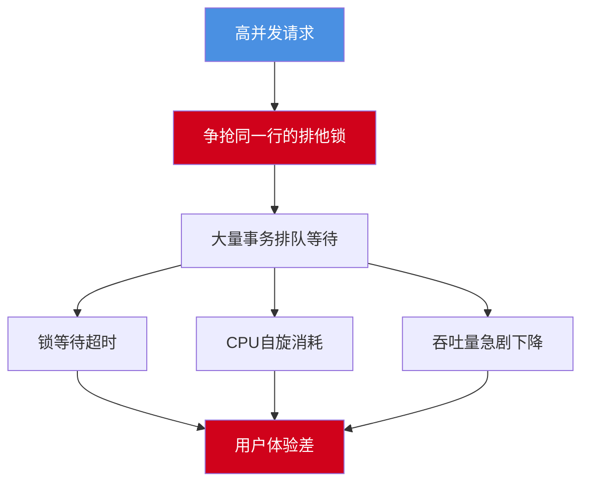

import PaidCTA from '@site/src/components/PaidCTA';

# MySQL热点数据更新优化方案

## 热点数据更新挑战

在高并发场景下,热点数据的频繁更新一直是数据库系统面临的重大挑战。典型场景包括电商秒杀的库存扣减、抢红包的余额更新、热门文章的阅读计数等。这些场景的共同特点是:大量并发请求集中更新少数几行数据,容易导致严重的锁竞争,甚至造成数据库性能急剧下降。

## 热点更新问题分析

### 典型秒杀场景

```sql
-- 商品库存表
CREATE TABLE product_inventory (
    product_id INT PRIMARY KEY,
    product_name VARCHAR(100),
    stock_quantity INT NOT NULL,
    version INT DEFAULT 0,
    updated_at TIMESTAMP DEFAULT CURRENT_TIMESTAMP ON UPDATE CURRENT_TIMESTAMP
);

-- 插入热门商品
INSERT INTO product_inventory (product_id, product_name, stock_quantity) 
VALUES (10001, '限量款智能手表', 1000);
```

传统的库存扣减方式:

```sql
-- 并发扣减库存(存在严重性能问题)
START TRANSACTION;

-- 查询当前库存
SELECT stock_quantity FROM product_inventory 
WHERE product_id = 10001 FOR UPDATE;  -- 加排他锁

-- 判断库存是否充足
-- (在应用层判断)

-- 扣减库存
UPDATE product_inventory 
SET stock_quantity = stock_quantity - 1 
WHERE product_id = 10001;

COMMIT;
```

问题所在:



### 锁竞争的本质

```sql
-- 模拟锁竞争
-- 会话1
START TRANSACTION;
UPDATE product_inventory SET stock_quantity = stock_quantity - 1 WHERE product_id = 10001;
-- 持有行锁,未提交

-- 会话2(被阻塞)
START TRANSACTION;
UPDATE product_inventory SET stock_quantity = stock_quantity - 1 WHERE product_id = 10001;
-- 等待会话1释放锁

-- 会话3(被阻塞)
START TRANSACTION;
UPDATE product_inventory SET stock_quantity = stock_quantity - 1 WHERE product_id = 10001;
-- 继续等待

-- 在高并发下,可能有数千个请求在等待同一把锁
```

## 优化方案详解

### 方案一:库存分片

<PaidCTA />