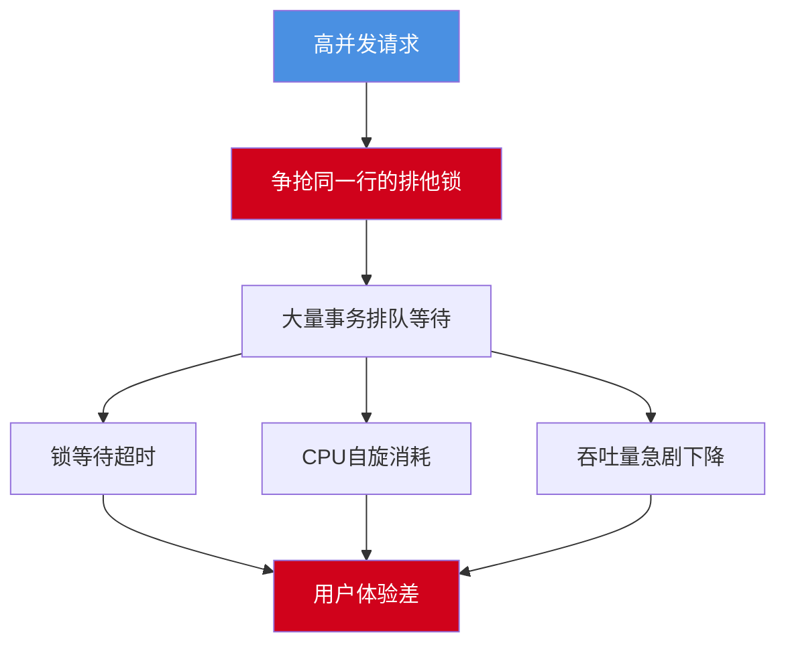
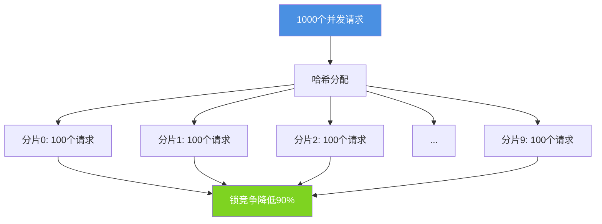
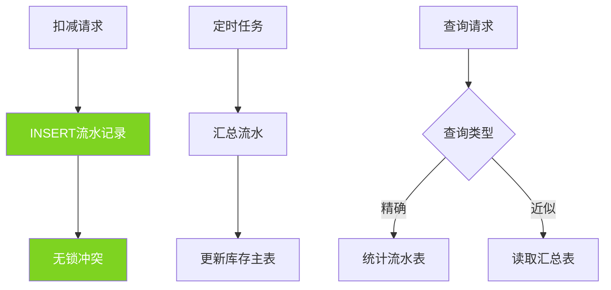
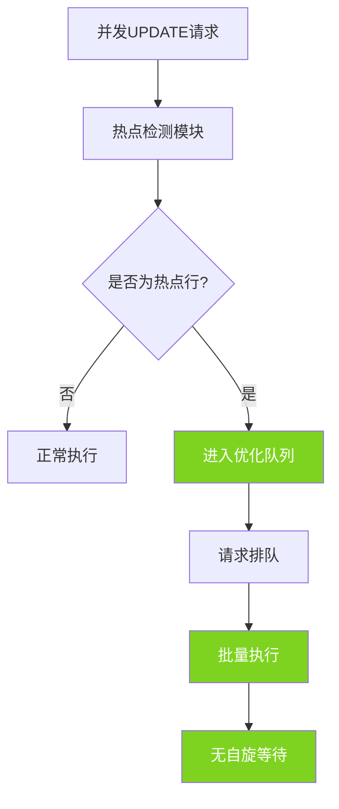
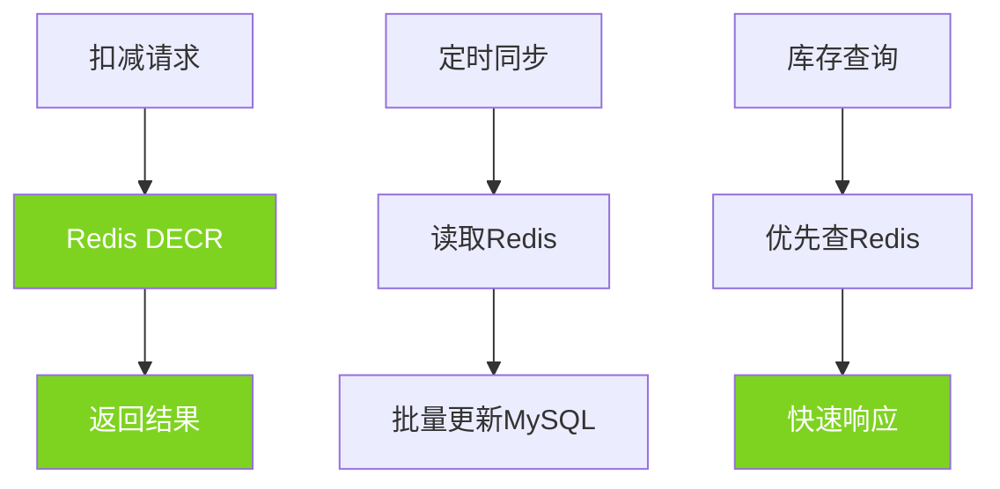
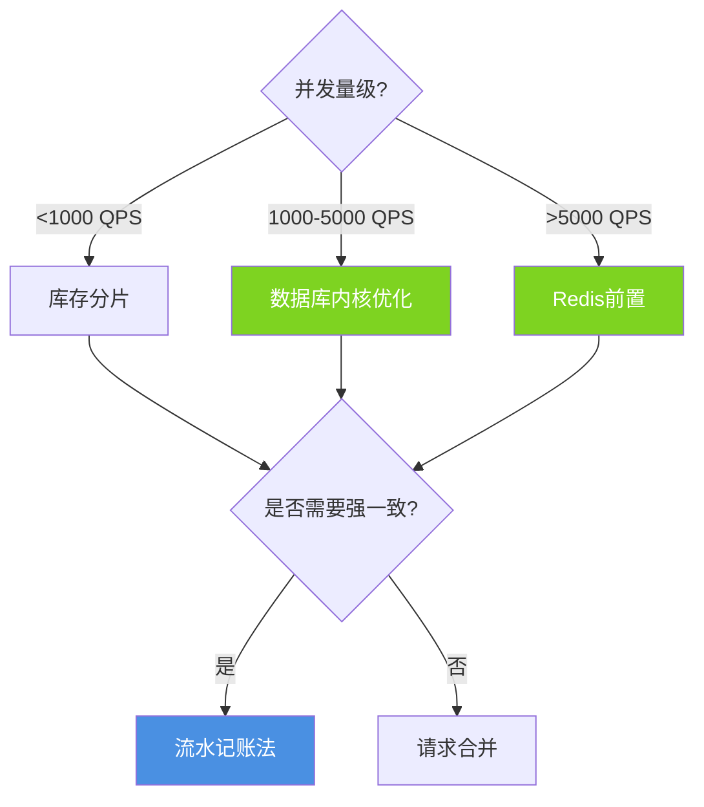

## 热点数据更新挑战

在高并发场景下,热点数据的频繁更新一直是数据库系统面临的重大挑战。典型场景包括电商秒杀的库存扣减、抢红包的余额更新、热门文章的阅读计数等。这些场景的共同特点是:大量并发请求集中更新少数几行数据,容易导致严重的锁竞争,甚至造成数据库性能急剧下降。

## 热点更新问题分析

### 典型秒杀场景

```sql
-- 商品库存表
CREATE TABLE product_inventory (
    product_id INT PRIMARY KEY,
    product_name VARCHAR(100),
    stock_quantity INT NOT NULL,
    version INT DEFAULT 0,
    updated_at TIMESTAMP DEFAULT CURRENT_TIMESTAMP ON UPDATE CURRENT_TIMESTAMP
);

-- 插入热门商品
INSERT INTO product_inventory (product_id, product_name, stock_quantity) 
VALUES (10001, '限量款智能手表', 1000);
```

传统的库存扣减方式:

```sql
-- 并发扣减库存(存在严重性能问题)
START TRANSACTION;

-- 查询当前库存
SELECT stock_quantity FROM product_inventory 
WHERE product_id = 10001 FOR UPDATE;  -- 加排他锁

-- 判断库存是否充足
-- (在应用层判断)

-- 扣减库存
UPDATE product_inventory 
SET stock_quantity = stock_quantity - 1 
WHERE product_id = 10001;

COMMIT;
```

问题所在:



### 锁竞争的本质

```sql
-- 模拟锁竞争
-- 会话1
START TRANSACTION;
UPDATE product_inventory SET stock_quantity = stock_quantity - 1 WHERE product_id = 10001;
-- 持有行锁,未提交

-- 会话2(被阻塞)
START TRANSACTION;
UPDATE product_inventory SET stock_quantity = stock_quantity - 1 WHERE product_id = 10001;
-- 等待会话1释放锁

-- 会话3(被阻塞)
START TRANSACTION;
UPDATE product_inventory SET stock_quantity = stock_quantity - 1 WHERE product_id = 10001;
-- 继续等待

-- 在高并发下,可能有数千个请求在等待同一把锁
```

## 优化方案详解

### 方案一:库存分片

将单个大库存拆分成多个小库存,降低锁的粒度:

```sql
-- 分片库存表
CREATE TABLE product_inventory_sharded (
    inventory_id INT PRIMARY KEY AUTO_INCREMENT,
    product_id INT NOT NULL,
    shard_index INT NOT NULL,  -- 分片编号
    stock_quantity INT NOT NULL,
    updated_at TIMESTAMP DEFAULT CURRENT_TIMESTAMP ON UPDATE CURRENT_TIMESTAMP,
    UNIQUE KEY uk_product_shard (product_id, shard_index),
    INDEX idx_product (product_id)
);

-- 将1000个库存分成10个分片
INSERT INTO product_inventory_sharded (product_id, shard_index, stock_quantity)
SELECT 10001, n, 100
FROM (
    SELECT 0 AS n UNION ALL SELECT 1 UNION ALL SELECT 2 UNION ALL SELECT 3 UNION ALL SELECT 4
    UNION ALL SELECT 5 UNION ALL SELECT 6 UNION ALL SELECT 7 UNION ALL SELECT 8 UNION ALL SELECT 9
) AS numbers;
```

扣减逻辑:

```java
public boolean deductInventory(int productId, int userId) {
    // 根据用户ID哈希到不同分片
    int shardIndex = userId % 10;
    
    // 只锁定该分片,不影响其他分片
    int updated = jdbcTemplate.update(
        "UPDATE product_inventory_sharded " +
        "SET stock_quantity = stock_quantity - 1 " +
        "WHERE product_id = ? AND shard_index = ? AND stock_quantity > 0",
        productId, shardIndex
    );
    
    return updated > 0;
}
```

分片效果:



**优缺点分析:**

优点:
- 实现相对简单
- 有效降低锁粒度
- 提升并发能力

缺点:
- 存在库存碎片(某些分片已空,其他分片有余量)
- 库存调配不便
- 需要额外的库存合并逻辑

### 方案二:请求合并(批量更新)

将短时间内的多个更新请求合并成一次批量操作:

```java
@Service
public class InventoryBatchService {
    
    private final ConcurrentHashMap<Integer, AtomicInteger> pendingDeductions = new ConcurrentHashMap<>();
    
    @Scheduled(fixedDelay = 100)  // 每100ms执行一次
    public void batchDeduct() {
        if (pendingDeductions.isEmpty()) {
            return;
        }
        
        // 获取待扣减数量
        Map<Integer, Integer> snapshot = new HashMap<>();
        pendingDeductions.forEach((productId, count) -> {
            int deductCount = count.getAndSet(0);
            if (deductCount > 0) {
                snapshot.put(productId, deductCount);
            }
        });
        
        // 批量更新数据库
        snapshot.forEach((productId, count) -> {
            jdbcTemplate.update(
                "UPDATE product_inventory SET stock_quantity = stock_quantity - ? WHERE product_id = ?",
                count, productId
            );
        });
    }
    
    public CompletableFuture<Boolean> requestDeduct(int productId) {
        // 累加待扣减数量
        pendingDeductions.computeIfAbsent(productId, k -> new AtomicInteger()).incrementAndGet();
        
        // 异步返回结果
        return CompletableFuture.supplyAsync(() -> {
            // 等待批处理完成并验证结果
            return true;
        });
    }
}
```

对应的SQL优化:

```sql
-- 单次批量更新
UPDATE product_inventory 
SET stock_quantity = stock_quantity - 150  -- 合并150个请求
WHERE product_id = 10001 AND stock_quantity >= 150;
```

**优缺点分析:**

优点:
- 大幅减少数据库更新次数
- 降低锁竞争

缺点:
- 仅适用于异步场景
- 实时性略差
- 需要额外的超卖控制

### 方案三:流水记账法

将UPDATE转换为INSERT,避免行锁竞争:

```sql
-- 库存变动流水表
CREATE TABLE inventory_transactions (
    transaction_id BIGINT PRIMARY KEY AUTO_INCREMENT,
    product_id INT NOT NULL,
    transaction_type ENUM('deduct', 'add') NOT NULL,
    quantity INT NOT NULL,
    user_id INT,
    created_at TIMESTAMP DEFAULT CURRENT_TIMESTAMP,
    INDEX idx_product_time (product_id, created_at)
);

-- 扣减操作变为插入流水
INSERT INTO inventory_transactions (product_id, transaction_type, quantity, user_id)
VALUES (10001, 'deduct', 1, 1001);

-- 计算剩余库存(实时统计或定期汇总)
SELECT 
    1000 - COALESCE(SUM(CASE 
        WHEN transaction_type = 'deduct' THEN quantity 
        WHEN transaction_type = 'add' THEN -quantity 
    END), 0) AS remaining_stock
FROM inventory_transactions
WHERE product_id = 10001;
```

流水法架构:



**优缺点分析:**

优点:
- 完全无UPDATE锁冲突
- 插入性能极高
- 天然保留操作日志

缺点:
- 库存查询需要统计计算
- 超卖控制复杂
- 流水表数据量增长快

### 方案四:数据库内核优化(Inventory Hint)

现代云数据库提供了专门的热点更新优化:

**阿里云PolarDB的Inventory Hint**

```sql
-- 开启热点更新优化
SET innodb_rds_flashback_task_enabled = ON;

-- 使用Inventory Hint语法
UPDATE /*+ INVENTORY_HINT */ product_inventory 
SET stock_quantity = stock_quantity - 1 
WHERE product_id = 10001 AND stock_quantity > 0;
```

**腾讯云TDSQL的热点更新保护**

```sql
-- 配置热点检测
SET GLOBAL hotspot_update_protection = ON;
SET GLOBAL hotspot_update_threshold = 100;  -- 每秒更新超过100次触发保护

-- 正常执行UPDATE,数据库自动优化
UPDATE product_inventory 
SET stock_quantity = stock_quantity - 1 
WHERE product_id = 10001;
```

内核优化原理:



**优缺点分析:**

优点:
- 应用层无需改动
- 自动热点检测和优化
- 性能提升显著

缺点:
- 依赖特定数据库版本
- 云数据库专属功能
- 自建数据库无法使用

### 方案五:Redis前置缓存

将热点数据的更新前移到Redis:

```java
@Service
public class RedisInventoryService {
    
    @Autowired
    private RedisTemplate<String, String> redisTemplate;
    
    @Autowired
    private JdbcTemplate jdbcTemplate;
    
    // 初始化:将库存加载到Redis
    public void initInventory(int productId, int initialStock) {
        String key = "inventory:" + productId;
        redisTemplate.opsForValue().set(key, String.valueOf(initialStock));
    }
    
    // 扣减库存(Redis原子操作)
    public boolean deductInventory(int productId) {
        String key = "inventory:" + productId;
        
        // Lua脚本保证原子性
        String luaScript = 
            "local stock = redis.call('get', KEYS[1]) " +
            "if tonumber(stock) > 0 then " +
            "    redis.call('decr', KEYS[1]) " +
            "    return 1 " +
            "else " +
            "    return 0 " +
            "end";
        
        Long result = redisTemplate.execute(
            new DefaultRedisScript<>(luaScript, Long.class),
            Collections.singletonList(key)
        );
        
        return result != null && result == 1;
    }
    
    // 异步同步到MySQL
    @Scheduled(fixedDelay = 5000)
    public void syncToDatabase() {
        Set<String> keys = redisTemplate.keys("inventory:*");
        
        for (String key : keys) {
            int productId = Integer.parseInt(key.split(":")[1]);
            String stock = redisTemplate.opsForValue().get(key);
            
            if (stock != null) {
                jdbcTemplate.update(
                    "UPDATE product_inventory SET stock_quantity = ? WHERE product_id = ?",
                    Integer.parseInt(stock), productId
                );
            }
        }
    }
}
```

Redis方案架构:



## 方案对比与选择

| 方案 | 并发能力 | 实现复杂度 | 一致性 | 适用场景 |
|-----|---------|-----------|--------|---------|
| 库存分片 | ★★★★☆ | ★★☆☆☆ | 强一致 | 中等并发秒杀 |
| 请求合并 | ★★★☆☆ | ★★★☆☆ | 最终一致 | 异步扣减场景 |
| 流水记账 | ★★★★★ | ★★★★☆ | 可配置 | 金融交易场景 |
| 数据库内核优化 | ★★★★★ | ★☆☆☆☆ | 强一致 | 云数据库环境 |
| Redis前置 | ★★★★★ | ★★★☆☆ | 最终一致 | 超高并发秒杀 |

### 选择建议



**推荐组合方案:**

1. **电商秒杀**: Redis前置 + 异步同步MySQL + 流水记账兜底
2. **金融交易**: 流水记账 + 定时汇总
3. **社交计数**: Redis前置 + 定期持久化
4. **云环境通用**: 数据库内核优化(Inventory Hint)

## 防超卖机制

无论采用何种优化方案,都必须保证不超卖:

```sql
-- 方案1:数据库层面控制
UPDATE product_inventory 
SET stock_quantity = stock_quantity - 1 
WHERE product_id = 10001 AND stock_quantity > 0;  -- 关键:判断库存充足

-- 检查影响行数
-- 如果affected_rows = 0,说明库存不足,扣减失败
```

```java
// 方案2:乐观锁版本控制
public boolean deductWithVersion(int productId, int currentVersion) {
    int updated = jdbcTemplate.update(
        "UPDATE product_inventory " +
        "SET stock_quantity = stock_quantity - 1, version = version + 1 " +
        "WHERE product_id = ? AND version = ? AND stock_quantity > 0",
        productId, currentVersion
    );
    
    return updated > 0;
}
```

```lua
-- 方案3:Redis Lua脚本保证原子性
local key = KEYS[1]
local deduct_count = tonumber(ARGV[1])

local current_stock = tonumber(redis.call('get', key) or '0')

if current_stock >= deduct_count then
    redis.call('decrby', key, deduct_count)
    return 1
else
    return 0
end
```

## 性能测试对比

假设商品初始库存1000,并发5000个请求:

```sql
-- 测试准备
CREATE TABLE perf_test_inventory (
    product_id INT PRIMARY KEY,
    stock_quantity INT,
    method VARCHAR(50),
    qps INT,
    avg_response_time_ms INT
);

-- 测试结果(示例数据)
INSERT INTO perf_test_inventory VALUES
(1, 1000, '传统UPDATE', 150, 2000),
(2, 1000, '库存分片(10分片)', 800, 350),
(3, 1000, '数据库内核优化', 2500, 120),
(4, 1000, 'Redis前置', 8000, 15);
```

性能对比可视化:


热点数据更新优化是高并发系统的核心挑战,需要根据业务特点、技术栈和一致性要求选择合适的方案。在实际应用中,往往需要多种方案组合使用,才能达到最佳效果。
