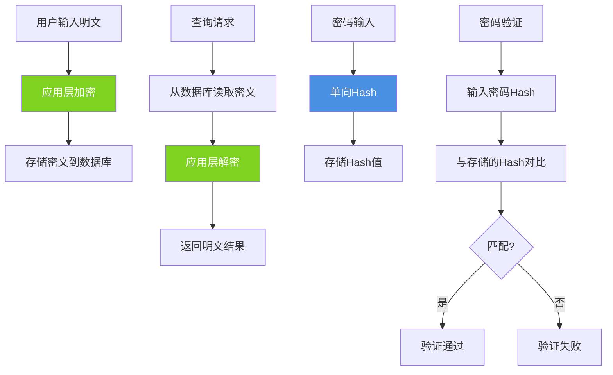
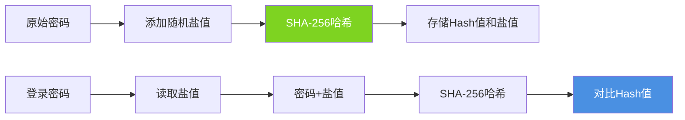
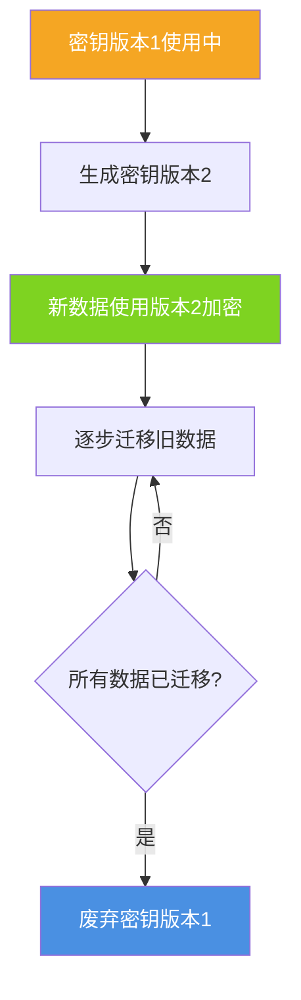
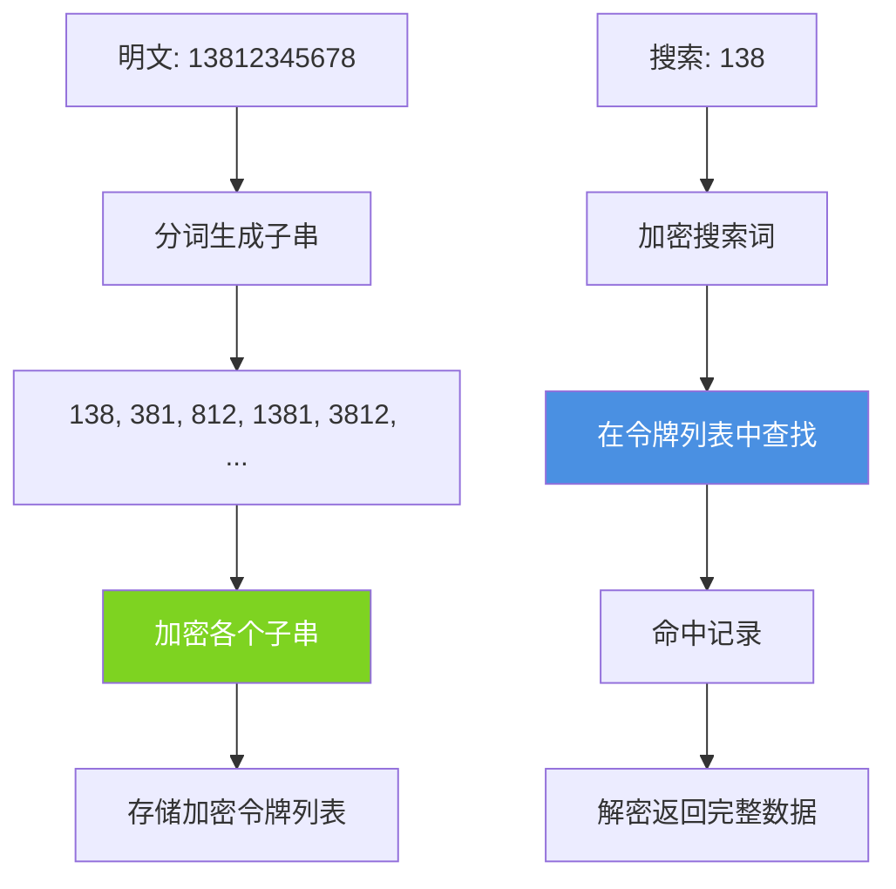
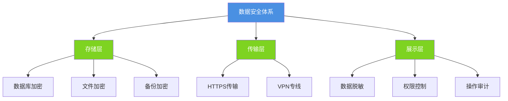

## 数据安全的重要性

在当今的信息时代,数据泄露事件频发,给企业和用户带来巨大损失。数据库作为敏感信息的集中存储地,其安全性至关重要。对用户的手机号、身份证号、银行卡号等敏感字段进行加密,能够有效防止数据泄露后的信息滥用。即使数据库被"拖库",攻击者获取的也只是加密后的密文,无法直接使用。

## 数据加密方案

### 应用层加密解密

最常用且最灵活的方案是在应用层对敏感数据进行加密处理:

```java
@Service
public class UserService {
    
    @Autowired
    private UserRepository userRepository;
    
    @Autowired
    private EncryptionService encryptionService;
    
    // 保存用户信息时加密
    public void createUser(UserDTO userDTO) {
        User user = new User();
        user.setUsername(userDTO.getUsername());
        
        // 加密手机号
        String encryptedPhone = encryptionService.encrypt(userDTO.getPhone());
        user.setPhone(encryptedPhone);
        
        // 加密身份证号
        String encryptedIdCard = encryptionService.encrypt(userDTO.getIdCard());
        user.setIdCard(encryptedIdCard);
        
        // 密码使用单向Hash(不可逆)
        String hashedPassword = encryptionService.hash(userDTO.getPassword());
        user.setPassword(hashedPassword);
        
        userRepository.save(user);
    }
    
    // 查询时解密
    public UserVO getUserById(Long userId) {
        User user = userRepository.findById(userId)
            .orElseThrow(() -> new NotFoundException("用户不存在"));
        
        UserVO userVO = new UserVO();
        userVO.setUserId(user.getUserId());
        userVO.setUsername(user.getUsername());
        
        // 解密手机号
        String decryptedPhone = encryptionService.decrypt(user.getPhone());
        userVO.setPhone(maskPhone(decryptedPhone));  // 脱敏显示
        
        // 解密身份证号
        String decryptedIdCard = encryptionService.decrypt(user.getIdCard());
        userVO.setIdCard(maskIdCard(decryptedIdCard));
        
        return userVO;
    }
    
    // 手机号脱敏:138****5678
    private String maskPhone(String phone) {
        if (phone == null || phone.length() != 11) {
            return phone;
        }
        return phone.substring(0, 3) + "****" + phone.substring(7);
    }
    
    // 身份证脱敏:110***********1234
    private String maskIdCard(String idCard) {
        if (idCard == null || idCard.length() < 8) {
            return idCard;
        }
        return idCard.substring(0, 3) + "***********" + idCard.substring(idCard.length() - 4);
    }
}
```

加密服务实现(使用AES对称加密):

```java
@Service
public class EncryptionService {
    
    // 密钥应从配置中心获取,不应硬编码
    @Value("${encryption.secret-key}")
    private String secretKey;
    
    private static final String ALGORITHM = "AES";
    private static final String TRANSFORMATION = "AES/ECB/PKCS5Padding";
    
    public String encrypt(String plainText) {
        try {
            SecretKeySpec keySpec = new SecretKeySpec(secretKey.getBytes(), ALGORITHM);
            Cipher cipher = Cipher.getInstance(TRANSFORMATION);
            cipher.init(Cipher.ENCRYPT_MODE, keySpec);
            
            byte[] encrypted = cipher.doFinal(plainText.getBytes(StandardCharsets.UTF_8));
            return Base64.getEncoder().encodeToString(encrypted);
        } catch (Exception e) {
            throw new EncryptionException("加密失败", e);
        }
    }
    
    public String decrypt(String cipherText) {
        try {
            SecretKeySpec keySpec = new SecretKeySpec(secretKey.getBytes(), ALGORITHM);
            Cipher cipher = Cipher.getInstance(TRANSFORMATION);
            cipher.init(Cipher.DECRYPT_MODE, keySpec);
            
            byte[] decoded = Base64.getDecoder().decode(cipherText);
            byte[] decrypted = cipher.doFinal(decoded);
            return new String(decrypted, StandardCharsets.UTF_8);
        } catch (Exception e) {
            throw new EncryptionException("解密失败", e);
        }
    }
    
    // 单向Hash用于密码(不可逆)
    public String hash(String plainText) {
        try {
            MessageDigest digest = MessageDigest.getInstance("SHA-256");
            byte[] hash = digest.digest(plainText.getBytes(StandardCharsets.UTF_8));
            return Base64.getEncoder().encodeToString(hash);
        } catch (Exception e) {
            throw new EncryptionException("Hash失败", e);
        }
    }
}
```

应用层加密架构:



### 数据库加密函数

MySQL提供了内置的加密函数,可以直接在SQL中使用:

**AES加密解密**

```sql
-- 创建用户表
CREATE TABLE users_encrypted (
    user_id INT PRIMARY KEY AUTO_INCREMENT,
    username VARCHAR(50) NOT NULL,
    phone_encrypted BLOB,  -- 存储加密后的手机号
    email_encrypted BLOB,
    created_at TIMESTAMP DEFAULT CURRENT_TIMESTAMP
);

-- 插入加密数据
INSERT INTO users_encrypted (username, phone_encrypted, email_encrypted) 
VALUES (
    '李明',
    AES_ENCRYPT('13812345678', 'my_secret_key_2024'),
    AES_ENCRYPT('liming@example.com', 'my_secret_key_2024')
);

-- 查询并解密
SELECT 
    user_id,
    username,
    CAST(AES_DECRYPT(phone_encrypted, 'my_secret_key_2024') AS CHAR) AS phone,
    CAST(AES_DECRYPT(email_encrypted, 'my_secret_key_2024') AS CHAR) AS email
FROM users_encrypted
WHERE user_id = 1;
```

**MD5和SHA哈希函数**

```sql
-- 创建账户表
CREATE TABLE user_accounts (
    account_id INT PRIMARY KEY AUTO_INCREMENT,
    username VARCHAR(50) UNIQUE NOT NULL,
    password_hash CHAR(64) NOT NULL,  -- SHA-256产生64位十六进制字符串
    salt CHAR(32) NOT NULL,  -- 盐值
    created_at TIMESTAMP DEFAULT CURRENT_TIMESTAMP
);

-- 注册用户(加盐Hash)
SET @username = 'zhangsan';
SET @password = 'MyPassword123';
SET @salt = MD5(RAND());  -- 生成随机盐值

INSERT INTO user_accounts (username, password_hash, salt)
VALUES (
    @username,
    SHA2(CONCAT(@password, @salt), 256),  -- 密码+盐值进行SHA-256
    @salt
);

-- 验证密码
SET @input_username = 'zhangsan';
SET @input_password = 'MyPassword123';

SELECT 
    CASE 
        WHEN password_hash = SHA2(CONCAT(@input_password, salt), 256) 
        THEN '密码正确' 
        ELSE '密码错误' 
    END AS validation_result
FROM user_accounts
WHERE username = @input_username;
```

加盐Hash机制:



### InnoDB静态数据加密

MySQL 5.7+支持对InnoDB表空间进行透明加密:

```sql
-- 启用加密的表
CREATE TABLE sensitive_data (
    data_id INT PRIMARY KEY AUTO_INCREMENT,
    secret_info VARCHAR(200),
    created_at TIMESTAMP DEFAULT CURRENT_TIMESTAMP
) ENCRYPTION='Y';

-- 为已存在的表启用加密
ALTER TABLE sensitive_data ENCRYPTION='Y';

-- 查看表的加密状态
SELECT 
    table_schema,
    table_name,
    create_options
FROM information_schema.tables
WHERE table_name = 'sensitive_data';
```

配置keyring插件(密钥管理):

```ini
# my.cnf配置
[mysqld]
early-plugin-load=keyring_file.so
keyring_file_data=/var/lib/mysql-keyring/keyring
```

**表空间加密特点:**
- 数据在磁盘上以加密形式存储
- 查询时自动解密,对应用透明
- 保护备份文件和binlog
- 性能影响较小(约5-15%)

## 加密后的挑战

### 性能开销

加密解密操作会增加CPU负担:

```java
// 性能测试示例
@Test
public void testEncryptionPerformance() {
    int iterations = 10000;
    String plainText = "13812345678";
    
    // 测试加密性能
    long startTime = System.currentTimeMillis();
    for (int i = 0; i < iterations; i++) {
        encryptionService.encrypt(plainText);
    }
    long encryptTime = System.currentTimeMillis() - startTime;
    System.out.println("10000次加密耗时: " + encryptTime + "ms");
    // 输出示例: 10000次加密耗时: 850ms
    
    // 测试解密性能
    String cipherText = encryptionService.encrypt(plainText);
    startTime = System.currentTimeMillis();
    for (int i = 0; i < iterations; i++) {
        encryptionService.decrypt(cipherText);
    }
    long decryptTime = System.currentTimeMillis() - startTime;
    System.out.println("10000次解密耗时: " + decryptTime + "ms");
    // 输出示例: 10000次解密耗时: 920ms
}
```

性能优化策略:
- 仅对必要的敏感字段加密
- 使用缓存减少重复解密
- 批量操作时考虑异步处理

### 密钥管理复杂度

密钥的安全存储和轮换是关键挑战:

```java
@Configuration
public class KeyManagementConfig {
    
    // 错误示范:硬编码密钥
    // private static final String SECRET_KEY = "hardcoded_key";  // 严重安全隐患!
    
    // 推荐方案1:从配置中心读取
    @Value("${encryption.key}")
    private String encryptionKey;
    
    // 推荐方案2:从密钥管理服务获取
    @Bean
    public KeyManager keyManager() {
        // 集成AWS KMS、Azure Key Vault或阿里云KMS
        return new CloudKeyManager();
    }
    
    // 推荐方案3:使用环境变量
    @Bean
    public String getSecretKey() {
        String key = System.getenv("DB_ENCRYPTION_KEY");
        if (key == null) {
            throw new IllegalStateException("加密密钥未配置");
        }
        return key;
    }
}
```

密钥轮换策略:



## 加密后的模糊查询

加密数据的模糊查询是一个技术难题,因为密文之间不存在明文的相似关系。

### 方案一:全表解密(不推荐)

```java
// 性能极差的方案
public List<User> searchByPhoneLike(String phonePattern) {
    List<User> allUsers = userRepository.findAll();
    
    return allUsers.stream()
        .filter(user -> {
            String decryptedPhone = encryptionService.decrypt(user.getPhone());
            return decryptedPhone.contains(phonePattern);
        })
        .collect(Collectors.toList());
}
```

缺点:
- 需要加载所有数据到内存
- 解密开销巨大
- 容易导致OOM
- 无法利用索引

### 方案二:数据库解密函数查询

```sql
-- 在WHERE中使用解密函数
SELECT 
    user_id,
    username,
    CAST(AES_DECRYPT(phone_encrypted, 'my_secret_key') AS CHAR) AS phone
FROM users_encrypted
WHERE CAST(AES_DECRYPT(phone_encrypted, 'my_secret_key') AS CHAR) LIKE '138%';
```

缺点:
- 索引失效(函数作用于字段)
- 全表扫描
- 适用于小数据量场景

### 方案三:明文关键词分词索引(推荐)

将敏感数据的关键部分分词后加密存储:

```sql
-- 优化后的用户表设计
CREATE TABLE users_searchable (
    user_id INT PRIMARY KEY AUTO_INCREMENT,
    username VARCHAR(50) NOT NULL,
    phone_encrypted BLOB NOT NULL,  -- 完整手机号加密
    phone_search_tokens TEXT,  -- 用于搜索的加密分词,例如:"enc_138,enc_381,enc_812,enc_123,enc_234,enc_345,enc_456,enc_567,enc_678"
    email_encrypted BLOB,
    created_at TIMESTAMP DEFAULT CURRENT_TIMESTAMP,
    INDEX idx_search_tokens (phone_search_tokens(100))  -- 前缀索引
);
```

Java实现:

```java
@Service
public class SearchableEncryptionService {
    
    @Autowired
    private EncryptionService encryptionService;
    
    // 生成搜索令牌
    public String generateSearchTokens(String phone) {
        Set<String> tokens = new HashSet<>();
        
        // 生成各种长度的子串
        for (int length = 3; length <= phone.length(); length++) {
            for (int i = 0; i <= phone.length() - length; i++) {
                String substring = phone.substring(i, i + length);
                // 加密子串
                String encryptedToken = encryptionService.encrypt(substring);
                tokens.add(encryptedToken);
            }
        }
        
        return String.join(",", tokens);
    }
    
    // 保存用户
    public void saveUserWithSearch(String username, String phone, String email) {
        User user = new User();
        user.setUsername(username);
        user.setPhoneEncrypted(encryptionService.encrypt(phone));
        user.setEmailEncrypted(encryptionService.encrypt(email));
        
        // 生成搜索令牌
        String searchTokens = generateSearchTokens(phone);
        user.setPhoneSearchTokens(searchTokens);
        
        userRepository.save(user);
    }
    
    // 模糊搜索
    public List<User> searchByPhonePattern(String pattern) {
        // 加密搜索模式
        String encryptedPattern = encryptionService.encrypt(pattern);
        
        // 使用LIKE查询(可以利用索引前缀)
        return userRepository.findByPhoneSearchTokensContaining(encryptedPattern);
    }
}
```

对应的SQL查询:

```sql
-- 查询手机号包含"138"的用户
SET @search_pattern = AES_ENCRYPT('138', 'my_secret_key');

SELECT 
    user_id,
    username,
    CAST(AES_DECRYPT(phone_encrypted, 'my_secret_key') AS CHAR) AS phone
FROM users_searchable
WHERE phone_search_tokens LIKE CONCAT('%', @search_pattern, '%');
```

分词索引方案架构:



### 方案四:布隆过滤器优化

对于大数据量场景,可使用布隆过滤器快速过滤:

```java
@Service
public class BloomFilterSearchService {
    
    private BloomFilter<String> phoneBloomFilter;
    
    @PostConstruct
    public void init() {
        // 预估100万用户,误判率0.01
        phoneBloomFilter = BloomFilter.create(
            Funnels.stringFunnel(StandardCharsets.UTF_8),
            1000000,
            0.01
        );
        
        // 加载已有数据到布隆过滤器
        List<User> users = userRepository.findAll();
        for (User user : users) {
            String phone = encryptionService.decrypt(user.getPhoneEncrypted());
            phoneBloomFilter.put(phone);
        }
    }
    
    public List<User> searchWithBloomFilter(String pattern) {
        // 快速判断是否可能存在
        if (!phoneBloomFilter.mightContain(pattern)) {
            return Collections.emptyList();  // 一定不存在
        }
        
        // 可能存在,执行精确查询
        String encryptedPattern = encryptionService.encrypt(pattern);
        return userRepository.findByPhoneSearchTokensContaining(encryptedPattern);
    }
}
```

### 真实案例参考

**淘宝的加密搜索方案**

淘宝对收货人手机号采用分段加密索引:

```sql
-- 简化版示例
CREATE TABLE delivery_addresses (
    address_id BIGINT PRIMARY KEY,
    receiver_name_encrypted VARCHAR(200),
    phone_full_encrypted VARCHAR(200),  -- 完整手机号加密
    phone_prefix_encrypted CHAR(50),  -- 前3位加密
    phone_middle_encrypted CHAR(50),  -- 中间4位加密
    phone_suffix_encrypted CHAR(50),  -- 后4位加密
    INDEX idx_prefix (phone_prefix_encrypted),
    INDEX idx_middle (phone_middle_encrypted),
    INDEX idx_suffix (phone_suffix_encrypted)
);

-- 搜索优化:根据输入位置选择索引
-- 搜索"138****"时使用prefix索引
-- 搜索"***1234"时使用suffix索引
```

## 数据脱敏最佳实践

除了加密,还应在展示层进行数据脱敏:

```java
@Service
public class DataMaskingService {
    
    // 手机号脱敏
    public String maskPhone(String phone) {
        if (StringUtils.isEmpty(phone) || phone.length() != 11) {
            return phone;
        }
        return phone.substring(0, 3) + "****" + phone.substring(7);
    }
    
    // 身份证号脱敏
    public String maskIdCard(String idCard) {
        if (StringUtils.isEmpty(idCard)) {
            return idCard;
        }
        int length = idCard.length();
        if (length == 15) {
            return idCard.substring(0, 6) + "*****" + idCard.substring(11);
        } else if (length == 18) {
            return idCard.substring(0, 6) + "********" + idCard.substring(14);
        }
        return idCard;
    }
    
    // 银行卡号脱敏
    public String maskBankCard(String cardNo) {
        if (StringUtils.isEmpty(cardNo) || cardNo.length() < 8) {
            return cardNo;
        }
        return cardNo.substring(0, 4) + " **** **** " + cardNo.substring(cardNo.length() - 4);
    }
    
    // 邮箱脱敏
    public String maskEmail(String email) {
        if (StringUtils.isEmpty(email) || !email.contains("@")) {
            return email;
        }
        String[] parts = email.split("@");
        String username = parts[0];
        if (username.length() <= 2) {
            return "*@" + parts[1];
        }
        return username.substring(0, 2) + "***@" + parts[1];
    }
}
```

数据安全层次:



通过多层次的安全防护,可以最大程度保障敏感数据的安全。加密方案的选择需要在安全性、性能和可用性之间找到平衡点。
