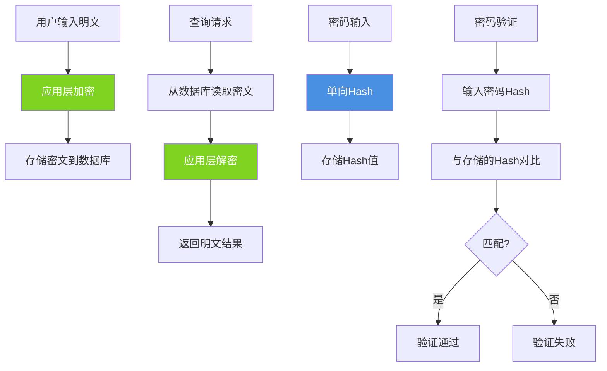

import PaidCTA from '@site/src/components/PaidCTA';

# MySQL数据加密与安全实践

## 数据安全的重要性

在当今的信息时代,数据泄露事件频发,给企业和用户带来巨大损失。数据库作为敏感信息的集中存储地,其安全性至关重要。对用户的手机号、身份证号、银行卡号等敏感字段进行加密,能够有效防止数据泄露后的信息滥用。即使数据库被"拖库",攻击者获取的也只是加密后的密文,无法直接使用。

## 数据加密方案

### 应用层加密解密

最常用且最灵活的方案是在应用层对敏感数据进行加密处理:

```java
@Service
public class UserService {
    
    @Autowired
    private UserRepository userRepository;
    
    @Autowired
    private EncryptionService encryptionService;
    
    // 保存用户信息时加密
    public void createUser(UserDTO userDTO) {
        User user = new User();
        user.setUsername(userDTO.getUsername());
        
        // 加密手机号
        String encryptedPhone = encryptionService.encrypt(userDTO.getPhone());
        user.setPhone(encryptedPhone);
        
        // 加密身份证号
        String encryptedIdCard = encryptionService.encrypt(userDTO.getIdCard());
        user.setIdCard(encryptedIdCard);
        
        // 密码使用单向Hash(不可逆)
        String hashedPassword = encryptionService.hash(userDTO.getPassword());
        user.setPassword(hashedPassword);
        
        userRepository.save(user);
    }
    
    // 查询时解密
    public UserVO getUserById(Long userId) {
        User user = userRepository.findById(userId)
            .orElseThrow(() -> new NotFoundException("用户不存在"));
        
        UserVO userVO = new UserVO();
        userVO.setUserId(user.getUserId());
        userVO.setUsername(user.getUsername());
        
        // 解密手机号
        String decryptedPhone = encryptionService.decrypt(user.getPhone());
        userVO.setPhone(maskPhone(decryptedPhone));  // 脱敏显示
        
        // 解密身份证号
        String decryptedIdCard = encryptionService.decrypt(user.getIdCard());
        userVO.setIdCard(maskIdCard(decryptedIdCard));
        
        return userVO;
    }
    
    // 手机号脱敏:138****5678
    private String maskPhone(String phone) {
        if (phone == null || phone.length() != 11) {
            return phone;
        }
        return phone.substring(0, 3) + "****" + phone.substring(7);
    }
    
    // 身份证脱敏:110***********1234
    private String maskIdCard(String idCard) {
        if (idCard == null || idCard.length() < 8) {
            return idCard;
        }
        return idCard.substring(0, 3) + "***********" + idCard.substring(idCard.length() - 4);
    }
}
```

加密服务实现(使用AES对称加密):

```java
@Service
public class EncryptionService {
    
    // 密钥应从配置中心获取,不应硬编码
    @Value("${encryption.secret-key}")
    private String secretKey;
    
    private static final String ALGORITHM = "AES";
    private static final String TRANSFORMATION = "AES/ECB/PKCS5Padding";
    
    public String encrypt(String plainText) {
        try {
            SecretKeySpec keySpec = new SecretKeySpec(secretKey.getBytes(), ALGORITHM);
            Cipher cipher = Cipher.getInstance(TRANSFORMATION);
            cipher.init(Cipher.ENCRYPT_MODE, keySpec);
            
            byte[] encrypted = cipher.doFinal(plainText.getBytes(StandardCharsets.UTF_8));
            return Base64.getEncoder().encodeToString(encrypted);
        } catch (Exception e) {
            throw new EncryptionException("加密失败", e);
        }
    }
    
    public String decrypt(String cipherText) {
        try {
            SecretKeySpec keySpec = new SecretKeySpec(secretKey.getBytes(), ALGORITHM);
            Cipher cipher = Cipher.getInstance(TRANSFORMATION);
            cipher.init(Cipher.DECRYPT_MODE, keySpec);
            
            byte[] decoded = Base64.getDecoder().decode(cipherText);
            byte[] decrypted = cipher.doFinal(decoded);
            return new String(decrypted, StandardCharsets.UTF_8);
        } catch (Exception e) {
            throw new EncryptionException("解密失败", e);
        }
    }
    
    // 单向Hash用于密码(不可逆)
    public String hash(String plainText) {
        try {
            MessageDigest digest = MessageDigest.getInstance("SHA-256");
            byte[] hash = digest.digest(plainText.getBytes(StandardCharsets.UTF_8));
            return Base64.getEncoder().encodeToString(hash);
        } catch (Exception e) {
            throw new EncryptionException("Hash失败", e);
        }
    }
}
```

应用层加密架构:



### 数据库加密函数

MySQL提供了内置的加密函数,可以直接在SQL中使用:

<PaidCTA />