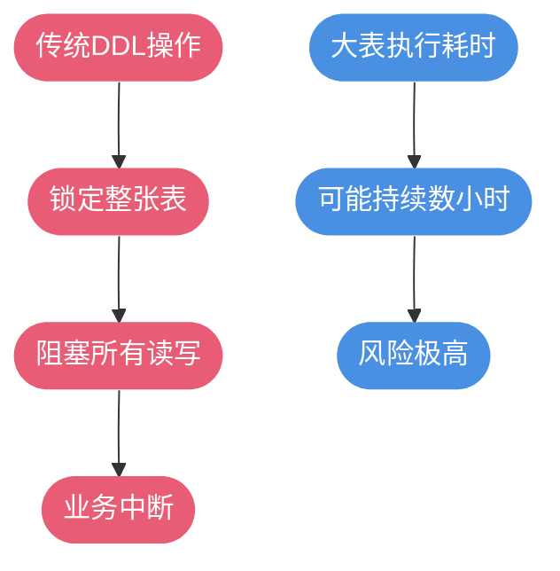

import PaidCTA from '@site/src/components/PaidCTA';

# 大表在线DDL操作实战

## 大表结构变更的挑战

在生产环境中，当数据表规模达到千万级甚至更大时，对表结构进行修改（如添加字段、修改索引等）会成为一项高风险操作。传统的 DDL 操作会锁定整张表，阻塞所有读写请求，导致业务中断。

对于千万级大表，核心问题在于：**DDL 执行时间与表数据量成正比**，表越大执行时间越长，对业务的影响也就越大。因此，如何在不影响业务的前提下完成表结构变更，是数据库运维的重要课题。

<PaidCTA />