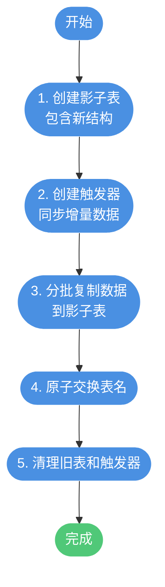

# 大表在线DDL操作实战

## 大表结构变更的挑战

在生产环境中，当数据表规模达到千万级甚至更大时，对表结构进行修改（如添加字段、修改索引等）会成为一项高风险操作。传统的 DDL 操作会锁定整张表，阻塞所有读写请求，导致业务中断。


对于千万级大表，核心问题在于：**DDL 执行时间与表数据量成正比**，表越大执行时间越长，对业务的影响也就越大。因此，如何在不影响业务的前提下完成表结构变更，是数据库运维的重要课题。

## Online DDL 在线表结构变更

### 什么是 Online DDL

从 MySQL 5.6 版本开始，InnoDB 存储引擎引入了 **Online DDL** 特性。它允许在执行 DDL 操作时，不完全阻塞并发的 DML（INSERT、UPDATE、DELETE）和查询操作。


### Online DDL 的工作原理

Online DDL 主要通过以下方式实现在线变更：

**INPLACE 算法**：直接在原表上进行修改，不需要创建临时表复制数据。

**Row Log 机制**：在 DDL 执行期间，将并发的 DML 操作记录到日志中，DDL 完成后再重放这些日志，保证数据一致性。


### 使用 Online DDL 添加字段

对于千万级数据表添加字段，使用 Online DDL 的标准语法如下：

```sql
-- 电商订单表添加促销标识字段
ALTER TABLE order_records 
ADD COLUMN promotion_flag TINYINT DEFAULT 0 COMMENT '促销标识 0-普通 1-促销',
ALGORITHM=INPLACE, LOCK=NONE;
```

**参数说明**：

- **ALGORITHM=INPLACE**：使用原地修改算法，不复制表数据
- **LOCK=NONE**：不加锁，允许并发读写

### ALGORITHM 选项详解

| 选项 | 说明 | 锁表情况 | 适用场景 |
|-----|------|---------|---------|
| INPLACE | 原地修改，不复制表 | 不锁表或短暂锁 | 添加列、添加索引等 |
| COPY | 创建临时表复制数据 | 全程锁表 | 不支持 INPLACE 的操作 |
| INSTANT | 仅修改元数据 | 极短暂锁 | MySQL 8.0+ 部分操作 |

### LOCK 选项详解

| 选项 | 说明 | DML操作 | 查询操作 |
|-----|------|--------|---------|
| NONE | 不加锁 | 允许 | 允许 |
| SHARED | 共享锁 | 不允许 | 允许 |
| EXCLUSIVE | 排他锁 | 不允许 | 不允许 |
| DEFAULT | 自动选择最小锁级别 | 取决于操作类型 | 取决于操作类型 |

### 支持 Online DDL 的操作


### 注意事项与最佳实践

虽然 Online DDL 大大降低了对业务的影响，但仍需注意以下几点：

**1. 避开业务高峰期**

即使不锁表，Online DDL 执行期间仍会消耗系统资源（CPU、内存、I/O），建议选择业务低峰期执行：

```sql
-- 查看当前连接数和活跃查询
SHOW PROCESSLIST;

-- 查看系统负载
SHOW STATUS LIKE 'Threads_running';
```

**2. 评估磁盘空间**

INPLACE 操作虽然不复制整表，但需要额外空间存储 Row Log：

```sql
-- 查看表大小
SELECT 
    table_name,
    ROUND(data_length / 1024 / 1024, 2) AS data_mb,
    ROUND(index_length / 1024 / 1024, 2) AS index_mb
FROM information_schema.tables 
WHERE table_schema = 'your_database' AND table_name = 'order_records';
```

**3. 监控执行进度**

```sql
-- MySQL 5.7+ 可通过 performance_schema 监控
SELECT * FROM performance_schema.events_stages_current 
WHERE thread_id = (SELECT thread_id FROM performance_schema.threads WHERE processlist_id = CONNECTION_ID());
```

## pt-online-schema-change 工具

### 适用场景

当以下情况时，推荐使用 Percona 的 **pt-online-schema-change** 工具：

- MySQL 版本低于 5.6
- 使用非 InnoDB 存储引擎
- 需要更精细的控制和监控
- Online DDL 不支持的操作

### 工作原理

pt-online-schema-change 通过创建影子表和触发器实现无锁表结构变更：



**详细流程**：

1. **创建影子表**：结构与原表相同，但包含要修改的字段
2. **创建触发器**：在原表上创建 INSERT、UPDATE、DELETE 触发器，实时同步变更到影子表
3. **分批复制**：按主键范围分批复制历史数据到影子表，避免一次性大量数据操作
4. **原子交换**：使用 RENAME TABLE 原子操作交换原表和影子表
5. **清理收尾**：删除触发器，可选删除旧表

### 使用示例

```bash
# 为会员信息表添加等级字段
pt-online-schema-change \
  --alter="ADD COLUMN member_level INT DEFAULT 1 COMMENT '会员等级'" \
  D=ecommerce_db,t=member_info \
  --execute \
  --no-drop-old-table \
  --max-load="Threads_running=50" \
  --critical-load="Threads_running=100" \
  --chunk-size=1000 \
  --progress=time,30
```

**关键参数说明**：

| 参数 | 说明 |
|-----|------|
| `--alter` | DDL 语句（不含 ALTER TABLE 前缀） |
| `D=库名,t=表名` | 指定数据库和表 |
| `--execute` | 实际执行（不加则为空运行模式） |
| `--no-drop-old-table` | 保留旧表，便于回滚 |
| `--max-load` | 负载阈值，超过时暂停复制 |
| `--critical-load` | 临界负载，超过时终止操作 |
| `--chunk-size` | 每批复制的行数 |
| `--progress` | 进度显示方式 |

### 回滚与恢复

使用 `--no-drop-old-table` 参数后，原表会被重命名保留：

```sql
-- 查看保留的旧表
SHOW TABLES LIKE '%_old';

-- 如需回滚，交换表名
RENAME TABLE member_info TO member_info_new, 
             member_info_old TO member_info;
```

## gh-ost 工具

### 介绍

**gh-ost** 是 GitHub 开源的 Online DDL 工具，相比 pt-online-schema-change 有以下优势：


### 核心特点

1. **无触发器**：通过读取 binlog 获取增量数据，不在原表创建触发器
2. **可控性强**：支持动态暂停、恢复、限速
3. **实时状态**：提供丰富的状态监控接口
4. **安全可靠**：经过 GitHub 大规模生产验证

### 基本用法

```bash
# 为物流跟踪表添加签收时间字段
gh-ost \
  --alter="ADD COLUMN receive_time DATETIME COMMENT '签收时间'" \
  --database=logistics_db \
  --table=delivery_records \
  --host=127.0.0.1 \
  --user=admin \
  --password=secret \
  --chunk-size=1000 \
  --max-load=Threads_running=50 \
  --critical-load=Threads_running=100 \
  --execute
```

## 方案选择建议

根据实际情况选择合适的方案：


**总结建议**：

| 场景 | 推荐方案 |
|-----|---------|
| MySQL 5.6+ InnoDB 支持的操作 | Online DDL |
| 需要更精细控制 | pt-online-schema-change |
| 对原表零侵入要求 | gh-ost |
| 超大表需要暂停恢复 | gh-ost |

无论选择哪种方案，都建议在**低峰期**执行，并做好**监控和回滚预案**。
