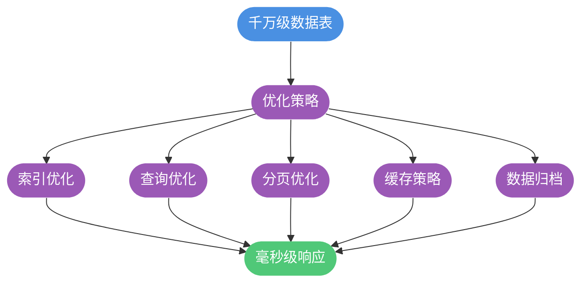

import PaidCTA from '@site/src/components/PaidCTA';

# 千万级数据查询优化实战

## 千万级数据查询的可行性

对于 MySQL 单表千万级甚至五千万级别的数据量，在合理优化的前提下，完全可以实现高性能查询，**无需急于分库分表或引入 Elasticsearch 等搜索引擎**。

关键在于掌握正确的优化策略和方法。本文将从索引优化、查询语句优化、分页优化等多个维度，系统讲解千万级数据表的查询优化技巧。

## 索引优化策略

索引是大数据量查询优化的**第一要务**。有无索引、是否正确使用索引，查询性能可能相差成百上千倍。

### 选择合适的索引类型

MySQL InnoDB 支持多种索引类型，需根据查询特点选择：

<PaidCTA />