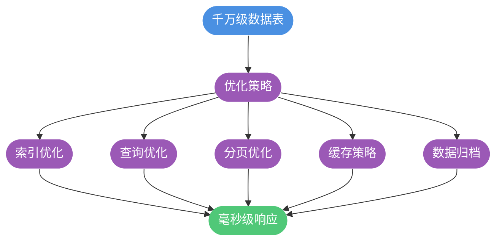
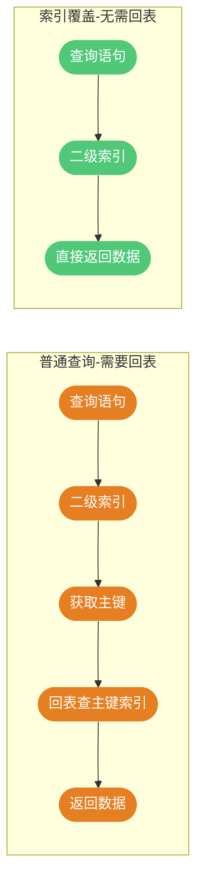

# 千万级数据查询优化实战

## 千万级数据查询的可行性

对于 MySQL 单表千万级甚至五千万级别的数据量，在合理优化的前提下，完全可以实现高性能查询，**无需急于分库分表或引入 Elasticsearch 等搜索引擎**。

关键在于掌握正确的优化策略和方法。本文将从索引优化、查询语句优化、分页优化等多个维度，系统讲解千万级数据表的查询优化技巧。



## 索引优化策略

索引是大数据量查询优化的**第一要务**。有无索引、是否正确使用索引，查询性能可能相差成百上千倍。

### 选择合适的索引类型

MySQL InnoDB 支持多种索引类型，需根据查询特点选择：


**场景选择**：

```sql
-- 订单查询：需要范围查询和排序，使用 B+树索引（默认）
CREATE INDEX idx_order_time ON sales_orders(order_time);

-- 配置表查询：仅做等值查询，可考虑 Hash 索引
-- Memory 引擎支持 Hash 索引
CREATE TABLE system_config (
    config_key VARCHAR(100) PRIMARY KEY,
    config_value TEXT
) ENGINE=MEMORY;
```

### 构建高效联合索引

联合索引能显著提升多条件查询的性能，合理设计联合索引是优化的关键。

**设计原则**：


**实战示例**：

```sql
-- 电商商品搜索场景
-- 常见查询：按分类、状态、上架时间查询
CREATE TABLE products (
    id BIGINT PRIMARY KEY AUTO_INCREMENT,
    category_id INT NOT NULL,
    status TINYINT NOT NULL DEFAULT 1,
    product_name VARCHAR(200) NOT NULL,
    price DECIMAL(10,2) NOT NULL,
    create_time DATETIME NOT NULL,
    INDEX idx_category_status_time (category_id, status, create_time)
);

-- 以下查询都能命中索引
SELECT * FROM products WHERE category_id = 100;
SELECT * FROM products WHERE category_id = 100 AND status = 1;
SELECT * FROM products WHERE category_id = 100 AND status = 1 ORDER BY create_time DESC;

-- 以下查询无法使用该联合索引
SELECT * FROM products WHERE status = 1;  -- 缺少最左字段
```

### 利用索引覆盖避免回表

当查询的所有字段都包含在索引中时，可以直接从索引获取数据，无需回表查询主键索引，这就是**索引覆盖**。



**示例**：

```sql
-- 创建联合索引
CREATE INDEX idx_user_order ON transactions(user_id, order_amount, transaction_time);

-- 索引覆盖查询：所需字段都在索引中
SELECT user_id, order_amount, transaction_time 
FROM transactions 
WHERE user_id = 10086;  -- 无需回表

-- 需要回表：查询了索引外的字段
SELECT user_id, order_amount, remark 
FROM transactions 
WHERE user_id = 10086;  -- remark 不在索引中，需回表
```

**执行计划验证**：

```sql
EXPLAIN SELECT user_id, order_amount, transaction_time 
FROM transactions WHERE user_id = 10086;

-- Extra 列显示 "Using index" 表示使用了索引覆盖
```

### 避免索引失效

即使建立了索引，某些写法也会导致索引无法使用：


**错误示例与修正**：

```sql
-- 错误：对索引列使用函数
SELECT * FROM orders WHERE DATE(create_time) = '2024-01-01';
-- 修正：改为范围查询
SELECT * FROM orders WHERE create_time >= '2024-01-01' AND create_time < '2024-01-02';

-- 错误：隐式类型转换
SELECT * FROM users WHERE mobile = 13800138000;  -- mobile 是 VARCHAR
-- 修正：保持类型一致
SELECT * FROM users WHERE mobile = '13800138000';

-- 错误：前导模糊查询
SELECT * FROM products WHERE product_name LIKE '%手机';
-- 修正：使用全文索引或搜索引擎

-- 验证是否使用索引
EXPLAIN SELECT * FROM orders WHERE create_time >= '2024-01-01';
```

## 查询语句优化

### 避免多表 JOIN

多表 JOIN 是性能杀手，特别是在大表场景下：


**优化示例**：

```sql
-- 不推荐：三表 JOIN 查询订单详情
SELECT o.order_no, u.username, p.product_name
FROM orders o
JOIN users u ON o.user_id = u.id
JOIN products p ON o.product_id = p.id
WHERE o.create_time > '2024-01-01';

-- 推荐方案1：冗余字段
-- 在 orders 表中冗余 username 和 product_name
SELECT order_no, username, product_name
FROM orders
WHERE create_time > '2024-01-01';

-- 推荐方案2：拆分查询，应用层组装
-- 步骤1：查询订单
SELECT order_no, user_id, product_id FROM orders WHERE create_time > '2024-01-01';
-- 步骤2：批量查询用户（IN查询）
SELECT id, username FROM users WHERE id IN (1, 2, 3, ...);
-- 步骤3：批量查询商品
SELECT id, product_name FROM products WHERE id IN (101, 102, ...);
-- 步骤4：应用层组装结果
```

### 禁止使用 SELECT *

`SELECT *` 存在多个性能问题：

```sql
-- 不推荐
SELECT * FROM order_details WHERE order_id = 10001;

-- 推荐：只查需要的字段
SELECT order_id, product_id, quantity, unit_price 
FROM order_details 
WHERE order_id = 10001;
```

**危害分析**：

1. **无法使用索引覆盖**：必须回表获取所有字段
2. **增加网络传输**：传输大量不需要的数据
3. **增加内存消耗**：应用层需要处理更多数据
4. **代码可维护性差**：表结构变更容易引发问题

### 减小事务粒度

长事务会占用数据库连接，导致连接池耗尽：


**优化建议**：

```java
// 不推荐：大事务包含非必要操作
@Transactional
public void processOrder(Order order) {
    saveOrder(order);           // 必须在事务中
    sendNotification(order);    // 不需要在事务中，可能很慢
    updateStatistics(order);    // 不需要在事务中
}

// 推荐：只包含必要的数据库操作
@Transactional
public void saveOrderInTransaction(Order order) {
    saveOrder(order);
    deductInventory(order);
}

public void processOrder(Order order) {
    saveOrderInTransaction(order);  // 事务操作
    sendNotification(order);         // 事务外执行
    asyncUpdateStatistics(order);    // 异步执行
}
```

## 深分页优化

### 深分页问题分析

当使用 `LIMIT offset, size` 进行分页时，offset 越大，性能越差：

```sql
-- 查询第 10000 页，每页 20 条
SELECT * FROM log_records ORDER BY id LIMIT 200000, 20;
```

**问题根源**：MySQL 需要扫描 200020 条记录，然后丢弃前 200000 条，只返回最后 20 条。


### 游标分页（推荐）

记录上一页最后一条数据的 ID，作为下一页的起始条件：

```sql
-- 物流轨迹表
CREATE TABLE shipping_tracks (
    id BIGINT PRIMARY KEY AUTO_INCREMENT,
    tracking_no VARCHAR(50) NOT NULL,
    location VARCHAR(200),
    track_time DATETIME,
    INDEX idx_tracking_no (tracking_no)
);

-- 第一页
SELECT * FROM shipping_tracks 
WHERE tracking_no = 'SF123456789' 
ORDER BY id ASC 
LIMIT 20;

-- 后续页（假设上一页最后一条的 id 是 1050）
SELECT * FROM shipping_tracks 
WHERE tracking_no = 'SF123456789' AND id > 1050
ORDER BY id ASC 
LIMIT 20;
```

**优势**：无论翻到第几页，查询效率都是恒定的。

**限制**：不支持随机跳页，只能顺序翻页。

### 子查询优化

先通过子查询定位起始位置，再获取数据：

```sql
-- 活动报名记录表
CREATE TABLE event_registrations (
    id BIGINT PRIMARY KEY AUTO_INCREMENT,
    event_id INT NOT NULL,
    user_id BIGINT NOT NULL,
    register_time DATETIME NOT NULL,
    INDEX idx_event_time (event_id, register_time)
);

-- 优化前：深分页查询
SELECT * FROM event_registrations 
WHERE event_id = 1001 
ORDER BY register_time DESC 
LIMIT 100000, 20;

-- 优化后：子查询定位
SELECT * FROM event_registrations 
WHERE event_id = 1001 AND id >= (
    SELECT id FROM event_registrations 
    WHERE event_id = 1001 
    ORDER BY register_time DESC 
    LIMIT 100000, 1
)
ORDER BY register_time DESC
LIMIT 20;
```

**原理**：子查询只查询 id 列，可以使用索引覆盖，效率更高。

### 倒序查询优化

当需要查询最后几页时，可以改用倒序查询：

```sql
-- 查询最后一页（假设共 500000 条，每页 20 条）
-- 不推荐
SELECT * FROM messages ORDER BY id ASC LIMIT 499980, 20;

-- 推荐：倒序查询
SELECT * FROM messages ORDER BY id DESC LIMIT 20;
```

### 延迟关联

先查询主键，再关联获取详细数据：

```sql
-- 优化前
SELECT * FROM articles 
WHERE category_id = 5 
ORDER BY publish_time DESC 
LIMIT 50000, 10;

-- 优化后：延迟关联
SELECT a.* FROM articles a
INNER JOIN (
    SELECT id FROM articles 
    WHERE category_id = 5 
    ORDER BY publish_time DESC 
    LIMIT 50000, 10
) b ON a.id = b.id;
```

## 其他优化策略

### 引入缓存层

对于热点数据查询，使用 Redis 缓存可以大幅降低数据库压力：


**注意事项**：

- 使用分布式缓存而非本地缓存
- 设置合理的过期时间
- 考虑缓存穿透、击穿、雪崩问题

### 数据归档

将历史冷数据迁移到归档表，保持主表数据量可控：

```sql
-- 主表：保留近期数据
CREATE TABLE operation_logs (
    id BIGINT PRIMARY KEY AUTO_INCREMENT,
    user_id BIGINT NOT NULL,
    action VARCHAR(100),
    log_time DATETIME NOT NULL,
    INDEX idx_log_time (log_time)
);

-- 归档表：存放历史数据
CREATE TABLE operation_logs_archive (
    id BIGINT PRIMARY KEY,
    user_id BIGINT NOT NULL,
    action VARCHAR(100),
    log_time DATETIME NOT NULL,
    INDEX idx_log_time (log_time)
);

-- 定期归档（每月执行）
INSERT INTO operation_logs_archive 
SELECT * FROM operation_logs 
WHERE log_time < DATE_SUB(NOW(), INTERVAL 6 MONTH);

DELETE FROM operation_logs 
WHERE log_time < DATE_SUB(NOW(), INTERVAL 6 MONTH);
```

### 硬件资源优化

合理的硬件配置能够显著提升数据库性能：

| 资源 | 优化建议 |
|-----|---------|
| CPU | 选择高主频多核CPU |
| 内存 | 确保 InnoDB Buffer Pool 足够大 |
| 磁盘 | 使用 SSD，配置 RAID10 |
| 网络 | 应用与数据库同机房部署 |

```sql
-- 查看 Buffer Pool 配置
SHOW VARIABLES LIKE 'innodb_buffer_pool_size';

-- 建议：Buffer Pool 设置为物理内存的 60%-70%
SET GLOBAL innodb_buffer_pool_size = 32 * 1024 * 1024 * 1024;  -- 32GB
```

## 优化效果验证

### 使用 EXPLAIN 分析

```sql
EXPLAIN SELECT * FROM orders 
WHERE user_id = 10086 AND status = 1 
ORDER BY create_time DESC LIMIT 10;
```

**关键指标**：

| 字段 | 说明 | 期望值 |
|-----|------|-------|
| type | 访问类型 | ref、range、index（避免 ALL） |
| key | 使用的索引 | 期望的索引名 |
| rows | 预估扫描行数 | 越小越好 |
| Extra | 额外信息 | Using index（索引覆盖） |

### 使用慢查询日志

```sql
-- 开启慢查询日志
SET GLOBAL slow_query_log = ON;
SET GLOBAL long_query_time = 1;  -- 超过1秒的查询

-- 查看慢查询日志位置
SHOW VARIABLES LIKE 'slow_query_log_file';
```

## 总结

千万级数据表的查询优化是一个系统工程，核心策略包括：

1. **索引为王**：合理设计索引，确保查询命中索引，利用索引覆盖避免回表
2. **精简查询**：避免 SELECT *，避免多表 JOIN，减小事务粒度
3. **分页优化**：使用游标分页或延迟关联，避免深分页
4. **多级缓存**：热点数据使用 Redis 缓存，降低数据库压力
5. **冷热分离**：定期归档历史数据，保持主表轻量

在实施这些优化后，如果仍无法满足性能要求，再考虑分库分表或引入 Elasticsearch 等方案。
