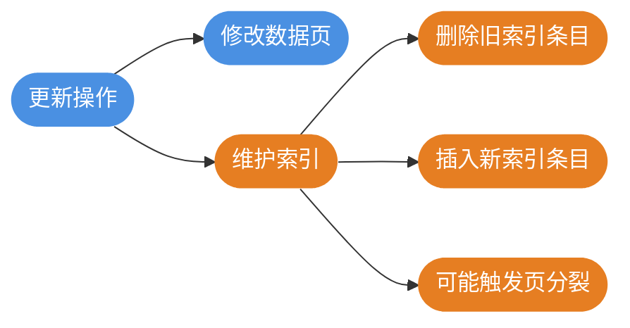

import PaidCTA from '@site/src/components/PaidCTA';

# 热点数据更新与缓存策略

## 热点数据更新的挑战

在高并发业务场景中，**热点数据更新**是一个常见且棘手的问题。当大量请求同时修改同一行或少数几行数据时，会引发严重的性能问题甚至系统崩溃。

### 典型业务场景


以电商秒杀场景为例，假设某款限量商品开售瞬间有 10 万用户同时抢购：

```sql
-- 扣减库存操作
UPDATE flash_sale_items 
SET stock_count = stock_count - 1 
WHERE item_id = 2024001 AND stock_count > 0;
```

这条简单的 SQL 会成为系统瓶颈，原因在于所有请求都在竞争同一行数据的锁。

## 热点更新带来的问题

### 锁竞争与阻塞

MySQL 的 UPDATE 语句需要获取行级排他锁（X锁），当多个事务同时更新同一行时，只有一个能执行，其他必须等待。


**后果**：系统吞吐量急剧下降，响应时间大幅增加。

### 数据库连接耗尽

等待锁的事务会持续占用数据库连接，而数据库连接是有限资源：


### CPU 资源过载

大量锁等待会导致严重的 CPU 消耗：

1. **锁自旋开销**：等待锁的线程会不断尝试获取锁，消耗 CPU
2. **死锁检测**：MySQL 持续进行死锁检测，消耗 CPU
3. **上下文切换**：频繁的线程调度增加系统开销

```sql
-- 查看当前锁等待情况
SELECT * FROM information_schema.INNODB_LOCK_WAITS;

-- 查看锁持有情况
SELECT * FROM performance_schema.data_locks;
```

### 死锁风险

高并发场景下，复杂的业务逻辑可能导致死锁：

```sql
-- 事务A：先更新订单，再更新库存
UPDATE orders SET status = 2 WHERE order_id = 1001;
UPDATE inventory SET stock = stock - 1 WHERE product_id = 5001;

-- 事务B：先更新库存，再更新订单
UPDATE inventory SET stock = stock - 1 WHERE product_id = 5001;
UPDATE orders SET status = 2 WHERE order_id = 1001;

-- 如果事务A和B交替执行，可能形成死锁
```

### 索引维护开销

频繁更新会导致相关索引的频繁维护，增加系统负担：



### 主从复制延迟

热点数据的高频更新会产生大量 binlog，加剧主从复制延迟：

- 主库写入频繁，binlog 生成速度快
- 从库重放 binlog 需要时间
- 延迟期间读写分离可能读到旧数据

## 热点数据的缓存策略

当数据库存在海量数据（如 2000 万条），而缓存容量有限（如只能存放 20 万条）时，如何确保缓存中都是热点数据，是缓存设计的核心问题。

<PaidCTA />