# 热点数据更新与缓存策略

## 热点数据更新的挑战

在高并发业务场景中，**热点数据更新**是一个常见且棘手的问题。当大量请求同时修改同一行或少数几行数据时，会引发严重的性能问题甚至系统崩溃。

### 典型业务场景

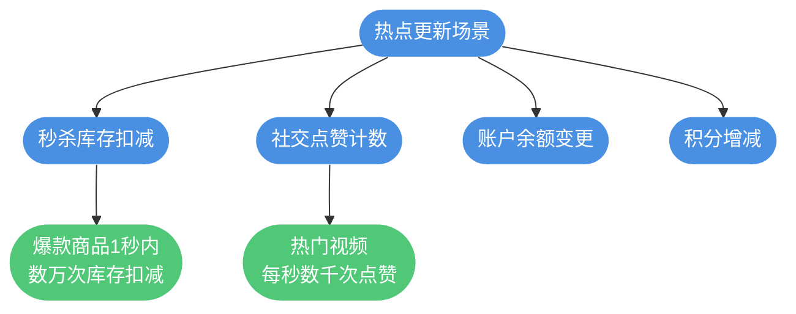

以电商秒杀场景为例，假设某款限量商品开售瞬间有 10 万用户同时抢购：

```sql
-- 扣减库存操作
UPDATE flash_sale_items 
SET stock_count = stock_count - 1 
WHERE item_id = 2024001 AND stock_count > 0;
```

这条简单的 SQL 会成为系统瓶颈，原因在于所有请求都在竞争同一行数据的锁。

## 热点更新带来的问题

### 锁竞争与阻塞

MySQL 的 UPDATE 语句需要获取行级排他锁（X锁），当多个事务同时更新同一行时，只有一个能执行，其他必须等待。

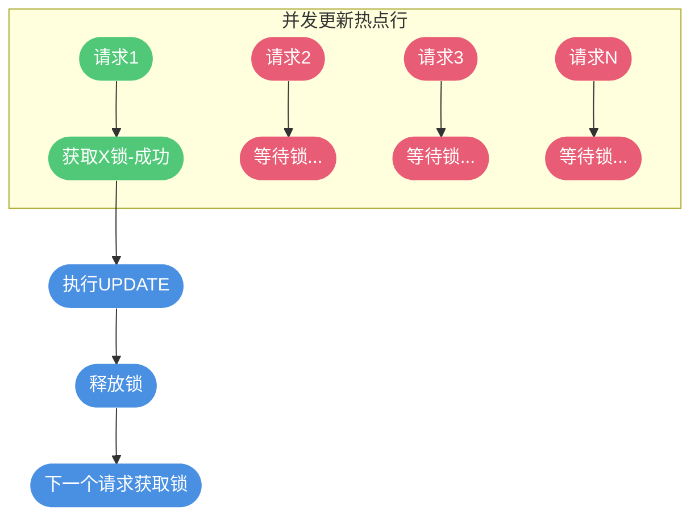

**后果**：系统吞吐量急剧下降，响应时间大幅增加。

### 数据库连接耗尽

等待锁的事务会持续占用数据库连接，而数据库连接是有限资源：

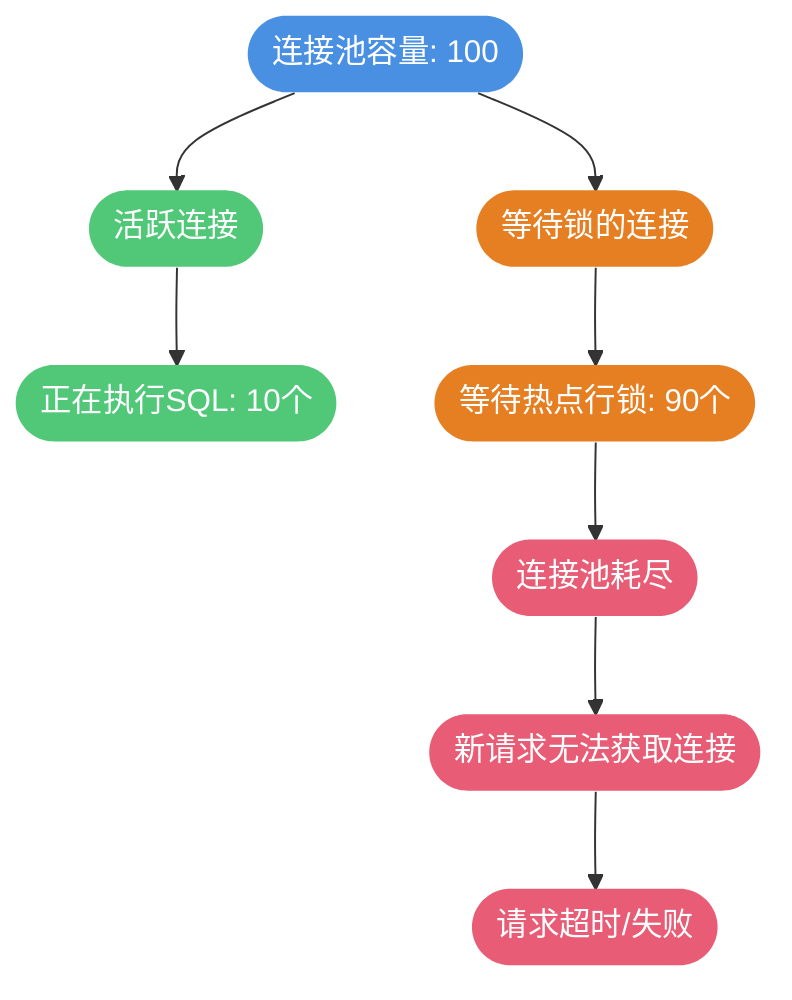

### CPU 资源过载

大量锁等待会导致严重的 CPU 消耗：

1. **锁自旋开销**：等待锁的线程会不断尝试获取锁，消耗 CPU
2. **死锁检测**：MySQL 持续进行死锁检测，消耗 CPU
3. **上下文切换**：频繁的线程调度增加系统开销

```sql
-- 查看当前锁等待情况
SELECT * FROM information_schema.INNODB_LOCK_WAITS;

-- 查看锁持有情况
SELECT * FROM performance_schema.data_locks;
```

### 死锁风险

高并发场景下，复杂的业务逻辑可能导致死锁：

```sql
-- 事务A：先更新订单，再更新库存
UPDATE orders SET status = 2 WHERE order_id = 1001;
UPDATE inventory SET stock = stock - 1 WHERE product_id = 5001;

-- 事务B：先更新库存，再更新订单
UPDATE inventory SET stock = stock - 1 WHERE product_id = 5001;
UPDATE orders SET status = 2 WHERE order_id = 1001;

-- 如果事务A和B交替执行，可能形成死锁
```

### 索引维护开销

频繁更新会导致相关索引的频繁维护，增加系统负担：


### 主从复制延迟

热点数据的高频更新会产生大量 binlog，加剧主从复制延迟：

- 主库写入频繁，binlog 生成速度快
- 从库重放 binlog 需要时间
- 延迟期间读写分离可能读到旧数据

## 热点数据的缓存策略

当数据库存在海量数据（如 2000 万条），而缓存容量有限（如只能存放 20 万条）时，如何确保缓存中都是热点数据，是缓存设计的核心问题。

### 缓存预热

系统启动或缓存重建时，需要将热点数据提前加载到缓存：

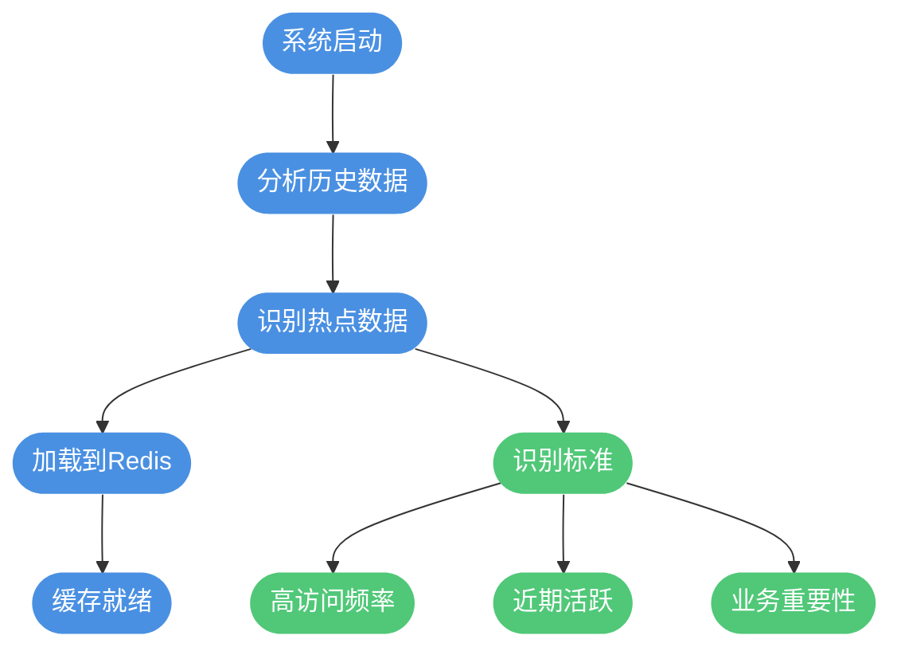

**实现示例**：

```java
@Component
public class CacheWarmer {
    
    @Autowired
    private ProductMapper productMapper;
    
    @Autowired
    private RedisTemplate<String, Object> redisTemplate;
    
    @PostConstruct
    public void warmUpCache() {
        // 查询近7天访问量Top 1000的商品
        List<Product> hotProducts = productMapper.selectHotProducts(7, 1000);
        
        for (Product product : hotProducts) {
            String key = "product:" + product.getId();
            redisTemplate.opsForValue().set(key, product, 1, TimeUnit.HOURS);
        }
        
        log.info("缓存预热完成，加载商品数量: {}", hotProducts.size());
    }
}
```

### 实时热点检测

业务运行过程中，热点数据会动态变化，需要实时检测和更新：


**方案一：本地计数 + 定期上报**

```java
@Component
public class HotKeyDetector {
    
    // 本地访问计数器
    private final ConcurrentHashMap<String, AtomicInteger> accessCounter = 
        new ConcurrentHashMap<>();
    
    public void recordAccess(String key) {
        accessCounter.computeIfAbsent(key, k -> new AtomicInteger())
                     .incrementAndGet();
    }
    
    @Scheduled(fixedRate = 60000)  // 每分钟上报
    public void reportHotKeys() {
        List<Map.Entry<String, AtomicInteger>> sorted = accessCounter.entrySet()
            .stream()
            .sorted((a, b) -> b.getValue().get() - a.getValue().get())
            .limit(100)
            .collect(Collectors.toList());
        
        // 上报到中心节点或直接加载到缓存
        for (Map.Entry<String, AtomicInteger> entry : sorted) {
            if (entry.getValue().get() > 100) {  // 阈值判断
                loadToCache(entry.getKey());
            }
        }
        
        accessCounter.clear();  // 重置计数器
    }
}
```

**方案二：使用专业热点框架**

京东开源的 hotkey 框架专门用于实时热点检测：

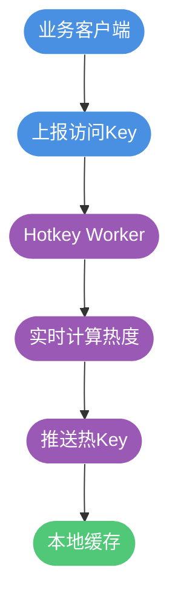

### 选择合适的过期策略

Redis 提供了多种内存淘汰策略，需要根据业务特点选择：

**LRU（最近最少使用）**

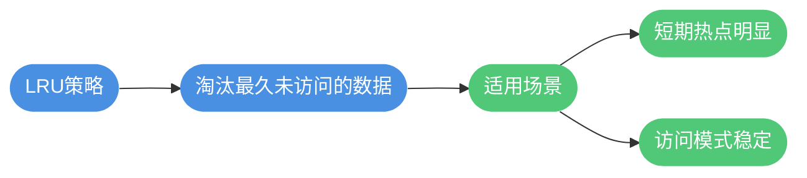

**LFU（最不经常使用）**

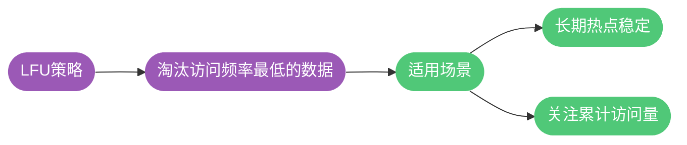

**配置示例**：

```bash
# redis.conf 配置
maxmemory 10gb
maxmemory-policy volatile-lru  # 对设置了过期时间的key使用LRU淘汰
```

| 策略 | 说明 | 适用场景 |
|-----|------|---------|
| volatile-lru | 对有过期时间的key使用LRU | 缓存数据有TTL |
| allkeys-lru | 对所有key使用LRU | 全部作为缓存使用 |
| volatile-lfu | 对有过期时间的key使用LFU | 长期热点稳定 |
| allkeys-lfu | 对所有key使用LFU | 关注长期访问频率 |
| volatile-ttl | 优先淘汰TTL较短的key | 按过期时间管理 |
| noeviction | 内存满时拒绝写入 | 数据不允许丢失 |

### 主动过期与被动更新

结合主动过期和被动更新，确保缓存数据的时效性：

```java
@Service
public class ProductCacheService {
    
    @Autowired
    private RedisTemplate<String, Object> redisTemplate;
    
    @Autowired
    private ProductMapper productMapper;
    
    // 缓存读取（Cache Aside 模式）
    public Product getProduct(Long productId) {
        String key = "product:" + productId;
        
        // 1. 先查缓存
        Product product = (Product) redisTemplate.opsForValue().get(key);
        if (product != null) {
            return product;
        }
        
        // 2. 缓存未命中，查数据库
        product = productMapper.selectById(productId);
        if (product != null) {
            // 3. 写入缓存，设置随机过期时间避免雪崩
            int ttl = 3600 + new Random().nextInt(600);  // 1小时 + 随机10分钟
            redisTemplate.opsForValue().set(key, product, ttl, TimeUnit.SECONDS);
        }
        
        return product;
    }
    
    // 数据更新时删除缓存
    @Transactional
    public void updateProduct(Product product) {
        // 1. 更新数据库
        productMapper.updateById(product);
        
        // 2. 删除缓存
        String key = "product:" + product.getId();
        redisTemplate.delete(key);
    }
}
```

## 热点更新的优化方案

### 库存分桶

将单个热点记录拆分为多个分桶，分散锁竞争：

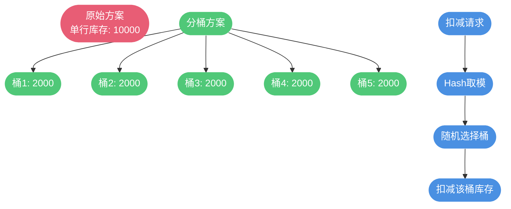

**实现示例**：

```sql
-- 创建库存分桶表
CREATE TABLE stock_buckets (
    id BIGINT PRIMARY KEY AUTO_INCREMENT,
    product_id BIGINT NOT NULL,
    bucket_no INT NOT NULL,
    stock_count INT NOT NULL DEFAULT 0,
    UNIQUE KEY uk_product_bucket (product_id, bucket_no)
);

-- 初始化10个分桶，每桶1000库存
INSERT INTO stock_buckets (product_id, bucket_no, stock_count)
SELECT 2024001, seq, 1000 
FROM (SELECT 0 seq UNION SELECT 1 UNION SELECT 2 UNION SELECT 3 UNION SELECT 4
      UNION SELECT 5 UNION SELECT 6 UNION SELECT 7 UNION SELECT 8 UNION SELECT 9) t;
```

```java
@Service
public class BucketStockService {
    
    private static final int BUCKET_COUNT = 10;
    
    @Transactional
    public boolean deductStock(Long productId, int quantity) {
        // 随机选择一个桶
        int bucketNo = ThreadLocalRandom.current().nextInt(BUCKET_COUNT);
        
        // 尝试扣减该桶库存
        int affected = stockBucketMapper.deductStock(productId, bucketNo, quantity);
        
        if (affected > 0) {
            return true;
        }
        
        // 该桶库存不足，尝试其他桶
        for (int i = 0; i < BUCKET_COUNT; i++) {
            if (i == bucketNo) continue;
            affected = stockBucketMapper.deductStock(productId, i, quantity);
            if (affected > 0) {
                return true;
            }
        }
        
        return false;  // 所有桶都没有足够库存
    }
}
```

### 合并更新（批量写入）

将多个更新请求合并为一次批量操作：

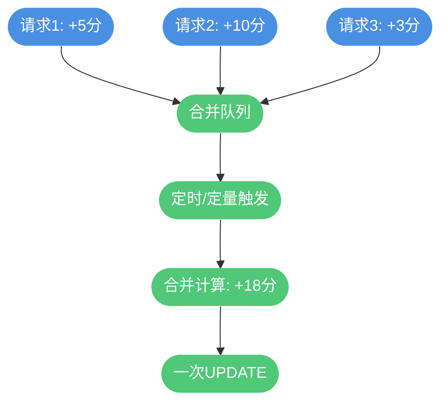

**实现示例**：

```java
@Component
public class PointsMergeUpdater {
    
    // 用户积分变更缓冲区
    private final ConcurrentHashMap<Long, AtomicInteger> pointsBuffer = 
        new ConcurrentHashMap<>();
    
    public void addPoints(Long userId, int points) {
        pointsBuffer.computeIfAbsent(userId, k -> new AtomicInteger())
                    .addAndGet(points);
    }
    
    @Scheduled(fixedRate = 1000)  // 每秒批量写入
    public void flushPoints() {
        if (pointsBuffer.isEmpty()) {
            return;
        }
        
        // 交换缓冲区，避免并发问题
        Map<Long, AtomicInteger> toFlush = new HashMap<>(pointsBuffer);
        pointsBuffer.clear();
        
        // 批量更新数据库
        List<PointsUpdate> updates = toFlush.entrySet().stream()
            .map(e -> new PointsUpdate(e.getKey(), e.getValue().get()))
            .collect(Collectors.toList());
        
        pointsMapper.batchUpdatePoints(updates);
    }
}
```

### 异步化处理

将热点更新异步化，通过消息队列削峰填谷：

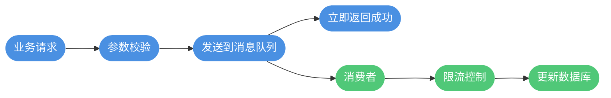

**注意事项**：

- 需要接受最终一致性
- 做好幂等性处理
- 消息堆积时需要有降级方案

### Redis 预扣减

使用 Redis 承接热点更新压力，异步同步到数据库：

```java
@Service
public class RedisStockService {
    
    @Autowired
    private StringRedisTemplate redisTemplate;
    
    // Redis 预扣减库存
    public boolean tryDeductStock(Long productId, int quantity) {
        String key = "stock:" + productId;
        
        // 使用 Lua 脚本保证原子性
        String script = 
            "local stock = redis.call('get', KEYS[1]) " +
            "if stock and tonumber(stock) >= tonumber(ARGV[1]) then " +
            "    redis.call('decrby', KEYS[1], ARGV[1]) " +
            "    return 1 " +
            "end " +
            "return 0";
        
        Long result = redisTemplate.execute(
            new DefaultRedisScript<>(script, Long.class),
            Collections.singletonList(key),
            String.valueOf(quantity)
        );
        
        return result != null && result == 1;
    }
}
```

## 综合解决方案

对于超高并发的热点更新场景，通常需要组合多种策略：

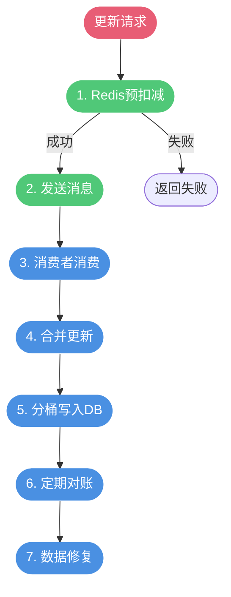

## 总结

热点数据更新是高并发系统必须面对的挑战，主要影响包括：

1. **锁竞争**：并发更新导致大量锁等待
2. **连接耗尽**：等待的事务占用连接资源
3. **CPU过载**：锁自旋和死锁检测消耗CPU
4. **主从延迟**：高频更新加剧复制延迟

解决方案包括：

| 策略 | 适用场景 | 复杂度 |
|-----|---------|-------|
| 库存分桶 | 库存、计数类场景 | 中 |
| 合并更新 | 积分、统计类场景 | 中 |
| 异步化 | 可接受最终一致性 | 中 |
| Redis预扣减 | 高并发扣减场景 | 高 |

缓存策略要点：

1. **预热**：系统启动时加载热点数据
2. **检测**：实时监控识别新热点
3. **淘汰**：选择合适的LRU/LFU策略
4. **更新**：数据变更时及时失效缓存

通过合理的架构设计和策略组合，可以有效应对热点数据带来的性能挑战。
