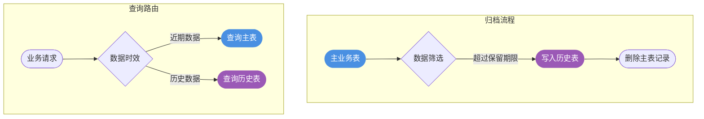

import PaidCTA from '@site/src/components/PaidCTA';

# 数据归档与平滑迁移实战

## 数据归档概述

### 为什么需要数据归档

随着业务持续运行，数据库中会积累大量历史数据。这些数据虽然对日常业务操作价值不大，但对于审计、分析等场景仍有保留必要。**数据归档**就是将这些不再频繁访问的历史数据从主库迁移到低成本存储位置的过程。

数据归档也被称为**冷热分离**。热数据是指近期产生、访问频繁的数据；冷数据则是时间较久、几乎不再操作的历史数据。合理的冷热分离策略能够显著提升系统性能并降低运营成本。

### 归档方案对比

| 方案 | 适用场景 | 实现难度 | 是否支持查询 | 查询效率 |
|-----|---------|---------|------------|---------|
| 分库分表归档 | 通用场景 | 较低 | 支持 | 一般 |
| 分区表归档 | 按时间划分 | 较低 | 支持 | 一般 |
| 数据备份导出 | 合规留存 | 较低 | 不支持 | 无 |
| 分布式存储归档 | 大数据查询 | 较高 | 支持 | 较高 |
| 离线数仓归档 | 数据分析 | 较高 | 支持 | 较低 |

## 常见归档实现方案

### 分库分表归档

这是最常用的归档方式，核心思路是在主库之外创建结构相同的历史表，定期将冷数据迁移过去。

以电商订单系统为例，将超过半年的已完成订单归档到历史表：

<PaidCTA />